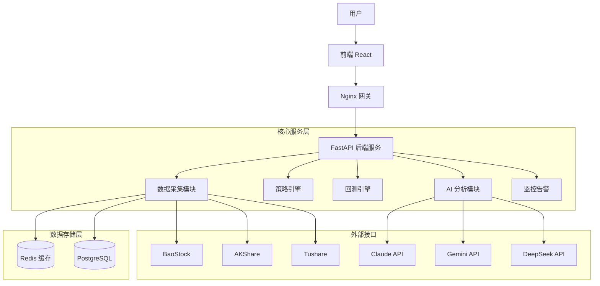

# A股智能选股系统 - 概要设计

> **版本：** v2.0
> **日期：** 2026-02-07
> **设计者：** Adrian & 雪莉 ✨
> **生成引擎：** Google Gemini 3.0 Pro
>
> **V1 实施范围：** 见 `99-实施范围-V1与V2划分.md` §一。V1 去掉 Nginx/Docker/ELK/用户权限，AI 只接 Gemini 单模型。

---

## 一、系统概述

### 1.1 系统定位
本系统是一款面向个人投资者的**专业级 A 股智能选股与回测平台**。它区别于传统的行情软件，核心定位于：
- **AI 增强决策：** 利用大语言模型（Claude/Gemini/DeepSeek）进行策略逻辑验证、新闻情感分析和量化信号辅助。
- **多源数据融合：** 整合 BaoStock（基础）、AKShare（实时）、Tushare（专业）等多方数据，确保数据的高可用性和完整性。
- **全链路可回测：** 从选股策略、AI 信号到新闻驱动，所有决策逻辑均可进行历史回测，拒绝"马后炮"。

### 1.2 核心目标
1. **构建策略工厂：** 提供 79+ 种预设策略，支持积木式组合。
2. **量化验证：** 通过 Backtrader 引擎对策略进行严格的历史回测。
3. **智能辅助：** AI 自动分析财报、研报和新闻，过滤假信号。
4. **实时监控：** 盘中实时捕捉交易信号，毫秒级告警。

### 1.3 技术栈架构
- **后端：** FastAPI (Python) + SQLAlchemy + Pydantic
- **回测引擎：** Backtrader
- **数据库：** PostgreSQL (时序数据/业务数据) + Redis (实时缓存/队列)
- **AI 模块：** 
  - **Claude 3.5 Sonnet:** 策略逻辑校验、风险评估
  - **Gemini 2.0 Flash:** 新闻情感分析、事件驱动
  - **DeepSeek V3:** 量化指标分析、代码生成
- **前端：** React 18 + TypeScript + Ant Design 5 + ECharts
- **部署：** Docker Compose + Nginx

---

## 二、系统架构设计

### 2.1 总体架构图


### 2.2 核心模块划分
1. **数据采集与管理：** 多源数据清洗、存储、故障切换。
2. **技术指标计算：** 高性能向量化计算库。
3. **选股策略引擎：** 79种策略实现与组合。
4. **回测引擎：** 历史数据仿真交易。
5. **参数优化：** 寻找策略最优参数。（✅ V2 已实施：网格搜索 + 遗传算法）
6. **可视化图表：** 交互式 K 线与收益图。
7. **AI 智能分析：** 三模型交叉验证。
8. **新闻舆情监控：** 全网舆情情感量化。
9. **高手跟投监控：** 游资/大V操作追踪。
10. **实时监控与告警：** 盘中信号推送。
11. **用户与权限：** 多租户管理。

---

## 三、核心模块详细设计

### 模块 1：数据采集与管理
**职责：** 为系统提供高质量、高可用的基础数据。

**核心设计：**
- **多级数据源灾备：**
  - **L1 (主):** BaoStock (历史日线、5分钟线，免费稳定)
  - **L2 (备):** AKShare (实时行情、分时数据，接口丰富)
  - **L3 (底):** Tushare Pro (财务数据、除权除息，专业精准)
- **智能调度：** 使用 APScheduler 定时任务，避开交易高峰期进行批量同步。
- **数据清洗：** 自动处理停牌、除权、异常值（如 0 价格）。

#### 1.1 数据采集架构：中转层 + 标准层

**设计理念：**
不同数据源的字段名、数据格式、时间戳格式都不统一。为了保证数据可追溯、可对比、可回滚，采用 **"原始落地 → 清洗标准化 → 业务使用"** 三层架构。

**架构图：**
```
数据源 API
    ↓
[中转层] raw_* 表 (原始数据，按来源分表)
    - raw_baostock_daily
    - raw_akshare_daily
    - raw_tushare_daily
    - raw_baostock_finance
    - ...
    ↓
[ETL 清洗层] Python 脚本
    - 字段映射、格式统一
    - 去重、异常值处理
    - 复权因子计算
    ↓
[标准层] stock_daily, finance_indicator (统一格式)
    ↓
业务查询 & 回测引擎
```

**中转层表设计（示例）：**

```sql
-- BaoStock 日线原始数据
CREATE TABLE raw_baostock_daily (
    id SERIAL PRIMARY KEY,
    fetch_time TIMESTAMP DEFAULT NOW(),  -- 采集时间（追溯用）
    code VARCHAR(10),                    -- 原始股票代码 sh.600519
    date DATE,
    open VARCHAR(20),   -- 注意：保持原始类型（可能有 "N/A"）
    high VARCHAR(20),
    low VARCHAR(20),
    close VARCHAR(20),
    volume VARCHAR(20),
    amount VARCHAR(20),
    adjustflag VARCHAR(5),  -- 复权标志 1前复权 2后复权 3不复权
    turn VARCHAR(20),       -- 换手率
    tradestatus VARCHAR(5), -- 交易状态 1正常 0停牌
    pctChg VARCHAR(20),
    peTTM VARCHAR(20),
    pbMRQ VARCHAR(20),
    psTTM VARCHAR(20),
    pcfNcfTTM VARCHAR(20),
    isST VARCHAR(5),
    raw_json JSONB          -- 完整原始 JSON（终极备份）
);

-- AKShare 日线原始数据
CREATE TABLE raw_akshare_daily (
    id SERIAL PRIMARY KEY,
    fetch_time TIMESTAMP DEFAULT NOW(),
    代码 VARCHAR(10),  -- 注意：保留中文字段名
    日期 DATE,
    开盘 VARCHAR(20),
    收盘 VARCHAR(20),
    最高 VARCHAR(20),
    最低 VARCHAR(20),
    成交量 VARCHAR(30),
    成交额 VARCHAR(30),
    振幅 VARCHAR(20),
    涨跌幅 VARCHAR(20),
    涨跌额 VARCHAR(20),
    换手率 VARCHAR(20),
    raw_json JSONB
);

-- Tushare 财务指标原始数据
CREATE TABLE raw_tushare_finance (
    id SERIAL PRIMARY KEY,
    fetch_time TIMESTAMP DEFAULT NOW(),
    ts_code VARCHAR(10),
    ann_date VARCHAR(10),   -- Tushare 是字符串格式 20231031
    end_date VARCHAR(10),
    eps VARCHAR(20),
    dt_eps VARCHAR(20),
    total_revenue_ps VARCHAR(20),
    -- ... 其他字段全部保留原始格式
    raw_json JSONB
);
```

**为什么这样设计？**
1. **保留原始数据：** API 返回的原始值（包括异常值如 "N/A"、"--"）全部保存，方便排查数据源问题。
2. **可追溯：** `fetch_time` 记录采集时间，`raw_json` 保存完整响应，未来数据源升级时可对比。
3. **容错性：** 字段用 `VARCHAR` 而非 `DECIMAL`，即使数据源返回非数字也不会导入失败。
4. **多源对比：** 可以对比 BaoStock 和 AKShare 对同一天数据的差异，选择更可靠的。

**ETL 清洗脚本（示例）：**
```python
async def sync_baostock_to_standard():
    # 读取中转表
    raw_data = await db.fetch_all("""
        SELECT * FROM raw_baostock_daily 
        WHERE date = '2024-01-15' 
        AND code NOT IN (
            SELECT ts_code FROM stock_daily WHERE trade_date = '2024-01-15'
        )
    """)
    
    for row in raw_data:
        # 字段映射 + 清洗
        clean_row = {
            'ts_code': row['code'].replace('sh.', '').replace('sz.', '') + '.SH',
            'trade_date': row['date'],
            'open': Decimal(row['open']) if row['open'] != '' else None,
            'close': Decimal(row['close']) if row['close'] != '' else None,
            # ...
        }
        
        # 写入标准表
        await db.execute("""
            INSERT INTO stock_daily (...) VALUES (...)
            ON CONFLICT (ts_code, trade_date) DO UPDATE SET ...
        """)
```

**优势总结：**
- ✅ **数据可回溯：** 任何时候都能回到原始数据重新清洗。
- ✅ **多源验证：** 可以对比三个数据源，选择一致性最高的。
- ✅ **灾难恢复：** 标准表被误删，可以从中转表重建。
- ✅ **调试友好：** 出问题时，可以对比原始数据和清洗后数据找 bug。

### 模块 2：技术指标计算
**职责：** 基于原始行情计算各类衍生指标。

**核心指标库：**
- **趋势类：** MA (5/10/20/60/120/250), EMA, MACD, BOLL, SAR, TRIX
- **摆动类：** KDJ, RSI, WR, CCI, BIAS, SKDJ
- **量能类：** VOL, OBV, VR, 量比, 换手率
- **资金类：** 资金流向 (MFI), 主力净流入
- **形态特征：** 均线粘合度, 波动率 (ATR)

**技术实现：** 使用 `pandas` 和 `ta-lib` 进行向量化计算，确保计算速度。

### 模块 3：选股策略引擎（79种策略）
**职责：** 提供丰富的策略库，支持灵活组合筛选。

#### 3.1 技术面策略 (30种)
**A. 趋势跟踪 (7)**
1. 均线金叉 (MA5上穿MA10)
2. 突破年线 (收盘价站上MA250)
3. 多头排列 (MA5>MA10>MA20)
4. ADX 趋势增强 (ADX>25 且 PDI>MDI)
5. 创60日新高
6. MACD 零轴上方金叉
7. TRIX 金叉

**B. 超跌反弹 (7)**
8. 连续 N 日下跌 (如连跌5日)
9. RSI 超卖 (<20)
10. 乖离率过大 (BIAS <-10%)
11. WR 威廉指标超卖
12. 缩量长阴后止跌
13. 锤子线/倒锤子线
14. KDJ 低位金叉

**C. 震荡突破 (6)**
15. 布林带收口突破
16. 箱体突破 (突破 N 日震荡区间)
17. 三角形收敛突破
18. 颈线突破 (W底/头肩底)
19. 平台突破
20. 缺口不补 (向上跳空)

**D. 量价配合 (6)**
21. 底部放量上涨
22. 量价齐升
23. 缩量回调 (上升趋势中)
24. 天量天价 (预警)
25. 地量地价 (抄底)
26. 换手率异动 (>10%)

**E. 形态识别 (4)**
27. 早晨之星
28. 红三兵
29. 双底/三底
30. 仙人指路

#### 3.2 基本面策略 (17种)
**A. 估值与价值 (5)**
31. 低 PE (市盈率 < 行业平均)
32. 低 PB (市净率 < 1.5)
33. 高股息率 (> 3%)
34. PEG < 1 (低估值高成长)
35. 破净股 (PB < 1)

**B. 成长性 (5)**
36. 高 ROE (> 15%)
37. 净利润同比增长 > 30%
38. 营收同比增长 > 20%
39. 扣非净利润高增长
40. 毛利率连续增长

**C. 财务安全 (4)**
41. 低资产负债率 (< 50%)
42. 经营现金流 > 净利润
43. 商誉占比低
44. 流动比率 > 2

**D. 机构动向 (3)**
45. 北向资金持续流入
46. 机构调研激增
47. 基金/社保新进重仓

#### 3.3 事件驱动策略 (10种)
48. 业绩预增/预喜
49. 高送转预期
50. 股份回购方案
51. 股东/高管增持
52. 重大合同中标
53. 资产重组/并购
54. 股权激励计划
55. 定增获批
56. 行业政策利好 (AI提取)
57. 产品涨价

#### 3.4 量化复合策略 (12种)
**A. 多因子模型 (4)**
58. 价值+动量因子
59. 质量+成长因子
60. 小市值+反转因子
61. F-Score 评分高分

**B. 统计套利 (4)**
62. 均值回归策略
63. 行业轮动策略
64. 风格轮动 (大小盘切换)
65. 协整配对交易

**C. 行为金融 (4)**
66. 龙虎榜游资跟随
67. 涨停板连板战法
68. 跌停板翘板
69. 筹码集中度提升

#### 3.5 新闻舆情策略 (5种)
70. 突发重大利好 (AI 评分 > 90)
71. 研报密集覆盖
72. 淘股吧热度飙升
73. 雪球大V集体看多
74. 负面舆情过滤 (黑名单)

#### 3.6 高手跟投策略 (5种)
75. 淘股吧百万实盘高手持仓
76. 雪球知名组合调仓
77. 龙虎榜知名席位买入
78. 公募明星基金经理隐形重仓
79. 私募大佬调研路径

---

#### 3.7 策略执行管道与成本控制（实战关键）

**问题背景：**
- A 股有 5000+ 只股票，如果每天对每只股票运行所有 79 种策略，再调用 AI 分析，会产生：
  - **计算爆炸：** 5000 × 79 = 39.5 万次策略计算
  - **成本爆炸：** 5000 次 AI 调用 ≈ 数千元/天（Claude 按 Token 计费）
  - **时间爆炸：** 单线程跑完可能需要数小时

**解决方案：漏斗式筛选管道**

```
5000只全市场股票
    ↓
[第一层] 基础过滤 (SQL 直接查询)
    - 剔除 ST/退市/停牌
    - 剔除流动性极差的股票 (换手率 < 0.1%)
    ↓ 剩余 ~4000 只
    
[第二层] 技术指标初筛 (Redis 缓存 + 向量化计算)
    - 从 technical_daily 表读取预计算指标
    - 快速筛选：MA5 > MA10, RSI < 80, MACD > 0
    ↓ 剩余 ~500 只
    
[第三层] 财务指标复筛 (SQL 联表查询)
    - ROE > 10%, 负债率 < 60%, PE < 50
    ↓ 剩余 ~100 只
    
[第四层] 事件驱动筛选 (新闻/公告扫描)
    - 最近7天有重大利好公告
    - 龙虎榜游资买入
    ↓ 剩余 ~30 只 (候选池)
    
[第五层] AI 深度分析 (仅对候选池调用)
    - 对 Top 30 调用 Gemini (便宜) 做新闻情感分析
    - 对 Top 10 调用 Claude (贵) 做逻辑校验
    ↓ 最终输出 ~5-10 只高质量股票
```

**成本对比：**
- **无漏斗：** 5000 只 × Claude ($0.01/次) = $50/天 ≈ ¥350/天
- **有漏斗：** 30 只 × Gemini ($0.001/次) + 10 只 × Claude = $0.13/天 ≈ ¥1/天 ✅

**执行时间：**
- **收盘后 T+0 模式：** 每日收盘后（15:05）自动执行，20 分钟内完成筛选。
- **盘中实时模式：** 仅对自选股池（< 50 只）做实时监控。

**代码示例：**
```python
async def daily_stock_selection_pipeline():
    # 第一层：基础过滤
    candidates = await db.query(
        "SELECT ts_code FROM stocks WHERE list_status='L' AND is_st=0"
    )
    
    # 第二层：技术指标初筛
    tech_filtered = []
    for stock in candidates:
        indicators = await redis.get(f"tech:{stock}:latest")
        if indicators['ma5'] > indicators['ma10'] and indicators['rsi'] < 80:
            tech_filtered.append(stock)
    
    # 第三层：财务指标
    finance_filtered = await db.query(
        "SELECT ts_code FROM finance_indicator WHERE roe > 10 AND debt_to_assets < 0.6"
    )
    
    # 取交集
    final_pool = set(tech_filtered) & set(finance_filtered)
    
    # 第四层：AI 分析（仅对 top 30）
    for stock in final_pool[:30]:
        sentiment = await gemini_analyze_news(stock)
        if sentiment > 70:
            await claude_verify_logic(stock)  # 仅高置信度的才用 Claude
```

---

### 模块 4：回测引擎
**职责：** 验证策略的有效性，避免亏损。
**技术选型：** Backtrader
**核心功能：**
- **历史回测：** 支持日线/分钟线级别的回测。
- **交易成本：** 模拟印花税、佣金、滑点。
- **绩效报告：** 年化收益率、最大回撤、夏普比率、胜率、盈亏比。
- **可视化：** 资金曲线图、持仓变动图。

#### 4.1 回测环境标准配置（防未来函数 & 成本建模）

**A. 防未来函数机制**
回测的最大陷阱是"用明天的数据做今天的决策"。必须严格遵守：

1. **数据时间对齐：**
   - **错误示例：** `if close[0] > ma20[0]` → 如果 `ma20` 是用收盘价计算的，那么当天收盘前无法得知当天的 ma20。
   - **正确做法：** 使用 `close[-1]` (昨日收盘) 与 `ma20[-1]` 比较，或在盘后（15:05）才触发信号。

2. **财务数据时间对齐：**
   - **关键字段：** `ann_date` (公告日期) vs `end_date` (报告期)
   - **规则：** 只能在 `ann_date` 当天或之后使用该财报数据。
   - **示例：** 2023-Q3 财报（end_date=2023-09-30）可能在 2023-10-28 才公告（ann_date），回测时只能在 10-28 后用。

3. **Backtrader 配置：**
```python
cerebro = bt.Cerebro(cheat_on_open=False)  # 禁止"偷看"开盘价
cerebro.broker.set_coc(True)  # Close-on-Close 模式（收盘价成交）
```

**B. 交易成本建模（A股标准）**

```python
# 佣金 + 印花税 + 过户费
class ChinaStockCommission(bt.CommInfoBase):
    params = (
        ('commission', 0.00025),  # 佣金万2.5
        ('min_commission', 5.0),  # 最低5元
        ('stamp_duty', 0.001),     # 印花税千一（仅卖出）
        ('transfer_fee', 0.00002), # 过户费万0.2（沪市）
    )
    
    def _getcommission(self, size, price, pseudoexec):
        # 买入成本
        if size > 0:
            comm = max(abs(size) * price * self.p.commission, self.p.min_commission)
            comm += abs(size) * price * self.p.transfer_fee
        # 卖出成本
        else:
            comm = max(abs(size) * price * self.p.commission, self.p.min_commission)
            comm += abs(size) * price * self.p.stamp_duty  # 印花税
            comm += abs(size) * price * self.p.transfer_fee
        return comm
```

**C. 滑点建模**
- **定义：** 实际成交价与预期价格的偏差。
- **A股经验值：** 流动性好的股票滑点约 0.1%-0.2%，小盘股可能 0.5%-1%。
```python
cerebro.broker.set_slippage_perc(0.001)  # 千一滑点
```

---

### 模块 5：参数优化
**职责：** 寻找策略的最佳参数组合。
**方法：**
- **网格搜索 (Grid Search):** 遍历所有参数组合。
- **暴力枚举:** 适用于参数空间较小的情况。
- **Walk Forward Analysis:** 滚动窗口回测，检验参数稳定性，防止过拟合。

### 模块 6：可视化图表
**职责：** 直观展示数据和分析结果。
**组件：**
- **K线图：** 叠加均线、买卖点标记。
- **收益图：** 策略净值 vs 沪深300指数。
- **热力图：** 板块涨跌幅、参数优化结果分布。
- **雷达图：** 股票多维度评分（估值、成长、技术、资金、舆情）。

---

## 模块 7：AI 智能分析（核心创新）

### 7.1 模块定位
本模块是系统的"大脑"，负责处理非结构化数据和复杂逻辑判断。通过引入大语言模型（LLM），解决传统量化无法理解新闻情感和逻辑推理的痛点。

### 7.2 三模型交叉验证机制
为了消除单一模型的幻觉（Hallucination）和偏见，系统采用 **"三权分立"** 的验证机制：

1.  **Claude (3.5 Sonnet) - 逻辑分析官：**
    *   **职责：** 负责策略逻辑的合理性审查、风险评估。
    *   **优势：** 逻辑推理能力强，不仅看涨跌，还能给出"为什么"。
    *   **任务：** "这个技术形态是否标准？基本面数据是否支持股价上涨？"

2.  **Gemini (2.0 Flash) - 信息情报官：**
    *   **职责：** 负责处理海量新闻、研报，进行情感分析。
    *   **优势：** 上下文窗口极大（1M+），处理速度快，适合阅读长文本。
    *   **任务：** "这篇新闻是利好还是利空？影响范围多大？持续时间多久？"

3.  **DeepSeek (V3) - 量化精算师：**
    *   **职责：** 负责代码生成、复杂数学计算辅助、量化指标验证。
    *   **优势：** 编码能力强，对数字敏感，成本极低。
    *   **任务：** "计算该股票过去 5 年的夏普比率。编写一段回测代码。"

**一致性评分算法：**
对于同一个决策信号（如"买入 600519"）：
- 若 3 个模型一致看多 -> **强烈推荐 (置信度 > 90%)**
- 若 2 个看多，1 个中性 -> **推荐 (置信度 > 70%)**
- 若模型间分歧巨大（如一多一空）-> **观望 (触发人工复核)**

### 7.3 Prompt 管理与 Token 池
- **Prompt 模板库：** 针对不同场景（财报分析、突发新闻、技术形态）预设优化过的 Prompt 模板，减少 Token 浪费。
- **Token 桶算法：** 限制 API 调用频率，控制成本。优先使用 Gemini Flash 和 DeepSeek（便宜），关键决策才调用 Claude（昂贵）。

---

## 模块 8：新闻舆情监控（✅ V2 已实施）

### 8.1 数据源与采集
- **东方财富 (公告):** 抓取上市公司正式公告。
- **淘股吧 (论坛):** 抓取热门帖子标题，监控散户情绪（贪婪/恐慌）。
- **雪球 (UGC):** 抓取大V观点和个股讨论热度。

### 8.2 NLP 情感分析流程
1.  **清洗：** 去除广告、HTML 标签、无关干扰信息。
2.  **打分：** Gemini Flash AI 给出情感评分（-1.0 到 +1.0），分类为利好/利空/中性/重大事件。
3.  **聚合：** 计算个股的当日情感指数（正面/负面/中性计数 + 来源分布）。

### 8.3 实施说明
- **数据库表：** `announcements`（公告存储）、`sentiment_daily`（每日情感聚合）
- **盘后链路：** 步骤 3.9 新闻采集与情感分析（受 `news_crawl_enabled` 控制，失败不阻断）
- **API 端点：** 新闻列表（分页筛选）、情感趋势、每日摘要
- **前端页面：** 新闻仪表盘（新闻列表 + 情感趋势图 + 每日摘要）

### 8.4 合规性说明（重要）
- **仅供个人研究：** 爬虫数据仅用于本地量化分析，严禁用于商业转售或构建公开数据服务。
- **不存储原文：** 数据库仅存储新闻的元数据（标题、时间、来源）和 AI 分析结果（摘要、情感分），不存储正文内容，避免版权风险。
- **遵守 Robots 协议：** 爬虫设置合理的请求间隔（如 3-5秒），不恶意消耗目标站点的服务器资源。

---

## 模块 9：高手跟投监控

### 9.1 监控对象
- **淘股吧高手：** 追踪"百万实盘比赛"排名前列的选手，分析其持仓风格（打板、低吸、波段）。
- **雪球组合：** 监控关注度高、历史收益稳定的用户组合调仓动态。
- **龙虎榜游资：** 识别知名游资席位（如"章盟主"、"赵老哥"等所在营业部）的买卖动向。

### 9.2 逻辑分析
单纯的"跟单"风险极大，本模块核心在于 **"逻辑还原"**：
- 当高手买入时，系统自动关联当日的新闻、板块热点和技术形态。
- **AI 试图解释：** "高手为什么要买？是博弈题材，还是看好业绩？"
- 如果 AI 能理解其逻辑且认可，才发出跟投信号。

---

## 模块 10：实时监控与告警

### 10.1 实时行情
- **数据流：** 通过 WebSocket 接入 AKShare 或其他实时行情源，实现秒级数据推送。
- **动态计算：** 行情到达后，实时更新技术指标（如最新价触发了 MA5 金叉）。

### 10.2 告警系统
- **触发条件：**
  - **价格预警：** 突破压力位、跌破支撑位、涨跌幅超过 ±5%。
  - **策略预警：** 盘中满足"MACD金叉"或"底分型"等策略条件。
  - **舆情预警：** 突发重大利空新闻。
- **通知渠道：**
  - **App/Web 弹窗：** 交易时段强提醒。
  - **Telegram/Discord：** 推送详细分析报告和图表。
  - **邮件：** 盘后复盘日报。

#### 10.3 告警防抖动机制（避免通知轰炸）

**问题场景：**
股价在均线附近反复震荡，可能出现：
```
09:31 → MA5金叉 → 发通知 ✅
09:33 → 跌破MA5 → 发通知 ⚠️
09:35 → 再次金叉 → 发通知 ⚠️
09:37 → 又跌破... → 发通知 ⚠️（用户崩溃）
```

**解决方案：频控 + 状态机**

1. **同类信号冷却期：**
```python
alert_cooldown = {
    'ma_cross': 1800,      # MA金叉/死叉信号30分钟内只发一次
    'price_break': 3600,   # 突破信号1小时内只发一次
    'news_urgent': 300,    # 紧急新闻5分钟内只发一次（允许密集）
}
```

2. **状态持续确认：**
- 信号触发后，等待 **3 根 K 线（如 3 分钟）** 确认状态稳定才发通知。
- 避免"毛刺"误报。

3. **优先级队列：**
```python
class AlertPriority:
    CRITICAL = 1  # 跌停、涨停、重大利空 → 立刻发送
    HIGH = 2      # 突破关键位 → 5分钟确认
    NORMAL = 3    # 常规技术信号 → 30分钟防抖
    LOW = 4       # 日常提醒 → 仅盘后汇总发送
```

**实现示例：**
```python
from datetime import datetime, timedelta

last_alert_time = {}  # {stock_code: {alert_type: timestamp}}

async def send_alert(stock, alert_type, message, priority=AlertPriority.NORMAL):
    key = f"{stock}:{alert_type}"
    cooldown = alert_cooldown.get(alert_type, 1800)
    
    # 检查冷却
    if key in last_alert_time:
        elapsed = (datetime.now() - last_alert_time[key]).total_seconds()
        if elapsed < cooldown and priority != AlertPriority.CRITICAL:
            logger.info(f"Alert suppressed (cooldown): {key}")
            return
    
    # 发送通知
    await telegram_send(message)
    last_alert_time[key] = datetime.now()
```

---

## 模块 11：用户与权限（多租户）

虽然主要是个人使用，但预留了多用户扩展能力：
- **认证：** JWT (JSON Web Token) 无状态认证。
- **隔离：** 每个用户的自选股、策略参数、回测记录完全物理隔离。
- **权限：** 管理员可配置 API Key、Token 配额和数据源权限。

---

## 四、数据模型设计 (Database Schema)

本系统采用 **PostgreSQL** 作为核心数据库，利用其对时序数据（TimescaleDB插件）和 JSONB 的良好支持。

### 4.1 基础数据域

```sql
-- 交易日历 (控制回测和调度)
CREATE TABLE trade_calendar (
    exchange VARCHAR(10), -- SSE/SZSE
    cal_date DATE PRIMARY KEY,
    is_open BOOLEAN,
    pre_trade_date DATE
);

-- 股票基础信息
CREATE TABLE stocks (
    ts_code VARCHAR(10) PRIMARY KEY, -- 600519.SH
    symbol VARCHAR(10),
    name VARCHAR(20),
    area VARCHAR(20),     -- 地域
    industry VARCHAR(50), -- 所属行业 (申万一级/二级)
    market VARCHAR(10),   -- 主板/科创板/创业板
    list_date DATE,
    list_status VARCHAR(1), -- L上市 D退市 P暂停
    is_hs VARCHAR(1)      -- H沪股通 S深股通 N否
);
```

### 4.2 行情数据域 (核心)

```sql
-- 日线行情 (基础复权数据)
CREATE TABLE stock_daily (
    ts_code VARCHAR(10),
    trade_date DATE,
    open DECIMAL(10,2),
    high DECIMAL(10,2),
    low DECIMAL(10,2),
    close DECIMAL(10,2),
    pre_close DECIMAL(10,2),
    change DECIMAL(10,2),
    pct_chg DECIMAL(10,4), -- 涨跌幅
    vol DECIMAL(20,2),     -- 成交量 (手)
    amount DECIMAL(20,2),  -- 成交额 (千元)
    turnover_rate DECIMAL(10,4), -- 换手率
    volume_ratio DECIMAL(10,2),  -- 量比
    pe DECIMAL(10,2),      -- PE (TTM)
    pb DECIMAL(10,2),      -- PB
    total_mv DECIMAL(20,2), -- 总市值
    circ_mv DECIMAL(20,2),  -- 流通市值
    adj_factor DECIMAL(10,4), -- 复权因子 (关键!)
    PRIMARY KEY (ts_code, trade_date)
);

-- 分钟线行情 (支持 1/5/15/30/60 分钟)
-- 建议启用 TimescaleDB 超表
CREATE TABLE stock_min (
    ts_code VARCHAR(10),
    trade_time TIMESTAMP, -- 2023-01-01 09:30:00
    freq VARCHAR(5),      -- 1min, 5min...
    open DECIMAL(10,2),
    high DECIMAL(10,2),
    low DECIMAL(10,2),
    close DECIMAL(10,2),
    vol DECIMAL(20,2),
    amount DECIMAL(20,2),
    PRIMARY KEY (ts_code, trade_time, freq)
);
```

### 4.3 财务数据域 (选股核心)

```sql
-- 关键财务指标 (用于快速选股筛选)
CREATE TABLE finance_indicator (
    ts_code VARCHAR(10),
    end_date DATE,        -- 报告期
    ann_date DATE,        -- 公告日期 (回测防未来函数关键)
    eps DECIMAL(10,4),    -- 基本每股收益
    dt_eps DECIMAL(10,4), -- 稀释每股收益
    total_revenue_ps DECIMAL(10,4), -- 每股营业总收入
    revenue_ps DECIMAL(10,4),       -- 每股营业收入
    capital_rese_ps DECIMAL(10,4),  -- 每股资本公积
    surplus_rese_ps DECIMAL(10,4),  -- 每股盈余公积
    undist_profit_ps DECIMAL(10,4), -- 每股未分配利润
    extra_item DECIMAL(20,2),       -- 非经常性损益
    profit_dedt DECIMAL(20,2),      -- 扣非净利润
    gross_margin DECIMAL(10,4),     -- 毛利率
    current_ratio DECIMAL(10,4),    -- 流动比率
    quick_ratio DECIMAL(10,4),      -- 速动比率
    cash_ratio DECIMAL(10,4),       -- 现金比率
    ar_turn DECIMAL(10,4),          -- 应收账款周转率
    ca_turn DECIMAL(10,4),          -- 流动资产周转率
    fa_turn DECIMAL(10,4),          -- 固定资产周转率
    assets_turn DECIMAL(10,4),      -- 总资产周转率
    op_income_of_ebt DECIMAL(10,4), -- 经营活动净收益/利润总额
    invest_income_of_ebt DECIMAL(10,4), -- 价值变动净收益/利润总额
    n_income_of_ebt DECIMAL(10,4),  -- 净利润/利润总额
    op_net_cash_flow_per_share DECIMAL(10,4), -- 每股经营活动产生的现金流量净额
    roe DECIMAL(10,4),              -- 净资产收益率
    roe_waa DECIMAL(10,4),          -- 加权平均净资产收益率
    roe_dt DECIMAL(10,4),           -- 摊薄净资产收益率
    net_profit_margin DECIMAL(10,4),-- 销售净利率
    grossprofit_margin DECIMAL(10,4),-- 销售毛利率
    assets_to_equity DECIMAL(10,4), -- 权益乘数
    debt_to_assets DECIMAL(10,4),   -- 资产负债率
    PRIMARY KEY (ts_code, end_date, ann_date)
);

-- (可选) 三大表详情: finance_balance, finance_income, finance_cashflow
-- 存储完整的资产负债表、利润表、现金流量表结构，字段较多暂略
```

### 4.4 技术指标缓存域 (性能优化)

```sql
-- 每日技术指标缓存 (预计算，加速选股)
CREATE TABLE technical_daily (
    ts_code VARCHAR(10),
    trade_date DATE,
    -- 均线
    ma5 DECIMAL(10,2), ma10 DECIMAL(10,2), ma20 DECIMAL(10,2),
    ma60 DECIMAL(10,2), ma120 DECIMAL(10,2), ma250 DECIMAL(10,2),
    -- MACD
    dif DECIMAL(10,4), dea DECIMAL(10,4), macd DECIMAL(10,4),
    -- KDJ
    k DECIMAL(10,2), d DECIMAL(10,2), j DECIMAL(10,2),
    -- RSI
    rsi_6 DECIMAL(10,2), rsi_12 DECIMAL(10,2), rsi_24 DECIMAL(10,2),
    -- BOLL
    boll_upper DECIMAL(10,2), boll_mid DECIMAL(10,2), boll_lower DECIMAL(10,2),
    -- 其他
    cci DECIMAL(10,2),
    wr_10 DECIMAL(10,2),
    atr DECIMAL(10,4),
    PRIMARY KEY (ts_code, trade_date)
);
```

### 4.5 资金与情绪数据域

```sql
-- 个股资金流向
CREATE TABLE money_flow (
    ts_code VARCHAR(10),
    trade_date DATE,
    buy_sm_vol INT,  -- 小单买入量
    buy_sm_amount DECIMAL(20,2),
    sell_sm_vol INT,
    sell_sm_amount DECIMAL(20,2),
    buy_md_vol INT,  -- 中单
    buy_md_amount DECIMAL(20,2),
    ...
    buy_lg_vol INT,  -- 大单
    buy_elg_vol INT, -- 特大单 (主力)
    net_mf_amount DECIMAL(20,2), -- 净流入额
    PRIMARY KEY (ts_code, trade_date)
);

-- 龙虎榜明细
CREATE TABLE dragon_tiger (
    ts_code VARCHAR(10),
    trade_date DATE,
    reason VARCHAR(100), -- 上榜理由
    buy_total DECIMAL(20,2),
    sell_total DECIMAL(20,2),
    net_buy DECIMAL(20,2),
    list_name VARCHAR(50) -- 席位名称
);
```

### 4.6 业务配置域

```sql
-- 策略实例配置
CREATE TABLE strategies (
    id SERIAL PRIMARY KEY,
    name VARCHAR(50),
    category VARCHAR(20),
    logic_code TEXT,      -- 策略逻辑代码或 JSON 规则
    params JSONB,         -- 参数 {period: 20}
    status INT,           -- 1启用 0停用
    created_at TIMESTAMP
);

-- 数据源配置
CREATE TABLE data_source_configs (
    id SERIAL PRIMARY KEY,
    source_code VARCHAR(20), -- BAOSTOCK, TUSHARE
    priority INT,
    token VARCHAR(100),
    is_enabled BOOLEAN,
    qps_limit INT,        -- 限流配置
    last_health_check TIMESTAMP
);
```

---

## 五、API 接口设计 (RESTful)

### 5.1 核心分组
- `/api/v1/data`: 行情数据获取 (K线, 实时)
- `/api/v1/strategy`: 策略管理与执行 (筛选股票)
- `/api/v1/backtest`: 回测任务提交与结果查询
- `/api/v1/ai`: AI 分析服务 (新闻解读, 策略诊断)
- `/api/v1/monitor`: 实时监控配置
- `/api/v1/user`: 用户登录与配置

---

## 六、部署架构

### 6.1 开发环境
- **本地：** Mac mini (M2/M4)
- **运行：** `uvicorn main:app --reload`
- **依赖：** Python 3.10+, Docker (Postgres, Redis)

### 6.2 生产环境
- **容器化：** Docker Compose 编排所有服务。
- **反向代理：** Nginx 处理 SSL 和静态资源。
- **进程管理：** Gunicorn 管理 FastAPI 进程。
- **日志：** ELK 或 Loki 日志收集。

---

## 七、开发计划与附录

### 7.1 开发阶段规划
- **Phase 1 (基础):** 数据采集 + 数据库搭建 + 基础技术指标计算。
- **Phase 2 (策略):** 实现核心技术面策略 + Backtrader 回测引擎跑通。
- **Phase 3 (AI):** 接入 Claude/Gemini API，实现新闻分析与策略增强。
- **Phase 4 (Web):** 前端可视化界面开发 + 实时监控看板。

### 7.2 结语
本设计文档 (v2.0) 整合了传统的量化分析框架与最前沿的 AI 大模型技术。通过多源数据保障地基稳固，通过 79 种策略覆盖全市场机会，通过 AI 交叉验证降低决策风险。这不仅是一个选股工具，更是一个**AI 驱动的智能投研平台**。
