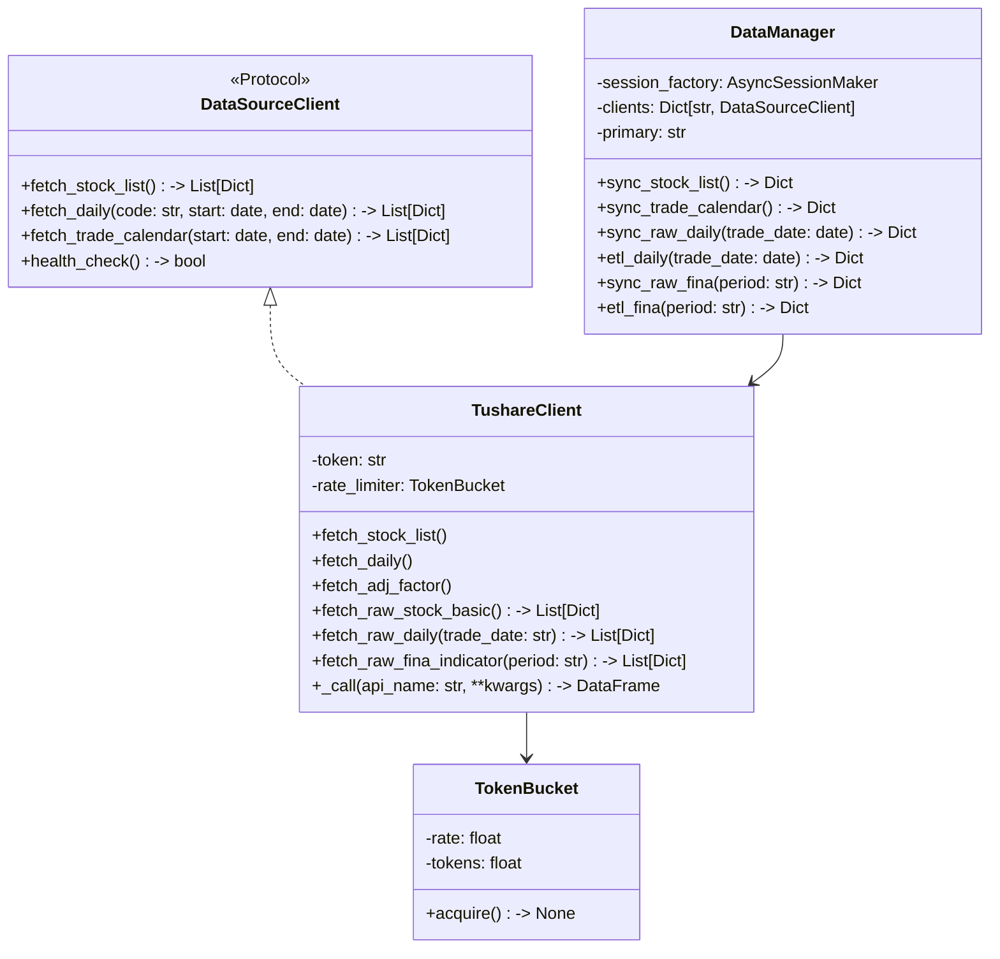
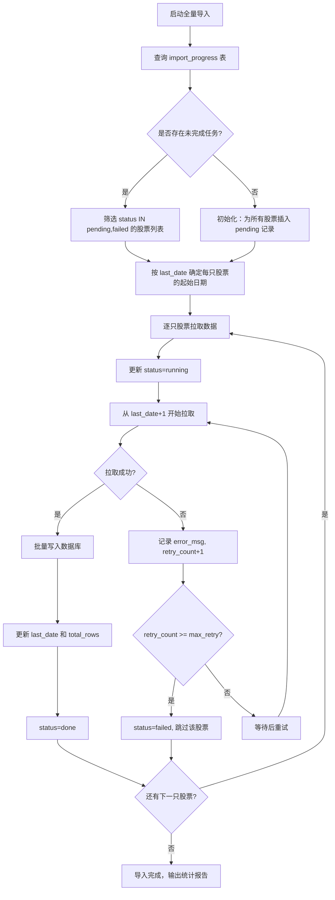
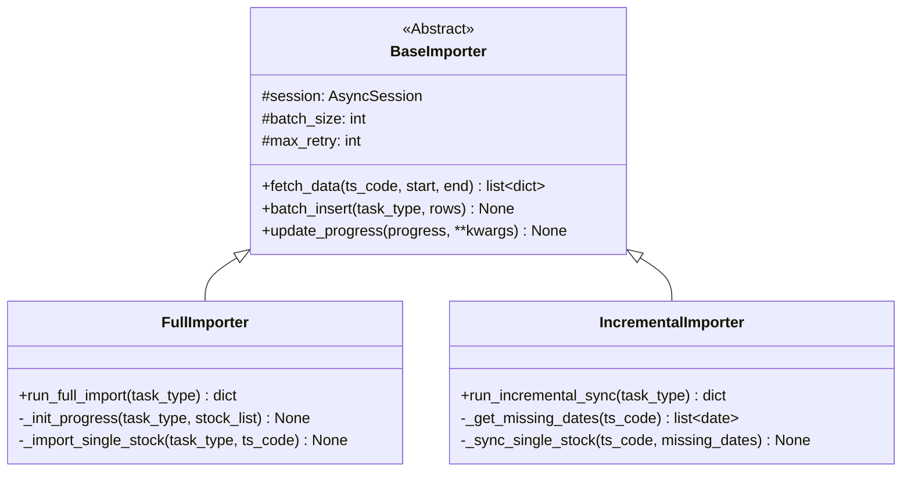
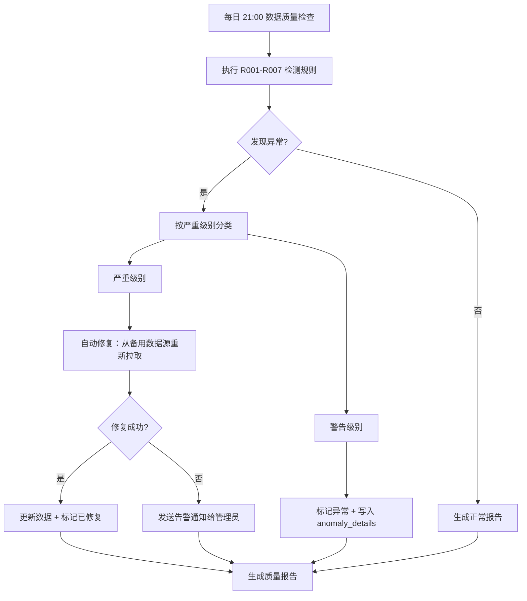
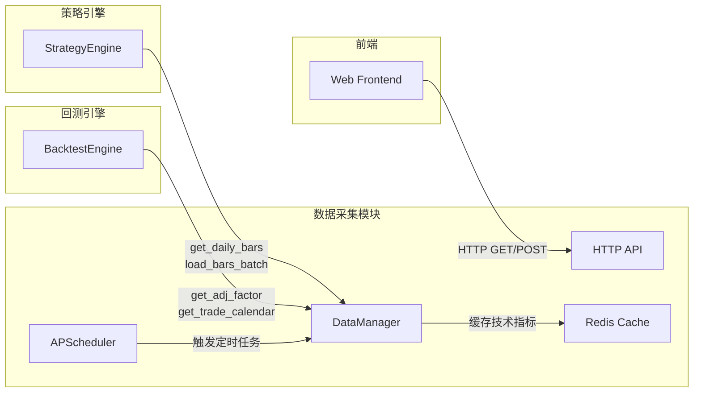

# 详细设计 - 模块 1：数据采集与管理

> **版本：** v2.0
> **日期：** 2026-02-16
> **关联任务：** Task 0.1
> **状态：** Implemented (P0 + P1)
>
> **V1 实施范围：** Tushare Pro 单一数据源 + raw 原始数据层 + ETL 清洗层。已实施 P0（基础行情）和 P1（财务数据）。

---

## 1. 模块概述

本模块负责从 **Tushare Pro** 数据源获取股票行情、财务数据、指数、板块等数据，经过 **raw 原始数据层** 存储后，再通过 **ETL 清洗层** 转换为业务表。

**核心架构变更（v2.0）：**
- **数据源统一：** 从 BaoStock/AKShare 多源切换为 Tushare Pro 单一数据源
- **新增 raw 层：** 引入原始数据层（raw_tushare_*），保留 API 原始格式
- **两阶段 ETL：** API → raw 表 → 业务表，支持数据回溯和审计

**核心挑战：**
- **Tushare 频率限制：** 需要令牌桶限流，避免超过 QPS 限制
- **VIP 接口依赖：** 财务数据需要 VIP 接口按季度批量获取
- **数据量大：** 日线数据每日 5000+ 股票，需批量写入优化

---

## 2. 类图设计 (Class Diagram)

采用 **单一数据源 + raw 层** 架构，去掉多源切换逻辑。



---

## 3. 数据库表设计与 ETL 映射

### 3.1 原始数据层 (Raw Layer)

**设计原则：**
- 每个 Tushare 接口对应一张 `raw_tushare_*` 表
- 字段与 API 输出一一对应，不做任何转换
- 日期字段保持 `VARCHAR(8)` 的 YYYYMMDD 格式
- 数值字段使用 `NUMERIC`，保留原始精度
- 每张表包含 `fetched_at` 时间戳，记录数据拉取时间

#### P0 核心原始表（6 张）

##### A. `raw_tushare_stock_basic` (股票基础信息)
| 字段名 | 类型 | 示例值 | 说明 |
| :--- | :--- | :--- | :--- |
| ts_code | VARCHAR(16) PK | 600519.SH | TS 代码 |
| symbol | VARCHAR(10) | 600519 | 股票代码 |
| name | VARCHAR(32) | 贵州茅台 | 股票名称 |
| area | VARCHAR(16) | 贵州 | 地域 |
| industry | VARCHAR(32) | 白酒 | 行业 |
| list_date | VARCHAR(8) | 20010827 | 上市日期 |
| delist_date | VARCHAR(8) | NULL | 退市日期 |
| list_status | VARCHAR(4) | L | L=上市 D=退市 |
| fetched_at | TIMESTAMP | 2026-02-16 10:00:00 | 采集时间 |

##### B. `raw_tushare_trade_cal` (交易日历)
| 字段名 | 类型 | 示例值 | 说明 |
| :--- | :--- | :--- | :--- |
| exchange | VARCHAR(8) PK | SSE | 交易所 |
| cal_date | VARCHAR(8) PK | 20260216 | 日期 |
| is_open | VARCHAR(4) | 1 | 1=交易日 0=休市 |
| pretrade_date | VARCHAR(8) | 20260215 | 上一交易日 |
| fetched_at | TIMESTAMP | 2026-02-16 10:00:00 | 采集时间 |

##### C. `raw_tushare_daily` (日线行情)
| 字段名 | 类型 | 示例值 | 说明 |
| :--- | :--- | :--- | :--- |
| ts_code | VARCHAR(16) PK | 600519.SH | TS 代码 |
| trade_date | VARCHAR(8) PK | 20260216 | 交易日期 |
| open | NUMERIC(12,4) | 1700.0000 | 开盘价 |
| high | NUMERIC(12,4) | 1720.0000 | 最高价 |
| low | NUMERIC(12,4) | 1695.0000 | 最低价 |
| close | NUMERIC(12,4) | 1710.0000 | 收盘价 |
| pre_close | NUMERIC(12,4) | 1705.0000 | 昨收价 |
| change | NUMERIC(12,4) | 5.0000 | 涨跌额 |
| pct_chg | NUMERIC(10,4) | 0.2900 | 涨跌幅 |
| vol | NUMERIC(20,4) | 12345.0000 | 成交量（手）|
| amount | NUMERIC(20,4) | 210000.0000 | 成交额（千元）|
| fetched_at | TIMESTAMP | 2026-02-16 16:00:00 | 采集时间 |

**索引：** `idx_raw_daily_trade_date` ON (trade_date)

##### D. `raw_tushare_adj_factor` (复权因子)
| 字段名 | 类型 | 示例值 | 说明 |
| :--- | :--- | :--- | :--- |
| ts_code | VARCHAR(16) PK | 600519.SH | TS 代码 |
| trade_date | VARCHAR(8) PK | 20260216 | 交易日期 |
| adj_factor | NUMERIC(16,6) | 1.234567 | 复权因子 |
| fetched_at | TIMESTAMP | 2026-02-16 16:00:00 | 采集时间 |

**索引：** `idx_raw_adj_factor_trade_date` ON (trade_date)

##### E. `raw_tushare_daily_basic` (每日指标)
| 字段名 | 类型 | 示例值 | 说明 |
| :--- | :--- | :--- | :--- |
| ts_code | VARCHAR(16) PK | 600519.SH | TS 代码 |
| trade_date | VARCHAR(8) PK | 20260216 | 交易日期 |
| close | NUMERIC(12,4) | 1710.0000 | 收盘价 |
| turnover_rate | NUMERIC(12,4) | 0.5600 | 换手率 |
| pe_ttm | NUMERIC(16,4) | 35.2000 | 市盈率 TTM |
| pb | NUMERIC(16,4) | 12.5000 | 市净率 |
| total_mv | NUMERIC(20,4) | 2145000.0000 | 总市值（万元）|
| circ_mv | NUMERIC(20,4) | 2145000.0000 | 流通市值（万元）|
| fetched_at | TIMESTAMP | 2026-02-16 16:00:00 | 采集时间 |

**索引：** `idx_raw_daily_basic_trade_date` ON (trade_date)

##### F. `raw_tushare_stk_limit` (涨跌停价格)
| 字段名 | 类型 | 示例值 | 说明 |
| :--- | :--- | :--- | :--- |
| ts_code | VARCHAR(16) PK | 600519.SH | TS 代码 |
| trade_date | VARCHAR(8) PK | 20260216 | 交易日期 |
| pre_close | NUMERIC(12,4) | 1705.0000 | 昨收价 |
| up_limit | NUMERIC(12,4) | 1875.5000 | 涨停价 |
| down_limit | NUMERIC(12,4) | 1534.5000 | 跌停价 |
| fetched_at | TIMESTAMP | 2026-02-16 16:00:00 | 采集时间 |

**索引：** `idx_raw_stk_limit_trade_date` ON (trade_date)

#### P1 财务原始表（10 张）

##### G. `raw_tushare_fina_indicator` (财务指标)
| 字段名 | 类型 | 示例值 | 说明 |
| :--- | :--- | :--- | :--- |
| ts_code | VARCHAR(16) PK | 600519.SH | TS 代码 |
| ann_date | VARCHAR(8) PK | 20260430 | 公告日期 |
| end_date | VARCHAR(8) PK | 20251231 | 报告期 |
| eps | NUMERIC(12,4) | 45.6700 | 基本每股收益 |
| roe | NUMERIC(12,4) | 28.5600 | 净资产收益率 |
| roe_dt | NUMERIC(12,4) | 27.8900 | 稀释净资产收益率 |
| grossprofit_margin | NUMERIC(12,4) | 91.2300 | 销售毛利率 |
| netprofit_margin | NUMERIC(12,4) | 52.3400 | 销售净利率 |
| ... | ... | ... | 共 100+ 字段 |
| fetched_at | TIMESTAMP | 2026-04-30 20:00:00 | 采集时间 |

**索引：**
- `idx_raw_fina_indicator_ann_date` ON (ann_date)
- `idx_raw_fina_indicator_end_date` ON (end_date)

**说明：** 使用 `fina_indicator_vip` 接口按季度（period 参数）获取全部公司数据。

##### H-P. 其他 9 张财务原始表
- `raw_tushare_income` (利润表) - 使用 `income_vip`
- `raw_tushare_balancesheet` (资产负债表) - 使用 `balancesheet_vip`
- `raw_tushare_cashflow` (现金流量表) - 使用 `cashflow_vip`
- `raw_tushare_dividend` (分红送股)
- `raw_tushare_forecast` (业绩预告) - 使用 `forecast_vip`
- `raw_tushare_express` (业绩快报) - 使用 `express_vip`
- `raw_tushare_fina_audit` (财务审计意见)
- `raw_tushare_fina_mainbz` (主营业务构成) - 使用 `fina_mainbz_vip`
- `raw_tushare_disclosure_date` (财报披露计划)

**复合主键：** (ts_code, ann_date, end_date) 或 (ts_code, end_date, bz_item)

---
| ... | ... | ... | |

---

### 3.2 标准数据层 (Standard Layer)

**设计原则：** 统一字段名、统一单位、统一精度 (`NUMERIC`)、统一代码格式 (`600519.SH`)。

#### A. ETL 映射规则 (Pipeline)

**两阶段 ETL 流程：**
```
Tushare API → raw_tushare_* (原始层) → stocks/stock_daily/finance_indicator (业务层)
```

**1. 股票代码标准化**
- Tushare 原生格式：`600519.SH` / `000858.SZ` / `430047.BJ`
- 直接透传，无需转换

**2. 日期格式转换**
- raw 层：`VARCHAR(8)` 格式 `YYYYMMDD`（如 `20260216`）
- 业务层：`DATE` 类型（如 `2026-02-16`）
- 转换函数：`parse_date(value: str) -> date | None`

**3. 数值类型转换**
- 空值处理：`""`, `"N/A"`, `"--"`, `"None"`, `NaN` → `NULL`
- 精度控制：
  - 价格：`NUMERIC(12, 4)` (保留4位)
  - 涨跌幅：`NUMERIC(10, 4)` (保留4位，如 0.2900)
  - 成交量：`NUMERIC(20, 4)` (单位：手)
  - 成交额：`NUMERIC(20, 4)` (单位：元，注意 Tushare daily 的 amount 是千元，需乘以 1000)
  - 财务指标：`NUMERIC(12, 4)` 或 `NUMERIC(20, 4)`
- 转换函数：`parse_decimal(value: str | float | None) -> Decimal | None`

**4. 复权处理**
- 策略回测必须使用**前复权 (Forward Adjusted)** 价格
- **方案：**
  - 每日存储 **不复权 (Raw)** 价格到 `stock_daily.close`
  - 每日存储 **复权因子 (Adj Factor)** 到 `stock_daily.adj_factor`
  - 回测时动态计算：`复权价 = 原始价 * 当日复权因子 / 最新复权因子`

#### B. ETL 实现示例

**P0 日线数据 ETL：**
```python
# 1. 按日期获取全市场原始数据
raw_daily = await tushare_client.fetch_raw_daily(trade_date="20260216")
raw_adj = await tushare_client.fetch_raw_adj_factor(trade_date="20260216")
raw_basic = await tushare_client.fetch_raw_daily_basic(trade_date="20260216")

# 2. 批量写入 raw 表
await batch_insert(session, RawTushareDaily.__table__, raw_daily)
await batch_insert(session, RawTushareAdjFactor.__table__, raw_adj)
await batch_insert(session, RawTushareDailyBasic.__table__, raw_basic)

# 3. 从 raw 表读取并 JOIN 清洗
cleaned = transform_tushare_daily(raw_daily, raw_adj, raw_basic)

# 4. 写入业务表
await batch_insert(session, StockDaily.__table__, cleaned)
```

**P1 财务数据 ETL：**
```python
# 1. 按季度获取全市场财务指标（使用 VIP 接口）
raw_fina = await tushare_client.fetch_raw_fina_indicator(period="20231231")

# 2. 批量写入 raw 表
await batch_insert(session, RawTushareFinaIndicator.__table__, raw_fina)

# 3. 从 raw 表读取并转换
cleaned = transform_tushare_fina_indicator(raw_fina)

# 4. 写入业务表
await batch_insert(session, FinanceIndicator.__table__, cleaned)
```

---

## 4. 频率限流 (Rate Limiting)

Tushare Pro 有 QPS 限制（默认 200次/分钟），需要令牌桶限流。

**令牌桶实现：**
```python
class TokenBucket:
    def __init__(self, rate_per_minute: int):
        self._rate = rate_per_minute / 60.0  # 每秒补充令牌数
        self._tokens = float(rate_per_minute)  # 初始满桶

    async def acquire(self):
        """获取一个令牌，令牌不足时等待"""
        if self._tokens < 1.0:
            wait_time = (1.0 - self._tokens) / self._rate
            await asyncio.sleep(wait_time)
        self._tokens -= 1.0
```

**TushareClient 集成：**
```python
class TushareClient:
    def __init__(self, token: str, qps_limit: int = 200):
        self._api = ts.pro_api(token)
        self._limiter = TokenBucket(qps_limit)

    async def _call(self, api_name: str, **kwargs):
        await self._limiter.acquire()  # 限流
        df = await asyncio.to_thread(self._api.query, api_name, **kwargs)
        return df
```

---

## 5. 数据同步流程 (Sync Workflow)

### 5.1 每日数据同步（盘后任务）

**执行时间：** 每日 16:00 后（收盘后）

**流程：**
```python
async def run_post_market_chain(target_date: date):
    """盘后数据同步链路"""
    # 1. 同步原始数据到 raw 表
    await manager.sync_raw_daily(target_date)

    # 2. ETL 清洗到业务表
    await manager.etl_daily(target_date)

    # 3. 计算技术指标
    await compute_incremental(target_date)

    # 4. 刷新缓存
    await refresh_cache(target_date)
```

### 5.2 财务数据同步（季度任务）

**执行时间：** 每季度财报披露期（4月、8月、10月、次年4月）

**流程：**
```python
async def sync_quarterly_finance(period: str):
    """季度财务数据同步"""
    # 1. 同步原始数据到 raw 表（使用 VIP 接口）
    await manager.sync_raw_fina(period)  # period="20231231"

    # 2. ETL 清洗到业务表
    await manager.etl_fina(period)
```

---

## 6. 接口定义 (API Specification)

`DataManager` 提供的内部 Python API：

```python
class DataManager:
    # P0 基础数据同步
    async def sync_stock_list() -> dict
    async def sync_trade_calendar(start_date, end_date) -> dict
    async def sync_raw_daily(trade_date: date) -> dict
    async def etl_daily(trade_date: date) -> dict

    # P1 财务数据同步
    async def sync_raw_fina(period: str) -> dict
    async def etl_fina(period: str) -> dict

    # 查询接口
    async def get_daily_bars(code: str, start: date, end: date) -> List[Dict]
    async def get_finance_indicators(code: str, period: str) -> Dict
```

---

## 7. 异常处理规范
    
    Tertiary(Tushare) --> Success: 成功获取
    Tertiary(Tushare) --> CriticalAlert: 全部失败(发告警)
```

**完整性校验逻辑 (`verify_data_integrity`)：**
1. **数量检查：** 今日 A 股总数是否 > 5000？（防止只获取了一半）
2. **零值检查：** 收盘价为 0 的股票数量是否异常？
3. **指数校验：** 对比上证指数的涨跌幅，若个股涨跌幅分布严重偏离（如全部跌停），可能数据源有问题。

---

## 5. 数据库分区策略 (Partitioning)

针对 `stock_min` (分钟线) 表，数据量极大（5000只 * 240分钟 * 250天 ≈ 3亿行/年）。

**TimescaleDB 超表配置：**

```sql
-- 1. 转换为超表，按时间分区 (chunk_time_interval = 1个月)
SELECT create_hypertable('stock_min', 'trade_time', chunk_time_interval => INTERVAL '1 month');

-- 2. 启用压缩 (节省 90% 空间)
ALTER TABLE stock_min SET (
    timescaledb.compress,
    timescaledb.compress_segmentby = 'ts_code',
    timescaledb.compress_orderby = 'trade_time DESC'
);

-- 3. 自动压缩策略 (压缩 7 天前的数据)
SELECT add_compression_policy('stock_min', INTERVAL '7 days');
```

**查询优化：**
- 总是带上 `trade_time` 过滤条件，以便利用分区剪枝。
- 总是带上 `ts_code`，以便利用压缩段索引。

---

## 6. 接口定义 (API Specification)

`DataManager` 提供的内部 Python API：

```python
async def get_daily_bars(
    codes: List[str], 
    start_date: date, 
    end_date: date, 
    adj: str = 'qfq'  # qfq前复权, hfq后复权, None不复权
) -> pd.DataFrame:
    """
    获取标准化日线数据（自动处理复权）
    返回 DataFrame Columns: [ts_code, trade_date, open, high, low, close, vol]
    """
    pass

async def update_daily_task():
    """
    [定时任务] 每日 16:00 执行
    1. 尝试 BaoStock 下载 -> raw_baostock_daily
    2. 若失败 -> AKShare -> raw_akshare_daily
    3. 执行 ETL -> stock_daily
    4. 更新 technical_daily 指标缓存
    """
    pass
```

---

## 7. 异常处理规范

- **网络超时：** 重试 3 次，间隔 5s (Exponential Backoff)。
- **数据缺失：** 记录到 `data_missing_log` 表，第二天自动重补。
- **解析错误：** 原始数据保留在 `raw_*` 表，跳过该行，不中断整体流程，记录 Error Log。

---

## 8. 首次全量导入 vs 日常增量更新

### 8.1 首次全量导入流程

#### 8.1.1 全量导入数据范围

| 数据类型 | 数据源 | 时间范围 | 预估行数 | 预估耗时 |
|:---|:---|:---|:---|:---|
| 日线行情 (`stock_daily`) | BaoStock (主) / Tushare (备) | 各股票上市日至今（最早可追溯至 1990-12-19） | 约 2500 万行（5000 只 x 平均 5000 个交易日） | 约 8-12 小时 |
| 5 分钟线 (`stock_min`) | BaoStock (主) / Tushare (备) | 最近 1 年（BaoStock 限制） | 约 3 亿行（5000 只 x 240 根/天 x 250 天） | 约 24-48 小时 |
| 财务指标 (`finance_indicator`) | Tushare Pro (主) | 全量（各股票上市以来所有季报） | 约 50 万行（5000 只 x 平均 100 个季度） | 约 2-4 小时 |
| 复权因子 (`adj_factor`) | Tushare Pro (主) | 各股票上市日至今 | 约 2500 万行 | 约 4-6 小时 |
| 交易日历 (`trade_calendar`) | BaoStock / Tushare | 1990-01-01 至今 | 约 9000 行 | < 1 分钟 |

> **说明：** 总导入耗时预估 40-72 小时（受网络带宽和数据源 QPS 限制影响较大）。建议在周末执行首次全量导入。

#### 8.1.2 断点续传机制

##### `import_progress` 表 DDL

```sql
CREATE TABLE import_progress (
    id              SERIAL          PRIMARY KEY,
    task_type       VARCHAR(32)     NOT NULL,       -- 'daily' | 'minute' | 'finance' | 'adj_factor'
    ts_code         VARCHAR(16)     NOT NULL,       -- 股票代码，如 '600519.SH'
    status          VARCHAR(16)     NOT NULL        -- 'pending' | 'running' | 'done' | 'failed'
                    DEFAULT 'pending',
    last_date       DATE,                           -- 已导入到的最后日期（断点位置）
    total_rows      INTEGER         DEFAULT 0,      -- 已导入行数
    error_msg       TEXT,                           -- 最近一次错误信息
    retry_count     INTEGER         DEFAULT 0,      -- 已重试次数
    created_at      TIMESTAMP       NOT NULL DEFAULT NOW(),
    updated_at      TIMESTAMP       NOT NULL DEFAULT NOW(),
    CONSTRAINT uq_import_progress UNIQUE (task_type, ts_code)
);

COMMENT ON TABLE import_progress IS '全量导入断点续传进度表';
COMMENT ON COLUMN import_progress.task_type IS '导入任务类型：daily/minute/finance/adj_factor';
COMMENT ON COLUMN import_progress.last_date IS '已成功导入的最后日期，中断后从此日期+1继续';

CREATE INDEX idx_import_progress_status ON import_progress (task_type, status);
```

##### 断点续传逻辑



#### 8.1.3 批量写入优化策略

1. **Batch Insert：** 使用 SQLAlchemy `insert().values([...])` 批量插入，每批 5000 行。
2. **关闭索引后重建：** 全量导入前删除非主键索引，导入完成后统一重建，提升写入速度约 3-5 倍。
3. **关闭自动提交：** 每 10 个批次（50000 行）执行一次 `COMMIT`，减少事务开销。
4. **COPY 协议：** 对于超大表（`stock_min`），使用 PostgreSQL `COPY FROM` 协议替代 INSERT，速度提升约 10 倍。

```sql
-- 全量导入前：删除索引
DROP INDEX IF EXISTS idx_stock_daily_code_date;
DROP INDEX IF EXISTS idx_stock_daily_trade_date;

-- 全量导入后：重建索引
CREATE INDEX idx_stock_daily_code_date ON stock_daily (ts_code, trade_date);
CREATE INDEX idx_stock_daily_trade_date ON stock_daily (trade_date);

-- 分析表统计信息
ANALYZE stock_daily;
```

#### 8.1.4 BaoStock 分钟线历史数据补全方案

BaoStock 仅提供最近 1 年的 5 分钟线数据，对于更早的历史分钟线：

| 方案 | 可行性 | 说明 |
|:---|:---|:---|
| Tushare Pro 补充 | **推荐** | Tushare 积分 >= 2000 可获取 5 年内分钟线，需付费 Token |
| 仅保留 1 年分钟线 | **默认方案** | 对于大多数短线策略回测，1 年分钟线已足够 |
| 日线模拟分钟线 | 不推荐 | 精度损失过大，无法用于分钟级策略回测 |

**默认策略：** 系统默认仅导入 BaoStock 最近 1 年分钟线。若用户配置了 Tushare Pro 高级 Token（积分 >= 2000），则自动补全至 5 年。配置项为 `tushare.enable_extended_minute = false`。

#### 8.1.5 全量导入完整伪代码

```python
import asyncio
from datetime import date, timedelta
from typing import Optional
from sqlalchemy import insert, text
from sqlalchemy.ext.asyncio import AsyncSession

from app.models import ImportProgress, StockDaily, StockMin
from app.datasource import BaoStockClient, TushareClient
from app.config import settings
from app.logger import logger


class FullImporter:
    """首次全量导入控制器，支持断点续传、进度上报、错误跳过。"""

    def __init__(
        self,
        session: AsyncSession,
        baostock: BaoStockClient,
        tushare: TushareClient,
        batch_size: int = 5000,
        max_retry: int = 3,
    ) -> None:
        self.session = session
        self.baostock = baostock
        self.tushare = tushare
        self.batch_size = batch_size
        self.max_retry = max_retry
        self._progress_cache: dict[str, ImportProgress] = {}

    async def run_full_import(self, task_type: str = "daily") -> dict:
        """
        执行全量导入主流程。

        Args:
            task_type: 导入类型，可选 'daily' | 'minute' | 'finance' | 'adj_factor'

        Returns:
            统计结果字典，包含 success_count, failed_count, skipped_count
        """
        stats = {"success": 0, "failed": 0, "skipped": 0}

        # Step 1: 获取全部股票列表
        stock_list: list[str] = await self._get_all_stock_codes()
        logger.info(f"全量导入[{task_type}]启动，共 {len(stock_list)} 只股票")

        # Step 2: 初始化或恢复进度表
        await self._init_progress(task_type, stock_list)

        # Step 3: 全量导入前删除非主键索引（提升写入性能）
        if task_type == "daily":
            await self.session.execute(
                text("DROP INDEX IF EXISTS idx_stock_daily_code_date")
            )
            await self.session.execute(
                text("DROP INDEX IF EXISTS idx_stock_daily_trade_date")
            )
            await self.session.commit()

        # Step 4: 逐只股票导入
        pending_codes = await self._get_pending_codes(task_type)
        for i, ts_code in enumerate(pending_codes):
            logger.info(
                f"[{i + 1}/{len(pending_codes)}] 正在导入 {ts_code} ({task_type})"
            )
            try:
                await self._import_single_stock(task_type, ts_code)
                stats["success"] += 1
            except Exception as e:
                logger.error(f"导入 {ts_code} 失败: {e}")
                stats["failed"] += 1

            # 每 100 只股票上报一次进度
            if (i + 1) % 100 == 0:
                logger.info(
                    f"进度: {i + 1}/{len(pending_codes)}, "
                    f"成功={stats['success']}, 失败={stats['failed']}"
                )

        # Step 5: 重建索引
        if task_type == "daily":
            await self.session.execute(
                text(
                    "CREATE INDEX idx_stock_daily_code_date "
                    "ON stock_daily (ts_code, trade_date)"
                )
            )
            await self.session.execute(
                text(
                    "CREATE INDEX idx_stock_daily_trade_date "
                    "ON stock_daily (trade_date)"
                )
            )
            await self.session.execute(text("ANALYZE stock_daily"))
            await self.session.commit()

        logger.info(f"全量导入[{task_type}]完成: {stats}")
        return stats

    async def _import_single_stock(
        self, task_type: str, ts_code: str
    ) -> None:
        """导入单只股票数据，支持断点续传和重试。"""
        progress = await self._get_progress(task_type, ts_code)

        # 确定起始日期（断点续传）
        if progress.last_date is not None:
            start_date = progress.last_date + timedelta(days=1)
        else:
            start_date = await self._get_listing_date(ts_code)

        end_date = date.today()

        if start_date > end_date:
            # 已经是最新，跳过
            await self._update_progress(progress, status="done")
            return

        await self._update_progress(progress, status="running")

        retry = 0
        while retry <= self.max_retry:
            try:
                # 拉取数据
                rows = await self._fetch_data(
                    task_type, ts_code, start_date, end_date
                )

                if not rows:
                    await self._update_progress(progress, status="done")
                    return

                # 批量写入
                for batch_start in range(0, len(rows), self.batch_size):
                    batch = rows[batch_start : batch_start + self.batch_size]
                    await self._batch_insert(task_type, batch)

                    # 更新断点位置
                    last_row_date = batch[-1]["trade_date"]
                    await self._update_progress(
                        progress,
                        last_date=last_row_date,
                        total_rows=progress.total_rows + len(batch),
                    )

                await self._update_progress(progress, status="done")
                return

            except Exception as e:
                retry += 1
                logger.warning(
                    f"{ts_code} 第 {retry} 次重试: {e}"
                )
                await self._update_progress(
                    progress,
                    error_msg=str(e),
                    retry_count=retry,
                )
                await asyncio.sleep(2 ** retry)  # 指数退避

        # 超过最大重试次数，标记失败并跳过
        await self._update_progress(progress, status="failed")
        raise RuntimeError(
            f"{ts_code} 导入失败，已重试 {self.max_retry} 次"
        )

    async def _fetch_data(
        self,
        task_type: str,
        ts_code: str,
        start_date: date,
        end_date: date,
    ) -> list[dict]:
        """根据任务类型从对应数据源拉取数据。"""
        if task_type == "daily":
            return await self.baostock.fetch_daily(
                ts_code, start_date, end_date
            )
        elif task_type == "minute":
            return await self.baostock.fetch_minute(
                ts_code, freq="5min"
            )
        elif task_type == "finance":
            return await self.tushare.fetch_finance(ts_code)
        elif task_type == "adj_factor":
            return await self.tushare.fetch_adj_factor(
                ts_code, start_date, end_date
            )
        else:
            raise ValueError(f"未知任务类型: {task_type}")

    async def _batch_insert(
        self, task_type: str, rows: list[dict]
    ) -> None:
        """批量插入数据，使用 ON CONFLICT 避免重复。"""
        table_map = {
            "daily": StockDaily.__table__,
            "minute": StockMin.__table__,
        }
        table = table_map.get(task_type)
        if table is not None:
            stmt = (
                insert(table)
                .values(rows)
                .on_conflict_do_nothing(
                    index_elements=["ts_code", "trade_date"]
                )
            )
            await self.session.execute(stmt)
            await self.session.commit()

    async def _get_all_stock_codes(self) -> list[str]:
        """获取全部 A 股股票代码列表。"""
        result = await self.session.execute(
            text("SELECT ts_code FROM stock_basic WHERE list_status = 'L'")
        )
        return [row[0] for row in result.fetchall()]

    async def _get_listing_date(self, ts_code: str) -> date:
        """获取股票上市日期。"""
        result = await self.session.execute(
            text(
                "SELECT list_date FROM stock_basic WHERE ts_code = :code"
            ),
            {"code": ts_code},
        )
        row = result.fetchone()
        return row[0] if row else date(1990, 12, 19)

    async def _init_progress(
        self, task_type: str, stock_list: list[str]
    ) -> None:
        """初始化进度表：仅为尚无记录的股票插入 pending 状态。"""
        existing = await self.session.execute(
            text(
                "SELECT ts_code FROM import_progress "
                "WHERE task_type = :task_type"
            ),
            {"task_type": task_type},
        )
        existing_codes = {row[0] for row in existing.fetchall()}
        new_codes = [c for c in stock_list if c not in existing_codes]

        if new_codes:
            values = [
                {"task_type": task_type, "ts_code": c, "status": "pending"}
                for c in new_codes
            ]
            await self.session.execute(
                insert(ImportProgress.__table__).values(values)
            )
            await self.session.commit()

    async def _get_pending_codes(self, task_type: str) -> list[str]:
        """获取待导入的股票列表（pending + failed 且重试次数未超限）。"""
        result = await self.session.execute(
            text(
                "SELECT ts_code FROM import_progress "
                "WHERE task_type = :task_type "
                "AND status IN ('pending', 'failed') "
                "AND retry_count < :max_retry "
                "ORDER BY ts_code"
            ),
            {"task_type": task_type, "max_retry": self.max_retry},
        )
        return [row[0] for row in result.fetchall()]

    async def _get_progress(
        self, task_type: str, ts_code: str
    ) -> ImportProgress:
        """获取单只股票的导入进度记录。"""
        result = await self.session.execute(
            text(
                "SELECT * FROM import_progress "
                "WHERE task_type = :task_type AND ts_code = :ts_code"
            ),
            {"task_type": task_type, "ts_code": ts_code},
        )
        return result.fetchone()

    async def _update_progress(
        self,
        progress: ImportProgress,
        status: Optional[str] = None,
        last_date: Optional[date] = None,
        total_rows: Optional[int] = None,
        error_msg: Optional[str] = None,
        retry_count: Optional[int] = None,
    ) -> None:
        """更新导入进度记录。"""
        updates: dict = {"updated_at": text("NOW()")}
        if status is not None:
            updates["status"] = status
        if last_date is not None:
            updates["last_date"] = last_date
        if total_rows is not None:
            updates["total_rows"] = total_rows
        if error_msg is not None:
            updates["error_msg"] = error_msg
        if retry_count is not None:
            updates["retry_count"] = retry_count

        await self.session.execute(
            text(
                "UPDATE import_progress SET "
                + ", ".join(f"{k} = :{k}" for k in updates)
                + " WHERE task_type = :task_type AND ts_code = :ts_code"
            ),
            {
                **updates,
                "task_type": progress.task_type,
                "ts_code": progress.ts_code,
            },
        )
        await self.session.commit()
```

### 8.2 日常增量更新流程

#### 8.2.1 触发时间与流程

| 任务 | Cron 表达式 | 触发时间 | 说明 |
|:---|:---|:---|:---|
| 智能数据自动更新 | `30 15 * * 1-5` | 每个工作日 15:30 | **V1 已实施**：智能嗅探 + 自动重试，包含交易日历更新、日线同步、技术指标计算、策略管道等完整盘后链路 |
| 交易日历更新 | 每日 15:30（盘后链路第一步） | 盘后链路自动执行 | **V1 已实施**：获取未来 90 天交易日历数据，使用 UPSERT 避免重复 |
| 5 分钟线增量同步 | `0 45 15 * * MON-FRI` | 每个交易日 15:45 | 日线同步完成后执行 |
| 财务数据增量同步 | `0 0 20 * * *` | 每日 20:00 | 财报披露后更新 |
| 复权因子增量同步 | `0 0 16 * * MON-FRI` | 每个交易日 16:00 | 除权除息日需更新 |
| 数据质量检查 | `0 0 21 * * MON-FRI` | 每个交易日 21:00 | 所有同步完成后执行 |

**V1 实施说明：**
- 原有的固定时间盘后任务已升级为智能自动更新系统（`auto_update_job`）
- 系统每日 15:30 自动触发，包含数据嗅探机制：
  - 检查 5-10 只样本股票（如茅台、平安银行等大盘股）是否有当日数据
  - 如数据就绪（≥80% 样本有数据）→ 立即执行完整盘后链路
  - 如数据未就绪 → 启动定时嗅探任务（每 15 分钟一次）
  - 嗅探到数据后自动执行盘后链路
  - 18:00 仍无数据则超时告警
- 交易日历更新作为盘后链路第一步自动执行，获取未来 90 天数据
- 详见 `10-系统设计-定时任务调度.md` §3.4.1 智能数据自动更新系统

#### 8.2.2 增量判断逻辑

```python
async def get_missing_dates(
    session: AsyncSession,
    ts_code: str,
    task_type: str = "daily",
) -> list[date]:
    """
    查询某只股票在 stock_daily 中缺失的交易日。
    通过对比 trade_calendar 和已有数据，返回缺失日期列表。
    """
    sql = text("""
        SELECT tc.cal_date
        FROM trade_calendar tc
        LEFT JOIN stock_daily sd
            ON sd.trade_date = tc.cal_date AND sd.ts_code = :ts_code
        WHERE tc.is_open = 1
          AND tc.cal_date > (
              SELECT COALESCE(MAX(trade_date), '1990-01-01')
              FROM stock_daily
              WHERE ts_code = :ts_code
          )
          AND tc.cal_date <= CURRENT_DATE
          AND sd.ts_code IS NULL
        ORDER BY tc.cal_date
    """)
    result = await session.execute(sql, {"ts_code": ts_code})
    return [row[0] for row in result.fetchall()]


async def incremental_sync_daily(
    session: AsyncSession,
    data_manager: "DataManager",
) -> dict:
    """
    日常增量同步主流程。

    Returns:
        统计结果: {synced: int, skipped: int, failed: int}
    """
    stats = {"synced": 0, "skipped": 0, "failed": 0}

    # 获取今日是否为交易日
    is_trade_day = await check_trade_day(session, date.today())
    if not is_trade_day:
        logger.info("今日非交易日，跳过增量同步")
        return stats

    stock_list = await get_all_stock_codes(session)

    for ts_code in stock_list:
        missing_dates = await get_missing_dates(session, ts_code)
        if not missing_dates:
            stats["skipped"] += 1
            continue

        try:
            # 复用全量导入的 _fetch_data 和 _batch_insert 逻辑
            rows = await data_manager.fetch_daily(
                ts_code,
                start_date=missing_dates[0],
                end_date=missing_dates[-1],
            )
            await data_manager.batch_insert("daily", rows)
            stats["synced"] += 1
        except Exception as e:
            logger.error(f"增量同步 {ts_code} 失败: {e}")
            stats["failed"] += 1

    return stats
```

#### 8.2.3 与全量导入的代码复用关系



> **复用说明：** `FullImporter` 和 `IncrementalImporter` 共享 `BaseImporter` 中的 `fetch_data()`、`batch_insert()`、`update_progress()` 方法。全量导入额外处理索引删除/重建和进度初始化；增量同步额外处理缺失日期检测。

### 8.3 交易日历自动更新（V1 已实施）

#### 8.3.1 设计目标

确保系统始终拥有最新的交易日历数据，包括未来的交易日信息，以支持：
- 交易日校验（判断当日是否为交易日）
- 数据完整性检查（检测缺失的交易日数据）
- 回测引擎（确定回测日期序列）

#### 8.3.2 更新机制

**触发时机：**
1. **每日盘后链路第一步**（15:30）
   - 作为智能自动更新系统的第一步自动执行
   - 获取未来 90 天的交易日历数据
   - 失败不阻断后续步骤（记录警告日志）

2. **周末任务兜底**（每周六 08:00）
   - 在股票列表同步任务中首先执行交易日历更新
   - 作为兜底机制，确保交易日历数据不会过期

**数据范围：**
- 起始日期：`date.today()`（当前日期）
- 结束日期：`date.today() + timedelta(days=90)`（未来 90 天）
- 数据源：BaoStock `query_trade_dates()` API
- 数据源能力：BaoStock 可获取当前年度内的所有交易日历数据

**UPSERT 逻辑：**
```python
async def sync_trade_calendar(
    self,
    start_date: date | None = None,
    end_date: date | None = None,
) -> dict:
    """
    同步交易日历数据（支持 UPSERT）。

    Args:
        start_date: 起始日期，默认为今天
        end_date: 结束日期，默认为今天+90天

    Returns:
        同步结果统计：{"inserted": 插入数, "updated": 更新数}
    """
    actual_start = start_date or date.today()
    actual_end = end_date or (date.today() + timedelta(days=90))

    # 从 BaoStock 获取交易日历数据
    rows = await self._fetch_trade_calendar(actual_start, actual_end)

    # 使用 UPSERT 逻辑避免重复数据
    stmt = (
        insert(TradeCalendar.__table__)
        .values(rows)
        .on_conflict_do_update(
            index_elements=["cal_date", "exchange"],
            set_={
                "is_open": excluded.c.is_open,
                "updated_at": text("NOW()"),
            },
        )
    )
    await self.session.execute(stmt)
    await self.session.commit()

    return {"inserted": len(rows), "updated": 0}
```

#### 8.3.3 数据验证

**完整性检查：**
- 验证未来 90 天内的交易日数量是否合理（预期 55-65 个交易日）
- 检查是否存在连续超过 10 天的非交易日（可能为数据缺失）
- 验证节假日数据是否正确（如春节、国庆等）

**数据质量：**
- 字段完整性：`cal_date`, `exchange`, `is_open` 字段不能为空
- 日期连续性：日历数据应覆盖连续的日期范围
- 交易日标识：`is_open` 字段值为 0 或 1

#### 8.3.4 性能优化

- **批量写入**：使用 UPSERT 批量插入/更新，单次操作处理 90 天数据
- **索引优化**：`trade_calendar` 表在 `(cal_date, exchange)` 上有唯一索引
- **缓存策略**：交易日历数据变动极少，启动时全量加载到内存，每日增量更新一次

#### 8.3.5 错误处理

- **BaoStock API 失败**：记录警告日志，不阻断盘后链路
- **数据解析错误**：跳过异常数据行，记录错误日志
- **数据库写入失败**：记录错误日志，抛出异常（阻断盘后链路）

#### 8.3.6 实现文件

- `app/data/manager.py` - `DataManager.sync_trade_calendar()` 方法
- `app/data/etl.py` - 交易日历数据清洗和标准化
- `app/scheduler/jobs.py` - 盘后链路中调用交易日历更新

### 8.4 数据补全机制

#### 8.3.1 检测缺失数据的 SQL 查询

```sql
-- 1. 检测某个交易日缺失数据的股票列表
SELECT sb.ts_code, sb.name
FROM stock_basic sb
LEFT JOIN stock_daily sd
    ON sd.ts_code = sb.ts_code AND sd.trade_date = '2026-02-06'
WHERE sb.list_status = 'L'
  AND sb.list_date <= '2026-02-06'
  AND sd.ts_code IS NULL
ORDER BY sb.ts_code;

-- 2. 检测最近 N 个交易日内有缺失的股票（连续缺失检测）
WITH recent_trade_days AS (
    SELECT cal_date
    FROM trade_calendar
    WHERE is_open = 1
      AND cal_date BETWEEN CURRENT_DATE - INTERVAL '30 days' AND CURRENT_DATE
),
expected AS (
    SELECT sb.ts_code, rtd.cal_date
    FROM stock_basic sb
    CROSS JOIN recent_trade_days rtd
    WHERE sb.list_status = 'L'
      AND sb.list_date <= rtd.cal_date
),
actual AS (
    SELECT ts_code, trade_date
    FROM stock_daily
    WHERE trade_date >= CURRENT_DATE - INTERVAL '30 days'
)
SELECT e.ts_code, COUNT(*) AS missing_days,
       ARRAY_AGG(e.cal_date ORDER BY e.cal_date) AS missing_dates
FROM expected e
LEFT JOIN actual a ON a.ts_code = e.ts_code AND a.trade_date = e.cal_date
WHERE a.ts_code IS NULL
GROUP BY e.ts_code
HAVING COUNT(*) > 0
ORDER BY missing_days DESC;

-- 3. 检测分钟线数据完整性（某日某股票的 K 线根数是否为 48 根）
SELECT ts_code, trade_time::date AS trade_date, COUNT(*) AS bar_count
FROM stock_min
WHERE trade_time::date = '2026-02-06'
GROUP BY ts_code, trade_time::date
HAVING COUNT(*) < 48
ORDER BY bar_count;
```

#### 8.3.2 自动补数据触发条件与流程

| 触发条件 | 触发方式 | 补数据范围 |
|:---|:---|:---|
| 每日数据质量检查发现缺失 | 定时任务（21:00 质量检查后自动触发） | 仅补当日缺失 |
| 连续 3 个交易日同一股票缺失 | 告警 + 自动补全 | 补全最近 30 天 |
| 数据源故障恢复后 | 手动或自动触发 | 补全故障期间所有缺失 |

```python
async def auto_repair_missing_data(
    session: AsyncSession,
    data_manager: "DataManager",
    lookback_days: int = 30,
) -> dict:
    """
    自动检测并补全缺失数据。

    Args:
        session: 数据库会话
        data_manager: 数据管理器实例
        lookback_days: 回溯检查天数

    Returns:
        补全统计: {checked: int, repaired: int, failed: int}
    """
    stats = {"checked": 0, "repaired": 0, "failed": 0}

    # 执行缺失检测 SQL
    missing_result = await session.execute(text("""
        WITH recent_trade_days AS (
            SELECT cal_date FROM trade_calendar
            WHERE is_open = 1
              AND cal_date BETWEEN CURRENT_DATE - INTERVAL ':days days'
                  AND CURRENT_DATE
        ),
        expected AS (
            SELECT sb.ts_code, rtd.cal_date
            FROM stock_basic sb
            CROSS JOIN recent_trade_days rtd
            WHERE sb.list_status = 'L' AND sb.list_date <= rtd.cal_date
        )
        SELECT e.ts_code,
               ARRAY_AGG(e.cal_date ORDER BY e.cal_date) AS missing_dates
        FROM expected e
        LEFT JOIN stock_daily sd
            ON sd.ts_code = e.ts_code AND sd.trade_date = e.cal_date
        WHERE sd.ts_code IS NULL
        GROUP BY e.ts_code
    """), {"days": lookback_days})

    for row in missing_result.fetchall():
        ts_code, missing_dates = row
        stats["checked"] += 1
        try:
            rows = await data_manager.fetch_daily(
                ts_code,
                start_date=missing_dates[0],
                end_date=missing_dates[-1],
            )
            await data_manager.batch_insert("daily", rows)
            stats["repaired"] += 1
            logger.info(f"已补全 {ts_code} 的 {len(missing_dates)} 天数据")
        except Exception as e:
            stats["failed"] += 1
            logger.error(f"补全 {ts_code} 失败: {e}")

    return stats
```

#### 8.3.3 手动补数据 API 接口

```python
from fastapi import APIRouter, Query
from datetime import date

router = APIRouter(prefix="/api/v1/data", tags=["数据管理"])


@router.post("/repair")
async def repair_data(
    ts_code: str = Query(..., description="股票代码，如 600519.SH"),
    start_date: date = Query(..., description="起始日期"),
    end_date: date = Query(..., description="结束日期"),
    task_type: str = Query("daily", description="数据类型: daily/minute/finance"),
) -> dict:
    """
    手动触发数据补全。

    - **ts_code**: 股票代码，支持 'ALL' 表示全部股票
    - **start_date / end_date**: 补数据的日期范围
    - **task_type**: 数据类型
    """
    # 调用 IncrementalImporter 的补数据逻辑
    result = await data_manager.repair(
        ts_code=ts_code,
        start_date=start_date,
        end_date=end_date,
        task_type=task_type,
    )
    return {"status": "ok", "detail": result}


@router.get("/missing")
async def query_missing_data(
    trade_date: date = Query(..., description="查询日期"),
) -> dict:
    """查询某个交易日缺失数据的股票列表。"""
    missing_list = await data_manager.get_missing_stocks(trade_date)
    return {
        "trade_date": trade_date.isoformat(),
        "missing_count": len(missing_list),
        "missing_stocks": missing_list,
    }
```

---

## 9. 数据质量监控报告

### 9.1 每日数据质量报告

#### 9.1.1 报告内容

每日数据质量报告包含以下维度：

| 报告维度 | 具体内容 | 数据来源 |
|:---|:---|:---|
| 同步概况 | 今日同步股票总数、新增行数、耗时 | `import_progress` + 运行日志 |
| 缺失统计 | 缺失股票列表、缺失原因分类 | `stock_daily` vs `trade_calendar` |
| 异常值统计 | 价格异常数、涨跌幅异常数、成交量异常数 | `data_quality_report` |
| 数据源使用情况 | 各数据源调用次数、成功率、平均响应时间 | `data_source_stats` |
| ETL 统计 | ETL 成功数、失败数、跳过数、失败原因 TOP5 | ETL 运行日志 |

#### 9.1.2 `data_quality_report` 表完整 DDL

```sql
CREATE TABLE data_quality_report (
    id              SERIAL          PRIMARY KEY,
    report_date     DATE            NOT NULL,                   -- 报告日期
    report_type     VARCHAR(32)     NOT NULL                    -- 'daily_summary' | 'anomaly_detail'
                    DEFAULT 'daily_summary',

    -- 同步概况
    total_stocks    INTEGER         NOT NULL DEFAULT 0,         -- 应同步股票总数
    synced_stocks   INTEGER         NOT NULL DEFAULT 0,         -- 实际同步股票数
    missing_stocks  INTEGER         NOT NULL DEFAULT 0,         -- 缺失股票数
    new_rows        INTEGER         NOT NULL DEFAULT 0,         -- 新增数据行数
    sync_duration   INTEGER         NOT NULL DEFAULT 0,         -- 同步耗时（秒）

    -- 异常统计
    price_anomaly_count     INTEGER NOT NULL DEFAULT 0,         -- 价格异常数
    change_anomaly_count    INTEGER NOT NULL DEFAULT 0,         -- 涨跌幅异常数
    volume_anomaly_count    INTEGER NOT NULL DEFAULT 0,         -- 成交量异常数
    data_gap_count          INTEGER NOT NULL DEFAULT 0,         -- 数据缺失数

    -- 数据源统计（JSONB 存储各源详情）
    source_stats    JSONB           NOT NULL DEFAULT '{}',
    -- 示例: {"baostock": {"calls": 5200, "success": 5180, "avg_ms": 120},
    --        "akshare": {"calls": 20, "success": 18, "avg_ms": 200}}

    -- ETL 统计
    etl_success     INTEGER         NOT NULL DEFAULT 0,         -- ETL 成功数
    etl_failed      INTEGER         NOT NULL DEFAULT 0,         -- ETL 失败数
    etl_skipped     INTEGER         NOT NULL DEFAULT 0,         -- ETL 跳过数
    etl_errors      JSONB           NOT NULL DEFAULT '[]',      -- 失败原因列表
    -- 示例: [{"ts_code": "000001.SZ", "error": "parse error", "count": 1}]

    -- 缺失股票明细
    missing_stock_list  JSONB       NOT NULL DEFAULT '[]',      -- 缺失股票代码列表
    -- 示例: ["000001.SZ", "000002.SZ"]

    -- 异常明细
    anomaly_details     JSONB       NOT NULL DEFAULT '[]',
    -- 示例: [{"ts_code": "300999.SZ", "type": "price_zero", "field": "close", "value": 0}]

    created_at      TIMESTAMP       NOT NULL DEFAULT NOW(),

    CONSTRAINT uq_quality_report UNIQUE (report_date, report_type)
);

COMMENT ON TABLE data_quality_report IS '每日数据质量监控报告';
COMMENT ON COLUMN data_quality_report.report_date IS '报告对应的交易日期';
COMMENT ON COLUMN data_quality_report.source_stats IS '各数据源调用统计，JSON 格式';
COMMENT ON COLUMN data_quality_report.anomaly_details IS '异常数据明细，JSON 数组';

CREATE INDEX idx_quality_report_date ON data_quality_report (report_date DESC);
CREATE INDEX idx_quality_report_type ON data_quality_report (report_type, report_date DESC);
```

#### 9.1.3 报告生成伪代码

```python
from datetime import date
from typing import Any
from sqlalchemy import text
from sqlalchemy.ext.asyncio import AsyncSession

from app.models import DataQualityReport
from app.logger import logger


class QualityReportGenerator:
    """每日数据质量报告生成器。"""

    def __init__(self, session: AsyncSession) -> None:
        self.session = session

    async def generate_daily_report(
        self, report_date: date
    ) -> DataQualityReport:
        """
        生成指定日期的数据质量报告。

        Args:
            report_date: 报告日期（交易日）

        Returns:
            DataQualityReport 实例
        """
        logger.info(f"开始生成 {report_date} 数据质量报告")

        # 1. 统计同步概况
        sync_stats = await self._calc_sync_stats(report_date)

        # 2. 检测缺失股票
        missing_stocks = await self._detect_missing_stocks(report_date)

        # 3. 检测异常数据
        anomalies = await self._detect_anomalies(report_date)

        # 4. 统计数据源使用情况
        source_stats = await self._calc_source_stats(report_date)

        # 5. 统计 ETL 结果
        etl_stats = await self._calc_etl_stats(report_date)

        # 6. 组装报告
        report = DataQualityReport(
            report_date=report_date,
            report_type="daily_summary",
            total_stocks=sync_stats["total"],
            synced_stocks=sync_stats["synced"],
            missing_stocks=len(missing_stocks),
            new_rows=sync_stats["new_rows"],
            sync_duration=sync_stats["duration"],
            price_anomaly_count=anomalies["price_count"],
            change_anomaly_count=anomalies["change_count"],
            volume_anomaly_count=anomalies["volume_count"],
            data_gap_count=len(missing_stocks),
            source_stats=source_stats,
            etl_success=etl_stats["success"],
            etl_failed=etl_stats["failed"],
            etl_skipped=etl_stats["skipped"],
            etl_errors=etl_stats["errors"],
            missing_stock_list=missing_stocks,
            anomaly_details=anomalies["details"],
        )

        self.session.add(report)
        await self.session.commit()
        logger.info(
            f"{report_date} 报告生成完成: "
            f"同步={sync_stats['synced']}, "
            f"缺失={len(missing_stocks)}, "
            f"异常={anomalies['total']}"
        )
        return report

    async def _calc_sync_stats(self, report_date: date) -> dict[str, Any]:
        """统计当日同步概况。"""
        result = await self.session.execute(text("""
            SELECT
                (SELECT COUNT(*) FROM stock_basic
                 WHERE list_status = 'L') AS total,
                (SELECT COUNT(DISTINCT ts_code) FROM stock_daily
                 WHERE trade_date = :dt) AS synced,
                (SELECT COUNT(*) FROM stock_daily
                 WHERE trade_date = :dt) AS new_rows
        """), {"dt": report_date})
        row = result.fetchone()
        return {
            "total": row[0],
            "synced": row[1],
            "new_rows": row[2],
            "duration": 0,  # 从运行日志中获取
        }

    async def _detect_missing_stocks(
        self, report_date: date
    ) -> list[str]:
        """检测当日缺失数据的股票。"""
        result = await self.session.execute(text("""
            SELECT sb.ts_code
            FROM stock_basic sb
            LEFT JOIN stock_daily sd
                ON sd.ts_code = sb.ts_code AND sd.trade_date = :dt
            WHERE sb.list_status = 'L'
              AND sb.list_date <= :dt
              AND sd.ts_code IS NULL
            ORDER BY sb.ts_code
        """), {"dt": report_date})
        return [row[0] for row in result.fetchall()]

    async def _detect_anomalies(
        self, report_date: date
    ) -> dict[str, Any]:
        """检测当日数据异常。"""
        anomalies: list[dict] = []

        # 价格异常：开盘价/收盘价为 0 或负数
        price_result = await self.session.execute(text("""
            SELECT ts_code, open, close
            FROM stock_daily
            WHERE trade_date = :dt
              AND (open <= 0 OR close <= 0)
        """), {"dt": report_date})
        price_rows = price_result.fetchall()
        for row in price_rows:
            anomalies.append({
                "ts_code": row[0], "type": "price_invalid",
                "field": "open/close",
                "value": f"open={row[1]}, close={row[2]}",
            })

        # 涨跌幅异常：非科创板/创业板单日涨跌幅超过 ±20%
        change_result = await self.session.execute(text("""
            SELECT ts_code, pct_chg
            FROM stock_daily
            WHERE trade_date = :dt
              AND ABS(pct_chg) > 20
              AND ts_code NOT LIKE '688%'
              AND ts_code NOT LIKE '300%'
        """), {"dt": report_date})
        change_rows = change_result.fetchall()
        for row in change_rows:
            anomalies.append({
                "ts_code": row[0], "type": "change_anomaly",
                "field": "pct_chg", "value": float(row[1]),
            })

        # 成交量异常：非停牌但成交量为 0
        volume_result = await self.session.execute(text("""
            SELECT ts_code, vol
            FROM stock_daily
            WHERE trade_date = :dt
              AND vol = 0
              AND trade_status = '1'
        """), {"dt": report_date})
        volume_rows = volume_result.fetchall()
        for row in volume_rows:
            anomalies.append({
                "ts_code": row[0], "type": "volume_zero",
                "field": "vol", "value": 0,
            })

        return {
            "price_count": len(price_rows),
            "change_count": len(change_rows),
            "volume_count": len(volume_rows),
            "total": len(anomalies),
            "details": anomalies,
        }

    async def _calc_source_stats(
        self, report_date: date
    ) -> dict[str, Any]:
        """统计各数据源调用情况（从日志表中聚合）。"""
        result = await self.session.execute(text("""
            SELECT source_name,
                   COUNT(*) AS calls,
                   SUM(CASE WHEN success THEN 1 ELSE 0 END) AS success_count,
                   AVG(response_ms) AS avg_ms
            FROM data_source_call_log
            WHERE call_date = :dt
            GROUP BY source_name
        """), {"dt": report_date})
        stats = {}
        for row in result.fetchall():
            stats[row[0]] = {
                "calls": row[1],
                "success": row[2],
                "avg_ms": round(float(row[3]), 1) if row[3] else 0,
            }
        return stats

    async def _calc_etl_stats(
        self, report_date: date
    ) -> dict[str, Any]:
        """统计 ETL 执行结果。"""
        result = await self.session.execute(text("""
            SELECT
                SUM(CASE WHEN status = 'success' THEN 1 ELSE 0 END),
                SUM(CASE WHEN status = 'failed' THEN 1 ELSE 0 END),
                SUM(CASE WHEN status = 'skipped' THEN 1 ELSE 0 END)
            FROM etl_run_log
            WHERE run_date = :dt
        """), {"dt": report_date})
        row = result.fetchone()
        return {
            "success": row[0] or 0,
            "failed": row[1] or 0,
            "skipped": row[2] or 0,
            "errors": [],  # 从 etl_run_log 中提取 TOP5 错误
        }
```

#### 9.1.4 报告展示接口

```python
from fastapi import APIRouter, Query
from datetime import date

router = APIRouter(prefix="/api/v1/quality", tags=["数据质量"])


@router.get("/report")
async def get_quality_report(
    report_date: date = Query(..., description="报告日期"),
) -> dict:
    """
    获取指定日期的数据质量报告。

    返回完整的质量报告 JSON，包含同步概况、缺失统计、异常明细等。
    前端可据此渲染数据质量仪表盘。
    """
    report = await quality_service.get_report(report_date)
    if report is None:
        return {"status": "not_found", "message": f"{report_date} 报告尚未生成"}
    return {
        "status": "ok",
        "data": {
            "report_date": report.report_date.isoformat(),
            "sync_summary": {
                "total_stocks": report.total_stocks,
                "synced_stocks": report.synced_stocks,
                "missing_stocks": report.missing_stocks,
                "new_rows": report.new_rows,
                "sync_duration_sec": report.sync_duration,
            },
            "anomaly_summary": {
                "price_anomaly": report.price_anomaly_count,
                "change_anomaly": report.change_anomaly_count,
                "volume_anomaly": report.volume_anomaly_count,
                "data_gap": report.data_gap_count,
            },
            "source_stats": report.source_stats,
            "etl_summary": {
                "success": report.etl_success,
                "failed": report.etl_failed,
                "skipped": report.etl_skipped,
                "top_errors": report.etl_errors[:5],
            },
            "missing_stock_list": report.missing_stock_list,
            "anomaly_details": report.anomaly_details,
        },
    }


@router.get("/report/history")
async def get_quality_report_history(
    start_date: date = Query(..., description="起始日期"),
    end_date: date = Query(..., description="结束日期"),
) -> dict:
    """获取一段时间内的数据质量趋势（用于前端折线图）。"""
    reports = await quality_service.get_reports_range(start_date, end_date)
    return {
        "status": "ok",
        "data": [
            {
                "date": r.report_date.isoformat(),
                "synced": r.synced_stocks,
                "missing": r.missing_stocks,
                "anomalies": (
                    r.price_anomaly_count
                    + r.change_anomaly_count
                    + r.volume_anomaly_count
                ),
            }
            for r in reports
        ],
    }
```

### 9.2 数据异常检测规则

| 规则编号 | 异常类型 | 检测条件 | 严重级别 | 处理方式 |
|:---|:---|:---|:---|:---|
| R001 | 价格为零或负数 | `open <= 0 OR close <= 0 OR high <= 0 OR low <= 0` | **严重** | 标记异常 + 告警通知 + 尝试从备用数据源重新拉取 |
| R002 | 涨跌幅超限（主板） | `ABS(pct_chg) > 11` 且 `ts_code NOT LIKE '688%' AND ts_code NOT LIKE '300%'` | **警告** | 标记异常 + 人工复核（可能为 ST 摘帽/新股等合理情况） |
| R003 | 涨跌幅超限（科创/创业板） | `ABS(pct_chg) > 21` 且 `ts_code LIKE '688%' OR ts_code LIKE '300%'` | **警告** | 标记异常 + 人工复核 |
| R004 | 非停牌零成交量 | `vol = 0 AND trade_status = '1'` | **警告** | 标记异常 + 记录日志 |
| R005 | 交易日无数据 | 股票在 `trade_calendar` 中应有数据但 `stock_daily` 中无记录 | **严重** | 自动触发数据补全流程 |
| R006 | 高开低收矛盾 | `high < low OR high < open OR high < close OR low > open OR low > close` | **严重** | 标记异常 + 从备用源重新拉取 |
| R007 | 成交额与量不匹配 | `vol > 0 AND amount = 0` 或 `vol = 0 AND amount > 0` | **警告** | 标记异常 + 记录日志 |

**异常处理流程：**



---

## 10. 标准层完整 DDL

> **单一信息源原则：** 以下为标准数据层所有表的权威定义，概要设计中的表结构描述以本章节为准。

### 10.1 `stock_daily` — 日线行情表

```sql
CREATE TABLE stock_daily (
    ts_code         VARCHAR(16)     NOT NULL,                   -- 股票代码（标准格式：600519.SH）
    trade_date      DATE            NOT NULL,                   -- 交易日期
    open            DECIMAL(10, 2)  NOT NULL,                   -- 开盘价（元，不复权）
    high            DECIMAL(10, 2)  NOT NULL,                   -- 最高价（元，不复权）
    low             DECIMAL(10, 2)  NOT NULL,                   -- 最低价（元，不复权）
    close           DECIMAL(10, 2)  NOT NULL,                   -- 收盘价（元，不复权）
    pre_close       DECIMAL(10, 2),                             -- 昨收价（元）
    pct_chg         DECIMAL(10, 4),                             -- 涨跌幅（%，如 5.21 表示涨 5.21%）
    vol             DECIMAL(20, 2)  NOT NULL DEFAULT 0,         -- 成交量（手）
    amount          DECIMAL(20, 2)  NOT NULL DEFAULT 0,         -- 成交额（千元）
    adj_factor      DECIMAL(16, 6),                             -- 复权因子（前复权 = close * adj_factor / latest_adj_factor）
    turnover_rate   DECIMAL(10, 4),                             -- 换手率（%）
    trade_status     VARCHAR(4)     NOT NULL DEFAULT '1',       -- 交易状态：1=正常交易, 0=停牌
    data_source     VARCHAR(16)     NOT NULL DEFAULT 'baostock',-- 数据来源标识
    created_at      TIMESTAMP       NOT NULL DEFAULT NOW(),     -- 记录创建时间
    updated_at      TIMESTAMP       NOT NULL DEFAULT NOW(),     -- 记录更新时间

    CONSTRAINT pk_stock_daily PRIMARY KEY (ts_code, trade_date)
);

COMMENT ON TABLE stock_daily IS 'A股日线行情数据（标准层，不复权价格）';
COMMENT ON COLUMN stock_daily.ts_code IS '股票代码，格式：{6位数字}.{SH|SZ|BJ}';
COMMENT ON COLUMN stock_daily.adj_factor IS '复权因子，前复权价 = 原始价 * adj_factor / 最新adj_factor';
COMMENT ON COLUMN stock_daily.pct_chg IS '涨跌幅百分比，5.21 表示上涨 5.21%';
COMMENT ON COLUMN stock_daily.vol IS '成交量，单位：手（1手=100股）';
COMMENT ON COLUMN stock_daily.amount IS '成交额，单位：千元';
COMMENT ON COLUMN stock_daily.data_source IS '数据来源：baostock / akshare / tushare';

-- 索引设计
CREATE INDEX idx_stock_daily_code_date ON stock_daily (ts_code, trade_date DESC);
-- 用途：按股票代码查询历史行情（策略引擎 get_daily_bars 核心查询路径）

CREATE INDEX idx_stock_daily_trade_date ON stock_daily (trade_date);
-- 用途：按日期查询全市场截面数据（选股引擎横截面扫描、数据质量检查）

CREATE INDEX idx_stock_daily_source ON stock_daily (data_source, trade_date);
-- 用途：按数据源统计同步情况（数据质量报告）
```

### 10.2 `stock_min` — 分钟线行情表

```sql
CREATE TABLE stock_min (
    ts_code         VARCHAR(16)     NOT NULL,                   -- 股票代码
    trade_time      TIMESTAMP       NOT NULL,                   -- K线时间戳（分钟线的结束时间）
    freq            VARCHAR(8)      NOT NULL DEFAULT '5min',    -- 频率：5min / 15min / 30min / 60min
    open            DECIMAL(10, 2)  NOT NULL,                   -- 开盘价（元，不复权）
    high            DECIMAL(10, 2)  NOT NULL,                   -- 最高价
    low             DECIMAL(10, 2)  NOT NULL,                   -- 最低价
    close           DECIMAL(10, 2)  NOT NULL,                   -- 收盘价
    vol             DECIMAL(20, 2)  NOT NULL DEFAULT 0,         -- 成交量（手）
    amount          DECIMAL(20, 2)  NOT NULL DEFAULT 0,         -- 成交额（千元）
    data_source     VARCHAR(16)     NOT NULL DEFAULT 'baostock',-- 数据来源标识
    created_at      TIMESTAMP       NOT NULL DEFAULT NOW(),     -- 记录创建时间

    CONSTRAINT pk_stock_min PRIMARY KEY (ts_code, trade_time, freq)
);

-- 转换为 TimescaleDB 超表（按月分区）
SELECT create_hypertable('stock_min', 'trade_time',
    chunk_time_interval => INTERVAL '1 month'
);

-- 启用压缩
ALTER TABLE stock_min SET (
    timescaledb.compress,
    timescaledb.compress_segmentby = 'ts_code, freq',
    timescaledb.compress_orderby = 'trade_time DESC'
);

-- 自动压缩 7 天前的数据
SELECT add_compression_policy('stock_min', INTERVAL '7 days');

COMMENT ON TABLE stock_min IS 'A股分钟线行情数据（TimescaleDB 超表，按月分区）';
COMMENT ON COLUMN stock_min.trade_time IS 'K线结束时间，如 2026-02-06 09:35:00 表示 09:30-09:35 的5分钟K线';
COMMENT ON COLUMN stock_min.freq IS 'K线频率：5min=5分钟线, 15min=15分钟线, 30min=30分钟线, 60min=60分钟线';

-- 索引设计（TimescaleDB 自动在 trade_time 上创建分区索引）
CREATE INDEX idx_stock_min_code_time ON stock_min (ts_code, trade_time DESC);
-- 用途：按股票代码查询分钟线历史（分钟级策略回测核心查询路径）

CREATE INDEX idx_stock_min_freq ON stock_min (freq, trade_time DESC);
-- 用途：按频率筛选（支持多频率策略切换）
```

### 10.3 `finance_indicator` — 财务指标表

```sql
CREATE TABLE finance_indicator (
    ts_code         VARCHAR(16)     NOT NULL,                   -- 股票代码
    ann_date        DATE,                                       -- 公告日期
    end_date        DATE            NOT NULL,                   -- 报告期截止日（如 2025-12-31）
    report_type     VARCHAR(8)      NOT NULL DEFAULT 'Q',       -- 报告类型：Q=季报, H=半年报, A=年报

    -- 盈利能力指标
    eps             DECIMAL(10, 4),                             -- 基本每股收益（元）
    roe             DECIMAL(10, 4),                             -- 净资产收益率（%）
    roe_diluted     DECIMAL(10, 4),                             -- 摊薄净资产收益率（%）
    gross_margin    DECIMAL(10, 4),                             -- 毛利率（%）
    net_margin      DECIMAL(10, 4),                             -- 净利率（%）

    -- 成长能力指标
    revenue_yoy     DECIMAL(10, 4),                             -- 营收同比增长率（%）
    profit_yoy      DECIMAL(10, 4),                             -- 净利润同比增长率（%）
    revenue_qoq     DECIMAL(10, 4),                             -- 营收环比增长率（%）
    profit_qoq      DECIMAL(10, 4),                             -- 净利润环比增长率（%）

    -- 估值指标
    pe_ttm          DECIMAL(12, 4),                             -- 市盈率（TTM）
    pb              DECIMAL(10, 4),                             -- 市净率
    ps_ttm          DECIMAL(10, 4),                             -- 市销率（TTM）
    total_mv        DECIMAL(20, 2),                             -- 总市值（万元）
    circ_mv         DECIMAL(20, 2),                             -- 流通市值（万元）

    -- 偿债能力指标
    current_ratio   DECIMAL(10, 4),                             -- 流动比率
    quick_ratio     DECIMAL(10, 4),                             -- 速动比率
    debt_ratio      DECIMAL(10, 4),                             -- 资产负债率（%）

    -- 营运能力指标
    inventory_turnover  DECIMAL(10, 4),                         -- 存货周转率
    receivable_turnover DECIMAL(10, 4),                         -- 应收账款周转率

    -- 现金流指标
    ocf_per_share   DECIMAL(10, 4),                             -- 每股经营现金流（元）
    fcf             DECIMAL(20, 2),                             -- 自由现金流（万元）

    data_source     VARCHAR(16)     NOT NULL DEFAULT 'tushare', -- 数据来源
    created_at      TIMESTAMP       NOT NULL DEFAULT NOW(),
    updated_at      TIMESTAMP       NOT NULL DEFAULT NOW(),

    CONSTRAINT pk_finance_indicator PRIMARY KEY (ts_code, end_date, report_type)
);

COMMENT ON TABLE finance_indicator IS 'A股财务指标数据（标准层，来源 Tushare Pro）';
COMMENT ON COLUMN finance_indicator.end_date IS '报告期截止日，如 2025-03-31 为一季报';
COMMENT ON COLUMN finance_indicator.report_type IS 'Q=季报(1/3/9月), H=半年报(6月), A=年报(12月)';
COMMENT ON COLUMN finance_indicator.pe_ttm IS '市盈率TTM=总市值/最近4个季度净利润之和';
COMMENT ON COLUMN finance_indicator.total_mv IS '总市值，单位：万元';

-- 索引设计
CREATE INDEX idx_finance_code_date ON finance_indicator (ts_code, end_date DESC);
-- 用途：按股票查询历史财务数据（基本面选股核心查询路径）

CREATE INDEX idx_finance_end_date ON finance_indicator (end_date);
-- 用途：按报告期查询全市场财务截面（财务因子横截面排序）

CREATE INDEX idx_finance_ann_date ON finance_indicator (ann_date);
-- 用途：按公告日期查询（避免未来数据泄露，回测时使用公告日而非报告期）
```

### 10.4 `technical_daily` — 日线技术指标表

```sql
CREATE TABLE technical_daily (
    ts_code         VARCHAR(16)     NOT NULL,                   -- 股票代码
    trade_date      DATE            NOT NULL,                   -- 交易日期

    -- 均线指标
    ma5             DECIMAL(10, 2),                             -- 5日均线
    ma10            DECIMAL(10, 2),                             -- 10日均线
    ma20            DECIMAL(10, 2),                             -- 20日均线
    ma60            DECIMAL(10, 2),                             -- 60日均线
    ma120           DECIMAL(10, 2),                             -- 120日均线
    ma250           DECIMAL(10, 2),                             -- 250日均线（年线）

    -- MACD 指标
    macd_dif        DECIMAL(10, 4),                             -- DIF 线
    macd_dea        DECIMAL(10, 4),                             -- DEA 线
    macd_hist       DECIMAL(10, 4),                             -- MACD 柱状值

    -- KDJ 指标
    kdj_k           DECIMAL(10, 4),                             -- K 值
    kdj_d           DECIMAL(10, 4),                             -- D 值
    kdj_j           DECIMAL(10, 4),                             -- J 值

    -- RSI 指标
    rsi6            DECIMAL(10, 4),                             -- 6日RSI
    rsi12           DECIMAL(10, 4),                             -- 12日RSI
    rsi24           DECIMAL(10, 4),                             -- 24日RSI

    -- 布林带指标
    boll_upper      DECIMAL(10, 2),                             -- 布林带上轨
    boll_mid        DECIMAL(10, 2),                             -- 布林带中轨
    boll_lower      DECIMAL(10, 2),                             -- 布林带下轨

    -- 成交量指标
    vol_ma5         DECIMAL(20, 2),                             -- 5日均量
    vol_ma10        DECIMAL(20, 2),                             -- 10日均量
    vol_ratio       DECIMAL(10, 4),                             -- 量比

    -- 其他指标
    atr14           DECIMAL(10, 4),                             -- 14日ATR（平均真实波幅）
    cci14           DECIMAL(10, 4),                             -- 14日CCI（顺势指标）
    willr14         DECIMAL(10, 4),                             -- 14日威廉指标

    created_at      TIMESTAMP       NOT NULL DEFAULT NOW(),
    updated_at      TIMESTAMP       NOT NULL DEFAULT NOW(),

    CONSTRAINT pk_technical_daily PRIMARY KEY (ts_code, trade_date)
);

COMMENT ON TABLE technical_daily IS '日线技术指标缓存表（由 ETL 计算后写入，避免重复计算）';
COMMENT ON COLUMN technical_daily.macd_hist IS 'MACD柱状值 = 2 * (DIF - DEA)';
COMMENT ON COLUMN technical_daily.vol_ratio IS '量比 = 当日成交量 / 过去5日平均成交量';

-- 索引设计
CREATE INDEX idx_technical_code_date ON technical_daily (ts_code, trade_date DESC);
-- 用途：按股票查询技术指标历史（技术面选股核心查询路径）

CREATE INDEX idx_technical_trade_date ON technical_daily (trade_date);
-- 用途：按日期查询全市场技术指标截面（技术因子横截面扫描）
```

### 10.5 索引设计总结

| 表名 | 索引名 | 索引列 | 服务查询场景 |
|:---|:---|:---|:---|
| `stock_daily` | `pk_stock_daily` | `(ts_code, trade_date)` | 主键，唯一性约束 + 单股票历史查询 |
| `stock_daily` | `idx_stock_daily_code_date` | `(ts_code, trade_date DESC)` | 策略引擎 `get_daily_bars()` 按代码+日期范围查询 |
| `stock_daily` | `idx_stock_daily_trade_date` | `(trade_date)` | 选股引擎全市场截面扫描、数据质量检查 |
| `stock_daily` | `idx_stock_daily_source` | `(data_source, trade_date)` | 数据质量报告按数据源统计 |
| `stock_min` | `pk_stock_min` | `(ts_code, trade_time, freq)` | 主键，唯一性约束 |
| `stock_min` | `idx_stock_min_code_time` | `(ts_code, trade_time DESC)` | 分钟级策略回测按代码+时间范围查询 |
| `stock_min` | `idx_stock_min_freq` | `(freq, trade_time DESC)` | 多频率策略切换筛选 |
| `finance_indicator` | `pk_finance_indicator` | `(ts_code, end_date, report_type)` | 主键，唯一性约束 |
| `finance_indicator` | `idx_finance_code_date` | `(ts_code, end_date DESC)` | 基本面选股按代码查询财务历史 |
| `finance_indicator` | `idx_finance_end_date` | `(end_date)` | 财务因子横截面排序 |
| `finance_indicator` | `idx_finance_ann_date` | `(ann_date)` | 回测时按公告日查询（防止未来数据泄露） |
| `technical_daily` | `pk_technical_daily` | `(ts_code, trade_date)` | 主键，唯一性约束 |
| `technical_daily` | `idx_technical_code_date` | `(ts_code, trade_date DESC)` | 技术面选股按代码查询指标历史 |
| `technical_daily` | `idx_technical_trade_date` | `(trade_date)` | 技术因子横截面扫描 |

---

## 11. 配置项清单

> 所有配置项通过 `app/config.py` 中的 Pydantic `BaseSettings` 管理，支持环境变量和 `.env` 文件覆盖。

### 11.1 数据源配置

| 配置项 | 类型 | 默认值 | 取值范围 | 说明 |
|:---|:---|:---|:---|:---|
| `baostock.retry_count` | int | 3 | 1-10 | BaoStock 请求重试次数 |
| `baostock.retry_interval` | float | 2.0 | 0.5-30.0 | BaoStock 重试间隔（秒），指数退避基数 |
| `baostock.timeout` | int | 30 | 5-120 | BaoStock 单次请求超时时间（秒） |
| `baostock.qps_limit` | int | 5 | 1-20 | BaoStock 每秒最大请求数 |
| `baostock.login_user` | str | `""` | - | BaoStock 登录用户名（匿名可留空） |
| `baostock.login_password` | str | `""` | - | BaoStock 登录密码（匿名可留空） |
| `akshare.retry_count` | int | 3 | 1-10 | AKShare 请求重试次数 |
| `akshare.retry_interval` | float | 1.0 | 0.5-30.0 | AKShare 重试间隔（秒） |
| `akshare.timeout` | int | 20 | 5-120 | AKShare 单次请求超时时间（秒） |
| `akshare.qps_limit` | int | 10 | 1-50 | AKShare 每秒最大请求数 |
| `tushare.token` | str | `""` | - | Tushare Pro API Token（**必填**，需在 tushare.pro 注册获取） |
| `tushare.retry_count` | int | 3 | 1-10 | Tushare 请求重试次数 |
| `tushare.retry_interval` | float | 1.0 | 0.5-30.0 | Tushare 重试间隔（秒） |
| `tushare.timeout` | int | 30 | 5-120 | Tushare 单次请求超时时间（秒） |
| `tushare.qps_limit` | int | 200 | 1-500 | Tushare 每分钟最大请求数（积分 >= 2000 为 500） |
| `tushare.enable_extended_minute` | bool | `false` | true/false | 是否启用 Tushare 补充历史分钟线（需积分 >= 2000） |

### 11.2 定时任务配置

| 配置项 | 类型 | 默认值 | 取值范围 | 说明 |
|:---|:---|:---|:---|:---|
| `scheduler.daily_sync_cron` | str | `"30 15 * * MON-FRI"` | cron 表达式 | 日线增量同步触发时间 |
| `scheduler.minute_sync_cron` | str | `"45 15 * * MON-FRI"` | cron 表达式 | 分钟线增量同步触发时间 |
| `scheduler.finance_sync_cron` | str | `"0 20 * * *"` | cron 表达式 | 财务数据增量同步触发时间 |
| `scheduler.adj_factor_sync_cron` | str | `"0 16 * * MON-FRI"` | cron 表达式 | 复权因子增量同步触发时间 |
| `scheduler.quality_check_cron` | str | `"0 21 * * MON-FRI"` | cron 表达式 | 数据质量检查触发时间 |
| `scheduler.auto_repair_cron` | str | `"30 21 * * MON-FRI"` | cron 表达式 | 自动数据补全触发时间 |
| `scheduler.timezone` | str | `"Asia/Shanghai"` | IANA 时区 | 定时任务时区 |

### 11.3 数据完整性校验配置

| 配置项 | 类型 | 默认值 | 取值范围 | 说明 |
|:---|:---|:---|:---|:---|
| `quality.min_stock_count` | int | 5000 | 1000-10000 | 每日同步股票数下限，低于此值触发告警 |
| `quality.max_missing_ratio` | float | 0.02 | 0.0-1.0 | 最大允许缺失比例（2%），超过触发告警 |
| `quality.price_change_limit_main` | float | 11.0 | 5.0-30.0 | 主板涨跌幅异常阈值（%） |
| `quality.price_change_limit_gem` | float | 21.0 | 10.0-40.0 | 科创板/创业板涨跌幅异常阈值（%） |
| `quality.auto_repair_enabled` | bool | `true` | true/false | 是否启用自动数据补全 |
| `quality.auto_repair_lookback_days` | int | 30 | 1-365 | 自动补全回溯天数 |
| `quality.alert_webhook_url` | str | `""` | URL | 告警通知 Webhook 地址（支持企业微信/钉钉/飞书） |

### 11.4 ETL 与写入配置

| 配置项 | 类型 | 默认值 | 取值范围 | 说明 |
|:---|:---|:---|:---|:---|
| `etl.batch_size` | int | 5000 | 500-50000 | 批量写入每批行数 |
| `etl.commit_interval` | int | 10 | 1-100 | 每 N 个批次执行一次 COMMIT |
| `etl.use_copy_protocol` | bool | `true` | true/false | 是否使用 PostgreSQL COPY 协议（大批量写入时推荐开启） |
| `etl.drop_index_on_full_import` | bool | `true` | true/false | 全量导入时是否先删除索引再重建 |

### 11.5 全量导入配置

| 配置项 | 类型 | 默认值 | 取值范围 | 说明 |
|:---|:---|:---|:---|:---|
| `full_import.concurrency` | int | 3 | 1-10 | 全量导入并发协程数（受数据源 QPS 限制） |
| `full_import.max_retry` | int | 3 | 1-10 | 单只股票最大重试次数 |
| `full_import.progress_report_interval` | int | 100 | 10-1000 | 每导入 N 只股票上报一次进度 |
| `full_import.daily_start_date` | str | `"auto"` | `"auto"` 或 `YYYY-MM-DD` | 日线导入起始日期，auto=从上市日开始 |
| `full_import.minute_lookback_years` | int | 1 | 1-5 | 分钟线回溯年数（BaoStock 最多 1 年，Tushare 最多 5 年） |

### 11.6 Redis 缓存配置

| 配置项 | 类型 | 默认值 | 取值范围 | 说明 |
|:---|:---|:---|:---|:---|
| `redis.host` | str | `"localhost"` | - | Redis 服务器地址 |
| `redis.port` | int | 6379 | 1-65535 | Redis 端口 |
| `redis.db` | int | 0 | 0-15 | Redis 数据库编号 |
| `redis.password` | str | `""` | - | Redis 密码 |
| `redis.technical_cache_ttl` | int | 3600 | 60-86400 | 技术指标缓存过期时间（秒） |
| `redis.realtime_cache_ttl` | int | 5 | 1-60 | 实时行情缓存过期时间（秒） |

### 11.7 Pydantic Settings 定义示例

```python
from pydantic_settings import BaseSettings
from pydantic import Field


class BaoStockConfig(BaseSettings):
    retry_count: int = Field(default=3, ge=1, le=10, description="请求重试次数")
    retry_interval: float = Field(default=2.0, ge=0.5, le=30.0, description="重试间隔秒数")
    timeout: int = Field(default=30, ge=5, le=120, description="请求超时秒数")
    qps_limit: int = Field(default=5, ge=1, le=20, description="每秒最大请求数")
    login_user: str = Field(default="", description="登录用户名")
    login_password: str = Field(default="", description="登录密码")

    class Config:
        env_prefix = "BAOSTOCK_"


class SchedulerConfig(BaseSettings):
    daily_sync_cron: str = Field(default="30 15 * * MON-FRI", description="日线同步cron")
    minute_sync_cron: str = Field(default="45 15 * * MON-FRI", description="分钟线同步cron")
    finance_sync_cron: str = Field(default="0 20 * * *", description="财务同步cron")
    adj_factor_sync_cron: str = Field(default="0 16 * * MON-FRI", description="复权因子同步cron")
    quality_check_cron: str = Field(default="0 21 * * MON-FRI", description="质量检查cron")
    auto_repair_cron: str = Field(default="30 21 * * MON-FRI", description="自动补全cron")
    timezone: str = Field(default="Asia/Shanghai", description="时区")

    class Config:
        env_prefix = "SCHEDULER_"


class QualityConfig(BaseSettings):
    min_stock_count: int = Field(default=5000, ge=1000, le=10000)
    max_missing_ratio: float = Field(default=0.02, ge=0.0, le=1.0)
    price_change_limit_main: float = Field(default=11.0, ge=5.0, le=30.0)
    price_change_limit_gem: float = Field(default=21.0, ge=10.0, le=40.0)
    auto_repair_enabled: bool = Field(default=True)
    auto_repair_lookback_days: int = Field(default=30, ge=1, le=365)
    alert_webhook_url: str = Field(default="")

    class Config:
        env_prefix = "QUALITY_"


class ETLConfig(BaseSettings):
    batch_size: int = Field(default=5000, ge=500, le=50000)
    commit_interval: int = Field(default=10, ge=1, le=100)
    use_copy_protocol: bool = Field(default=True)
    drop_index_on_full_import: bool = Field(default=True)

    class Config:
        env_prefix = "ETL_"


class FullImportConfig(BaseSettings):
    concurrency: int = Field(default=3, ge=1, le=10)
    max_retry: int = Field(default=3, ge=1, le=10)
    progress_report_interval: int = Field(default=100, ge=10, le=1000)
    daily_start_date: str = Field(default="auto")
    minute_lookback_years: int = Field(default=1, ge=1, le=5)

    class Config:
        env_prefix = "FULL_IMPORT_"


class AppSettings(BaseSettings):
    baostock: BaoStockConfig = BaoStockConfig()
    akshare: "AKShareConfig" = ...  # 结构类似 BaoStockConfig
    tushare: "TushareConfig" = ...  # 含 token 字段
    scheduler: SchedulerConfig = SchedulerConfig()
    quality: QualityConfig = QualityConfig()
    etl: ETLConfig = ETLConfig()
    full_import: FullImportConfig = FullImportConfig()
    redis: "RedisConfig" = ...      # Redis 连接配置
```

---

## 12. 与其他模块的接口契约

### 12.1 接口总览



### 12.2 对策略引擎暴露的接口

```python
from datetime import date
from typing import Optional
import pandas as pd


async def get_daily_bars(
    codes: list[str],
    start_date: date,
    end_date: date,
    adj: str = "qfq",
    fields: Optional[list[str]] = None,
) -> pd.DataFrame:
    """
    获取标准化日线数据（策略引擎核心接口）。

    Args:
        codes: 股票代码列表，如 ['600519.SH', '000001.SZ']
        start_date: 起始日期（含）
        end_date: 结束日期（含）
        adj: 复权方式 - 'qfq'=前复权, 'hfq'=后复权, 'none'=不复权
        fields: 返回字段列表，None 表示全部字段

    Returns:
        pd.DataFrame，列包含:
            ts_code, trade_date, open, high, low, close, vol, amount,
            pct_chg, turnover_rate
        按 (ts_code, trade_date) 排序

    Raises:
        DataNotFoundError: 指定股票或日期范围无数据
        InvalidCodeError: 股票代码格式错误

    Performance:
        - 单只股票 1 年数据: < 50ms
        - 100 只股票 1 年数据: < 500ms（批量查询优化）
    """
    ...


async def load_bars_batch(
    codes: list[str],
    start_date: date,
    end_date: date,
    adj: str = "qfq",
) -> dict[str, pd.DataFrame]:
    """
    批量加载多只股票日线数据（策略引擎批量回测接口）。

    Args:
        codes: 股票代码列表
        start_date: 起始日期
        end_date: 结束日期
        adj: 复权方式

    Returns:
        dict，key 为 ts_code，value 为该股票的 DataFrame

    Note:
        内部使用 SQL IN 查询 + DataFrame groupby 拆分，
        比逐只调用 get_daily_bars 快 5-10 倍。
    """
    ...


async def get_latest_technical(
    codes: list[str],
    indicators: Optional[list[str]] = None,
) -> pd.DataFrame:
    """
    获取最新技术指标（优先从 Redis 缓存读取）。

    Args:
        codes: 股票代码列表
        indicators: 指标列表，如 ['ma5', 'ma20', 'macd_dif', 'rsi6']
                    None 表示全部指标

    Returns:
        pd.DataFrame，列包含 ts_code + 请求的指标列

    Cache:
        - Redis key 格式: tech:{ts_code}:{trade_date}
        - TTL: redis.technical_cache_ttl (默认 3600s)
    """
    ...
```

### 12.3 对回测引擎暴露的接口

```python
from datetime import date
import pandas as pd


async def get_adj_factor(
    codes: list[str],
    start_date: date,
    end_date: date,
) -> pd.DataFrame:
    """
    获取复权因子数据（回测引擎核心接口）。

    Args:
        codes: 股票代码列表
        start_date: 起始日期
        end_date: 结束日期

    Returns:
        pd.DataFrame，列包含:
            ts_code, trade_date, adj_factor
        回测引擎使用公式: 前复权价 = 原始价 * adj_factor / latest_adj_factor

    Note:
        复权因子来源优先级: stock_daily.adj_factor > Tushare adj_factor API
    """
    ...


async def get_trade_calendar(
    start_date: date,
    end_date: date,
    exchange: str = "SSE",
) -> list[date]:
    """
    获取交易日历（回测引擎用于确定回测日期序列）。

    Args:
        start_date: 起始日期
        end_date: 结束日期
        exchange: 交易所代码 - 'SSE'=上交所, 'SZSE'=深交所

    Returns:
        交易日日期列表（已排序），仅包含 is_open=1 的日期

    Cache:
        - 交易日历变动极少，启动时全量加载到内存
        - 每日增量更新一次
    """
    ...


async def get_minute_bars(
    codes: list[str],
    start_time: str,
    end_time: str,
    freq: str = "5min",
    adj: str = "qfq",
) -> pd.DataFrame:
    """
    获取分钟线数据（分钟级回测接口）。

    Args:
        codes: 股票代码列表
        start_time: 起始时间，格式 'YYYY-MM-DD HH:MM:SS'
        end_time: 结束时间
        freq: K线频率 - '5min' | '15min' | '30min' | '60min'
        adj: 复权方式

    Returns:
        pd.DataFrame，列包含:
            ts_code, trade_time, open, high, low, close, vol, amount

    Performance:
        - 利用 TimescaleDB 分区剪枝，查询性能与数据总量无关
        - 单只股票 1 个月 5 分钟线: < 100ms
    """
    ...
```

### 12.4 对前端暴露的 HTTP API

| 方法 | 路径 | 说明 | 请求参数 | 响应格式 |
|:---|:---|:---|:---|:---|
| GET | `/api/v1/kline/daily` | 查询日线 K 线数据 | `ts_code`, `start_date`, `end_date`, `adj` | `{data: [{date, open, high, low, close, vol}]}` |
| GET | `/api/v1/kline/minute` | 查询分钟线 K 线数据 | `ts_code`, `start_time`, `end_time`, `freq` | `{data: [{time, open, high, low, close, vol}]}` |
| GET | `/api/v1/sync/status` | 查询数据同步状态 | 无 | `{last_sync_time, status, progress}` |
| GET | `/api/v1/sync/progress` | 查询全量导入进度 | `task_type` | `{total, done, failed, pending, percent}` |
| POST | `/api/v1/data/repair` | 手动触发数据补全 | `ts_code`, `start_date`, `end_date`, `task_type` | `{status, detail}` |
| GET | `/api/v1/data/missing` | 查询缺失数据 | `trade_date` | `{missing_count, missing_stocks}` |
| GET | `/api/v1/quality/report` | 获取数据质量报告 | `report_date` | `{data: {sync_summary, anomaly_summary, ...}}` |
| GET | `/api/v1/quality/report/history` | 获取质量趋势 | `start_date`, `end_date` | `{data: [{date, synced, missing, anomalies}]}` |

#### 前端 K 线查询接口详细定义

```python
from fastapi import APIRouter, Query
from datetime import date
from typing import Optional

router = APIRouter(prefix="/api/v1/kline", tags=["K线数据"])


@router.get("/daily")
async def query_daily_kline(
    ts_code: str = Query(..., description="股票代码，如 600519.SH"),
    start_date: date = Query(..., description="起始日期"),
    end_date: date = Query(..., description="结束日期"),
    adj: str = Query("qfq", description="复权方式: qfq/hfq/none"),
    fields: Optional[str] = Query(
        None, description="返回字段，逗号分隔，如 'open,close,vol'"
    ),
) -> dict:
    """
    查询日线 K 线数据。

    前端 K 线图组件直接消费此接口。
    支持前复权/后复权/不复权三种模式。
    """
    field_list = fields.split(",") if fields else None
    df = await data_manager.get_daily_bars(
        codes=[ts_code],
        start_date=start_date,
        end_date=end_date,
        adj=adj,
        fields=field_list,
    )
    return {
        "status": "ok",
        "ts_code": ts_code,
        "count": len(df),
        "data": df.to_dict(orient="records"),
    }


@router.get("/minute")
async def query_minute_kline(
    ts_code: str = Query(..., description="股票代码"),
    start_time: str = Query(..., description="起始时间 YYYY-MM-DD HH:MM:SS"),
    end_time: str = Query(..., description="结束时间 YYYY-MM-DD HH:MM:SS"),
    freq: str = Query("5min", description="K线频率: 5min/15min/30min/60min"),
) -> dict:
    """查询分钟线 K 线数据。"""
    df = await data_manager.get_minute_bars(
        codes=[ts_code],
        start_time=start_time,
        end_time=end_time,
        freq=freq,
    )
    return {
        "status": "ok",
        "ts_code": ts_code,
        "freq": freq,
        "count": len(df),
        "data": df.to_dict(orient="records"),
    }
```

### 12.5 依赖 Redis 的缓存契约

| 缓存 Key 格式 | 数据类型 | TTL | 写入时机 | 读取方 |
|:---|:---|:---|:---|:---|
| `tech:{ts_code}:{trade_date}` | Hash | 3600s | 每日 ETL 完成后写入 | 策略引擎 `get_latest_technical()` |
| `realtime:{ts_code}` | Hash | 5s | AKShare 实时行情推送 | 前端实时行情展示 |
| `trade_calendar:{year}` | List | 86400s | 每日增量更新 | 回测引擎 `get_trade_calendar()` |
| `sync_status` | Hash | 不过期 | 每次同步任务更新 | 前端同步状态查询 |
| `import_progress:{task_type}` | Hash | 不过期 | 全量导入过程中实时更新 | 前端导入进度查询 |

**Redis 数据结构示例：**

```python
# 技术指标缓存写入
async def cache_technical_indicators(
    redis: "Redis",
    ts_code: str,
    trade_date: date,
    indicators: dict[str, float],
) -> None:
    """将计算好的技术指标写入 Redis 缓存。"""
    key = f"tech:{ts_code}:{trade_date.isoformat()}"
    await redis.hset(key, mapping=indicators)
    await redis.expire(key, settings.redis.technical_cache_ttl)


# 技术指标缓存读取
async def get_cached_technical(
    redis: "Redis",
    ts_code: str,
    trade_date: date,
    fields: Optional[list[str]] = None,
) -> Optional[dict[str, float]]:
    """从 Redis 缓存读取技术指标，未命中返回 None。"""
    key = f"tech:{ts_code}:{trade_date.isoformat()}"
    if fields:
        values = await redis.hmget(key, fields)
        if any(v is not None for v in values):
            return {f: float(v) for f, v in zip(fields, values) if v is not None}
    else:
        data = await redis.hgetall(key)
        if data:
            return {k: float(v) for k, v in data.items()}
    return None
```

### 12.6 依赖 APScheduler 的定时任务注册

```python
from apscheduler.schedulers.asyncio import AsyncIOScheduler
from apscheduler.triggers.cron import CronTrigger

from app.config import settings


def register_data_tasks(scheduler: AsyncIOScheduler) -> None:
    """
    向 APScheduler 注册数据采集模块的所有定时任务。

    在应用启动时由 main.py 调用。
    """
    tz = settings.scheduler.timezone

    # 日线增量同步
    scheduler.add_job(
        func=incremental_sync_daily,
        trigger=CronTrigger.from_crontab(
            settings.scheduler.daily_sync_cron, timezone=tz
        ),
        id="data_sync_daily",
        name="日线增量同步",
        replace_existing=True,
        misfire_grace_time=3600,  # 允许 1 小时内的延迟执行
    )

    # 分钟线增量同步
    scheduler.add_job(
        func=incremental_sync_minute,
        trigger=CronTrigger.from_crontab(
            settings.scheduler.minute_sync_cron, timezone=tz
        ),
        id="data_sync_minute",
        name="分钟线增量同步",
        replace_existing=True,
        misfire_grace_time=3600,
    )

    # 财务数据增量同步
    scheduler.add_job(
        func=incremental_sync_finance,
        trigger=CronTrigger.from_crontab(
            settings.scheduler.finance_sync_cron, timezone=tz
        ),
        id="data_sync_finance",
        name="财务数据增量同步",
        replace_existing=True,
        misfire_grace_time=7200,
    )

    # 复权因子增量同步
    scheduler.add_job(
        func=incremental_sync_adj_factor,
        trigger=CronTrigger.from_crontab(
            settings.scheduler.adj_factor_sync_cron, timezone=tz
        ),
        id="data_sync_adj_factor",
        name="复权因子增量同步",
        replace_existing=True,
        misfire_grace_time=3600,
    )

    # 数据质量检查
    scheduler.add_job(
        func=run_quality_check,
        trigger=CronTrigger.from_crontab(
            settings.scheduler.quality_check_cron, timezone=tz
        ),
        id="data_quality_check",
        name="数据质量检查",
        replace_existing=True,
        misfire_grace_time=3600,
    )

    # 自动数据补全
    scheduler.add_job(
        func=auto_repair_missing_data,
        trigger=CronTrigger.from_crontab(
            settings.scheduler.auto_repair_cron, timezone=tz
        ),
        id="data_auto_repair",
        name="自动数据补全",
        replace_existing=True,
        misfire_grace_time=3600,
    )
```

### 12.7 模块间依赖关系总结

| 本模块角色 | 对方模块 | 接口方向 | 接口名称 | 调用频率 |
|:---|:---|:---|:---|:---|
| **提供方** | 策略引擎 | 本模块 --> 策略引擎 | `get_daily_bars()` | 高频（每次策略计算） |
| **提供方** | 策略引擎 | 本模块 --> 策略引擎 | `load_bars_batch()` | 中频（批量回测时） |
| **提供方** | 策略引擎 | 本模块 --> 策略引擎 | `get_latest_technical()` | 高频（实时选股） |
| **提供方** | 回测引擎 | 本模块 --> 回测引擎 | `get_adj_factor()` | 中频（回测初始化） |
| **提供方** | 回测引擎 | 本模块 --> 回测引擎 | `get_trade_calendar()` | 低频（回测初始化） |
| **提供方** | 回测引擎 | 本模块 --> 回测引擎 | `get_minute_bars()` | 中频（分钟级回测） |
| **提供方** | 前端 | 本模块 --> 前端 | HTTP API（8 个端点） | 按需（用户操作触发） |
| **消费方** | Redis | Redis --> 本模块 | 缓存读写（5 种 Key） | 高频 |
| **消费方** | APScheduler | APScheduler --> 本模块 | 定时任务触发（6 个任务） | 每日固定时间 |
| **消费方** | PostgreSQL | PostgreSQL --> 本模块 | 数据持久化 | 高频 |
