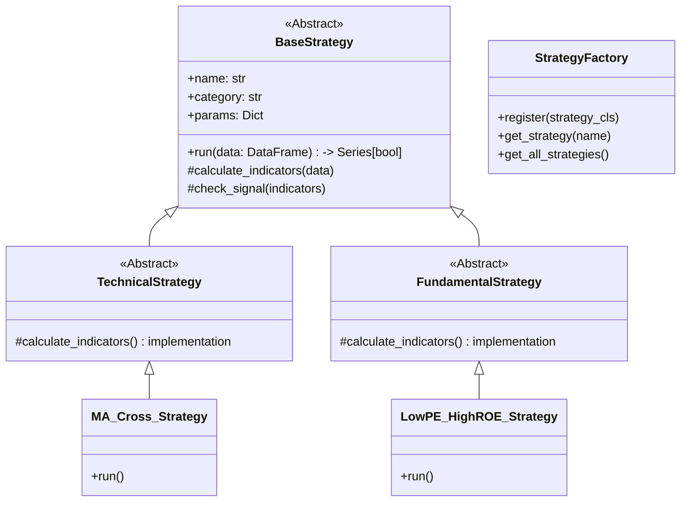
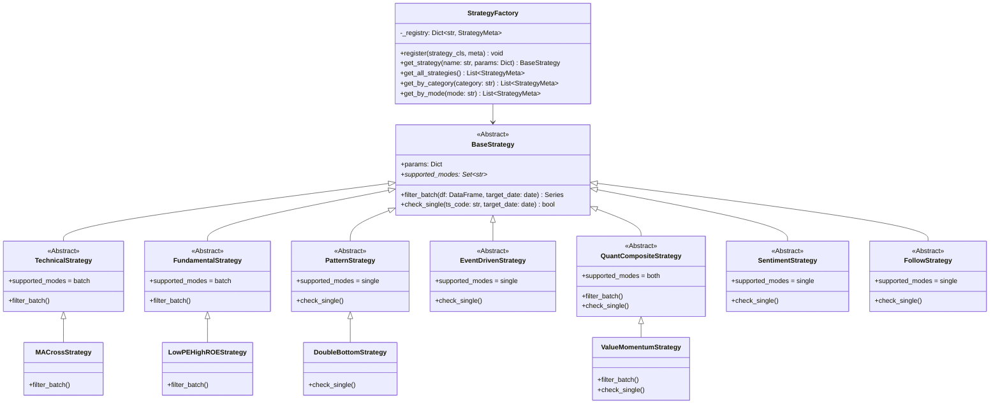
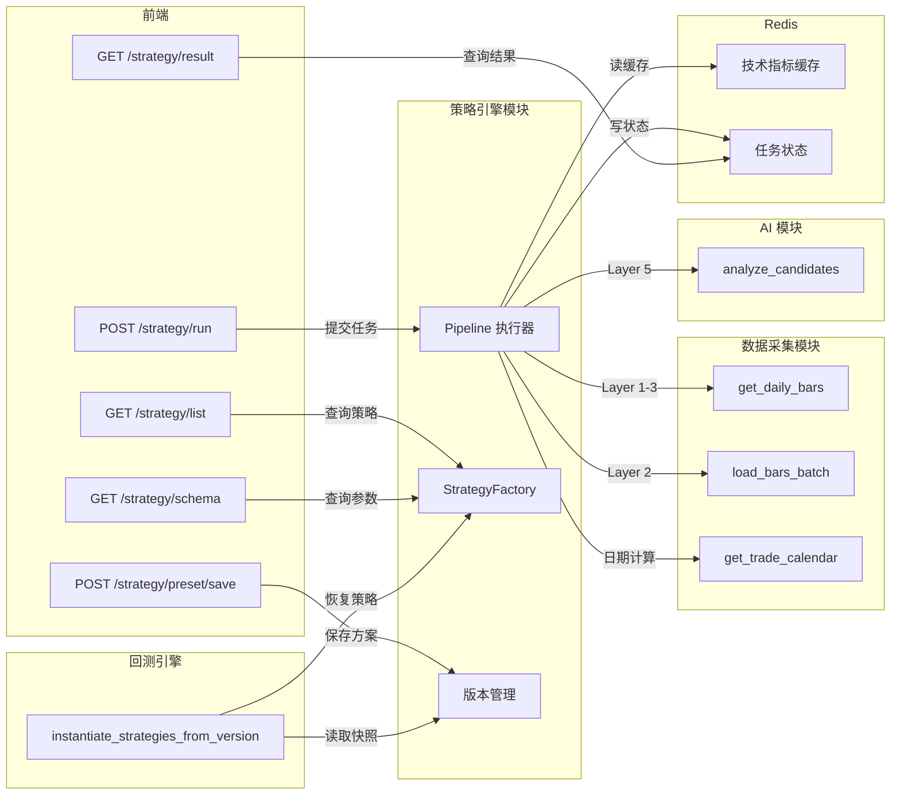

# 详细设计 - 模块 2：策略引擎与执行管道

> **版本：** v1.0
> **日期：** 2026-02-07
> **关联任务：** Task 0.2
> **状态：** Draft
>
> **V1 实施范围：** 见 `99-实施范围-V1与V2划分.md` §三。V1 扁平化继承、统一单模式接口、手动注册策略、去掉版本管理，先实现 10-15 种核心策略。

---

## 1. 模块概述

本模块定义了系统的核心——**策略工厂**与**执行管道**。它负责管理 79 种选股策略的生命周期，以及如何高效地从 5000+ 只股票中筛选出最终的 Top 10。

**核心设计目标：**
- **可扩展性：** 新增一种策略只需继承基类，无需修改引擎代码。
- **高性能：** 利用向量化计算（Pandas/Numpy）和分层筛选（Pipeline）将计算时间控制在 20 分钟内。
- **鲁棒性：** 自动处理停牌、除权、数据缺失等边界情况。

---

## 2. 策略类架构设计

采用 **模板方法模式 (Template Method)**。

### 2.1 类图 (Class Diagram)



### 2.2 接口定义

```python
class BaseStrategy(ABC):
    def __init__(self, params: Dict = None):
        self.params = params or {}

    @abstractmethod
    async def run(self, ts_code: str, date: date) -> bool:
        """
        核心执行方法
        :param ts_code: 股票代码
        :param date: 选股日期
        :return: True(选中) / False(淘汰)
        """
        pass
```

---

## 3. 典型策略伪代码 (精细化逻辑)

### 3.1 策略 A：均线金叉 (MA Golden Cross)
**逻辑：** 短期均线 (MA5) 上穿长期均线 (MA10)，且成交量放大。
**边界处理：** 必须剔除停牌股票；使用复权价格。

```python
async def run_ma_cross(self, ts_code, date):
    # 1. 获取过去 30 天的日线数据 (前复权)
    df = await data_mgr.get_daily_bars(ts_code, end_date=date, limit=30, adj='qfq')
    
    # 边界检查：数据不足
    if len(df) < 11: return False
    # 边界检查：当日停牌 (vol=0)
    if df.iloc[-1]['vol'] == 0: return False

    # 2. 计算均线
    df['ma5'] = talib.SMA(df['close'], timeperiod=5)
    df['ma10'] = talib.SMA(df['close'], timeperiod=10)

    # 3. 信号判断 (昨天死叉，今天金叉)
    today = df.iloc[-1]
    yesterday = df.iloc[-2]

    # 金叉条件
    is_cross = (yesterday['ma5'] <= yesterday['ma10']) and \
               (today['ma5'] > today['ma10'])
               
    # 过滤条件：放量 (今日量 > 5日均量 * 1.5)
    vol_ma5 = df['vol'][-6:-1].mean()
    is_volume_up = today['vol'] > vol_ma5 * 1.5

    return is_cross and is_volume_up
```

### 3.2 策略 B：低估值高成长 (Low PE + High ROE)
**逻辑：** PE < 30 且 ROE > 15%，且净利润增长 > 20%。
**防未来函数：** 必须使用 **公告日期 <= 选股日期** 的最新财报。

```python
async def run_value_growth(self, ts_code, date):
    # 1. 获取最新可用财报 (根据公告日期过滤)
    finance = await db.fetch_one(
        "SELECT * FROM finance_indicator "
        "WHERE ts_code = :code AND ann_date <= :date "
        "ORDER BY end_date DESC LIMIT 1",
        {"code": ts_code, "date": date}
    )
    
    # 2. 获取当日行情 (计算动态 PE)
    daily = await db.fetch_one(...)

    if not finance or not daily: return False

    # 3. 逻辑判断
    pe_ttm = daily['pe_ttm']
    roe = finance['roe']
    profit_growth = finance['net_profit_yoy']

    if pe_ttm < 30 and roe > 15 and profit_growth > 20:
        return True
    return False
```

### 3.3 策略 C：双底形态识别 (W-Bottom)
**逻辑：** 识别股价走势形成 "W" 形状，且右底不低于左底，突破颈线。

### 3.4 V1 扩展技术面策略（8 种）

以下 8 种策略在 V1 技术面策略扩展中实施，使技术面策略总数达到 16 种。

#### 3.4.1 唐奇安通道突破 (Donchian Breakout)
**逻辑：** 价格从通道内突破 20 日唐奇安通道上轨（昨日收盘 ≤ 上轨，今日收盘 > 上轨）。
**依赖指标：** `donchian_upper`（预计算，不含当日）、`close_prev`
**默认参数：** `period=20`

#### 3.4.2 ATR 波动率突破 (ATR Breakout)
**逻辑：** 价格突破 MA20 + ATR14 × 倍数的波动带上轨，且昨日未突破。
**依赖指标：** `ma20`、`atr14`、`close_prev`、`ma20_prev`、`atr14_prev`
**默认参数：** `atr_multiplier=1.5`

#### 3.4.3 CCI 超买超卖 (CCI Overbought/Oversold)
**逻辑：** CCI 从超卖区（< -100）反弹至 -80 以上（昨日 CCI ≤ 超卖线，今日 CCI > 反弹线）。
**依赖指标：** `cci`、`cci_prev`
**默认参数：** `oversold=-100, bounce=-80`

#### 3.4.4 Williams %R 超卖反弹
**逻辑：** Williams %R 从超卖区（< -80）反弹至 -50 以上。
**依赖指标：** `wr`、`wr_prev`
**默认参数：** `oversold=-80, bounce=-50`

#### 3.4.5 BIAS 乖离率
**逻辑：** BIAS 乖离率达到超卖极值（≤ -6%），预期均值回归。
**依赖指标：** `bias`
**默认参数：** `oversold_bias=-6.0`

#### 3.4.6 缩量回调 (Volume Contraction Pullback)
**逻辑：** 上升趋势中（MA5 > MA20）缩量（量比 ≤ 0.6）回调至 MA20 支撑位附近（±2%）。
**依赖指标：** `ma5`、`ma20`、`vol_ratio`、`close`
**默认参数：** `max_vol_ratio=0.6, ma_tolerance=0.02`

#### 3.4.7 量价背离 (Volume-Price Divergence)
**逻辑：** 价格接近唐奇安下轨（2% 范围内）但成交量显著萎缩（量比 < 0.7），看涨背离信号。
**依赖指标：** `donchian_lower`、`vol_ratio`、`close`
**默认参数：** `lookback=20`

#### 3.4.8 OBV 能量潮突破
**逻辑：** OBV 突破（今日 OBV > 昨日 OBV）且价格上涨确认（今日收盘 > 昨日收盘）。
**依赖指标：** `obv`、`obv_prev`、`close`、`close_prev`
**默认参数：** `lookback=20`

```python
async def run_double_bottom(self, ts_code, date):
    # 获取 60 天数据
    df = await data_mgr.get_daily_bars(...)
    closes = df['close'].values
    
    # 寻找局部极小值 (Local Minima)
    min_indices = argrelextrema(closes, np.less, order=5)[0]
    
    if len(min_indices) < 2: return False
    
    # 取最近的两个底
    bottom2_idx = min_indices[-1] # 右底
    bottom1_idx = min_indices[-2] # 左底
    
    bottom2_val = closes[bottom2_idx]
    bottom1_val = closes[bottom1_idx]
    
    # 颈线 (两底中间的最高点)
    neck_idx = np.argmax(closes[bottom1_idx:bottom2_idx]) + bottom1_idx
    neck_val = closes[neck_idx]
    
    # 规则：
    # 1. 右底不能比左底低太多 (允许 2% 误差)
    # 2. 当前价格突破颈线
    # 3. 两底间隔 > 10天
    
    cond1 = bottom2_val >= bottom1_val * 0.98
    cond2 = df.iloc[-1]['close'] > neck_val
    cond3 = (bottom2_idx - bottom1_idx) > 10
    
    return cond1 and cond2 and cond3
```

---

### 3.5 V1 扩展基本面策略（8 种）

在 V1 已有 4 种基本面策略（低估值高成长、高股息、成长股、财务安全）基础上，新增 8 种基本面策略，覆盖估值、盈利、安全、综合评分四大类。

#### 3.5.1 PB 低估值（pb-value）
**逻辑：** PB > 0 且 PB < 阈值，适合重资产行业价值投资。
**数据依赖：** `pb`（来自 `raw_tushare_daily_basic`）
**默认参数：** `pb_max=2.0`

#### 3.5.2 PEG 估值（peg-value）
**逻辑：** PEG = PE_TTM / profit_yoy < 阈值，PE 和利润增长率均须为正。PEG < 1 表示成长性被低估。
**数据依赖：** `pe_ttm`（来自 `raw_tushare_daily_basic`）、`profit_yoy`（来自 `finance_indicator`）
**默认参数：** `peg_max=1.0`

#### 3.5.3 市销率低估值（ps-value）
**逻辑：** PS_TTM > 0 且 PS_TTM < 阈值，适合高成长但尚未盈利的公司。
**数据依赖：** `ps_ttm`（来自 `raw_tushare_daily_basic`）
**默认参数：** `ps_max=3.0`

#### 3.5.4 毛利率提升（gross-margin-up）
**逻辑：** 毛利率 >= 阈值，筛选盈利能力强的公司。
**数据依赖：** `gross_margin`（来自 `finance_indicator`）
**默认参数：** `gross_margin_min=30.0`

#### 3.5.5 现金流质量（cashflow-quality）
**逻辑：** EPS > 0 且 OCF > 0 且每股经营现金流 / 每股收益 >= 阈值。
**数据依赖：** `ocf_per_share`、`eps`（来自 `finance_indicator`）
**默认参数：** `ocf_eps_ratio_min=1.0`

#### 3.5.6 净利润连续增长（profit-continuous-growth）
**逻辑：** 利润同比增长率 >= 阈值。
**数据依赖：** `profit_yoy`（来自 `finance_indicator`）
**默认参数：** `profit_growth_min=5.0`

#### 3.5.7 经营现金流覆盖（cashflow-coverage）
**逻辑：** 每股经营现金流 >= 阈值 且 流动比率 >= 阈值。
**数据依赖：** `ocf_per_share`、`current_ratio`（来自 `finance_indicator`）
**默认参数：** `ocf_min=0.5, current_ratio_min=1.0`

#### 3.5.8 综合质量评分（quality-score）
**逻辑：** 多因子加权评分（ROE 30% + 成长 25% + 安全 25% + 估值 20%），总分 >= 阈值。各维度按梯度打分（100/80/60/40/20 分）。
**数据依赖：** `roe`、`profit_yoy`、`debt_ratio`（来自 `finance_indicator`）、`pe_ttm`（来自 `raw_tushare_daily_basic`）
**默认参数：** `score_min=60.0`

---

## 4. 策略执行管道 (Pipeline Architecture)

为了解决 5000 只股票的全量计算性能问题，设计 **5 层漏斗筛选** 机制。

**数据流转图：**

```
[全部股票 5000+]
      |
      v
(Layer 1: SQL 粗筛) --> 剔除 ST、退市、停牌
      | Output: ~4000 只
      v
(Layer 2: 向量化初筛) --> 基于 Pandas/Numpy 批量计算技术指标
      | 规则: MA多头排列 OR RSI超卖 OR ... (宽泛条件)
      | Output: ~500 只
      v
(Layer 3: 财务/基本面筛) --> SQL 联表查询
      | 规则: 盈利能力、成长性、机构持仓
      | Output: ~100 只
      v
(Layer 4: 策略精筛) --> 逐个运行复杂策略 (如双底识别、缠论)
      | Output: ~30 只 (候选池)
      v
(Layer 5: AI 终审) --> 调用 LLM 分析
      | Output: ~5-10 只 (最终推荐)
```

### 4.1 管道实现逻辑

```python
async def execute_daily_pipeline(date):
    # Layer 1: SQL 过滤
    pool_l1 = await db.fetch_all("SELECT ts_code FROM stocks WHERE is_st=0")
    
    # Layer 2: 批量加载数据到内存 (Pandas)
    # 一次性加载 4000 只股票的最近 60 天数据 (约 200MB 内存，完全可控)
    all_bars = await data_mgr.load_bars_batch(pool_l1, limit=60)
    
    pool_l2 = []
    # 向量化计算 (极快)
    # ... 计算过程 ...
    
    # Layer 4: 运行复杂策略
    candidates = []
    for code in pool_l3:
        # 并行执行所有启用策略
        results = await asyncio.gather(
            *[s.run(code, date) for s in active_strategies]
        )
        if any(results):  # 只要命中任意一个策略
            candidates.append(code)
            
    # Layer 5: AI
    final_picks = await ai_manager.analyze_candidates(candidates)
    
    return final_picks
```

---

## 5. 性能优化策略

1.  **预计算缓存 (`technical_daily` 表):**
    *   每日收盘后，单独起一个任务，把 MA5, MACD 等基础指标算好存入 DB。
    *   策略运行时，直接 `SELECT` 查表，而不是每次都从 `stock_daily` 重新算。

2.  **并发执行:**
    *   使用 Python `asyncio` 并发处理不同股票的策略计算。
    *   策略之间无依赖，完全可以并行。

3.  **内存管理:**
    *   避免一次性加载 10 年历史数据。
    *   只加载策略所需的最小窗口（如 MA250 策略只加载 300 天）。

---

## 6. 策略接口统一设计（修复矛盾）

### 6.1 问题说明

当前文档存在接口矛盾：

- **第 2.1 节类图**中 `BaseStrategy.run()` 的签名为 `run(data: DataFrame) -> Series[bool]`，这是批量向量化模式，一次处理所有股票。
- **第 2.2 节接口定义**中 `BaseStrategy.run()` 的签名为 `run(ts_code: str, date: date) -> bool`，这是逐只处理模式。

两种模式各有适用场景，不应强行统一为一种。本节通过引入**双模式接口**来解决这一矛盾。

### 6.2 双模式接口设计

```python
from abc import ABC, abstractmethod
from datetime import date
from typing import Dict, Optional, Set

import pandas as pd


class BaseStrategy(ABC):
    """
    策略基类 - 双模式接口

    所有策略必须继承此基类，并根据自身特性实现以下两种模式之一或全部：
    - filter_batch: 批量向量化筛选，适用于简单指标类策略
    - check_single: 单只精细筛选，适用于复杂形态识别类策略

    子类通过 `supported_modes` 属性声明自己支持的模式。
    Pipeline 根据该属性决定在哪一层调用该策略。
    """

    def __init__(self, params: Optional[Dict] = None):
        self.params: Dict = params or {}

    @property
    @abstractmethod
    def supported_modes(self) -> Set[str]:
        """
        声明策略支持的执行模式。
        返回值为 {"batch"}、{"single"} 或 {"batch", "single"}。
        """
        ...

    async def filter_batch(
        self,
        df: pd.DataFrame,
        target_date: date,
    ) -> pd.Series:
        """
        模式 1：批量向量化筛选（Layer 2 技术指标初筛使用）

        :param df: 全市场行情 DataFrame，包含 ts_code, trade_date, open,
                   high, low, close, vol 以及 technical_daily 中的预计算指标列。
                   每行代表一只股票在 target_date 当天的数据。
        :param target_date: 筛选日期
        :return: 与 df 等长的布尔 Series，True 表示该股票通过筛选
        :raises NotImplementedError: 若策略不支持 batch 模式
        """
        raise NotImplementedError(
            f"策略 {self.__class__.__name__} 未实现 filter_batch 方法"
        )

    async def check_single(
        self,
        ts_code: str,
        target_date: date,
    ) -> bool:
        """
        模式 2：单只精细筛选（Layer 4 策略精筛使用）

        :param ts_code: 股票代码，如 "600519.SH"
        :param target_date: 筛选日期
        :return: True 表示选中，False 表示淘汰
        :raises NotImplementedError: 若策略不支持 single 模式
        """
        raise NotImplementedError(
            f"策略 {self.__class__.__name__} 未实现 check_single 方法"
        )
```

### 6.3 策略模式分配清单

| 模式 | 适用策略类型 | 策略编号 | 调用位置 | 说明 |
|---|---|---|---|---|
| `batch` | 趋势跟踪 | 1-7 | Layer 2 | 均线、ADX 等指标可直接从 `technical_daily` 缓存表向量化计算 |
| `batch` | 超跌反弹 | 8-14 | Layer 2 | RSI、KDJ、BIAS 等摆动指标均已预计算 |
| `batch` | 量价配合 | 21-26 | Layer 2 | 成交量、换手率等字段在 `stock_daily` 中直接可用 |
| `batch` | 估值与价值 | 31-35 | Layer 3 | PE、PB、股息率等可通过 SQL 联表批量筛选 |
| `batch` | 成长性 | 36-40 | Layer 3 | ROE、净利润增长等财务指标可批量查询 |
| `batch` | 财务安全 | 41-44 | Layer 3 | 负债率、流动比率等可批量查询 |
| `batch` | 机构动向 | 45-47 | Layer 3 | 北向资金、机构调研数据可批量查询 |
| `single` | 震荡突破 | 15-20 | Layer 4 | 布林带收口、箱体突破等需要加载历史窗口逐只分析 |
| `single` | 形态识别 | 27-30 | Layer 4 | 早晨之星、红三兵、双底等 K 线形态需逐只识别 |
| `single` | 事件驱动 | 48-57 | Layer 4 | 需要查询公告、新闻等非结构化数据，逐只处理 |
| `single` | 统计套利 | 62-65 | Layer 4 | 均值回归、配对交易等需要加载长周期历史数据 |
| `single` | 行为金融 | 66-69 | Layer 4 | 龙虎榜、涨停板等需要查询特定事件数据 |
| `both` | 多因子模型 | 58-61 | Layer 2 + Layer 4 | 初筛用 batch 快速过滤，精筛用 single 做因子合成 |
| `single` | 新闻舆情 | 70-74 | Layer 4 | 需要调用 NLP 分析，逐只处理 |
| `single` | 高手跟投 | 75-79 | Layer 4 | 需要查询跟投数据源，逐只处理 |

### 6.4 更新后的类图



### 6.5 双模式代码示例

#### 6.5.1 批量模式示例：均线金叉策略

```python
from typing import Set

import pandas as pd


class MACrossStrategy(TechnicalStrategy):
    """
    均线金叉策略 - 批量模式

    逻辑：短期均线上穿长期均线，且当日成交量放大（> 5日均量 * 1.5）。
    默认参数：fast=5, slow=10, vol_ratio=1.5
    """

    @property
    def supported_modes(self) -> Set[str]:
        return {"batch"}

    async def filter_batch(
        self,
        df: pd.DataFrame,
        target_date: date,
    ) -> pd.Series:
        """
        批量筛选：利用 technical_daily 预计算指标，一次处理所有股票。

        :param df: 包含以下列的 DataFrame（每行一只股票当日数据）：
                   ts_code, trade_date, close, vol,
                   ma5, ma10, ma5_prev, ma10_prev, vol_ma5
        :param target_date: 筛选日期
        :return: 布尔 Series
        """
        fast_col = f"ma{self.params.get('fast', 5)}"          # 短期均线列名
        slow_col = f"ma{self.params.get('slow', 10)}"         # 长期均线列名
        vol_ratio = self.params.get("vol_ratio", 1.5)         # 放量倍数阈值

        # 金叉条件：昨日短期 <= 长期，今日短期 > 长期
        prev_fast = f"{fast_col}_prev"  # 前一日短期均线（预计算列）
        prev_slow = f"{slow_col}_prev"  # 前一日长期均线（预计算列）

        is_cross = (df[prev_fast] <= df[prev_slow]) & (df[fast_col] > df[slow_col])

        # 放量条件：今日成交量 > 5日均量 * vol_ratio
        is_volume_up = df["vol"] > df["vol_ma5"] * vol_ratio

        # 排除停牌股（成交量为 0）
        is_trading = df["vol"] > 0

        return is_cross & is_volume_up & is_trading  # 返回布尔 Series
```

#### 6.5.2 单只模式示例：双底形态识别策略

```python
from typing import Set

import numpy as np
from scipy.signal import argrelextrema


class DoubleBottomStrategy(PatternStrategy):
    """
    双底形态识别策略 - 单只模式

    逻辑：识别股价 W 形走势，右底不低于左底，当前价突破颈线。
    默认参数：lookback=60, tolerance=0.02, min_gap=10, order=5
    """

    @property
    def supported_modes(self) -> Set[str]:
        return {"single"}

    async def check_single(
        self,
        ts_code: str,
        target_date: date,
    ) -> bool:
        """
        逐只精细筛选：加载历史数据，识别 W 底形态。

        :param ts_code: 股票代码
        :param target_date: 筛选日期
        :return: True 表示识别到双底形态
        """
        lookback = self.params.get("lookback", 60)       # 回看天数
        tolerance = self.params.get("tolerance", 0.02)    # 右底容差（2%）
        min_gap = self.params.get("min_gap", 10)          # 两底最小间隔天数
        order = self.params.get("order", 5)               # 极值检测窗口

        # 从数据管理器获取历史日线（前复权）
        df = await data_mgr.get_daily_bars(
            codes=[ts_code],
            start_date=target_date - timedelta(days=lookback + 30),
            end_date=target_date,
            adj="qfq",
        )

        if len(df) < lookback:
            return False  # 数据不足，跳过

        closes = df["close"].values

        # 寻找局部极小值（Local Minima）
        min_indices = argrelextrema(closes, np.less, order=order)[0]

        if len(min_indices) < 2:
            return False  # 不足两个底部

        # 取最近的两个底
        bottom1_idx = min_indices[-2]  # 左底
        bottom2_idx = min_indices[-1]  # 右底
        bottom1_val = closes[bottom1_idx]
        bottom2_val = closes[bottom2_idx]

        # 颈线：两底之间的最高点
        neck_idx = int(np.argmax(closes[bottom1_idx:bottom2_idx])) + bottom1_idx
        neck_val = closes[neck_idx]

        # 判断条件
        cond1 = bottom2_val >= bottom1_val * (1 - tolerance)  # 右底不低于左底
        cond2 = closes[-1] > neck_val                          # 当前价突破颈线
        cond3 = (bottom2_idx - bottom1_idx) > min_gap          # 两底间隔足够

        return bool(cond1 and cond2 and cond3)
```

### 6.6 Pipeline 中的调用方式

```python
async def execute_pipeline_with_dual_mode(
    target_date: date,
    active_strategies: list[BaseStrategy],
) -> list[str]:
    """
    在 Pipeline 中根据策略的 supported_modes 分别调用不同方法。
    """
    # 分离批量策略和单只策略
    batch_strategies = [s for s in active_strategies if "batch" in s.supported_modes]
    single_strategies = [s for s in active_strategies if "single" in s.supported_modes]

    # --- Layer 2: 批量向量化筛选 ---
    # 一次性加载全市场当日数据（含预计算指标）
    market_df = await data_mgr.load_market_snapshot(target_date)

    # 对每个 batch 策略执行向量化筛选，取并集（OR 逻辑）
    batch_mask = pd.Series(False, index=market_df.index)
    for strategy in batch_strategies:
        result = await strategy.filter_batch(market_df, target_date)
        batch_mask = batch_mask | result  # 任一 batch 策略命中即保留

    pool_l2 = market_df.loc[batch_mask, "ts_code"].tolist()

    # --- Layer 3: 财务指标复筛（SQL）---
    pool_l3 = await filter_by_finance(pool_l2, target_date)

    # --- Layer 4: 单只精细筛选 ---
    candidates = []
    semaphore = asyncio.Semaphore(50)  # 限制并发数

    async def check_stock(ts_code: str) -> Optional[str]:
        async with semaphore:
            results = await asyncio.gather(
                *[s.check_single(ts_code, target_date) for s in single_strategies],
                return_exceptions=True,
            )
            # 过滤异常结果，任一 single 策略命中即保留
            valid_results = [r for r in results if isinstance(r, bool)]
            if any(valid_results):
                return ts_code
            return None

    tasks = [check_stock(code) for code in pool_l3]
    results = await asyncio.gather(*tasks)
    candidates = [r for r in results if r is not None]

    return candidates
```

---

## 7. 策略组合逻辑设计

### 7.1 需求背景

前端文档（04-详细设计-前端与交互）中明确提到：策略积木默认为 AND 关系，支持创建"策略组"实现 OR 关系。本节定义策略组合的数据结构、执行逻辑和持久化方案，确保前后端对齐。

### 7.2 组合数据结构

```python
from __future__ import annotations

from enum import Enum
from typing import Any, Dict, List, Optional, Union

from pydantic import BaseModel, Field


class CombineOperator(str, Enum):
    """组合运算符"""
    AND = "AND"  # 所有子策略都通过才通过
    OR = "OR"    # 任一子策略通过即通过


class StrategyConfig(BaseModel):
    """单个策略配置"""
    strategy_name: str = Field(..., description="策略唯一标识，如 'ma_cross'")
    params: Dict[str, Any] = Field(default_factory=dict, description="策略参数")
    enabled: bool = Field(default=True, description="是否启用")


class StrategyGroup(BaseModel):
    """
    策略组合节点 - 支持嵌套的树形结构。

    示例：(MA金叉 AND 低PE) OR (双底 AND 放量)
    对应结构：
        StrategyGroup(
            operator=OR,
            children=[
                StrategyGroup(operator=AND, children=[MA金叉, 低PE]),
                StrategyGroup(operator=AND, children=[双底, 放量]),
            ]
        )
    """
    operator: CombineOperator = Field(
        default=CombineOperator.AND,
        description="组合运算符",
    )
    children: List[Union[StrategyConfig, StrategyGroup]] = Field(
        ...,
        description="子节点列表，可以是单个策略或嵌套的策略组",
    )
    label: Optional[str] = Field(
        default=None,
        description="组合名称（用于前端显示），如 '技术面组合'",
    )
```

### 7.3 组合执行逻辑

```python
async def evaluate_group(
    group: StrategyGroup,
    ts_code: str,
    target_date: date,
    factory: StrategyFactory,
) -> bool:
    """
    递归执行策略组合，返回该股票是否通过组合筛选。

    :param group: 策略组合树的根节点
    :param ts_code: 股票代码
    :param target_date: 筛选日期
    :param factory: 策略工厂，用于实例化策略
    :return: True 表示通过组合筛选
    """
    results: list[bool] = []

    for child in group.children:
        if isinstance(child, StrategyConfig):
            if not child.enabled:
                continue  # 跳过已禁用的策略
            # 叶子节点：实例化并执行单个策略
            strategy = factory.get_strategy(child.strategy_name, child.params)
            result = await strategy.check_single(ts_code, target_date)
            results.append(result)
        elif isinstance(child, StrategyGroup):
            # 递归节点：递归执行子组合
            result = await evaluate_group(child, ts_code, target_date, factory)
            results.append(result)

    if not results:
        return False  # 无有效子策略，视为不通过

    # 根据运算符聚合结果
    if group.operator == CombineOperator.AND:
        return all(results)  # AND：全部通过才通过
    else:
        return any(results)  # OR：任一通过即通过


async def evaluate_group_batch(
    group: StrategyGroup,
    df: pd.DataFrame,
    target_date: date,
    factory: StrategyFactory,
) -> pd.Series:
    """
    批量模式下的组合执行（用于 Layer 2 向量化筛选）。

    :param group: 策略组合树
    :param df: 全市场行情 DataFrame
    :param target_date: 筛选日期
    :param factory: 策略工厂
    :return: 布尔 Series
    """
    series_list: list[pd.Series] = []

    for child in group.children:
        if isinstance(child, StrategyConfig):
            if not child.enabled:
                continue
            strategy = factory.get_strategy(child.strategy_name, child.params)
            if "batch" in strategy.supported_modes:
                result = await strategy.filter_batch(df, target_date)
                series_list.append(result)
        elif isinstance(child, StrategyGroup):
            result = await evaluate_group_batch(child, df, target_date, factory)
            series_list.append(result)

    if not series_list:
        return pd.Series(False, index=df.index)

    if group.operator == CombineOperator.AND:
        combined = series_list[0]
        for s in series_list[1:]:
            combined = combined & s  # AND：逐个取交集
        return combined
    else:
        combined = series_list[0]
        for s in series_list[1:]:
            combined = combined | s  # OR：逐个取并集
        return combined
```

### 7.4 前端提交的 JSON 结构示例

以下 JSON 与前端文档（04-详细设计-前端与交互 第 3.1 节）的 `POST /api/v1/strategy/run` 接口对齐。新增 `strategy_group` 字段替代原有的 `strategies` 数组，以支持嵌套组合。

```json
{
  "base_filter": {
    "exclude_st": true,
    "exclude_halt": true,
    "min_turnover_rate": 0.001
  },
  "strategy_group": {
    "operator": "AND",
    "label": "我的选股方案",
    "children": [
      {
        "operator": "OR",
        "label": "技术面信号（任一满足）",
        "children": [
          {
            "strategy_name": "ma_cross",
            "params": {"fast": 5, "slow": 10, "vol_ratio": 1.5},
            "enabled": true
          },
          {
            "strategy_name": "double_bottom",
            "params": {"lookback": 60, "tolerance": 0.02},
            "enabled": true
          }
        ]
      },
      {
        "strategy_name": "low_pe_high_roe",
        "params": {"pe_max": 30, "roe_min": 15, "profit_growth_min": 20},
        "enabled": true
      }
    ]
  },
  "ai_filter": {
    "enabled": true,
    "min_score": 80
  }
}
```

上述 JSON 表达的组合逻辑为：`(MA金叉 OR 双底形态) AND 低估值高成长`。

### 7.5 组合策略的序列化与持久化

策略组合以 JSON 格式存储到 `user_strategy_presets` 表中，支持用户保存和加载自定义方案。

```sql
CREATE TABLE user_strategy_presets (
    id SERIAL PRIMARY KEY,
    user_id INTEGER NOT NULL REFERENCES users(id) ON DELETE CASCADE,
    preset_name VARCHAR(100) NOT NULL,
    description TEXT,
    strategy_group_json JSONB NOT NULL,
    base_filter_json JSONB NOT NULL DEFAULT '{}',
    ai_filter_json JSONB NOT NULL DEFAULT '{}',
    is_default BOOLEAN NOT NULL DEFAULT FALSE,
    created_at TIMESTAMP NOT NULL DEFAULT NOW(),
    updated_at TIMESTAMP NOT NULL DEFAULT NOW(),
    UNIQUE (user_id, preset_name)
);

CREATE INDEX idx_user_strategy_presets_user_id ON user_strategy_presets(user_id);
```

**序列化/反序列化代码：**

```python
import json
from typing import Union

from pydantic import TypeAdapter


# Pydantic v2 的 TypeAdapter 可以处理 Union 类型的递归解析
_group_adapter = TypeAdapter(StrategyGroup)


def serialize_group(group: StrategyGroup) -> str:
    """将策略组合序列化为 JSON 字符串，用于存储到数据库。"""
    return group.model_dump_json()


def deserialize_group(json_str: str) -> StrategyGroup:
    """从数据库 JSON 字符串反序列化为策略组合对象。"""
    return _group_adapter.validate_json(json_str)


async def save_preset(
    user_id: int,
    preset_name: str,
    group: StrategyGroup,
    base_filter: dict,
    ai_filter: dict,
    description: str = "",
) -> int:
    """保存用户策略方案到数据库，返回 preset_id。"""
    result = await db.fetch_one(
        """
        INSERT INTO user_strategy_presets
            (user_id, preset_name, description, strategy_group_json,
             base_filter_json, ai_filter_json)
        VALUES (:user_id, :name, :desc, :group_json, :base_json, :ai_json)
        ON CONFLICT (user_id, preset_name)
        DO UPDATE SET
            strategy_group_json = EXCLUDED.strategy_group_json,
            base_filter_json = EXCLUDED.base_filter_json,
            ai_filter_json = EXCLUDED.ai_filter_json,
            updated_at = NOW()
        RETURNING id
        """,
        {
            "user_id": user_id,
            "name": preset_name,
            "desc": description,
            "group_json": serialize_group(group),
            "base_json": json.dumps(base_filter),
            "ai_json": json.dumps(ai_filter),
        },
    )
    return result["id"]
```

---

## 8. 策略注册与发现机制

### 8.1 策略元数据定义

每个策略在注册时必须提供完整的元数据，用于策略发现、前端展示和参数校验。

```python
from dataclasses import dataclass, field
from typing import Any, Dict


@dataclass(frozen=True)
class StrategyMeta:
    """策略元数据 - 描述一个策略的所有静态信息"""
    name: str                    # 唯一标识，如 "ma_cross"
    display_name: str            # 显示名称，如 "均线金叉"
    category: str                # 分类：technical / fundamental / event /
                                 #       quant / sentiment / follow
    description: str             # 策略描述（一句话说明逻辑）
    params_schema: Dict[str, Any]  # 参数 JSON Schema（用于前端动态生成配置表单）
    version: str                 # 版本号，如 "1.0.0"
    author: str                  # 作者
    mode: str                    # 执行模式："batch" / "single" / "both"
    strategy_cls: type           # 策略类引用（用于实例化）
    tags: list[str] = field(default_factory=list)  # 标签，如 ["趋势", "短线"]
```

### 8.2 装饰器自动注册方案

```python
from typing import Any, Callable, Dict, List, Optional, Type


class StrategyFactory:
    """
    策略工厂 - 单例模式

    负责策略的注册、查询和实例化。
    所有策略通过 @register_strategy 装饰器自动注册到本工厂。
    """

    _instance: Optional["StrategyFactory"] = None
    _registry: Dict[str, StrategyMeta] = {}

    def __new__(cls) -> "StrategyFactory":
        if cls._instance is None:
            cls._instance = super().__new__(cls)
        return cls._instance

    @classmethod
    def register(cls, meta: StrategyMeta) -> None:
        """注册一个策略到工厂。"""
        if meta.name in cls._registry:
            raise ValueError(
                f"策略名称冲突：'{meta.name}' 已被 "
                f"{cls._registry[meta.name].strategy_cls.__name__} 注册"
            )
        cls._registry[meta.name] = meta

    @classmethod
    def get_strategy(
        cls,
        name: str,
        params: Optional[Dict[str, Any]] = None,
    ) -> BaseStrategy:
        """
        根据策略名称实例化策略对象。

        :param name: 策略唯一标识
        :param params: 运行时参数（覆盖默认值）
        :return: 策略实例
        :raises KeyError: 策略未注册
        """
        if name not in cls._registry:
            raise KeyError(f"策略 '{name}' 未注册，可用策略：{list(cls._registry.keys())}")
        meta = cls._registry[name]
        return meta.strategy_cls(params=params or {})

    @classmethod
    def get_all_strategies(cls) -> List[StrategyMeta]:
        """获取所有已注册策略的元数据列表。"""
        return list(cls._registry.values())

    @classmethod
    def get_by_category(cls, category: str) -> List[StrategyMeta]:
        """按分类查询策略。"""
        return [m for m in cls._registry.values() if m.category == category]

    @classmethod
    def get_by_mode(cls, mode: str) -> List[StrategyMeta]:
        """按执行模式查询策略。"""
        return [m for m in cls._registry.values() if m.mode == mode or m.mode == "both"]

    @classmethod
    def get_meta(cls, name: str) -> StrategyMeta:
        """获取指定策略的元数据。"""
        return cls._registry[name]


def register_strategy(
    name: str,
    category: str,
    display_name: str,
    description: str = "",
    params_schema: Optional[Dict[str, Any]] = None,
    version: str = "1.0.0",
    author: str = "system",
    mode: str = "single",
    tags: Optional[list[str]] = None,
) -> Callable[[Type[BaseStrategy]], Type[BaseStrategy]]:
    """
    策略注册装饰器。

    用法：
        @register_strategy(
            name="ma_cross",
            category="technical",
            display_name="均线金叉",
            mode="batch",
        )
        class MACrossStrategy(TechnicalStrategy):
            ...
    """
    def decorator(cls: Type[BaseStrategy]) -> Type[BaseStrategy]:
        meta = StrategyMeta(
            name=name,
            display_name=display_name,
            category=category,
            description=description or cls.__doc__ or "",
            params_schema=params_schema or {},
            version=version,
            author=author,
            mode=mode,
            strategy_cls=cls,
            tags=tags or [],
        )
        StrategyFactory.register(meta)
        return cls

    return decorator
```

### 8.3 策略自动扫描与加载机制

系统启动时自动扫描 `strategies/` 目录下的所有 Python 模块，触发装饰器执行，完成策略注册。

```
app/
├── strategies/
│   ├── __init__.py
│   ├── technical/          # 技术面策略（30种）
│   │   ├── __init__.py
│   │   ├── ma_cross.py
│   │   ├── macd_golden.py
│   │   ├── rsi_oversold.py
│   │   ├── bollinger_breakout.py
│   │   └── ...
│   ├── fundamental/        # 基本面策略（17种）
│   │   ├── __init__.py
│   │   ├── low_pe_high_roe.py
│   │   ├── high_dividend.py
│   │   └── ...
│   ├── event/              # 事件驱动策略（10种）
│   │   ├── __init__.py
│   │   ├── earnings_surprise.py
│   │   └── ...
│   ├── quant/              # 量化复合策略（12种）
│   │   ├── __init__.py
│   │   ├── value_momentum.py
│   │   └── ...
│   ├── sentiment/          # 舆情策略（5种）
│   │   ├── __init__.py
│   │   └── ...
│   └── follow/             # 跟投策略（5种）
│       ├── __init__.py
│       └── ...
├── engine/
│   ├── factory.py          # StrategyFactory 定义
│   ├── pipeline.py         # Pipeline 执行逻辑
│   └── loader.py           # 自动扫描加载器
└── main.py
```

**自动加载器实现：**

```python
import importlib
import logging
import pkgutil
from pathlib import Path
from types import ModuleType

logger = logging.getLogger(__name__)

STRATEGIES_PACKAGE = "app.strategies"  # 策略包的完整 Python 路径


def auto_discover_strategies() -> int:
    """
    自动扫描并加载 strategies/ 目录下的所有策略模块。

    通过 import 触发 @register_strategy 装饰器执行，
    从而将策略自动注册到 StrategyFactory。

    :return: 成功加载的模块数量
    """
    package: ModuleType = importlib.import_module(STRATEGIES_PACKAGE)
    package_path: str = str(Path(package.__file__).parent)

    loaded_count = 0

    # 递归遍历 strategies/ 下所有子包和模块
    for importer, module_name, is_pkg in pkgutil.walk_packages(
        path=[package_path],
        prefix=f"{STRATEGIES_PACKAGE}.",
    ):
        try:
            importlib.import_module(module_name)
            loaded_count += 1
            logger.debug(f"已加载策略模块：{module_name}")
        except Exception as e:
            # 单个模块加载失败不影响其他模块
            logger.error(f"加载策略模块失败：{module_name}，错误：{e}")

    registered = StrategyFactory.get_all_strategies()
    logger.info(
        f"策略自动发现完成：扫描 {loaded_count} 个模块，"
        f"注册 {len(registered)} 个策略"
    )
    return loaded_count
```

**在 FastAPI 启动时调用：**

```python
from fastapi import FastAPI

app = FastAPI(title="A股智能选股系统")


@app.on_event("startup")
async def startup_event():
    """应用启动时自动发现并注册所有策略。"""
    from app.engine.loader import auto_discover_strategies
    auto_discover_strategies()
```

### 8.4 策略参数 Schema 示例

以下给出 3 个典型策略的完整 `params_schema`，遵循 JSON Schema 规范，前端可据此动态生成配置表单。

#### 8.4.1 均线金叉策略 (ma_cross)

```python
@register_strategy(
    name="ma_cross",
    category="technical",
    display_name="均线金叉",
    description="短期均线上穿长期均线，且成交量放大，发出买入信号。",
    mode="batch",
    version="1.0.0",
    author="system",
    tags=["趋势", "短线", "均线"],
    params_schema={
        "type": "object",
        "properties": {
            "fast": {
                "type": "integer",
                "title": "短期均线周期",
                "description": "短期均线的计算天数",
                "default": 5,
                "minimum": 2,
                "maximum": 60,
                "enum": [5, 10, 20],
            },
            "slow": {
                "type": "integer",
                "title": "长期均线周期",
                "description": "长期均线的计算天数",
                "default": 10,
                "minimum": 5,
                "maximum": 250,
                "enum": [10, 20, 60, 120, 250],
            },
            "vol_ratio": {
                "type": "number",
                "title": "放量倍数",
                "description": "今日成交量 / 5日均量的最低倍数",
                "default": 1.5,
                "minimum": 1.0,
                "maximum": 5.0,
            },
        },
        "required": ["fast", "slow"],
    },
)
class MACrossStrategy(TechnicalStrategy):
    ...
```

#### 8.4.2 低估值高成长策略 (low_pe_high_roe)

```python
@register_strategy(
    name="low_pe_high_roe",
    category="fundamental",
    display_name="低估值高成长",
    description="筛选 PE 低于阈值、ROE 高于阈值、净利润同比增长达标的股票。",
    mode="batch",
    version="1.0.0",
    author="system",
    tags=["价值", "成长", "基本面"],
    params_schema={
        "type": "object",
        "properties": {
            "pe_max": {
                "type": "number",
                "title": "PE 上限",
                "description": "市盈率（TTM）的最大值",
                "default": 30,
                "minimum": 1,
                "maximum": 200,
            },
            "roe_min": {
                "type": "number",
                "title": "ROE 下限（%）",
                "description": "净资产收益率的最小值",
                "default": 15,
                "minimum": 0,
                "maximum": 100,
            },
            "profit_growth_min": {
                "type": "number",
                "title": "净利润增长下限（%）",
                "description": "净利润同比增长率的最小值",
                "default": 20,
                "minimum": -100,
                "maximum": 1000,
            },
            "exclude_negative_pe": {
                "type": "boolean",
                "title": "排除负 PE",
                "description": "是否排除市盈率为负的股票（亏损股）",
                "default": true,
            },
        },
        "required": ["pe_max", "roe_min"],
    },
)
class LowPEHighROEStrategy(FundamentalStrategy):
    ...
```

#### 8.4.3 双底形态识别策略 (double_bottom)

```python
@register_strategy(
    name="double_bottom",
    category="technical",
    display_name="双底形态（W底）",
    description="识别股价 W 形走势，右底不低于左底，当前价突破颈线。",
    mode="single",
    version="1.0.0",
    author="system",
    tags=["形态", "反转", "中线"],
    params_schema={
        "type": "object",
        "properties": {
            "lookback": {
                "type": "integer",
                "title": "回看天数",
                "description": "用于形态识别的历史数据窗口长度",
                "default": 60,
                "minimum": 30,
                "maximum": 120,
            },
            "tolerance": {
                "type": "number",
                "title": "右底容差",
                "description": "右底相对左底允许的最大下跌比例（如 0.02 表示 2%）",
                "default": 0.02,
                "minimum": 0.0,
                "maximum": 0.1,
            },
            "min_gap": {
                "type": "integer",
                "title": "两底最小间隔（天）",
                "description": "左底与右底之间的最小交易日数",
                "default": 10,
                "minimum": 5,
                "maximum": 60,
            },
            "order": {
                "type": "integer",
                "title": "极值检测窗口",
                "description": "scipy argrelextrema 的 order 参数，越大越平滑",
                "default": 5,
                "minimum": 3,
                "maximum": 15,
            },
        },
        "required": ["lookback"],
    },
)
class DoubleBottomStrategy(PatternStrategy):
    ...
```

---

## 9. 策略版本管理

### 9.1 问题场景

用户在使用系统时，经常会调整策略参数（如将 MA 金叉的短期均线从 5 改为 10）。当用户查看历史回测结果时，需要知道当时使用的是哪一组参数。如果不做版本管理，会出现以下问题：

1. **回测结果不可复现**：用户修改参数后，无法回溯当时的参数配置。
2. **对比失效**：无法对比"参数 A 的回测结果"与"参数 B 的回测结果"。
3. **审计缺失**：无法追踪参数变更历史。

### 9.2 `strategy_versions` 表完整 DDL

```sql
-- 策略版本快照表
CREATE TABLE strategy_versions (
    id SERIAL PRIMARY KEY,
    preset_id INTEGER NOT NULL REFERENCES user_strategy_presets(id) ON DELETE CASCADE,
    version_number INTEGER NOT NULL,
    strategy_group_snapshot JSONB NOT NULL,
    base_filter_snapshot JSONB NOT NULL DEFAULT '{}',
    ai_filter_snapshot JSONB NOT NULL DEFAULT '{}',
    change_summary TEXT,
    created_by INTEGER NOT NULL REFERENCES users(id),
    created_at TIMESTAMP NOT NULL DEFAULT NOW(),
    UNIQUE (preset_id, version_number)
);

CREATE INDEX idx_strategy_versions_preset_id ON strategy_versions(preset_id);
CREATE INDEX idx_strategy_versions_created_at ON strategy_versions(created_at);

-- 回测结果表（通过 version_id 关联到策略版本快照）
CREATE TABLE backtest_results (
    id SERIAL PRIMARY KEY,
    task_id UUID NOT NULL UNIQUE,
    user_id INTEGER NOT NULL REFERENCES users(id),
    version_id INTEGER NOT NULL REFERENCES strategy_versions(id),
    start_date DATE NOT NULL,
    end_date DATE NOT NULL,
    initial_capital DECIMAL(20, 2) NOT NULL DEFAULT 100000.00,
    final_capital DECIMAL(20, 2),
    total_return DECIMAL(10, 4),
    annual_return DECIMAL(10, 4),
    max_drawdown DECIMAL(10, 4),
    sharpe_ratio DECIMAL(10, 4),
    win_rate DECIMAL(10, 4),
    profit_loss_ratio DECIMAL(10, 4),
    total_trades INTEGER,
    status VARCHAR(20) NOT NULL DEFAULT 'pending',
    error_message TEXT,
    result_detail JSONB,
    created_at TIMESTAMP NOT NULL DEFAULT NOW(),
    completed_at TIMESTAMP
);

CREATE INDEX idx_backtest_results_user_id ON backtest_results(user_id);
CREATE INDEX idx_backtest_results_version_id ON backtest_results(version_id);
CREATE INDEX idx_backtest_results_task_id ON backtest_results(task_id);
```

### 9.3 版本创建时机

```python
async def create_version_on_save(
    preset_id: int,
    user_id: int,
    change_summary: str = "",
) -> int:
    """
    用户保存策略配置时自动创建新版本。

    :param preset_id: 策略方案 ID
    :param user_id: 操作用户 ID
    :param change_summary: 变更说明
    :return: 新版本 ID
    """
    # 获取当前方案的最新配置
    preset = await db.fetch_one(
        "SELECT strategy_group_json, base_filter_json, ai_filter_json "
        "FROM user_strategy_presets WHERE id = :id",
        {"id": preset_id},
    )

    # 获取当前最大版本号
    max_ver = await db.fetch_one(
        "SELECT COALESCE(MAX(version_number), 0) AS max_ver "
        "FROM strategy_versions WHERE preset_id = :pid",
        {"pid": preset_id},
    )
    next_version = max_ver["max_ver"] + 1

    # 创建版本快照
    result = await db.fetch_one(
        """
        INSERT INTO strategy_versions
            (preset_id, version_number, strategy_group_snapshot,
             base_filter_snapshot, ai_filter_snapshot,
             change_summary, created_by)
        VALUES (:pid, :ver, :group_snap, :base_snap, :ai_snap, :summary, :uid)
        RETURNING id
        """,
        {
            "pid": preset_id,
            "ver": next_version,
            "group_snap": preset["strategy_group_json"],
            "base_snap": preset["base_filter_json"],
            "ai_snap": preset["ai_filter_json"],
            "summary": change_summary,
            "uid": user_id,
        },
    )
    return result["id"]


async def lock_version_for_backtest(
    preset_id: int,
    user_id: int,
) -> int:
    """
    提交回测时锁定当前版本。

    如果当前配置与最新版本快照一致，则复用该版本；
    否则自动创建新版本后返回。

    :param preset_id: 策略方案 ID
    :param user_id: 操作用户 ID
    :return: 锁定的版本 ID
    """
    # 获取当前配置
    preset = await db.fetch_one(
        "SELECT strategy_group_json FROM user_strategy_presets WHERE id = :id",
        {"id": preset_id},
    )

    # 获取最新版本快照
    latest_ver = await db.fetch_one(
        "SELECT id, strategy_group_snapshot FROM strategy_versions "
        "WHERE preset_id = :pid ORDER BY version_number DESC LIMIT 1",
        {"pid": preset_id},
    )

    # 比较当前配置与最新快照是否一致
    if latest_ver and latest_ver["strategy_group_snapshot"] == preset["strategy_group_json"]:
        return latest_ver["id"]  # 配置未变，复用已有版本

    # 配置已变更，创建新版本
    return await create_version_on_save(
        preset_id, user_id, change_summary="回测提交时自动创建"
    )
```

### 9.4 版本对比功能

```python
import json
from dataclasses import dataclass
from typing import Any


@dataclass
class ParamDiff:
    """参数差异项"""
    path: str          # 参数路径，如 "children[0].params.fast"
    old_value: Any     # 旧版本值
    new_value: Any     # 新版本值


def diff_strategy_versions(
    snapshot_old: dict,
    snapshot_new: dict,
    path: str = "",
) -> list[ParamDiff]:
    """
    递归对比两个策略版本快照的参数差异。

    :param snapshot_old: 旧版本的 strategy_group_snapshot（已解析为 dict）
    :param snapshot_new: 新版本的 strategy_group_snapshot（已解析为 dict）
    :param path: 当前递归路径（内部使用）
    :return: 差异列表
    """
    diffs: list[ParamDiff] = []

    all_keys = set(list(snapshot_old.keys()) + list(snapshot_new.keys()))

    for key in sorted(all_keys):
        current_path = f"{path}.{key}" if path else key
        old_val = snapshot_old.get(key)
        new_val = snapshot_new.get(key)

        if old_val == new_val:
            continue  # 值相同，跳过

        if isinstance(old_val, dict) and isinstance(new_val, dict):
            # 递归比较嵌套字典
            diffs.extend(diff_strategy_versions(old_val, new_val, current_path))
        elif isinstance(old_val, list) and isinstance(new_val, list):
            # 列表逐项比较
            max_len = max(len(old_val), len(new_val))
            for i in range(max_len):
                item_path = f"{current_path}[{i}]"
                o = old_val[i] if i < len(old_val) else None
                n = new_val[i] if i < len(new_val) else None
                if o != n:
                    if isinstance(o, dict) and isinstance(n, dict):
                        diffs.extend(diff_strategy_versions(o, n, item_path))
                    else:
                        diffs.append(ParamDiff(path=item_path, old_value=o, new_value=n))
        else:
            diffs.append(ParamDiff(path=current_path, old_value=old_val, new_value=new_val))

    return diffs


async def compare_versions(version_id_old: int, version_id_new: int) -> list[ParamDiff]:
    """
    对比两个版本的参数差异，返回差异列表。

    :param version_id_old: 旧版本 ID
    :param version_id_new: 新版本 ID
    :return: 差异列表
    """
    old = await db.fetch_one(
        "SELECT strategy_group_snapshot FROM strategy_versions WHERE id = :id",
        {"id": version_id_old},
    )
    new = await db.fetch_one(
        "SELECT strategy_group_snapshot FROM strategy_versions WHERE id = :id",
        {"id": version_id_new},
    )

    old_snap = json.loads(old["strategy_group_snapshot"])
    new_snap = json.loads(new["strategy_group_snapshot"])

    return diff_strategy_versions(old_snap, new_snap)
```

---

## 10. Pipeline 层级统一定义

### 10.1 问题说明

概要设计（00-概要设计-v2 第 3.7 节）中的 5 层漏斗与本文档第 4 节的 5 层存在以下差异：

| 层级 | 概要设计定义 | 本文档原定义 | 差异 |
|---|---|---|---|
| Layer 4 | 事件驱动筛选（新闻/公告扫描） | 策略精筛（逐只运行复杂策略） | 概要设计将事件驱动单独成层，本文档将其归入策略精筛 |
| Layer 5 | AI 深度分析（Gemini 初审 + Claude 终审） | AI 终审（调用 LLM 分析） | 基本一致，但概要设计更明确分工 |

**统一决策：** 将事件驱动策略归入 Layer 4 策略精筛层（因为事件驱动本质上也是逐只处理的策略），与本文档第 6 节的双模式接口设计保持一致。以下为权威定义。

### 10.2 权威 Pipeline 定义

```
全市场股票 ~5300 只
        |
        v
 [Layer 1] 基础过滤（SQL 查询）
        | 剔除 ST / 退市 / 停牌 / 流动性极差（换手率 < 0.1%）
        | 输出: ~4000 只
        v
 [Layer 2] 技术指标初筛（向量化批量计算）
        | 从 technical_daily 缓存表 + stock_daily 批量读取
        | 运行所有 mode=batch 的技术面策略（策略编号 1-26）
        | 输出: ~500 只
        v
 [Layer 3] 财务指标复筛（SQL 联表查询）
        | 运行所有 mode=batch 的基本面策略（策略编号 31-47）
        | ROE / PE / 负债率 / 机构持仓等联表查询
        | 输出: ~100 只
        v
 [Layer 4] 策略精筛（逐只处理）
        | 运行所有 mode=single 的策略（策略编号 15-20, 27-30, 48-79）
        | 包含：形态识别、事件驱动、舆情分析、高手跟投等
        | 输出: ~30 只（候选池）
        v
 [Layer 5] AI 终审（API 调用）
        | Gemini Flash 初审 Top 30：新闻情感分析 + 量化信号
        | Claude Sonnet 终审 Top 10：逻辑校验 + 风险评估
        | 输出: ~5-10 只（最终推荐）
```

### 10.3 各层详细规格

#### Layer 1：基础过滤

| 属性 | 说明 |
|---|---|
| **执行方式** | SQL 直接查询 `stocks` 表 + `stock_daily` 表 |
| **输入数据结构** | `stocks` 表全量记录 |
| **输出数据结构** | `List[str]` — 通过筛选的 `ts_code` 列表 |
| **筛选条件（可配置）** | `list_status = 'L'`（上市中）；`is_st = 0`（非 ST）；当日 `vol > 0`（非停牌）；`turnover_rate >= 0.001`（换手率 >= 0.1%） |
| **预期数据量** | 输入 ~5300 只 → 输出 ~4000 只 |
| **耗时预估** | < 1 秒（单次 SQL 查询） |

**SQL 实现：**

```sql
SELECT sd.ts_code
FROM stock_daily sd
JOIN stocks s ON sd.ts_code = s.ts_code
WHERE sd.trade_date = :target_date
  AND s.list_status = 'L'
  AND s.is_st = 0
  AND sd.vol > 0
  AND sd.turnover_rate >= :min_turnover_rate;
```

#### Layer 2：技术指标初筛

| 属性 | 说明 |
|---|---|
| **执行方式** | 从 `technical_daily` + `stock_daily` 批量加载到 Pandas DataFrame，运行所有 `mode=batch` 的技术面策略 |
| **输入数据结构** | `pd.DataFrame`，列包含：`ts_code, trade_date, open, high, low, close, vol, ma5, ma10, ma20, ma60, ma120, ma250, dif, dea, macd, k, d, j, rsi_6, rsi_12, boll_upper, boll_mid, boll_lower, cci, wr_10, atr`，以及前一日指标列（`ma5_prev, ma10_prev` 等） |
| **输出数据结构** | `List[str]` — 通过筛选的 `ts_code` 列表 |
| **筛选条件（可配置）** | 由用户选择的 batch 策略组合决定，默认使用 OR 逻辑（任一策略命中即保留） |
| **预期数据量** | 输入 ~4000 只 → 输出 ~500 只 |
| **耗时预估** | 1-3 秒（内存中向量化计算） |

#### Layer 3：财务指标复筛

| 属性 | 说明 |
|---|---|
| **执行方式** | SQL 联表查询 `finance_indicator` 表，筛选满足基本面条件的股票 |
| **输入数据结构** | Layer 2 输出的 `List[str]`（约 500 只 `ts_code`） |
| **输出数据结构** | `List[str]` — 通过筛选的 `ts_code` 列表 |
| **筛选条件（可配置）** | 由用户选择的 batch 基本面策略决定，如 `roe >= 10`、`debt_to_assets <= 0.6`、`pe > 0 AND pe <= 50` |
| **预期数据量** | 输入 ~500 只 → 输出 ~100 只 |
| **耗时预估** | < 1 秒（SQL 联表查询，IN 子句限定范围） |

**SQL 实现：**

```sql
SELECT fi.ts_code
FROM finance_indicator fi
WHERE fi.ts_code = ANY(:ts_codes)
  AND fi.ann_date <= :target_date
  AND fi.ann_date = (
      SELECT MAX(fi2.ann_date)
      FROM finance_indicator fi2
      WHERE fi2.ts_code = fi.ts_code
        AND fi2.ann_date <= :target_date
  )
  AND fi.roe >= :roe_min
  AND fi.debt_to_assets <= :debt_max;
```

#### Layer 4：策略精筛

| 属性 | 说明 |
|---|---|
| **执行方式** | 异步并发，逐只运行所有 `mode=single` 的策略，使用 `asyncio.Semaphore` 控制并发数 |
| **输入数据结构** | Layer 3 输出的 `List[str]`（约 100 只 `ts_code`） |
| **输出数据结构** | `List[str]` — 通过筛选的 `ts_code` 列表（候选池） |
| **筛选条件（可配置）** | 由用户选择的 single 策略组合决定，支持 AND/OR 嵌套组合（参见第 7 节） |
| **预期数据量** | 输入 ~100 只 → 输出 ~30 只 |
| **耗时预估** | 5-15 秒（取决于策略复杂度和并发数，每只股票约 50-150ms） |

#### Layer 5：AI 终审

| 属性 | 说明 |
|---|---|
| **执行方式** | 调用 AI 模块的 `ai_manager.analyze_candidates()` 接口，分两轮：Gemini 初审 + Claude 终审 |
| **输入数据结构** | Layer 4 输出的 `List[str]`（约 30 只 `ts_code`），以及每只股票的行情数据、财务数据、新闻摘要 |
| **输出数据结构** | `List[CandidateResult]`，包含 `ts_code, score, ai_summary, decision, confidence` |
| **筛选条件（可配置）** | `min_score`（AI 评分下限，默认 80）；`max_output`（最终输出数量上限，默认 10） |
| **预期数据量** | 输入 ~30 只 → Gemini 初审保留 ~10 只 → Claude 终审输出 ~5-10 只 |
| **耗时预估** | 30-60 秒（Gemini 30 只并发约 10 秒，Claude 10 只串行约 30 秒） |

---

## 11. 配置项清单

以下为策略引擎模块的所有可配置参数。配置通过环境变量或 `config/strategy_engine.yaml` 文件加载，运行时可通过管理后台动态修改。

### 11.1 Pipeline 层级参数

| 配置项 | 类型 | 默认值 | 取值范围 | 说明 |
|---|---|---|---|---|
| `pipeline.layer1.min_turnover_rate` | float | 0.001 | 0.0 - 1.0 | Layer 1 最低换手率阈值（0.001 = 0.1%） |
| `pipeline.layer1.exclude_st` | bool | true | true / false | 是否剔除 ST 股票 |
| `pipeline.layer1.exclude_halt` | bool | true | true / false | 是否剔除停牌股票 |
| `pipeline.layer2.batch_combine_logic` | str | "OR" | "AND" / "OR" | Layer 2 多个 batch 策略之间的默认组合逻辑 |
| `pipeline.layer3.roe_min` | float | 10.0 | 0.0 - 100.0 | Layer 3 默认 ROE 下限（%） |
| `pipeline.layer3.debt_to_assets_max` | float | 0.6 | 0.0 - 1.0 | Layer 3 默认资产负债率上限 |
| `pipeline.layer3.pe_max` | float | 50.0 | 1.0 - 500.0 | Layer 3 默认 PE 上限 |
| `pipeline.layer4.single_combine_logic` | str | "OR" | "AND" / "OR" | Layer 4 多个 single 策略之间的默认组合逻辑 |
| `pipeline.layer5.min_score` | int | 80 | 0 - 100 | Layer 5 AI 评分下限 |
| `pipeline.layer5.max_output` | int | 10 | 1 - 50 | Layer 5 最终输出数量上限 |
| `pipeline.layer5.gemini_top_n` | int | 30 | 10 - 100 | 送入 Gemini 初审的候选数量 |
| `pipeline.layer5.claude_top_n` | int | 10 | 5 - 30 | 送入 Claude 终审的候选数量 |

### 11.2 并发与性能参数

| 配置项 | 类型 | 默认值 | 取值范围 | 说明 |
|---|---|---|---|---|
| `engine.max_concurrency` | int | 50 | 1 - 200 | Layer 4 逐只策略执行的最大并发协程数 |
| `engine.strategy_timeout_sec` | int | 30 | 5 - 120 | 单个策略对单只股票的执行超时时间（秒） |
| `engine.pipeline_timeout_sec` | int | 1200 | 300 - 3600 | 整个 Pipeline 的执行超时时间（秒，默认 20 分钟） |
| `engine.batch_chunk_size` | int | 1000 | 100 - 5000 | Layer 2 向量化计算时的分块大小（避免内存溢出） |
| `engine.ai_gemini_concurrency` | int | 10 | 1 - 30 | Gemini API 并发调用数 |
| `engine.ai_claude_concurrency` | int | 3 | 1 - 10 | Claude API 并发调用数 |

### 11.3 内存管理参数

| 配置项 | 类型 | 默认值 | 取值范围 | 说明 |
|---|---|---|---|---|
| `memory.default_lookback_days` | int | 60 | 10 - 500 | 策略默认加载的历史数据窗口天数 |
| `memory.max_lookback_days` | int | 300 | 60 - 1000 | 策略允许加载的最大历史数据窗口天数（如 MA250 需要 300 天） |
| `memory.market_snapshot_cache_ttl` | int | 300 | 60 - 3600 | 全市场快照数据的内存缓存有效期（秒） |
| `memory.single_stock_cache_ttl` | int | 60 | 10 - 600 | 单只股票历史数据的内存缓存有效期（秒） |

### 11.4 候选池与输出参数

| 配置项 | 类型 | 默认值 | 取值范围 | 说明 |
|---|---|---|---|---|
| `output.candidate_pool_max` | int | 50 | 10 - 200 | Layer 4 输出的候选池最大数量（超出则按策略命中数排序截断） |
| `output.final_pick_max` | int | 10 | 1 - 50 | 最终推荐股票的最大数量 |
| `output.result_expire_hours` | int | 24 | 1 - 168 | 选股结果在 Redis 中的缓存过期时间（小时） |

### 11.5 策略版本管理参数

| 配置项 | 类型 | 默认值 | 取值范围 | 说明 |
|---|---|---|---|---|
| `versioning.max_versions_per_preset` | int | 100 | 10 - 1000 | 每个策略方案保留的最大版本数（超出自动清理最旧版本） |
| `versioning.auto_create_on_save` | bool | true | true / false | 保存策略时是否自动创建新版本 |

---

## 13. 全市场选股回放参数优化

> **V1 已实施** — 2026-02-28

### 13.1 概述

全市场选股回放优化器（`MarketOptimizer`）通过在历史交易日上回放选股管道来评估参数组合效果，弥补单股 Backtrader 回测无法评估全市场选股能力的不足。

### 13.2 核心逻辑

1. 从 `trade_calendar` 获取最近 `lookback_days` 个交易日
2. 间隔 4 天采样（120 天 → 约 30 个采样日），避免逐日执行过慢
3. 对每组参数组合：
   - 在每个采样日调用 `execute_pipeline()` 执行选股
   - 从 `stock_daily` 查询 T+5 日收盘价，计算实际收益率
   - 统计 hit_rate_5d（5 日正收益占比）、avg_return_5d、max_drawdown
4. 评分公式：`score = hit_rate_5d × 0.5 + avg_return_5d × 0.3 - max_drawdown × 0.2`
5. 返回 Top N 结果，可选自动写入 `strategies.params`

### 13.3 数据库表

```sql
CREATE TABLE market_optimization_tasks (
    id SERIAL PRIMARY KEY,
    strategy_name VARCHAR(64) NOT NULL,
    status VARCHAR(16) NOT NULL DEFAULT 'pending',
    param_space JSONB,
    lookback_days INTEGER DEFAULT 120,
    total_combinations INTEGER,
    completed_combinations INTEGER DEFAULT 0,
    progress INTEGER DEFAULT 0,
    best_params JSONB,
    best_score NUMERIC(10,6),
    result_detail JSONB,
    auto_apply BOOLEAN DEFAULT true,
    error_message TEXT,
    created_at TIMESTAMP DEFAULT NOW(),
    finished_at TIMESTAMP
);
```

### 13.4 API 端点

| 方法 | 路径 | 说明 |
|------|------|------|
| POST | `/api/v1/optimization/market-opt/run` | 提交全市场优化任务 |
| GET | `/api/v1/optimization/market-opt/result/{task_id}` | 查询优化结果 |
| GET | `/api/v1/optimization/market-opt/list` | 任务列表 |

### 13.5 每周自动 cron

`weekly_market_optimization` 任务（默认周六 10:00）：
- 遍历启用策略，跳过无 param_space 或组合数 > 500 的策略
- 逐个执行全市场优化
- 最佳参数自动写入 `strategies.params`
- 完成后发送 Telegram 通知汇总

---

## 12. 与其他模块的接口契约

本节明确策略引擎模块对外暴露的接口和依赖的外部接口，确保模块间的契约清晰可测。

### 12.1 依赖数据采集模块（DataManager）

策略引擎依赖数据采集模块提供行情数据和交易日历。以下接口定义参考 `01-详细设计-数据采集` 第 6 节。

#### 接口 1：`get_daily_bars` — 获取标准化日线数据

```python
async def get_daily_bars(
    codes: list[str],
    start_date: date,
    end_date: date,
    adj: str = "qfq",
) -> pd.DataFrame:
    """
    获取指定股票的标准化日线数据（自动处理复权）。

    :param codes: 股票代码列表，如 ["600519.SH", "000001.SZ"]
    :param start_date: 开始日期（含）
    :param end_date: 结束日期（含）
    :param adj: 复权方式，"qfq"=前复权, "hfq"=后复权, None=不复权
    :return: DataFrame，列包含 ts_code, trade_date, open, high, low,
             close, vol, amount, turnover_rate, pe, pb, adj_factor
    """
    ...
```

**调用示例（策略引擎内部）：**

```python
# 在 DoubleBottomStrategy.check_single() 中调用
df = await data_mgr.get_daily_bars(
    codes=["600519.SH"],
    start_date=date(2026, 1, 1),
    end_date=date(2026, 2, 7),
    adj="qfq",
)
```

#### 接口 2：`load_bars_batch` — 批量加载全市场行情快照

```python
async def load_bars_batch(
    codes: list[str],
    target_date: date,
    lookback: int = 60,
) -> pd.DataFrame:
    """
    批量加载多只股票的历史日线数据到内存。

    用于 Layer 2 向量化筛选，一次性加载所有候选股票的近 N 天数据。
    数据来源优先从 Redis 缓存读取，缓存未命中则查询 PostgreSQL。

    :param codes: 股票代码列表
    :param target_date: 目标日期
    :param lookback: 回看天数
    :return: DataFrame，包含所有股票的历史日线数据，
             列同 get_daily_bars 的返回值
    """
    ...
```

**调用示例：**

```python
# 在 Pipeline Layer 2 中调用
all_bars = await data_mgr.load_bars_batch(
    codes=pool_l1,       # Layer 1 输出的 ~4000 只股票
    target_date=date(2026, 2, 7),
    lookback=60,
)
```

#### 接口 3：`get_trade_calendar` — 获取交易日历

```python
async def get_trade_calendar(
    start_date: date,
    end_date: date,
    exchange: str = "SSE",
) -> list[date]:
    """
    获取指定区间内的交易日列表。

    :param start_date: 开始日期
    :param end_date: 结束日期
    :param exchange: 交易所代码，"SSE"=上交所, "SZSE"=深交所
    :return: 交易日列表（升序排列）
    """
    ...
```

**调用示例：**

```python
# 获取最近 60 个交易日
trade_days = await data_mgr.get_trade_calendar(
    start_date=date(2025, 11, 1),
    end_date=date(2026, 2, 7),
    exchange="SSE",
)
actual_start = trade_days[-60]  # 第 60 个交易日前的日期
```

### 12.2 依赖 AI 模块（AIManager）

策略引擎在 Layer 5 调用 AI 模块进行终审。以下接口定义参考 `03-详细设计-AI与回测` 第 1 节。

#### 接口 4：`analyze_candidates` — AI 候选股分析

```python
from dataclasses import dataclass


@dataclass
class CandidateResult:
    """AI 分析结果"""
    ts_code: str
    name: str
    score: int                # 综合评分 0-100
    decision: str             # "APPROVE" / "REJECT"
    confidence: int           # 置信度 0-100
    ai_summary: str           # AI 生成的分析摘要
    risk_flags: list[str]     # 风险提示列表
    stop_loss_suggest: str    # 建议止损位


async def analyze_candidates(
    candidates: list[str],
    target_date: date,
    min_score: int = 80,
    gemini_top_n: int = 30,
    claude_top_n: int = 10,
) -> list[CandidateResult]:
    """
    对候选股票进行 AI 深度分析。

    执行流程：
    1. 对 candidates 中的前 gemini_top_n 只调用 Gemini Flash 做初审
       （新闻情感分析 + 量化信号验证）
    2. 按 Gemini 评分排序，取前 claude_top_n 只调用 Claude Sonnet 做终审
       （逻辑校验 + 风险评估）
    3. 过滤掉 score < min_score 的结果

    :param candidates: 候选股票代码列表（来自 Layer 4 输出）
    :param target_date: 分析日期
    :param min_score: 最低通过评分
    :param gemini_top_n: Gemini 初审数量
    :param claude_top_n: Claude 终审数量
    :return: 通过终审的 CandidateResult 列表（按 score 降序）
    """
    ...
```

**调用示例：**

```python
# 在 Pipeline Layer 5 中调用
final_picks = await ai_manager.analyze_candidates(
    candidates=pool_l4,          # Layer 4 输出的 ~30 只候选股
    target_date=date(2026, 2, 7),
    min_score=80,
    gemini_top_n=30,
    claude_top_n=10,
)
# final_picks: [CandidateResult(ts_code="600519.SH", score=95, ...), ...]
```

### 12.3 对前端暴露的 HTTP API

策略引擎通过 FastAPI 路由对前端暴露以下 HTTP 接口。接口契约与 `04-详细设计-前端与交互` 第 3 节对齐。

#### 接口 5：运行选股策略

```python
from fastapi import APIRouter, BackgroundTasks
from pydantic import BaseModel

router = APIRouter(prefix="/api/v1/strategy", tags=["策略引擎"])


class RunStrategyRequest(BaseModel):
    """运行选股策略的请求体"""
    base_filter: dict          # 基础过滤配置
    strategy_group: dict       # 策略组合 JSON（StrategyGroup 结构）
    ai_filter: dict            # AI 过滤配置


class RunStrategyResponse(BaseModel):
    """运行选股策略的响应体"""
    task_id: str               # 异步任务 ID（UUID）
    status: str                # "pending"


@router.post("/run", response_model=RunStrategyResponse)
async def run_strategy(
    request: RunStrategyRequest,
    background_tasks: BackgroundTasks,
) -> RunStrategyResponse:
    """
    提交选股任务（异步执行）。

    前端提交策略配置后，后端将任务放入队列异步执行，
    立即返回 task_id。前端通过 WebSocket 订阅进度更新，
    或轮询 GET /result/{task_id} 获取结果。
    """
    ...
```

#### 接口 6：获取选股结果

```python
class StrategyResultItem(BaseModel):
    """单只股票的选股结果"""
    ts_code: str
    name: str
    price: float
    pct_chg: float
    match_details: dict        # 各策略命中情况
    ai_analysis: dict | None   # AI 分析结果（若启用）


class StrategyResultResponse(BaseModel):
    """选股结果响应体"""
    status: str                # "pending" / "running" / "completed" / "failed"
    progress: int              # 进度百分比 0-100
    total_count: int           # 结果总数
    execution_time_ms: int     # 执行耗时（毫秒）
    items: list[StrategyResultItem]


@router.get("/result/{task_id}", response_model=StrategyResultResponse)
async def get_strategy_result(task_id: str) -> StrategyResultResponse:
    """
    获取选股任务的执行结果。

    :param task_id: 任务 ID（由 POST /run 返回）
    """
    ...
```

#### 接口 7：策略 CRUD

```python
class StrategyListResponse(BaseModel):
    """策略列表响应体"""
    strategies: list[dict]     # StrategyMeta 序列化后的列表


@router.get("/list", response_model=StrategyListResponse)
async def list_strategies(
    category: str | None = None,
    mode: str | None = None,
) -> StrategyListResponse:
    """
    获取所有可用策略列表（支持按分类和模式过滤）。

    :param category: 策略分类过滤，如 "technical"
    :param mode: 执行模式过滤，如 "batch"
    """
    ...


@router.get("/schema/{strategy_name}")
async def get_strategy_schema(strategy_name: str) -> dict:
    """
    获取指定策略的参数 JSON Schema（前端用于动态生成配置表单）。

    :param strategy_name: 策略唯一标识，如 "ma_cross"
    :return: JSON Schema 对象
    """
    meta = StrategyFactory.get_meta(strategy_name)
    return meta.params_schema


class PresetSaveRequest(BaseModel):
    """保存策略方案的请求体"""
    preset_name: str
    description: str = ""
    strategy_group: dict
    base_filter: dict
    ai_filter: dict


@router.post("/preset/save")
async def save_preset(request: PresetSaveRequest, user_id: int) -> dict:
    """
    保存用户的策略方案（自动创建版本快照）。

    :return: {"preset_id": int, "version_id": int}
    """
    ...


@router.get("/preset/list")
async def list_presets(user_id: int) -> list[dict]:
    """获取用户保存的所有策略方案列表。"""
    ...
```

### 12.4 对回测引擎暴露的接口

回测引擎需要实例化策略并在历史数据上逐日执行。以下接口供回测模块调用。

#### 接口 8：策略实例化

```python
def instantiate_strategies_from_version(
    version_id: int,
) -> tuple[StrategyGroup, list[BaseStrategy]]:
    """
    从版本快照中恢复策略组合，并实例化所有策略对象。

    :param version_id: 策略版本 ID
    :return: (策略组合树, 所有策略实例列表)
    """
    ...
```

**调用示例（回测引擎内部）：**

```python
# 回测引擎根据 version_id 恢复策略配置
group, strategies = instantiate_strategies_from_version(version_id=42)

# 在历史每个交易日上执行 Pipeline
for trade_date in trade_calendar:
    picks = await execute_pipeline_with_dual_mode(
        target_date=trade_date,
        active_strategies=strategies,
    )
    # 根据 picks 执行模拟交易...
```

### 12.5 依赖 Redis 的接口

策略引擎依赖 Redis 读取技术指标缓存和存储任务状态。

#### 接口 9：读取技术指标缓存

```python
async def get_technical_cache(
    ts_code: str,
    target_date: date,
) -> dict | None:
    """
    从 Redis 读取单只股票的技术指标缓存。

    Redis Key 格式: "tech:{ts_code}:{trade_date}"
    Value: JSON 字符串，包含 ma5, ma10, ma20, rsi_6, macd 等字段

    :param ts_code: 股票代码
    :param target_date: 日期
    :return: 技术指标字典，缓存未命中返回 None
    """
    key = f"tech:{ts_code}:{target_date.isoformat()}"
    data = await redis.get(key)
    if data is None:
        return None
    return json.loads(data)
```

**调用示例：**

```python
# 在 Pipeline 中优先从 Redis 读取，未命中则查 PostgreSQL
indicators = await get_technical_cache("600519.SH", date(2026, 2, 7))
if indicators is None:
    # 回退到数据库查询
    indicators = await db.fetch_one(
        "SELECT * FROM technical_daily WHERE ts_code = :code AND trade_date = :date",
        {"code": "600519.SH", "date": date(2026, 2, 7)},
    )
```

#### 接口 10：任务状态管理

```python
async def set_task_status(
    task_id: str,
    status: str,
    progress: int = 0,
    result: dict | None = None,
    expire_hours: int = 24,
) -> None:
    """
    将任务执行状态写入 Redis（供前端轮询或 WebSocket 推送）。

    Redis Key 格式: "task:{task_id}"
    Value: JSON 字符串，包含 status, progress, result 等字段

    :param task_id: 任务 ID
    :param status: 状态，"pending" / "running" / "completed" / "failed"
    :param progress: 进度百分比 0-100
    :param result: 执行结果（仅 completed 时有值）
    :param expire_hours: 缓存过期时间（小时）
    """
    payload = {
        "status": status,
        "progress": progress,
        "result": result,
        "updated_at": datetime.now().isoformat(),
    }
    await redis.set(
        f"task:{task_id}",
        json.dumps(payload, ensure_ascii=False),
        ex=expire_hours * 3600,
    )
```

### 12.6 接口依赖关系总览


