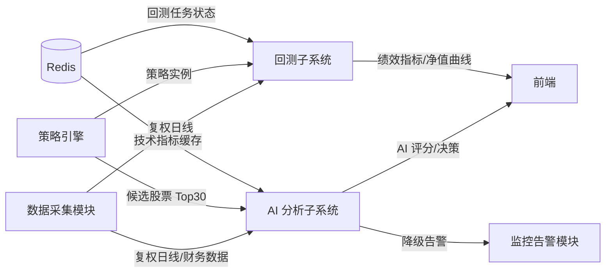
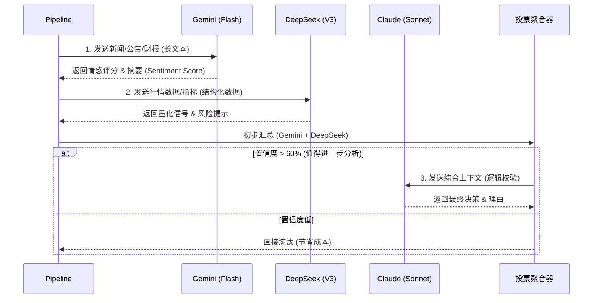
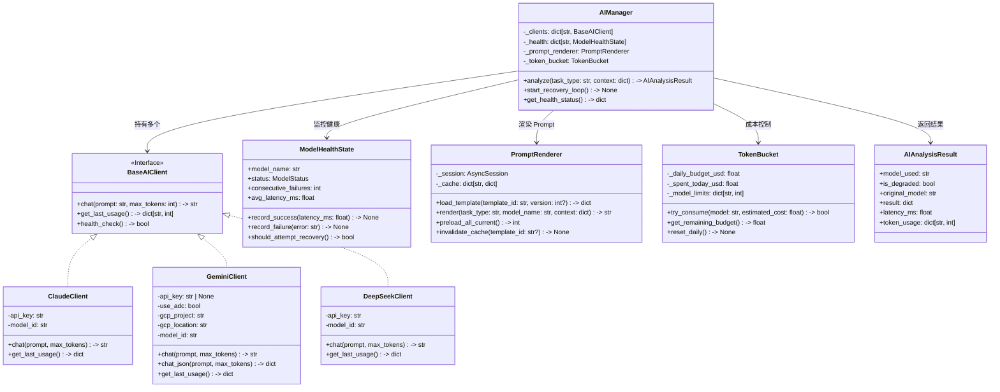
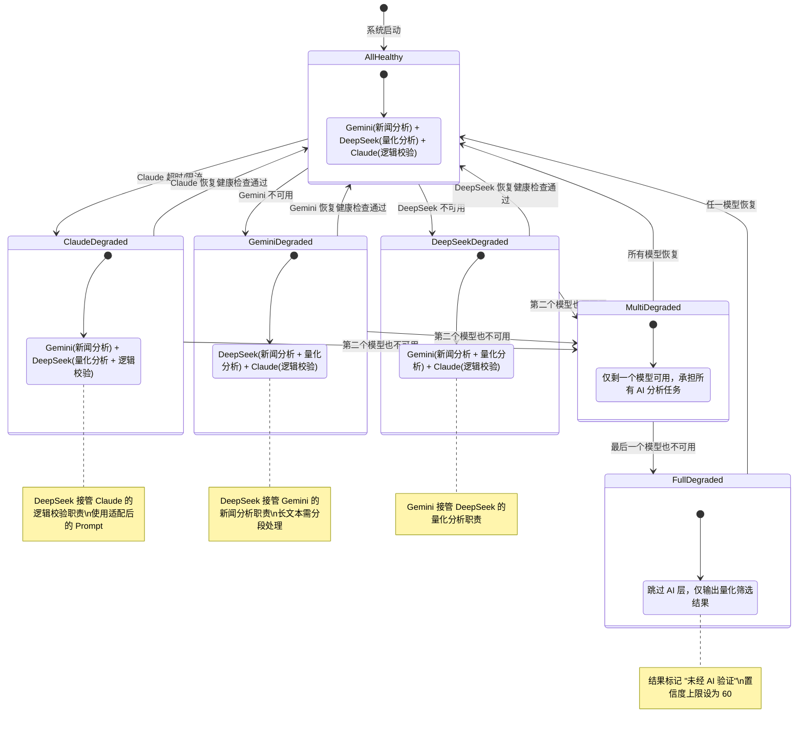
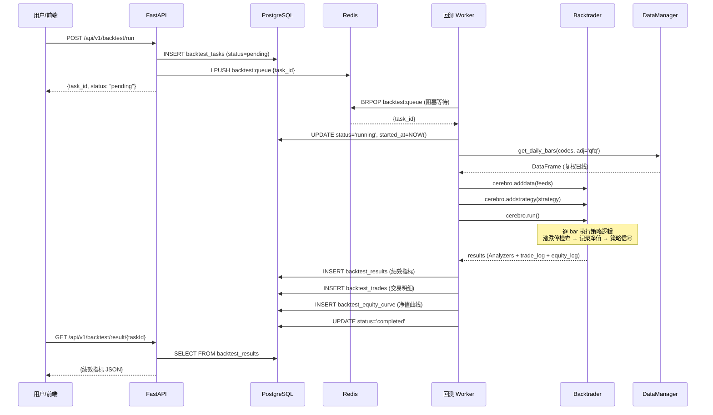
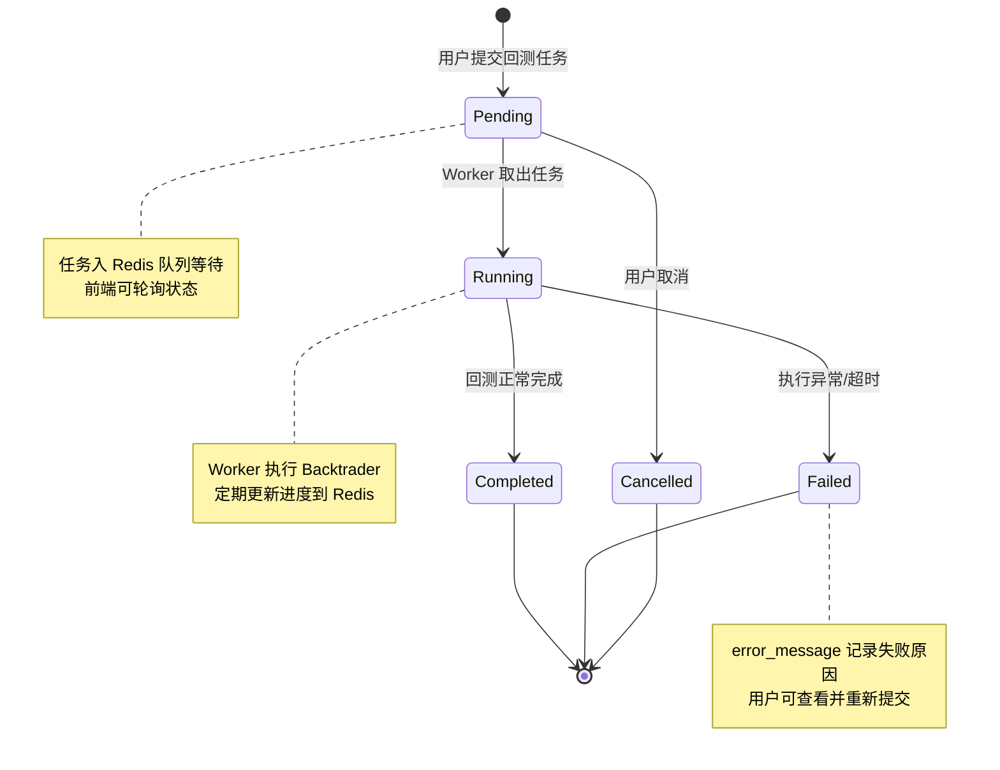

# 详细设计 - 模块 3：AI 智能分析与回测系统

> **版本：** v2.0
> **日期：** 2026-02-07
> **关联任务：** Task B3
> **状态：** Final
> **前置依赖：** 00-概要设计-v2, 01-详细设计-数据采集, 02-详细设计-策略引擎
>
> **V1 实施范围：** 见 `99-实施范围-V1与V2划分.md` §四。V1 AI 只接 Gemini 单模型，去掉降级状态机/Prompt 版本管理/Token 桶/Redis 队列，回测同步执行，trades 和 equity_curve 合并为 JSONB。

---

## 0. 模块概述

### 0.1 职责

本模块包含两个紧密协作的子系统：

1. **AI 智能分析子系统：** 调用 Claude / Gemini / DeepSeek 三个大语言模型，对策略引擎筛选出的候选股票进行新闻情感分析、量化信号验证和逻辑校验，输出最终的投资建议。
2. **回测子系统：** 基于 Backtrader 框架，对选股策略进行历史数据仿真交易，输出绩效指标（年化收益、最大回撤、夏普比率等），验证策略有效性。

### 0.2 核心挑战

| 挑战 | 说明 | 应对方案 |
|:---|:---|:---|
| AI 模型不稳定 | 任意模型可能超时、限流或宕机 | 三模型降级链路 + 健康检查（第 5 节） |
| AI 成本控制 | 无限制调用会导致每日数百元开销 | 漏斗筛选 + Token 桶限流（第 14 节） |
| AI 幻觉 | 单一模型可能输出错误结论 | 三模型交叉验证 + 投票聚合（第 1 节） |
| 回测未来函数 | 用未来数据做历史决策导致虚假收益 | 严格的时间对齐 + Checklist（第 3 节） |
| A 股涨跌停 | Backtrader 默认不处理涨跌停限制 | 自定义 PriceLimitChecker（第 8 节） |
| 多股票组合 | 单股回测无法反映真实组合收益 | 多 Data Feed + 仓位管理器（第 9 节） |
| 复权不一致 | 数据采集与回测的复权方案不统一 | 统一前复权方案（第 10 节） |

### 0.3 与其他模块的关系



---

## 1. AI 智能分析架构

### 1.0 Gemini 认证方式

GeminiClient 支持两种认证方式，**二选一**：

| 方式 | 配置项 | 适用场景 | 说明 |
|:---|:---|:---|:---|
| API Key | `GEMINI_API_KEY` | 开发/生产（推荐） | 直接传入 API 密钥，`genai.Client(api_key=...)`，走 Google AI API 免费层 |
| ADC (Vertex AI) | `GEMINI_USE_ADC=true` + `GEMINI_GCP_PROJECT` | GCP 生产环境 | 走 Vertex AI API，`genai.Client(vertexai=True, project=..., location=...)`，需要 GCP Billing |

**优先级规则：**
1. 若 `GEMINI_API_KEY` 非空，使用 API Key 方式（忽略 ADC 设置）
2. 若 `GEMINI_USE_ADC=true` 且 API Key 为空，使用 ADC/Vertex AI 方式
3. 两者都未配置时，AI 分析模块自动禁用

**API Key 方式（推荐）：**
- 从 https://aistudio.google.com/apikey 获取
- 免费层支持 Gemini 2.0/2.5 Flash 系列，配额足够日常选股使用
- 无需 GCP Billing

**ADC/Vertex AI 方式：**
- 需要 GCP 项目启用 Vertex AI API 并开启 Billing
- 需要配置 `GEMINI_GCP_PROJECT`（GCP 项目 ID）和 `GEMINI_GCP_LOCATION`（默认 us-central1）
- 本地开发：运行 `gcloud auth application-default login`
- 服务器部署：配置 Service Account 或 Workload Identity

```python
# 认证初始化示例
def _init_client(api_key: str | None, use_adc: bool,
                 gcp_project: str, gcp_location: str) -> genai.Client:
    """根据配置选择认证方式初始化 Gemini 客户端。"""
    if api_key:
        return genai.Client(api_key=api_key)
    if use_adc:
        return genai.Client(vertexai=True, project=gcp_project, location=gcp_location)
    raise ValueError("必须配置 GEMINI_API_KEY 或 GEMINI_USE_ADC=true")
```

### 1.1 三模型分工与调用流程

采用 **"专家委员会" (Expert Committee)** 模式，不同模型扮演不同角色。



### 1.2 Prompt 模板设计

#### A. Gemini - 信息情报官 (长文本分析)
**输入：** 最近 3 天的新闻标题、公告摘要、研报片段。
**Prompt:**
```text
你是一名资深的金融情报分析师。请分析以下关于股票 {stock_name} ({stock_code}) 的近期资讯：
{news_content}

请输出 JSON 格式：
{
    "summary": "一句话摘要核心事件",
    "sentiment_score": -100到100的整数,
    "event_type": "业绩/并购/减持/行业政策/其他",
    "impact_duration": "短期/中期/长期"
}
```

#### B. DeepSeek - 量化精算师 (数据分析)
**输入：** 最近 30 天的 OHLCV 数据、技术指标值。
**Prompt:**
```text
你是一名量化交易员。基于以下数据分析 {stock_code} 的走势：
当前价格: {price}, MA5: {ma5}, MA20: {ma20}, RSI: {rsi}...
MACD状态: {macd_status}

请检查是否存在以下风险：
1. 顶背离
2. 成交量异常放大但滞涨
3. 均线空头排列

输出 JSON:
{
    "technical_score": 0-100,
    "risk_flags": ["风险1", "风险2"],
    "signal": "BUY/SELL/HOLD"
}
```

#### C. Claude - 首席策略官 (逻辑校验)
**输入：** Gemini 的情报 + DeepSeek 的量化结论 + 策略本身的逻辑。
**Prompt:**
```text
你是一名基金经理。你的团队提交了一份买入建议：
股票：{stock_name}
触发策略：{strategy_name} (逻辑：{strategy_logic})
情报分析：{gemini_summary} (情感分: {gemini_score})
量化分析：{deepseek_signal} (技术分: {deepseek_score})

请综合判断：这是否是一个合理的买入机会？还是仅仅是市场噪音？
请特别警惕：是否有"诱多"嫌疑？基本面是否支持？

输出 JSON:
{
    "final_decision": "APPROVE/REJECT",
    "confidence": 0-100,
    "reasoning": "详细理由...",
    "stop_loss_suggest": "建议止损位"
}
```

### 1.3 投票加权算法

$$
FinalScore = w_1 \cdot S_{Gemini} + w_2 \cdot S_{DeepSeek} + w_3 \cdot S_{Claude}
$$

**权重配置：**
- **新闻驱动型策略：** Gemini (0.5), DeepSeek (0.2), Claude (0.3)
- **技术突破型策略：** Gemini (0.2), DeepSeek (0.5), Claude (0.3)
- **基本面价值策略：** Gemini (0.3), DeepSeek (0.2), Claude (0.5)

### 1.4 AI 模块类图



---

## 2. 回测系统设计 (Backtest System)

基于 **Backtrader** 框架，重点解决 A 股特有的回测难点。

### 2.1 核心配置 (`Cerebro` Setup)

```python
def configure_cerebro():
    cerebro = bt.Cerebro()
    
    # 1. 资金管理
    cerebro.broker.setcash(100000.0)
    
    # 2. 交易成本 (A股标准)
    # 佣金万2.5，印花税千1(卖出)，过户费忽略
    comminfo = ChinaStockCommission(
        commission=0.00025, 
        stamp_duty=0.001
    )
    cerebro.broker.addcommissioninfo(comminfo)
    
    # 3. 滑点控制 (千1)
    cerebro.broker.set_slippage_perc(0.001)
    
    # 4. 防未来函数 (关键!)
    # cheat_on_open=False: 禁止在当根K线开盘时就用到当根K线的收盘价
    cerebro.run(runonce=False, cheat_on_open=False)
```

### 2.2 数据加载 (`DataFeed`)

必须处理 **复权** 和 **停牌**。

```python
class PandasDataPlus(bt.feeds.PandasData):
    # 增加自定义字段
    lines = ('turnover_rate', 'pe_ttm', 'adj_factor',)
    params = (
        ('turnover_rate', -1),
        ('pe_ttm', -1),
        ('adj_factor', -1),
        ('datetime', None),
        ('open', 'open'),
        ('high', 'high'),
        ('low', 'low'),
        ('close', 'close'),
        ('volume', 'vol'),
        ('openinterest', -1),
    )

def load_data(code):
    # 从 DB 读取数据
    df = db.get_stock_daily(code)
    
    # 动态前复权 (Backtrader 建议传入复权后的价格)
    # Price_adj = Price_raw * Adj_factor
    df['open'] = df['open'] * df['adj_factor']
    df['high'] = df['high'] * df['adj_factor']
    df['low']  = df['low']  * df['adj_factor']
    df['close']= df['close']* df['adj_factor']
    
    # 剔除停牌 (vol=0) 的行？
    # 不建议剔除，而是保留但 vol=0，这样回测引擎知道这天无法交易
    
    return PandasDataPlus(dataname=df)
```

### 2.3 绩效分析 (`Analyzers`)

```python
cerebro.addanalyzer(bt.analyzers.SharpeRatio, _name='sharpe', timeframe=bt.TimeFrame.Days)
cerebro.addanalyzer(bt.analyzers.DrawDown, _name='drawdown')
cerebro.addanalyzer(bt.analyzers.TradeAnalyzer, _name='trades')
cerebro.addanalyzer(bt.analyzers.Returns, _name='returns')

# 运行后解析：
results = cerebro.run()
strat = results[0]
print(f"夏普比率: {strat.analyzers.sharpe.get_analysis()['sharperatio']}")
print(f"最大回撤: {strat.analyzers.drawdown.get_analysis()['max']['drawdown']}%")
```

---

## 3. 防未来函数 Checklist (Anti-Lookahead)

在编写策略代码和回测脚本时，必须逐条核对：

- [ ] **价格引用：** 只能引用 `idx` (当前) 或 `idx-1` (过去) 的数据，严禁引用 `idx+1`。
- [ ] **收盘价陷阱：** 如果策略逻辑是 `if close > ma5: buy()`，这隐含了必须等到收盘那一刻才能确认。**实盘中只能在次日开盘买入**，或者在收盘前 3 分钟预估买入。回测必须配置 `cheat_on_open=False`。
- [ ] **财务数据：** 必须使用 `ann_date` (公告日) 作为生效时间，而不是 `end_date` (报告期)。
    - *错误：* 在 2023-10-01 买入，理由是 2023-09-30 的季报业绩好（实际公告可能在 10-30）。
- [ ] **停牌处理：** 确保策略不会在停牌期间发出买卖信号（通过检查 `vol > 0`）。
- [ ] **涨跌停限制：** 确保回测引擎无法以涨停价买入、跌停价卖出（Backtrader 默认不处理，需自定义逻辑）。

---

## 4. 附录：成本估算

假设每日精选 10 只股票调用 Claude (Sonnet)：
- Input: ~2k tokens (新闻+数据)
- Output: ~500 tokens (分析报告)
- 成本: $3/M In + $15/M Out
- 单次: $0.006 + $0.0075 ≈ $0.0135
- 每日: 10 * $0.0135 ≈ $0.135 (约 1 元人民币)

**结论：** 只要漏斗筛选有效，AI 成本完全可控。

---

## 5. AI 模型降级与容错

参照数据采集模块（`01-详细设计-数据采集` 第 4 节）的多源故障切换状态机，本节设计 AI 模型层的降级链路，确保在任意模型不可用时系统仍能输出有价值的选股结果。

### 5.1 降级状态机



### 5.2 健康检查机制

每个 AI 模型维护独立的健康状态，通过轻量级探测请求判断可用性。

```python
import asyncio
import time
from dataclasses import dataclass, field
from enum import Enum
from typing import Optional

from app.logger import logger


class ModelStatus(str, Enum):
    """模型健康状态枚举"""
    HEALTHY = "healthy"          # 正常可用
    DEGRADED = "degraded"        # 响应变慢但可用
    UNAVAILABLE = "unavailable"  # 不可用，已触发降级


@dataclass
class ModelHealthState:
    """单个模型的健康状态追踪"""
    model_name: str                              # 模型标识，如 "claude"
    status: ModelStatus = ModelStatus.HEALTHY     # 当前状态
    consecutive_failures: int = 0                 # 连续失败次数
    last_success_time: float = field(            # 上次成功时间戳
        default_factory=time.time
    )
    last_check_time: float = 0.0                 # 上次健康检查时间戳
    last_error: Optional[str] = None             # 最近一次错误信息
    avg_latency_ms: float = 0.0                  # 近 10 次平均延迟（毫秒）
    _latency_window: list[float] = field(        # 延迟滑动窗口
        default_factory=list
    )

    # 可配置阈值
    max_consecutive_failures: int = 3            # 连续失败 N 次后标记不可用
    degraded_latency_threshold_ms: float = 5000  # 延迟超过此值标记为 degraded
    recovery_check_interval_sec: int = 300       # 恢复检测间隔（秒，默认 5 分钟）

    def record_success(self, latency_ms: float) -> None:
        """记录一次成功调用"""
        self.consecutive_failures = 0
        self.last_success_time = time.time()
        self.last_error = None
        # 更新延迟滑动窗口（保留最近 10 次）
        self._latency_window.append(latency_ms)
        if len(self._latency_window) > 10:
            self._latency_window.pop(0)
        self.avg_latency_ms = sum(self._latency_window) / len(self._latency_window)
        # 根据延迟判断是否降级
        if self.avg_latency_ms > self.degraded_latency_threshold_ms:
            self.status = ModelStatus.DEGRADED
        else:
            self.status = ModelStatus.HEALTHY

    def record_failure(self, error: str) -> None:
        """记录一次失败调用"""
        self.consecutive_failures += 1
        self.last_error = error
        if self.consecutive_failures >= self.max_consecutive_failures:
            self.status = ModelStatus.UNAVAILABLE
            logger.warning(
                f"模型 {self.model_name} 连续失败 {self.consecutive_failures} 次，"
                f"标记为不可用。最近错误: {error}"
            )

    def should_attempt_recovery(self) -> bool:
        """判断是否应该尝试恢复检测"""
        if self.status != ModelStatus.UNAVAILABLE:
            return False  # 只有不可用状态才需要恢复检测
        elapsed = time.time() - self.last_check_time
        return elapsed >= self.recovery_check_interval_sec


async def health_check_probe(
    model_name: str,
    api_client: "BaseAIClient",
) -> tuple[bool, float]:
    """
    对单个模型执行轻量级健康探测。

    发送一个极简 Prompt（消耗极少 Token），验证 API 连通性和响应速度。

    Args:
        model_name: 模型标识
        api_client: 模型 API 客户端实例

    Returns:
        (是否成功, 延迟毫秒数)
    """
    probe_prompt = "请回复数字1"  # 最小化 Token 消耗
    start_time = time.time()
    try:
        response = await asyncio.wait_for(
            api_client.chat(prompt=probe_prompt, max_tokens=5),
            timeout=10.0,  # 健康检查超时 10 秒
        )
        latency_ms = (time.time() - start_time) * 1000
        # 验证响应非空
        if response and len(response.strip()) > 0:
            return True, latency_ms
        return False, latency_ms
    except asyncio.TimeoutError:
        latency_ms = (time.time() - start_time) * 1000
        logger.warning(f"模型 {model_name} 健康检查超时 ({latency_ms:.0f}ms)")
        return False, latency_ms
    except Exception as e:
        latency_ms = (time.time() - start_time) * 1000
        logger.warning(f"模型 {model_name} 健康检查失败: {e}")
        return False, latency_ms
```

### 5.3 降级执行代码

`AIManager` 是 AI 模块的核心管理器，封装了模型选择、降级切换和 Prompt 适配逻辑。

```python
import asyncio
import time
from dataclasses import dataclass
from datetime import datetime
from typing import Any, Optional

from app.ai.clients import ClaudeClient, DeepSeekClient, GeminiClient
from app.ai.health import ModelHealthState, ModelStatus, health_check_probe
from app.ai.prompts import PromptRenderer
from app.logger import logger
from app.notify import send_telegram_alert


@dataclass
class AIAnalysisResult:
    """AI 分析结果"""
    model_used: str              # 实际使用的模型
    is_degraded: bool            # 是否为降级模式
    original_model: str          # 原计划使用的模型
    result: dict[str, Any]       # 分析结果 JSON
    latency_ms: float            # 响应延迟
    token_usage: dict[str, int]  # Token 消耗 {"input": N, "output": M}


class AIManager:
    """
    AI 模型管理器 —— 负责模型调度、降级切换和健康监控。

    核心职责：
    1. 根据任务类型选择最优模型
    2. 模型不可用时自动降级到备选模型
    3. 适配不同模型的 Prompt 格式
    4. 定期执行健康检查和恢复检测
    """

    # 任务类型 -> 模型优先级链（首选 -> 降级备选）
    TASK_MODEL_CHAIN: dict[str, list[str]] = {
        "news_sentiment": ["gemini", "deepseek", "claude"],   # 新闻情感分析
        "quant_analysis": ["deepseek", "gemini", "claude"],   # 量化数据分析
        "logic_verify":   ["claude", "deepseek", "gemini"],   # 逻辑校验
    }

    def __init__(
        self,
        claude_client: ClaudeClient,
        gemini_client: GeminiClient,
        deepseek_client: DeepSeekClient,
        prompt_renderer: PromptRenderer,
    ) -> None:
        self._clients: dict[str, Any] = {
            "claude": claude_client,
            "gemini": gemini_client,
            "deepseek": deepseek_client,
        }
        self._health: dict[str, ModelHealthState] = {
            "claude": ModelHealthState(model_name="claude"),
            "gemini": ModelHealthState(model_name="gemini"),
            "deepseek": ModelHealthState(model_name="deepseek"),
        }
        self._prompt_renderer = prompt_renderer
        self._recovery_task: Optional[asyncio.Task] = None

    async def start_recovery_loop(self) -> None:
        """启动后台恢复检测循环（应用启动时调用）"""
        self._recovery_task = asyncio.create_task(self._recovery_loop())

    async def _recovery_loop(self) -> None:
        """每 60 秒检查一次是否有模型需要恢复检测"""
        while True:
            await asyncio.sleep(60)
            for model_name, state in self._health.items():
                if state.should_attempt_recovery():
                    state.last_check_time = time.time()
                    success, latency = await health_check_probe(
                        model_name, self._clients[model_name]
                    )
                    if success:
                        state.record_success(latency)
                        logger.info(
                            f"模型 {model_name} 恢复正常 "
                            f"(延迟 {latency:.0f}ms)"
                        )
                        await send_telegram_alert(
                            f"[恢复] AI 模型 {model_name} 已恢复正常服务"
                        )

    async def analyze(
        self,
        task_type: str,
        context: dict[str, Any],
    ) -> AIAnalysisResult:
        """
        执行 AI 分析任务，自动处理降级逻辑。

        Args:
            task_type: 任务类型，可选 "news_sentiment" / "quant_analysis" / "logic_verify"
            context: 分析上下文，包含股票代码、行情数据、新闻内容等

        Returns:
            AIAnalysisResult 包含分析结果和元信息

        Raises:
            AllModelsUnavailableError: 所有模型均不可用
        """
        model_chain = self.TASK_MODEL_CHAIN.get(task_type, [])
        original_model = model_chain[0] if model_chain else "unknown"

        for model_name in model_chain:
            state = self._health[model_name]

            # 跳过不可用的模型
            if state.status == ModelStatus.UNAVAILABLE:
                logger.debug(f"跳过不可用模型 {model_name}，尝试下一个")
                continue

            # 渲染适配当前模型的 Prompt
            prompt = self._prompt_renderer.render(
                task_type=task_type,
                model_name=model_name,
                context=context,
            )

            is_degraded = (model_name != original_model)
            if is_degraded:
                logger.warning(
                    f"任务 {task_type} 降级: {original_model} -> {model_name}"
                )

            try:
                start_time = time.time()
                client = self._clients[model_name]
                response = await asyncio.wait_for(
                    client.chat(prompt=prompt, max_tokens=2000),
                    timeout=30.0,  # 单次调用超时 30 秒
                )
                latency_ms = (time.time() - start_time) * 1000

                # 解析响应 JSON
                result = self._parse_response(response, task_type)
                token_usage = client.get_last_usage()

                # 记录成功
                state.record_success(latency_ms)

                return AIAnalysisResult(
                    model_used=model_name,
                    is_degraded=is_degraded,
                    original_model=original_model,
                    result=result,
                    latency_ms=latency_ms,
                    token_usage=token_usage,
                )

            except asyncio.TimeoutError:
                state.record_failure("请求超时")
                if is_degraded:
                    await self._send_degradation_alert(
                        task_type, model_name, "请求超时"
                    )
            except Exception as e:
                state.record_failure(str(e))
                if is_degraded:
                    await self._send_degradation_alert(
                        task_type, model_name, str(e)
                    )

        # 所有模型均不可用 —— 进入 FullDegraded 状态
        logger.error(f"所有 AI 模型不可用，任务 {task_type} 跳过 AI 分析")
        await send_telegram_alert(
            f"[严重] 所有 AI 模型不可用！任务 {task_type} 已跳过 AI 层，"
            f"仅输出量化筛选结果。"
        )
        return AIAnalysisResult(
            model_used="none",
            is_degraded=True,
            original_model=original_model,
            result={"decision": "SKIP", "reason": "所有AI模型不可用"},
            latency_ms=0,
            token_usage={"input": 0, "output": 0},
        )

    def _parse_response(
        self,
        response: str,
        task_type: str,
    ) -> dict[str, Any]:
        """解析模型返回的 JSON 响应，容错处理格式异常"""
        import json
        try:
            # 尝试从响应中提取 JSON 块
            if "```json" in response:
                json_str = response.split("```json")[1].split("```")[0].strip()
            elif "{" in response:
                start = response.index("{")
                end = response.rindex("}") + 1
                json_str = response[start:end]
            else:
                json_str = response
            return json.loads(json_str)
        except (json.JSONDecodeError, ValueError) as e:
            logger.warning(f"AI 响应 JSON 解析失败: {e}，原始响应: {response[:200]}")
            return {"raw_response": response, "parse_error": str(e)}

    async def _send_degradation_alert(
        self,
        task_type: str,
        failed_model: str,
        error: str,
    ) -> None:
        """发送降级告警通知"""
        await send_telegram_alert(
            f"[降级告警] AI 模型 {failed_model} 在任务 {task_type} 中失败\n"
            f"错误: {error}\n"
            f"时间: {datetime.now().strftime('%Y-%m-%d %H:%M:%S')}\n"
            f"已自动切换到备选模型"
        )

    def get_health_status(self) -> dict[str, dict]:
        """获取所有模型的健康状态摘要（供监控 API 使用）"""
        return {
            name: {
                "status": state.status.value,
                "consecutive_failures": state.consecutive_failures,
                "avg_latency_ms": round(state.avg_latency_ms, 1),
                "last_error": state.last_error,
                "last_success": datetime.fromtimestamp(
                    state.last_success_time
                ).isoformat() if state.last_success_time else None,
            }
            for name, state in self._health.items()
        }
```

### 5.4 降级时的 Prompt 适配

同一个分析任务在不同模型上执行时，Prompt 需要适配。例如 Claude 擅长长推理链，而 DeepSeek 更适合结构化指令。

```python
# Prompt 适配映射表
# key: (task_type, model_name) -> Prompt 模板场景标识
PROMPT_ADAPTATION_MAP: dict[tuple[str, str], str] = {
    # 正常分配
    ("news_sentiment", "gemini"):    "news_sentiment_gemini",
    ("quant_analysis", "deepseek"):  "quant_analysis_deepseek",
    ("logic_verify", "claude"):      "logic_verify_claude",
    # 降级适配：DeepSeek 接管 Claude 的逻辑校验
    ("logic_verify", "deepseek"):    "logic_verify_deepseek_fallback",
    # 降级适配：DeepSeek 接管 Gemini 的新闻分析（需分段处理长文本）
    ("news_sentiment", "deepseek"):  "news_sentiment_deepseek_fallback",
    # 降级适配：Gemini 接管 DeepSeek 的量化分析
    ("quant_analysis", "gemini"):    "quant_analysis_gemini_fallback",
    # 其他降级组合
    ("news_sentiment", "claude"):    "news_sentiment_claude_fallback",
    ("quant_analysis", "claude"):    "quant_analysis_claude_fallback",
    ("logic_verify", "gemini"):      "logic_verify_gemini_fallback",
}
```

**降级 Prompt 示例 —— DeepSeek 接管 Claude 的逻辑校验：**

```text
# 场景: logic_verify_deepseek_fallback
# 说明: Claude 不可用时，由 DeepSeek 执行逻辑校验。
#       DeepSeek 更擅长结构化分析，因此 Prompt 更强调数据驱动。

你是一名量化基金经理，请基于以下数据严格验证买入建议的合理性。

## 买入建议
- 股票：{stock_name} ({stock_code})
- 触发策略：{strategy_name}
- 策略逻辑：{strategy_logic}

## 情报分析结果
- 新闻情感评分：{gemini_score}/100
- 核心事件：{gemini_summary}

## 量化数据
- 当前价格：{price}
- PE(TTM)：{pe_ttm}
- ROE：{roe}%
- 近5日涨幅：{pct_5d}%
- 近20日涨幅：{pct_20d}%

## 请逐项检查
1. 策略触发条件是否真实满足？（对照数据验证）
2. 估值是否合理？（PE 与行业均值对比）
3. 是否存在"诱多"风险？（放量滞涨、高位横盘等）
4. 基本面是否支撑当前股价？

请输出严格的 JSON 格式：
{
    "final_decision": "APPROVE 或 REJECT",
    "confidence": 0到100的整数,
    "reasoning": "逐项检查结论",
    "risk_flags": ["风险点1", "风险点2"],
    "stop_loss_suggest": "建议止损价位"
}
```

### 5.5 降级告警

```python
import httpx
from datetime import datetime
from app.config import settings
from app.logger import logger


async def send_telegram_alert(message: str) -> None:
    """
    发送 Telegram 告警通知。

    通过 Telegram Bot API 发送消息到指定的告警群组。
    发送失败时仅记录日志，不抛出异常（告警本身不应阻塞业务流程）。

    Args:
        message: 告警消息内容（支持 Markdown 格式）
    """
    bot_token = settings.alert.telegram_bot_token
    chat_id = settings.alert.telegram_chat_id

    if not bot_token or not chat_id:
        logger.warning("Telegram 告警未配置，跳过发送")
        return

    url = f"https://api.telegram.org/bot{bot_token}/sendMessage"
    payload = {
        "chat_id": chat_id,
        "text": f"[A股选股系统]\n{message}",
        "parse_mode": "Markdown",
    }

    try:
        async with httpx.AsyncClient(timeout=10.0) as client:
            resp = await client.post(url, json=payload)
            if resp.status_code != 200:
                logger.error(f"Telegram 告警发送失败: HTTP {resp.status_code}")
    except Exception as e:
        logger.error(f"Telegram 告警发送异常: {e}")


# 降级事件日志记录（写入数据库，供后续分析降级频率）
async def log_degradation_event(
    task_type: str,
    original_model: str,
    fallback_model: str,
    error: str,
    session: "AsyncSession",
) -> None:
    """
    记录模型降级事件到数据库。

    Args:
        task_type: 任务类型
        original_model: 原计划使用的模型
        fallback_model: 实际降级到的模型
        error: 触发降级的错误信息
        session: 数据库会话
    """
    from sqlalchemy import text
    await session.execute(
        text("""
            INSERT INTO ai_degradation_log
                (task_type, original_model, fallback_model, error_message, created_at)
            VALUES (:task_type, :original, :fallback, :error, NOW())
        """),
        {
            "task_type": task_type,
            "original": original_model,
            "fallback": fallback_model,
            "error": error,
        },
    )
    await session.commit()
```

**降级日志表 DDL：**

```sql
CREATE TABLE ai_degradation_log (
    id              SERIAL          PRIMARY KEY,
    task_type       VARCHAR(32)     NOT NULL,                   -- 任务类型: news_sentiment / quant_analysis / logic_verify
    original_model  VARCHAR(32)     NOT NULL,                   -- 原计划模型: claude / gemini / deepseek
    fallback_model  VARCHAR(32)     NOT NULL,                   -- 降级到的模型（"none" 表示全部不可用）
    error_message   TEXT,                                       -- 触发降级的错误信息
    created_at      TIMESTAMP       NOT NULL DEFAULT NOW(),     -- 事件时间

    CONSTRAINT chk_degradation_models CHECK (original_model != fallback_model)
);

COMMENT ON TABLE ai_degradation_log IS 'AI 模型降级事件日志，用于监控降级频率和模型稳定性';

CREATE INDEX idx_degradation_log_time ON ai_degradation_log (created_at DESC);
CREATE INDEX idx_degradation_log_model ON ai_degradation_log (original_model, created_at DESC);
```

---

## 6. Prompt 版本管理

### 6.1 `prompt_templates` 表完整 DDL

```sql
CREATE TABLE prompt_templates (
    id              SERIAL          PRIMARY KEY,
    template_id     VARCHAR(64)     NOT NULL,                   -- 模板唯一标识，如 "news_sentiment_gemini"
    model_name      VARCHAR(32)     NOT NULL,                   -- 目标模型: claude / gemini / deepseek
    scene           VARCHAR(64)     NOT NULL,                   -- 场景标识: news_sentiment / quant_analysis / logic_verify
    version         INTEGER         NOT NULL DEFAULT 1,         -- 版本号（同一 template_id 下递增）
    content         TEXT            NOT NULL,                   -- 模板内容（含 {variable} 占位符）
    variables       JSONB           NOT NULL DEFAULT '[]',      -- 变量列表 JSON，如 ["stock_code", "stock_name", "news_content"]
    description     TEXT,                                       -- 模板说明
    is_current      BOOLEAN         NOT NULL DEFAULT FALSE,     -- 是否为当前生效版本
    effective_from  TIMESTAMP       NOT NULL DEFAULT NOW(),     -- 生效时间
    created_by      VARCHAR(64)     NOT NULL DEFAULT 'system',  -- 创建者
    created_at      TIMESTAMP       NOT NULL DEFAULT NOW(),     -- 创建时间
    updated_at      TIMESTAMP       NOT NULL DEFAULT NOW(),     -- 更新时间

    CONSTRAINT uq_prompt_template_version UNIQUE (template_id, version),
    CONSTRAINT chk_version_positive CHECK (version > 0)
);

COMMENT ON TABLE prompt_templates IS 'AI Prompt 模板版本管理表';
COMMENT ON COLUMN prompt_templates.template_id IS '模板唯一标识，格式: {scene}_{model}[_fallback]';
COMMENT ON COLUMN prompt_templates.variables IS '模板中使用的变量名列表，用于渲染前校验';
COMMENT ON COLUMN prompt_templates.is_current IS '同一 template_id 下仅有一条记录为 TRUE';

-- 确保同一 template_id 下最多只有一个 is_current=TRUE 的版本
CREATE UNIQUE INDEX idx_prompt_current_version
    ON prompt_templates (template_id)
    WHERE is_current = TRUE;

-- 按场景和模型查询
CREATE INDEX idx_prompt_scene_model
    ON prompt_templates (scene, model_name);

-- 按创建时间排序
CREATE INDEX idx_prompt_created_at
    ON prompt_templates (created_at DESC);
```

### 6.2 Prompt A/B 测试机制

对同一批股票使用两个版本的 Prompt 进行分析，对比结果差异，以数据驱动的方式优化 Prompt。

#### 6.2.1 A/B 测试结果存储表

```sql
CREATE TABLE prompt_ab_tests (
    id              SERIAL          PRIMARY KEY,
    test_name       VARCHAR(128)    NOT NULL,                   -- 测试名称，如 "logic_verify_v2_vs_v3"
    template_id     VARCHAR(64)     NOT NULL,                   -- 被测试的模板标识
    version_a       INTEGER         NOT NULL,                   -- A 组版本号
    version_b       INTEGER         NOT NULL,                   -- B 组版本号
    model_name      VARCHAR(32)     NOT NULL,                   -- 测试使用的模型
    status          VARCHAR(16)     NOT NULL DEFAULT 'running', -- running / completed / cancelled
    total_samples   INTEGER         NOT NULL DEFAULT 0,         -- 总样本数（股票数）
    created_at      TIMESTAMP       NOT NULL DEFAULT NOW(),
    completed_at    TIMESTAMP,

    CONSTRAINT uq_ab_test_name UNIQUE (test_name),
    CONSTRAINT chk_ab_versions CHECK (version_a != version_b)
);

CREATE TABLE prompt_ab_test_results (
    id              SERIAL          PRIMARY KEY,
    test_id         INTEGER         NOT NULL REFERENCES prompt_ab_tests(id) ON DELETE CASCADE,
    ts_code         VARCHAR(16)     NOT NULL,                   -- 测试股票代码
    -- A 组结果
    result_a        JSONB           NOT NULL,                   -- A 版本 Prompt 的分析结果 JSON
    tokens_a_input  INTEGER         NOT NULL DEFAULT 0,         -- A 版本输入 Token 数
    tokens_a_output INTEGER         NOT NULL DEFAULT 0,         -- A 版本输出 Token 数
    latency_a_ms    FLOAT           NOT NULL DEFAULT 0,         -- A 版本响应延迟（毫秒）
    -- B 组结果
    result_b        JSONB           NOT NULL,                   -- B 版本 Prompt 的分析结果 JSON
    tokens_b_input  INTEGER         NOT NULL DEFAULT 0,         -- B 版本输入 Token 数
    tokens_b_output INTEGER         NOT NULL DEFAULT 0,         -- B 版本输出 Token 数
    latency_b_ms    FLOAT           NOT NULL DEFAULT 0,         -- B 版本响应延迟（毫秒）
    -- 对比指标
    decision_match  BOOLEAN,                                    -- A/B 决策是否一致
    confidence_diff FLOAT,                                      -- 置信度差值 (B - A)
    created_at      TIMESTAMP       NOT NULL DEFAULT NOW(),

    CONSTRAINT uq_ab_result UNIQUE (test_id, ts_code)
);

COMMENT ON TABLE prompt_ab_tests IS 'Prompt A/B 测试主表';
COMMENT ON TABLE prompt_ab_test_results IS 'Prompt A/B 测试逐股票对比结果';

CREATE INDEX idx_ab_results_test_id ON prompt_ab_test_results (test_id);
```

#### 6.2.2 评估指标

| 指标 | 计算方式 | 说明 |
|:---|:---|:---|
| **决策一致率** | `COUNT(decision_match=TRUE) / total_samples` | A/B 两版本对同一股票给出相同决策（APPROVE/REJECT）的比例。一致率过低说明 Prompt 变更影响显著 |
| **平均置信度** | `AVG(confidence)` 分别计算 A/B | 置信度分布更集中（标准差更小）的版本更稳定 |
| **置信度提升** | `AVG(confidence_b) - AVG(confidence_a)` | 正值表示 B 版本提升了模型的判断确定性 |
| **Token 消耗比** | `SUM(tokens_b) / SUM(tokens_a)` | < 1 表示 B 版本更节省 Token |
| **平均延迟比** | `AVG(latency_b) / AVG(latency_a)` | < 1 表示 B 版本响应更快 |

#### 6.2.3 A/B 测试汇总查询

```sql
-- 查询某次 A/B 测试的汇总指标
SELECT
    t.test_name,
    t.version_a,
    t.version_b,
    COUNT(r.id) AS total_samples,
    -- 决策一致率
    ROUND(
        COUNT(CASE WHEN r.decision_match THEN 1 END)::NUMERIC / COUNT(r.id) * 100, 2
    ) AS decision_match_pct,
    -- A 组平均置信度
    ROUND(AVG((r.result_a->>'confidence')::NUMERIC), 2) AS avg_confidence_a,
    -- B 组平均置信度
    ROUND(AVG((r.result_b->>'confidence')::NUMERIC), 2) AS avg_confidence_b,
    -- 置信度提升
    ROUND(
        AVG((r.result_b->>'confidence')::NUMERIC) -
        AVG((r.result_a->>'confidence')::NUMERIC), 2
    ) AS confidence_lift,
    -- Token 消耗对比
    SUM(r.tokens_a_input + r.tokens_a_output) AS total_tokens_a,
    SUM(r.tokens_b_input + r.tokens_b_output) AS total_tokens_b,
    -- 平均延迟对比
    ROUND(AVG(r.latency_a_ms)::NUMERIC, 1) AS avg_latency_a_ms,
    ROUND(AVG(r.latency_b_ms)::NUMERIC, 1) AS avg_latency_b_ms
FROM prompt_ab_tests t
JOIN prompt_ab_test_results r ON r.test_id = t.id
WHERE t.test_name = :test_name
GROUP BY t.test_name, t.version_a, t.version_b;
```

### 6.3 Prompt 渲染引擎

```python
import re
from typing import Any, Optional

from sqlalchemy import text
from sqlalchemy.ext.asyncio import AsyncSession

from app.logger import logger


class PromptRenderError(Exception):
    """Prompt 渲染错误"""
    pass


class PromptRenderer:
    """
    Prompt 模板渲染引擎。

    负责从数据库加载模板、校验变量完整性、执行变量替换。
    支持内存缓存以减少数据库查询。
    """

    # 匹配模板中的 {variable_name} 占位符
    _VARIABLE_PATTERN = re.compile(r"\{(\w+)\}")

    def __init__(self, session: AsyncSession) -> None:
        self._session = session
        self._cache: dict[str, dict] = {}  # template_id -> {content, variables}

    async def load_template(
        self,
        template_id: str,
        version: Optional[int] = None,
    ) -> dict[str, Any]:
        """
        从数据库加载 Prompt 模板。

        Args:
            template_id: 模板标识
            version: 指定版本号，None 表示加载当前生效版本

        Returns:
            {"content": str, "variables": list[str], "version": int}

        Raises:
            PromptRenderError: 模板不存在
        """
        cache_key = f"{template_id}:{version or 'current'}"
        if cache_key in self._cache:
            return self._cache[cache_key]

        if version is not None:
            sql = text("""
                SELECT content, variables, version
                FROM prompt_templates
                WHERE template_id = :tid AND version = :ver
            """)
            params = {"tid": template_id, "ver": version}
        else:
            sql = text("""
                SELECT content, variables, version
                FROM prompt_templates
                WHERE template_id = :tid AND is_current = TRUE
            """)
            params = {"tid": template_id}

        result = await self._session.execute(sql, params)
        row = result.fetchone()

        if row is None:
            raise PromptRenderError(
                f"Prompt 模板 '{template_id}' (version={version}) 不存在"
            )

        template_data = {
            "content": row[0],
            "variables": row[1],  # JSONB 自动解析为 list
            "version": row[2],
        }
        self._cache[cache_key] = template_data
        return template_data

    def render(
        self,
        task_type: str,
        model_name: str,
        context: dict[str, Any],
        version: Optional[int] = None,
    ) -> str:
        """
        渲染 Prompt 模板（同步版本，从缓存读取）。

        Args:
            task_type: 任务类型
            model_name: 模型名称
            context: 变量上下文字典
            version: 指定版本号

        Returns:
            渲染后的完整 Prompt 字符串

        Raises:
            PromptRenderError: 变量缺失或模板未加载
        """
        from app.ai.health import PROMPT_ADAPTATION_MAP
        template_id = PROMPT_ADAPTATION_MAP.get(
            (task_type, model_name),
            f"{task_type}_{model_name}",
        )

        cache_key = f"{template_id}:{version or 'current'}"
        if cache_key not in self._cache:
            raise PromptRenderError(
                f"模板 '{template_id}' 未加载到缓存，请先调用 load_template()"
            )

        template_data = self._cache[cache_key]
        content = template_data["content"]
        declared_vars = set(template_data["variables"])

        # 提取模板中实际使用的变量
        used_vars = set(self._VARIABLE_PATTERN.findall(content))

        # 校验：确保所有占位符都有对应的值
        missing_vars = used_vars - set(context.keys())
        if missing_vars:
            raise PromptRenderError(
                f"Prompt 渲染失败：变量 {missing_vars} 未提供。"
                f"模板 '{template_id}' 需要: {declared_vars}"
            )

        # 校验：声明的变量与实际使用的变量是否一致（警告级别）
        undeclared_used = used_vars - declared_vars
        if undeclared_used:
            logger.warning(
                f"模板 '{template_id}' 中使用了未声明的变量: {undeclared_used}"
            )

        # 执行变量替换
        rendered = content
        for var_name, var_value in context.items():
            placeholder = "{" + var_name + "}"
            rendered = rendered.replace(placeholder, str(var_value))

        return rendered

    async def preload_all_current(self) -> int:
        """
        预加载所有当前生效的模板到缓存（应用启动时调用）。

        Returns:
            加载的模板数量
        """
        result = await self._session.execute(
            text("SELECT template_id, content, variables, version "
                 "FROM prompt_templates WHERE is_current = TRUE")
        )
        count = 0
        for row in result.fetchall():
            cache_key = f"{row[0]}:current"
            self._cache[cache_key] = {
                "content": row[1],
                "variables": row[2],
                "version": row[3],
            }
            count += 1
        logger.info(f"已预加载 {count} 个 Prompt 模板到缓存")
        return count

    def invalidate_cache(self, template_id: Optional[str] = None) -> None:
        """
        清除缓存。

        Args:
            template_id: 指定模板 ID，None 表示清除全部缓存
        """
        if template_id:
            keys_to_remove = [
                k for k in self._cache if k.startswith(f"{template_id}:")
            ]
            for k in keys_to_remove:
                del self._cache[k]
        else:
            self._cache.clear()
```

---

## 7. 回测结果存储

### 7.1 回测相关表完整 DDL

#### 7.1.1 `backtest_tasks` — 回测任务表

```sql
CREATE TABLE backtest_tasks (
    id              SERIAL          PRIMARY KEY,
    task_id         UUID            NOT NULL DEFAULT gen_random_uuid(),  -- 任务唯一标识
    user_id         INTEGER         NOT NULL,                           -- 用户 ID
    strategy_id     INTEGER,                                            -- 关联策略方案 ID
    version_id      INTEGER,                                            -- 关联策略版本 ID
    params_snapshot JSONB           NOT NULL DEFAULT '{}',              -- 回测参数快照（含策略配置、过滤条件等完整配置）
    start_date      DATE            NOT NULL,                           -- 回测起始日期
    end_date        DATE            NOT NULL,                           -- 回测结束日期
    initial_capital DECIMAL(20, 2)  NOT NULL DEFAULT 100000.00,         -- 初始资金（元）
    commission_rate DECIMAL(10, 6)  NOT NULL DEFAULT 0.000250,          -- 佣金率（默认万2.5）
    stamp_duty_rate DECIMAL(10, 6)  NOT NULL DEFAULT 0.001000,          -- 印花税率（默认千1）
    slippage_rate   DECIMAL(10, 6)  NOT NULL DEFAULT 0.001000,          -- 滑点率（默认千1）
    benchmark       VARCHAR(16)     NOT NULL DEFAULT '000300.SH',       -- 基准指数代码（默认沪深300）
    status          VARCHAR(16)     NOT NULL DEFAULT 'pending',         -- pending / running / completed / failed / cancelled
    error_message   TEXT,                                               -- 失败时的错误信息
    created_at      TIMESTAMP       NOT NULL DEFAULT NOW(),             -- 创建时间
    started_at      TIMESTAMP,                                          -- 开始执行时间
    completed_at    TIMESTAMP,                                          -- 完成时间
    duration_sec    INTEGER,                                            -- 执行耗时（秒）

    CONSTRAINT uq_backtest_task_id UNIQUE (task_id),
    CONSTRAINT chk_backtest_dates CHECK (start_date < end_date),
    CONSTRAINT chk_backtest_capital CHECK (initial_capital > 0),
    CONSTRAINT chk_backtest_status CHECK (
        status IN ('pending', 'running', 'completed', 'failed', 'cancelled')
    )
);

COMMENT ON TABLE backtest_tasks IS '回测任务主表，记录每次回测的配置和状态';
COMMENT ON COLUMN backtest_tasks.params_snapshot IS '完整的回测参数快照 JSON，确保回测可复现';
COMMENT ON COLUMN backtest_tasks.benchmark IS '基准指数代码，用于计算超额收益和绘制对比曲线';

CREATE INDEX idx_backtest_tasks_user ON backtest_tasks (user_id, created_at DESC);
CREATE INDEX idx_backtest_tasks_status ON backtest_tasks (status, created_at DESC);
CREATE INDEX idx_backtest_tasks_task_id ON backtest_tasks (task_id);
```

#### 7.1.2 `backtest_results` — 回测绩效指标表

```sql
CREATE TABLE backtest_results (
    id                  SERIAL          PRIMARY KEY,
    task_id             UUID            NOT NULL REFERENCES backtest_tasks(task_id) ON DELETE CASCADE,
    -- 收益指标
    total_return        DECIMAL(10, 4),     -- 总收益率（如 0.2531 表示 25.31%）
    annual_return       DECIMAL(10, 4),     -- 年化收益率
    benchmark_return    DECIMAL(10, 4),     -- 基准收益率
    excess_return       DECIMAL(10, 4),     -- 超额收益率（策略收益 - 基准收益）
    -- 风险指标
    max_drawdown        DECIMAL(10, 4),     -- 最大回撤（如 0.1523 表示 15.23%）
    max_drawdown_start  DATE,               -- 最大回撤起始日期
    max_drawdown_end    DATE,               -- 最大回撤结束日期
    max_drawdown_days   INTEGER,            -- 最大回撤持续天数
    volatility          DECIMAL(10, 4),     -- 年化波动率
    downside_volatility DECIMAL(10, 4),     -- 下行波动率
    -- 风险调整收益
    sharpe_ratio        DECIMAL(10, 4),     -- 夏普比率（无风险利率取一年期国债收益率）
    sortino_ratio       DECIMAL(10, 4),     -- 索提诺比率
    calmar_ratio        DECIMAL(10, 4),     -- 卡玛比率（年化收益 / 最大回撤）
    information_ratio   DECIMAL(10, 4),     -- 信息比率
    -- 交易统计
    total_trades        INTEGER NOT NULL DEFAULT 0,     -- 总交易次数
    win_count           INTEGER NOT NULL DEFAULT 0,     -- 盈利次数
    loss_count          INTEGER NOT NULL DEFAULT 0,     -- 亏损次数
    win_rate            DECIMAL(10, 4),                 -- 胜率
    profit_loss_ratio   DECIMAL(10, 4),                 -- 盈亏比（平均盈利 / 平均亏损）
    avg_profit_per_trade DECIMAL(10, 4),                -- 每笔交易平均收益率
    max_consecutive_wins  INTEGER DEFAULT 0,            -- 最大连续盈利次数
    max_consecutive_losses INTEGER DEFAULT 0,           -- 最大连续亏损次数
    -- 资金指标
    final_capital       DECIMAL(20, 2),                 -- 最终资金
    max_capital         DECIMAL(20, 2),                 -- 期间最高资金
    min_capital         DECIMAL(20, 2),                 -- 期间最低资金
    total_commission    DECIMAL(20, 2),                 -- 总佣金支出
    total_stamp_duty    DECIMAL(20, 2),                 -- 总印花税支出
    total_slippage      DECIMAL(20, 2),                 -- 总滑点损耗

    CONSTRAINT uq_backtest_result_task UNIQUE (task_id)
);

COMMENT ON TABLE backtest_results IS '回测绩效指标表，每个回测任务对应一条记录';
COMMENT ON COLUMN backtest_results.sharpe_ratio IS '夏普比率 = (年化收益 - 无风险利率) / 年化波动率';
COMMENT ON COLUMN backtest_results.calmar_ratio IS '卡玛比率 = 年化收益 / 最大回撤，衡量收益与风险的平衡';

CREATE INDEX idx_backtest_results_task ON backtest_results (task_id);
```

#### 7.1.3 `backtest_trades` — 回测交易明细表

```sql
CREATE TABLE backtest_trades (
    id              SERIAL          PRIMARY KEY,
    task_id         UUID            NOT NULL REFERENCES backtest_tasks(task_id) ON DELETE CASCADE,
    ts_code         VARCHAR(16)     NOT NULL,                   -- 股票代码
    direction       VARCHAR(4)      NOT NULL,                   -- BUY / SELL
    trade_date      DATE            NOT NULL,                   -- 交易日期
    price           DECIMAL(10, 2)  NOT NULL,                   -- 成交价格
    quantity        INTEGER         NOT NULL,                   -- 成交数量（股）
    amount          DECIMAL(20, 2)  NOT NULL,                   -- 成交金额（元）
    commission      DECIMAL(10, 2)  NOT NULL DEFAULT 0,         -- 佣金（元）
    stamp_duty      DECIMAL(10, 2)  NOT NULL DEFAULT 0,         -- 印花税（元）
    slippage        DECIMAL(10, 2)  NOT NULL DEFAULT 0,         -- 滑点损耗（元）
    -- 以下字段仅 SELL 时有值
    profit_amount   DECIMAL(20, 2),                             -- 本笔交易收益额（元）
    profit_rate     DECIMAL(10, 4),                             -- 本笔交易收益率
    holding_days    INTEGER,                                    -- 持仓天数
    -- 策略信息
    strategy_name   VARCHAR(64),                                -- 触发策略名称
    signal_reason   TEXT,                                       -- 交易信号原因

    CONSTRAINT chk_trade_direction CHECK (direction IN ('BUY', 'SELL')),
    CONSTRAINT chk_trade_quantity CHECK (quantity > 0),
    CONSTRAINT chk_trade_price CHECK (price > 0)
);

COMMENT ON TABLE backtest_trades IS '回测交易明细表，记录每一笔买卖操作';
COMMENT ON COLUMN backtest_trades.profit_amount IS '仅卖出时有值，= 卖出金额 - 买入金额 - 交易成本';

CREATE INDEX idx_backtest_trades_task ON backtest_trades (task_id, trade_date);
CREATE INDEX idx_backtest_trades_stock ON backtest_trades (task_id, ts_code);
```

#### 7.1.4 `backtest_equity_curve` — 回测净值曲线表

```sql
CREATE TABLE backtest_equity_curve (
    id              SERIAL          PRIMARY KEY,
    task_id         UUID            NOT NULL REFERENCES backtest_tasks(task_id) ON DELETE CASCADE,
    trade_date      DATE            NOT NULL,                   -- 交易日期
    equity          DECIMAL(20, 4)  NOT NULL,                   -- 策略净值（初始为 1.0000）
    benchmark_equity DECIMAL(20, 4),                            -- 基准净值（初始为 1.0000）
    drawdown        DECIMAL(10, 4),                             -- 当日回撤幅度
    cash            DECIMAL(20, 2),                             -- 当日现金余额
    position_value  DECIMAL(20, 2),                             -- 当日持仓市值
    total_value     DECIMAL(20, 2),                             -- 当日总资产（现金 + 持仓市值）

    CONSTRAINT uq_equity_curve UNIQUE (task_id, trade_date)
);

COMMENT ON TABLE backtest_equity_curve IS '回测净值曲线表，用于绘制收益曲线对比图';
COMMENT ON COLUMN backtest_equity_curve.equity IS '策略净值 = 当日总资产 / 初始资金';
COMMENT ON COLUMN backtest_equity_curve.benchmark_equity IS '基准净值，用于绘制策略 vs 基准对比曲线';

CREATE INDEX idx_equity_curve_task_date ON backtest_equity_curve (task_id, trade_date);
```

### 7.2 回测结果写入代码

从 Backtrader Analyzers 提取数据并写入上述表的完整代码。

```python
import uuid
from datetime import date, datetime
from decimal import Decimal
from typing import Any, Optional

import backtrader as bt
from sqlalchemy import text
from sqlalchemy.ext.asyncio import AsyncSession

from app.logger import logger


class BacktestResultWriter:
    """
    回测结果写入器。

    从 Backtrader 的 Analyzers 和 Broker 中提取绩效数据，
    写入 backtest_results / backtest_trades / backtest_equity_curve 表。
    """

    def __init__(self, session: AsyncSession) -> None:
        self._session = session

    async def save_results(
        self,
        task_id: str,
        cerebro_result: list[bt.Strategy],
        initial_capital: float,
        benchmark_data: Optional[list[dict]] = None,
    ) -> None:
        """
        保存回测结果到数据库。

        Args:
            task_id: 回测任务 UUID
            cerebro_result: cerebro.run() 的返回值
            initial_capital: 初始资金
            benchmark_data: 基准指数净值数据 [{"date": ..., "close": ...}]
        """
        strat = cerebro_result[0]

        # 1. 提取并保存绩效指标
        await self._save_performance(task_id, strat, initial_capital)

        # 2. 提取并保存交易明细
        await self._save_trades(task_id, strat)

        # 3. 保存净值曲线
        await self._save_equity_curve(
            task_id, strat, initial_capital, benchmark_data
        )

        # 4. 更新任务状态为已完成
        await self._session.execute(
            text("""
                UPDATE backtest_tasks
                SET status = 'completed',
                    completed_at = NOW(),
                    duration_sec = EXTRACT(EPOCH FROM (NOW() - started_at))::INTEGER
                WHERE task_id = :task_id
            """),
            {"task_id": task_id},
        )
        await self._session.commit()
        logger.info(f"回测结果已保存: task_id={task_id}")

    async def _save_performance(
        self,
        task_id: str,
        strat: bt.Strategy,
        initial_capital: float,
    ) -> None:
        """从 Analyzers 提取绩效指标并写入 backtest_results 表"""
        # 提取各 Analyzer 的分析结果
        sharpe_analysis = strat.analyzers.sharpe.get_analysis()
        drawdown_analysis = strat.analyzers.drawdown.get_analysis()
        trade_analysis = strat.analyzers.trades.get_analysis()
        returns_analysis = strat.analyzers.returns.get_analysis()

        # 计算最终资金
        final_capital = strat.broker.getvalue()
        total_return = (final_capital - initial_capital) / initial_capital

        # 从 TradeAnalyzer 提取交易统计
        total_trades = trade_analysis.get("total", {}).get("total", 0)
        won = trade_analysis.get("won", {})
        lost = trade_analysis.get("lost", {})
        win_count = won.get("total", 0)
        loss_count = lost.get("total", 0)
        win_rate = win_count / total_trades if total_trades > 0 else 0

        # 盈亏比 = 平均盈利 / 平均亏损
        avg_win = won.get("pnl", {}).get("average", 0)
        avg_loss = abs(lost.get("pnl", {}).get("average", 1))  # 避免除零
        profit_loss_ratio = avg_win / avg_loss if avg_loss > 0 else 0

        # 连续盈亏
        streak = trade_analysis.get("streak", {})
        max_consecutive_wins = streak.get("won", {}).get("longest", 0)
        max_consecutive_losses = streak.get("lost", {}).get("longest", 0)

        await self._session.execute(
            text("""
                INSERT INTO backtest_results (
                    task_id, total_return, annual_return,
                    max_drawdown, sharpe_ratio,
                    total_trades, win_count, loss_count, win_rate,
                    profit_loss_ratio,
                    max_consecutive_wins, max_consecutive_losses,
                    final_capital
                ) VALUES (
                    :task_id, :total_return, :annual_return,
                    :max_drawdown, :sharpe_ratio,
                    :total_trades, :win_count, :loss_count, :win_rate,
                    :profit_loss_ratio,
                    :max_consecutive_wins, :max_consecutive_losses,
                    :final_capital
                )
            """),
            {
                "task_id": task_id,
                "total_return": round(total_return, 4),
                "annual_return": round(
                    returns_analysis.get("rnorm100", 0) / 100, 4
                ),
                "max_drawdown": round(
                    drawdown_analysis["max"]["drawdown"] / 100, 4
                ),
                "sharpe_ratio": round(
                    sharpe_analysis.get("sharperatio", 0) or 0, 4
                ),
                "total_trades": total_trades,
                "win_count": win_count,
                "loss_count": loss_count,
                "win_rate": round(win_rate, 4),
                "profit_loss_ratio": round(profit_loss_ratio, 4),
                "max_consecutive_wins": max_consecutive_wins,
                "max_consecutive_losses": max_consecutive_losses,
                "final_capital": round(final_capital, 2),
            },
        )

    async def _save_trades(
        self,
        task_id: str,
        strat: bt.Strategy,
    ) -> None:
        """从策略的交易记录中提取明细并写入 backtest_trades 表"""
        # 遍历策略中记录的所有交易（需要策略在 notify_trade 中收集）
        if not hasattr(strat, "trade_log"):
            logger.warning("策略未记录交易日志，跳过交易明细写入")
            return

        for trade in strat.trade_log:
            await self._session.execute(
                text("""
                    INSERT INTO backtest_trades (
                        task_id, ts_code, direction, trade_date,
                        price, quantity, amount,
                        commission, profit_amount, profit_rate,
                        holding_days, strategy_name
                    ) VALUES (
                        :task_id, :ts_code, :direction, :trade_date,
                        :price, :quantity, :amount,
                        :commission, :profit_amount, :profit_rate,
                        :holding_days, :strategy_name
                    )
                """),
                {
                    "task_id": task_id,
                    "ts_code": trade["ts_code"],
                    "direction": trade["direction"],
                    "trade_date": trade["date"],
                    "price": trade["price"],
                    "quantity": trade["quantity"],
                    "amount": trade["price"] * trade["quantity"],
                    "commission": trade.get("commission", 0),
                    "profit_amount": trade.get("profit_amount"),
                    "profit_rate": trade.get("profit_rate"),
                    "holding_days": trade.get("holding_days"),
                    "strategy_name": trade.get("strategy_name"),
                },
            )

    async def _save_equity_curve(
        self,
        task_id: str,
        strat: bt.Strategy,
        initial_capital: float,
        benchmark_data: Optional[list[dict]],
    ) -> None:
        """保存每日净值曲线到 backtest_equity_curve 表"""
        # 从策略的 equity_log 中提取（需要策略在 next() 中记录）
        if not hasattr(strat, "equity_log"):
            logger.warning("策略未记录净值日志，跳过净值曲线写入")
            return

        # 构建基准净值映射
        benchmark_map: dict[str, float] = {}
        if benchmark_data:
            first_close = benchmark_data[0]["close"]
            for item in benchmark_data:
                benchmark_map[str(item["date"])] = item["close"] / first_close

        # 计算历史最高净值（用于回撤计算）
        peak_equity = 0.0

        for record in strat.equity_log:
            equity = record["total_value"] / initial_capital
            peak_equity = max(peak_equity, equity)
            drawdown = (peak_equity - equity) / peak_equity if peak_equity > 0 else 0

            trade_date_str = str(record["date"])
            benchmark_equity = benchmark_map.get(trade_date_str)

            await self._session.execute(
                text("""
                    INSERT INTO backtest_equity_curve (
                        task_id, trade_date, equity, benchmark_equity,
                        drawdown, cash, position_value, total_value
                    ) VALUES (
                        :task_id, :trade_date, :equity, :benchmark_equity,
                        :drawdown, :cash, :position_value, :total_value
                    )
                """),
                {
                    "task_id": task_id,
                    "trade_date": record["date"],
                    "equity": round(equity, 4),
                    "benchmark_equity": (
                        round(benchmark_equity, 4) if benchmark_equity else None
                    ),
                    "drawdown": round(drawdown, 4),
                    "cash": round(record["cash"], 2),
                    "position_value": round(record["position_value"], 2),
                    "total_value": round(record["total_value"], 2),
                },
            )
```

### 7.3 回测结果查询 API

```python
from datetime import date
from typing import Optional
from uuid import UUID

from fastapi import APIRouter, HTTPException, Query
from pydantic import BaseModel

router = APIRouter(prefix="/api/v1/backtest", tags=["回测"])


# ---- GET /api/v1/backtest/list ----

class BacktestTaskItem(BaseModel):
    """回测任务列表项"""
    task_id: str
    strategy_name: Optional[str]
    start_date: str
    end_date: str
    initial_capital: float
    status: str
    created_at: str
    duration_sec: Optional[int]


class BacktestListResponse(BaseModel):
    """回测任务列表响应"""
    total: int
    page: int
    page_size: int
    items: list[BacktestTaskItem]


@router.get("/list", response_model=BacktestListResponse)
async def list_backtest_tasks(
    user_id: int = Query(..., description="用户 ID"),
    status: Optional[str] = Query(None, description="状态过滤"),
    page: int = Query(1, ge=1, description="页码"),
    page_size: int = Query(20, ge=1, le=100, description="每页数量"),
) -> BacktestListResponse:
    """
    获取回测任务列表。

    Response JSON 示例:
    ```json
    {
        "total": 42,
        "page": 1,
        "page_size": 20,
        "items": [
            {
                "task_id": "a1b2c3d4-e5f6-7890-abcd-ef1234567890",
                "strategy_name": "均线金叉 + 低估值",
                "start_date": "2024-01-01",
                "end_date": "2025-12-31",
                "initial_capital": 100000.0,
                "status": "completed",
                "created_at": "2026-02-07T10:30:00",
                "duration_sec": 45
            }
        ]
    }
    ```
    """
    ...


# ---- GET /api/v1/backtest/result/{taskId} ----

class BacktestResultDetail(BaseModel):
    """回测结果详情"""
    task_id: str
    status: str
    # 收益指标
    total_return: Optional[float]
    annual_return: Optional[float]
    benchmark_return: Optional[float]
    excess_return: Optional[float]
    # 风险指标
    max_drawdown: Optional[float]
    max_drawdown_start: Optional[str]
    max_drawdown_end: Optional[str]
    volatility: Optional[float]
    # 风险调整收益
    sharpe_ratio: Optional[float]
    sortino_ratio: Optional[float]
    calmar_ratio: Optional[float]
    # 交易统计
    total_trades: int
    win_count: int
    loss_count: int
    win_rate: Optional[float]
    profit_loss_ratio: Optional[float]
    max_consecutive_wins: int
    max_consecutive_losses: int
    # 资金
    initial_capital: float
    final_capital: Optional[float]
    total_commission: Optional[float]


@router.get("/result/{task_id}", response_model=BacktestResultDetail)
async def get_backtest_result(task_id: str) -> BacktestResultDetail:
    """
    获取回测结果详情。

    Response JSON 示例:
    ```json
    {
        "task_id": "a1b2c3d4-e5f6-7890-abcd-ef1234567890",
        "status": "completed",
        "total_return": 0.2531,
        "annual_return": 0.1342,
        "benchmark_return": 0.0856,
        "excess_return": 0.0486,
        "max_drawdown": 0.1523,
        "max_drawdown_start": "2024-09-15",
        "max_drawdown_end": "2024-10-20",
        "volatility": 0.2145,
        "sharpe_ratio": 1.2300,
        "sortino_ratio": 1.5600,
        "calmar_ratio": 0.8810,
        "total_trades": 86,
        "win_count": 52,
        "loss_count": 34,
        "win_rate": 0.6047,
        "profit_loss_ratio": 1.8500,
        "max_consecutive_wins": 8,
        "max_consecutive_losses": 4,
        "initial_capital": 100000.0,
        "final_capital": 125310.0,
        "total_commission": 1250.50
    }
    ```
    """
    ...


# ---- GET /api/v1/backtest/equity/{taskId} ----

class EquityPoint(BaseModel):
    """净值曲线数据点"""
    date: str
    equity: float
    benchmark_equity: Optional[float]
    drawdown: float


class EquityCurveResponse(BaseModel):
    """净值曲线响应"""
    task_id: str
    data_points: int
    curve: list[EquityPoint]


@router.get("/equity/{task_id}", response_model=EquityCurveResponse)
async def get_equity_curve(task_id: str) -> EquityCurveResponse:
    """
    获取回测净值曲线数据（用于绘制收益曲线对比图）。

    Response JSON 示例:
    ```json
    {
        "task_id": "a1b2c3d4-e5f6-7890-abcd-ef1234567890",
        "data_points": 487,
        "curve": [
            {
                "date": "2024-01-02",
                "equity": 1.0000,
                "benchmark_equity": 1.0000,
                "drawdown": 0.0000
            },
            {
                "date": "2024-01-03",
                "equity": 1.0052,
                "benchmark_equity": 0.9985,
                "drawdown": 0.0000
            },
            {
                "date": "2025-12-31",
                "equity": 1.2531,
                "benchmark_equity": 1.0856,
                "drawdown": 0.0210
            }
        ]
    }
    ```
    """
    ...


# ---- GET /api/v1/backtest/trades/{taskId} ----

class TradeRecord(BaseModel):
    """交易明细记录"""
    ts_code: str
    direction: str
    trade_date: str
    price: float
    quantity: int
    amount: float
    commission: float
    profit_amount: Optional[float]
    profit_rate: Optional[float]
    holding_days: Optional[int]
    strategy_name: Optional[str]


class TradesResponse(BaseModel):
    """交易明细响应"""
    task_id: str
    total_trades: int
    trades: list[TradeRecord]


@router.get("/trades/{task_id}", response_model=TradesResponse)
async def get_backtest_trades(
    task_id: str,
    ts_code: Optional[str] = Query(None, description="按股票代码过滤"),
    direction: Optional[str] = Query(None, description="按方向过滤: BUY/SELL"),
    page: int = Query(1, ge=1),
    page_size: int = Query(50, ge=1, le=200),
) -> TradesResponse:
    """
    获取回测交易明细。

    Response JSON 示例:
    ```json
    {
        "task_id": "a1b2c3d4-e5f6-7890-abcd-ef1234567890",
        "total_trades": 86,
        "trades": [
            {
                "ts_code": "600519.SH",
                "direction": "BUY",
                "trade_date": "2024-03-15",
                "price": 1680.50,
                "quantity": 100,
                "amount": 168050.00,
                "commission": 42.01,
                "profit_amount": null,
                "profit_rate": null,
                "holding_days": null,
                "strategy_name": "ma_cross"
            },
            {
                "ts_code": "600519.SH",
                "direction": "SELL",
                "trade_date": "2024-04-02",
                "price": 1752.30,
                "quantity": 100,
                "amount": 175230.00,
                "commission": 43.81,
                "profit_amount": 6994.18,
                "profit_rate": 0.0416,
                "holding_days": 18,
                "strategy_name": "ma_cross"
            }
        ]
    }
    ```
    """
    ...
```

---

## 8. 涨跌停限制实现方案

A 股回测的关键难点之一：涨停时买不进、跌停时卖不出。Backtrader 默认不处理涨跌停限制，必须自定义实现。

### 8.1 涨跌停判断逻辑

#### 8.1.1 各板块涨跌停幅度规则

| 板块 | 代码特征 | 普通涨跌停 | ST 股涨跌停 | 新股上市首日 |
|:---|:---|:---|:---|:---|
| 主板（沪市） | 60xxxx.SH | ±10% | ±5% | 首日涨幅上限 44%，跌幅下限 36% |
| 主板（深市） | 00xxxx.SZ | ±10% | ±5% | 首日涨幅上限 44%，跌幅下限 36% |
| 创业板 | 30xxxx.SZ | ±20% | ±20% | 前 5 个交易日不设涨跌停 |
| 科创板 | 688xxx.SH | ±20% | ±20% | 前 5 个交易日不设涨跌停 |
| 北交所 | 8xxxxx.BJ | ±30% | ±30% | 首日不设涨跌停 |

#### 8.1.2 涨跌停价格计算公式

```python
from decimal import Decimal, ROUND_HALF_UP
from datetime import date
from typing import Optional


def calc_price_limit(
    pre_close: float,
    ts_code: str,
    is_st: bool = False,
    list_date: Optional[date] = None,
    trade_date: Optional[date] = None,
) -> tuple[float, float]:
    """
    计算涨停价和跌停价。

    A 股涨跌停价格以前收盘价为基准，按板块规则计算，
    结果四舍五入到分（0.01 元）。

    Args:
        pre_close: 前收盘价（元）
        ts_code: 股票代码，如 "600519.SH"
        is_st: 是否为 ST 股
        list_date: 上市日期（用于判断新股）
        trade_date: 当前交易日期

    Returns:
        (涨停价, 跌停价)
    """
    code_prefix = ts_code[:3]  # 取前三位判断板块
    pre = Decimal(str(pre_close))

    # 判断是否为新股上市初期（不设涨跌停）
    if list_date and trade_date:
        days_since_list = _count_trade_days(list_date, trade_date)
        # 科创板/创业板前 5 个交易日不设涨跌停
        if code_prefix in ("688", "300") and days_since_list <= 5:
            return 999999.99, 0.01  # 不设限制
        # 北交所首日不设涨跌停
        if ts_code[0] == "8" and days_since_list <= 1:
            return 999999.99, 0.01
        # 主板首日特殊规则
        if code_prefix in ("600", "601", "603", "000", "001", "002") and days_since_list <= 1:
            limit_up = pre * Decimal("1.44")    # 涨幅上限 44%
            limit_down = pre * Decimal("0.64")  # 跌幅下限 36%
            return (
                float(limit_up.quantize(Decimal("0.01"), rounding=ROUND_HALF_UP)),
                float(limit_down.quantize(Decimal("0.01"), rounding=ROUND_HALF_UP)),
            )

    # 确定涨跌停幅度
    if code_prefix in ("688",):
        pct = Decimal("0.20")       # 科创板 ±20%
    elif code_prefix in ("300",):
        pct = Decimal("0.20")       # 创业板 ±20%
    elif ts_code[0] == "8":
        pct = Decimal("0.30")       # 北交所 ±30%
    elif is_st:
        pct = Decimal("0.05")       # ST 股 ±5%
    else:
        pct = Decimal("0.10")       # 主板 ±10%

    # 计算涨跌停价（四舍五入到分）
    limit_up = pre * (1 + pct)
    limit_down = pre * (1 - pct)

    return (
        float(limit_up.quantize(Decimal("0.01"), rounding=ROUND_HALF_UP)),
        float(limit_down.quantize(Decimal("0.01"), rounding=ROUND_HALF_UP)),
    )


def is_limit_up(close: float, pre_close: float, ts_code: str, is_st: bool = False) -> bool:
    """判断是否涨停（收盘价 >= 涨停价）"""
    limit_up, _ = calc_price_limit(pre_close, ts_code, is_st)
    return close >= limit_up


def is_limit_down(close: float, pre_close: float, ts_code: str, is_st: bool = False) -> bool:
    """判断是否跌停（收盘价 <= 跌停价）"""
    _, limit_down = calc_price_limit(pre_close, ts_code, is_st)
    return close <= limit_down


def _count_trade_days(start: date, end: date) -> int:
    """计算两个日期之间的交易日数（简化版，实际应查询 trade_calendar）"""
    # 实际实现中应查询 trade_calendar 表
    # 此处简化为自然日差值
    return (end - start).days
```

### 8.2 自定义 Backtrader 涨跌停检查

在 Backtrader 策略的 `next()` 方法中检查涨跌停，拒绝无法成交的订单。

```python
import backtrader as bt
from decimal import Decimal, ROUND_HALF_UP
from typing import Optional


class PriceLimitChecker:
    """
    涨跌停检查器 —— 作为 Mixin 嵌入 Backtrader 策略。

    在每个 bar 的 next() 中调用，检查待执行的订单是否会因涨跌停而无法成交。
    涨停时取消买入订单，跌停时取消卖出订单。
    """

    def check_and_cancel_orders(
        self,
        strategy: bt.Strategy,
        stock_info: dict,
    ) -> list[bt.Order]:
        """
        检查所有待执行订单，取消因涨跌停无法成交的订单。

        Args:
            strategy: Backtrader 策略实例
            stock_info: 股票信息字典 {"ts_code": str, "is_st": bool, "list_date": date}

        Returns:
            被取消的订单列表
        """
        cancelled_orders: list[bt.Order] = []

        for data in strategy.datas:
            ts_code = stock_info.get(data._name, {}).get("ts_code", data._name)
            is_st = stock_info.get(data._name, {}).get("is_st", False)

            # 获取当日收盘价和前收盘价
            current_close = data.close[0]
            pre_close = data.close[-1] if len(data) > 1 else current_close

            # 计算涨跌停价
            limit_up, limit_down = calc_price_limit(pre_close, ts_code, is_st)

            # 检查是否涨停
            if current_close >= limit_up:
                # 涨停：取消所有该股票的买入订单
                for order in strategy.broker.get_orders_open():
                    if order.data == data and order.isbuy():
                        strategy.cancel(order)
                        cancelled_orders.append(order)
                        strategy.log(
                            f"涨停取消买入: {ts_code} "
                            f"收盘={current_close} >= 涨停价={limit_up}"
                        )

            # 检查是否跌停
            if current_close <= limit_down:
                # 跌停：取消所有该股票的卖出订单
                for order in strategy.broker.get_orders_open():
                    if order.data == data and order.issell():
                        strategy.cancel(order)
                        cancelled_orders.append(order)
                        strategy.log(
                            f"跌停取消卖出: {ts_code} "
                            f"收盘={current_close} <= 跌停价={limit_down}"
                        )

        return cancelled_orders


class AStockStrategy(bt.Strategy):
    """
    A 股回测策略基类 —— 内置涨跌停检查。

    所有 A 股回测策略应继承此基类，而非直接继承 bt.Strategy。
    """

    params = (
        ("enable_price_limit", True),   # 是否启用涨跌停限制
        ("stock_info", {}),             # 股票信息字典
    )

    def __init__(self) -> None:
        super().__init__()
        self._price_limit_checker = PriceLimitChecker()
        self.trade_log: list[dict] = []     # 交易日志（供结果写入器使用）
        self.equity_log: list[dict] = []    # 净值日志（供结果写入器使用）

    def next(self) -> None:
        """每个 bar 执行：先检查涨跌停，再执行策略逻辑"""
        # 1. 涨跌停检查（在策略逻辑之前执行）
        if self.p.enable_price_limit:
            cancelled = self._price_limit_checker.check_and_cancel_orders(
                self, self.p.stock_info
            )
            if cancelled:
                self.log(f"因涨跌停取消了 {len(cancelled)} 个订单")

        # 2. 记录每日净值
        self._record_equity()

        # 3. 执行子类的策略逻辑
        self.next_strategy()

    def next_strategy(self) -> None:
        """子类实现具体的策略逻辑（替代直接重写 next）"""
        raise NotImplementedError("子类必须实现 next_strategy() 方法")

    def notify_trade(self, trade: bt.Trade) -> None:
        """交易完成通知 —— 记录交易日志"""
        if trade.isclosed:
            self.trade_log.append({
                "ts_code": trade.data._name,
                "direction": "SELL",
                "date": self.data.datetime.date(0),
                "price": trade.price,
                "quantity": abs(trade.size),
                "commission": trade.commission,
                "profit_amount": trade.pnlcomm,
                "profit_rate": trade.pnlcomm / (trade.price * abs(trade.size))
                    if trade.price * abs(trade.size) > 0 else 0,
                "holding_days": (trade.dtclose - trade.dtopen).days
                    if hasattr(trade, "dtclose") else None,
            })

    def _record_equity(self) -> None:
        """记录当日净值数据"""
        self.equity_log.append({
            "date": self.data.datetime.date(0),
            "cash": self.broker.getcash(),
            "position_value": self.broker.getvalue() - self.broker.getcash(),
            "total_value": self.broker.getvalue(),
        })

    def log(self, msg: str) -> None:
        """日志输出"""
        dt = self.data.datetime.date(0)
        print(f"[{dt}] {msg}")
```

### 8.3 测试用例

```python
import pytest
import backtrader as bt
import pandas as pd
from datetime import date
from decimal import Decimal


class TestPriceLimit:
    """涨跌停限制测试用例"""

    def test_main_board_limit_up_blocks_buy(self) -> None:
        """主板涨停时，买入订单应被拒绝"""
        # 构造涨停场景：前收盘 10.00，涨停价 11.00，当日收盘 11.00
        pre_close = 10.00
        ts_code = "600519.SH"
        limit_up, limit_down = calc_price_limit(pre_close, ts_code)

        assert limit_up == 11.00   # 10 * 1.10 = 11.00
        assert limit_down == 9.00  # 10 * 0.90 = 9.00

        # 当日收盘价 = 涨停价 -> 涨停
        assert is_limit_up(11.00, pre_close, ts_code) is True
        # 当日收盘价 < 涨停价 -> 未涨停
        assert is_limit_up(10.99, pre_close, ts_code) is False

    def test_gem_board_limit_down_blocks_sell(self) -> None:
        """创业板跌停时，卖出订单应被拒绝"""
        pre_close = 50.00
        ts_code = "300001.SZ"
        limit_up, limit_down = calc_price_limit(pre_close, ts_code)

        assert limit_up == 60.00   # 50 * 1.20 = 60.00
        assert limit_down == 40.00 # 50 * 0.80 = 40.00

        # 当日收盘价 = 跌停价 -> 跌停
        assert is_limit_down(40.00, pre_close, ts_code) is True
        # 当日收盘价 > 跌停价 -> 未跌停
        assert is_limit_down(40.01, pre_close, ts_code) is False

    def test_st_stock_limit(self) -> None:
        """ST 股涨跌停幅度为 ±5%"""
        pre_close = 5.00
        ts_code = "000001.SZ"
        limit_up, limit_down = calc_price_limit(pre_close, ts_code, is_st=True)

        assert limit_up == 5.25   # 5 * 1.05 = 5.25
        assert limit_down == 4.75 # 5 * 0.95 = 4.75

    def test_star_board_new_stock_no_limit(self) -> None:
        """科创板新股上市前 5 日不设涨跌停"""
        pre_close = 100.00
        ts_code = "688001.SH"
        list_date = date(2026, 2, 3)
        trade_date = date(2026, 2, 5)  # 上市第 2 天

        limit_up, limit_down = calc_price_limit(
            pre_close, ts_code,
            list_date=list_date, trade_date=trade_date,
        )

        assert limit_up == 999999.99   # 不设涨停
        assert limit_down == 0.01      # 不设跌停

    def test_price_rounding(self) -> None:
        """涨跌停价格应四舍五入到分"""
        pre_close = 13.57
        ts_code = "600000.SH"
        limit_up, limit_down = calc_price_limit(pre_close, ts_code)

        # 13.57 * 1.10 = 14.927 -> 四舍五入 -> 14.93
        assert limit_up == 14.93
        # 13.57 * 0.90 = 12.213 -> 四舍五入 -> 12.21
        assert limit_down == 12.21

    def test_backtrader_integration(self) -> None:
        """集成测试：在 Backtrader 中验证涨停买入被拒"""
        # 构造测试数据：第 2 天涨停
        data = pd.DataFrame({
            "open":  [10.0, 11.0, 11.0],
            "high":  [10.5, 11.0, 11.5],
            "low":   [9.8,  10.8, 10.9],
            "close": [10.0, 11.0, 11.2],  # 第 2 天收盘 = 涨停价
            "volume":[1000, 500,  800],
        }, index=pd.date_range("2026-01-05", periods=3, freq="B"))

        class TestStrategy(AStockStrategy):
            def next_strategy(self) -> None:
                if len(self) == 2:  # 第 2 天尝试买入（涨停日）
                    self.buy(size=100)

        cerebro = bt.Cerebro()
        feed = bt.feeds.PandasData(dataname=data)
        cerebro.adddata(feed, name="600519.SH")
        cerebro.addstrategy(
            TestStrategy,
            stock_info={"600519.SH": {"ts_code": "600519.SH", "is_st": False}},
        )
        cerebro.broker.setcash(100000)
        results = cerebro.run()

        # 验证：涨停日的买入订单应被取消，持仓为 0
        strat = results[0]
        assert strat.broker.getposition(feed).size == 0
```

---

## 9. 多股票组合回测

当前设计（第 2 节）仅展示了单股票回测，但实际策略选出多只股票，需要组合回测以验证整体收益和风险。

### 9.1 仓位分配策略

#### 9.1.1 等权重分配

```python
import numpy as np
from typing import Optional


def allocate_equal_weight(
    selected_codes: list[str],
    total_capital: float,
    max_positions: int = 10,
) -> dict[str, float]:
    """
    等权重仓位分配：每只股票分配相同的资金。

    Args:
        selected_codes: 选中的股票代码列表
        total_capital: 可用总资金
        max_positions: 最大持仓数量

    Returns:
        {ts_code: 分配金额} 字典
    """
    # 限制最大持仓数
    codes = selected_codes[:max_positions]
    n = len(codes)
    if n == 0:
        return {}
    per_stock_capital = total_capital / n  # 每只股票分配金额
    return {code: round(per_stock_capital, 2) for code in codes}
```

#### 9.1.2 按评分加权分配

```python
def allocate_score_weighted(
    selected_codes: list[str],
    scores: dict[str, float],
    total_capital: float,
    max_positions: int = 10,
    min_weight: float = 0.05,
) -> dict[str, float]:
    """
    按评分加权仓位分配：评分越高，分配资金越多。

    Args:
        selected_codes: 选中的股票代码列表
        scores: {ts_code: 评分} 字典（评分范围 0-100）
        total_capital: 可用总资金
        max_positions: 最大持仓数量
        min_weight: 单只股票最低权重（防止权重过小）

    Returns:
        {ts_code: 分配金额} 字典
    """
    codes = selected_codes[:max_positions]
    if not codes:
        return {}

    # 获取每只股票的评分
    raw_scores = [max(scores.get(code, 50), 1) for code in codes]  # 最低评分为 1
    total_score = sum(raw_scores)

    # 计算原始权重
    weights = [s / total_score for s in raw_scores]

    # 应用最低权重约束
    adjusted_weights = [max(w, min_weight) for w in weights]
    weight_sum = sum(adjusted_weights)
    normalized_weights = [w / weight_sum for w in adjusted_weights]  # 归一化

    return {
        code: round(total_capital * weight, 2)
        for code, weight in zip(codes, normalized_weights)
    }
```

#### 9.1.3 按波动率倒数加权（风险平价）

```python
def allocate_risk_parity(
    selected_codes: list[str],
    volatilities: dict[str, float],
    total_capital: float,
    max_positions: int = 10,
) -> dict[str, float]:
    """
    风险平价仓位分配：波动率越低的股票分配越多资金，
    使每只股票对组合的风险贡献大致相等。

    公式: weight_i = (1 / vol_i) / sum(1 / vol_j)

    Args:
        selected_codes: 选中的股票代码列表
        volatilities: {ts_code: 年化波动率} 字典
        total_capital: 可用总资金
        max_positions: 最大持仓数量

    Returns:
        {ts_code: 分配金额} 字典
    """
    codes = selected_codes[:max_positions]
    if not codes:
        return {}

    # 获取每只股票的波动率（避免除零）
    vols = [max(volatilities.get(code, 0.3), 0.01) for code in codes]

    # 计算波动率倒数
    inv_vols = [1.0 / v for v in vols]
    total_inv_vol = sum(inv_vols)

    # 归一化为权重
    weights = [iv / total_inv_vol for iv in inv_vols]

    return {
        code: round(total_capital * weight, 2)
        for code, weight in zip(codes, weights)
    }


def calc_annual_volatility(
    daily_returns: list[float],
    trading_days: int = 250,
) -> float:
    """
    计算年化波动率。

    Args:
        daily_returns: 日收益率序列
        trading_days: 年交易日数

    Returns:
        年化波动率
    """
    if len(daily_returns) < 2:
        return 0.3  # 数据不足时返回默认值
    return float(np.std(daily_returns) * np.sqrt(trading_days))
```

### 9.2 调仓机制

#### 9.2.1 调仓频率与触发

| 调仓频率 | 触发条件 | 适用场景 |
|:---|:---|:---|
| 每日调仓 | 每个交易日收盘后重新运行选股 Pipeline | 短线策略（如涨停板、超跌反弹） |
| 每周调仓 | 每周五收盘后运行选股 Pipeline | 中短线策略（如均线金叉、量价配合） |
| 每月调仓 | 每月最后一个交易日收盘后运行 | 中长线策略（如价值投资、多因子） |

#### 9.2.2 调仓逻辑

```python
from dataclasses import dataclass
from datetime import date
from typing import Optional


@dataclass
class RebalanceAction:
    """单只股票的调仓动作"""
    ts_code: str
    action: str          # "BUY" / "SELL" / "HOLD" / "ADJUST"
    target_amount: float # 目标持仓金额
    current_amount: float # 当前持仓金额
    delta_amount: float  # 需要调整的金额（正=加仓，负=减仓）


def generate_rebalance_actions(
    new_selection: list[str],
    current_holdings: dict[str, float],
    allocation: dict[str, float],
    min_trade_amount: float = 1000.0,
) -> list[RebalanceAction]:
    """
    生成调仓动作列表。

    对比新选股结果与当前持仓，生成具体的买卖动作：
    - 新入选且当前未持有 -> BUY
    - 被淘汰且当前持有 -> SELL
    - 继续持有但权重变化 -> ADJUST（仅当变化超过阈值时）
    - 继续持有且权重不变 -> HOLD

    Args:
        new_selection: 新一期选股结果
        current_holdings: 当前持仓 {ts_code: 持仓市值}
        allocation: 新的目标分配 {ts_code: 目标金额}
        min_trade_amount: 最小交易金额（低于此值不调仓，避免频繁小额交易）

    Returns:
        调仓动作列表
    """
    actions: list[RebalanceAction] = []
    new_set = set(new_selection)
    current_set = set(current_holdings.keys())

    # 1. 需要卖出的：当前持有但不在新选股中
    for code in current_set - new_set:
        actions.append(RebalanceAction(
            ts_code=code,
            action="SELL",
            target_amount=0,
            current_amount=current_holdings[code],
            delta_amount=-current_holdings[code],  # 全部卖出
        ))

    # 2. 需要买入的：在新选股中但当前未持有
    for code in new_set - current_set:
        target = allocation.get(code, 0)
        if target > 0:
            actions.append(RebalanceAction(
                ts_code=code,
                action="BUY",
                target_amount=target,
                current_amount=0,
                delta_amount=target,
            ))

    # 3. 继续持有的：调整权重或保持不变
    for code in new_set & current_set:
        target = allocation.get(code, 0)
        current = current_holdings[code]
        delta = target - current

        if abs(delta) < min_trade_amount:
            actions.append(RebalanceAction(
                ts_code=code,
                action="HOLD",
                target_amount=target,
                current_amount=current,
                delta_amount=0,  # 不调整
            ))
        else:
            actions.append(RebalanceAction(
                ts_code=code,
                action="ADJUST",
                target_amount=target,
                current_amount=current,
                delta_amount=delta,
            ))

    return actions
```

### 9.3 Backtrader 多 Data Feed 实现

#### 9.3.1 加载多只股票数据

```python
import backtrader as bt
import pandas as pd
from datetime import date
from typing import Optional


def load_multi_stock_data(
    cerebro: bt.Cerebro,
    stock_codes: list[str],
    start_date: date,
    end_date: date,
    data_manager: "DataManager",
) -> dict[str, bt.feeds.PandasData]:
    """
    向 Cerebro 加载多只股票的数据。

    每只股票作为一个独立的 Data Feed 添加到 Cerebro，
    策略中通过 self.datas[i] 或 self.getdatabyname(code) 访问。

    Args:
        cerebro: Backtrader Cerebro 实例
        stock_codes: 股票代码列表
        start_date: 回测起始日期
        end_date: 回测结束日期
        data_manager: 数据管理器（用于获取行情数据）

    Returns:
        {ts_code: DataFeed} 映射字典
    """
    feeds: dict[str, bt.feeds.PandasData] = {}

    for code in stock_codes:
        # 从数据库加载前复权日线数据
        df = data_manager.get_daily_bars_sync(
            codes=[code],
            start_date=start_date,
            end_date=end_date,
            adj="qfq",
        )

        if df.empty:
            continue  # 跳过无数据的股票

        # 设置 DataFrame 索引为日期
        df.index = pd.to_datetime(df["trade_date"])
        df = df.sort_index()

        # 创建 Backtrader DataFeed
        feed = PandasDataPlus(
            dataname=df,
            name=code,  # 用股票代码作为 Data Feed 名称
            fromdate=pd.Timestamp(start_date),
            todate=pd.Timestamp(end_date),
        )

        cerebro.adddata(feed, name=code)
        feeds[code] = feed

    return feeds
```

#### 9.3.2 自定义 Sizer（仓位管理器）

```python
import backtrader as bt
from typing import Any


class PortfolioSizer(bt.Sizer):
    """
    组合回测仓位管理器。

    根据策略传入的目标分配金额计算每只股票的买入股数。
    A 股买入必须为 100 股（1 手）的整数倍。
    """

    params = (
        ("allocation", {}),  # {data_name: 目标金额} 字典
    )

    def _getsizing(
        self,
        comminfo: Any,
        cash: float,
        data: bt.feeds.DataBase,
        isbuy: bool,
    ) -> int:
        """
        计算下单数量。

        Args:
            comminfo: 佣金信息
            cash: 当前可用现金
            data: 目标股票的 DataFeed
            isbuy: 是否为买入

        Returns:
            下单股数（A 股为 100 的整数倍）
        """
        if isbuy:
            target_amount = self.p.allocation.get(data._name, 0)
            if target_amount <= 0:
                return 0

            # 使用当前价格计算可买股数
            price = data.close[0]
            if price <= 0:
                return 0

            # 计算目标股数，向下取整到 100 的整数倍（A 股 1 手 = 100 股）
            raw_shares = target_amount / price
            lots = int(raw_shares // 100)  # 手数
            shares = lots * 100            # 股数

            # 确保不超过可用现金
            while shares > 0 and shares * price > cash * 0.99:  # 留 1% 余量
                shares -= 100

            return max(shares, 0)
        else:
            # 卖出时：全部卖出当前持仓
            position = self.broker.getposition(data)
            return abs(position.size)
```

#### 9.3.3 组合回测完整代码框架

```python
import backtrader as bt
from datetime import date
from typing import Any, Optional


class PortfolioStrategy(AStockStrategy):
    """
    多股票组合回测策略框架。

    在每个调仓日：
    1. 运行选股 Pipeline 获取新一期选股结果
    2. 计算仓位分配
    3. 生成调仓动作
    4. 执行买卖操作
    """

    params = (
        ("rebalance_freq", "weekly"),       # 调仓频率: daily / weekly / monthly
        ("max_positions", 10),              # 最大持仓数量
        ("allocation_method", "equal"),     # 分配方式: equal / score / risk_parity
        ("stock_pool", []),                 # 候选股票池（所有可能被选中的股票代码）
        ("stock_info", {}),                 # 股票信息字典
        ("enable_price_limit", True),       # 是否启用涨跌停限制
    )

    def __init__(self) -> None:
        super().__init__()
        self._last_rebalance_date: Optional[date] = None
        self._data_map: dict[str, bt.feeds.DataBase] = {}

        # 建立 data_name -> DataFeed 的映射
        for data in self.datas:
            self._data_map[data._name] = data

    def next_strategy(self) -> None:
        """组合策略核心逻辑"""
        current_date = self.data.datetime.date(0)

        # 判断是否为调仓日
        if not self._is_rebalance_day(current_date):
            return

        self.log(f"=== 调仓日 {current_date} ===")

        # 1. 获取当前持仓
        current_holdings = self._get_current_holdings()

        # 2. 运行选股逻辑（在回测中使用历史数据模拟）
        new_selection = self._run_selection(current_date)
        self.log(f"新选股结果: {new_selection[:5]}...")

        # 3. 计算仓位分配
        total_value = self.broker.getvalue()
        allocation = self._calc_allocation(new_selection, total_value)

        # 4. 生成调仓动作
        actions = generate_rebalance_actions(
            new_selection=new_selection,
            current_holdings=current_holdings,
            allocation=allocation,
        )

        # 5. 执行调仓（先卖后买，确保有足够现金）
        # 第一轮：执行所有卖出
        for action in actions:
            if action.action in ("SELL",) and action.ts_code in self._data_map:
                data = self._data_map[action.ts_code]
                self.close(data=data)  # 清仓卖出
                self.log(f"卖出 {action.ts_code}")

        # 第二轮：执行所有买入和调仓
        for action in actions:
            if action.action in ("BUY", "ADJUST") and action.delta_amount > 0:
                if action.ts_code in self._data_map:
                    data = self._data_map[action.ts_code]
                    price = data.close[0]
                    if price > 0:
                        # 计算买入股数（100 的整数倍）
                        shares = int(action.delta_amount / price // 100) * 100
                        if shares >= 100:
                            self.buy(data=data, size=shares)
                            self.log(
                                f"买入 {action.ts_code} "
                                f"{shares}股 @ {price:.2f}"
                            )

        self._last_rebalance_date = current_date

    def _is_rebalance_day(self, current_date: date) -> bool:
        """判断当前日期是否为调仓日"""
        if self._last_rebalance_date is None:
            return True  # 首次运行，立即调仓

        freq = self.p.rebalance_freq
        if freq == "daily":
            return True
        elif freq == "weekly":
            return current_date.weekday() == 4  # 周五
        elif freq == "monthly":
            # 判断是否为当月最后一个交易日（简化：月份变化时触发）
            return current_date.month != self._last_rebalance_date.month
        return False

    def _get_current_holdings(self) -> dict[str, float]:
        """获取当前持仓市值"""
        holdings: dict[str, float] = {}
        for data in self.datas:
            pos = self.broker.getposition(data)
            if pos.size > 0:
                holdings[data._name] = pos.size * data.close[0]
        return holdings

    def _run_selection(self, current_date: date) -> list[str]:
        """
        运行选股逻辑（回测中的简化版本）。

        实际回测中，这里应该调用策略引擎的 Pipeline，
        使用截至 current_date 的历史数据进行选股。
        """
        # 子类应重写此方法实现具体的选股逻辑
        raise NotImplementedError("子类必须实现 _run_selection() 方法")

    def _calc_allocation(
        self,
        selected: list[str],
        total_capital: float,
    ) -> dict[str, float]:
        """根据配置的分配方式计算仓位"""
        method = self.p.allocation_method
        max_pos = self.p.max_positions

        if method == "equal":
            return allocate_equal_weight(selected, total_capital, max_pos)
        elif method == "score":
            # 需要从策略上下文获取评分
            scores = getattr(self, "_latest_scores", {})
            return allocate_score_weighted(
                selected, scores, total_capital, max_pos
            )
        elif method == "risk_parity":
            vols = getattr(self, "_latest_volatilities", {})
            return allocate_risk_parity(
                selected, vols, total_capital, max_pos
            )
        else:
            return allocate_equal_weight(selected, total_capital, max_pos)


def run_portfolio_backtest(
    strategy_cls: type,
    stock_codes: list[str],
    start_date: date,
    end_date: date,
    initial_capital: float = 100000.0,
    rebalance_freq: str = "weekly",
    allocation_method: str = "equal",
    max_positions: int = 10,
) -> list[bt.Strategy]:
    """
    执行多股票组合回测的入口函数。

    Args:
        strategy_cls: 策略类（必须继承 PortfolioStrategy）
        stock_codes: 候选股票池
        start_date: 回测起始日期
        end_date: 回测结束日期
        initial_capital: 初始资金
        rebalance_freq: 调仓频率
        allocation_method: 仓位分配方式
        max_positions: 最大持仓数量

    Returns:
        Backtrader 策略结果列表
    """
    cerebro = bt.Cerebro()

    # 1. 配置资金和交易成本
    cerebro.broker.setcash(initial_capital)
    comminfo = ChinaStockCommission(
        commission=0.00025,
        stamp_duty=0.001,
    )
    cerebro.broker.addcommissioninfo(comminfo)
    cerebro.broker.set_slippage_perc(0.001)

    # 2. 加载多只股票数据
    from app.data import data_manager
    feeds = load_multi_stock_data(
        cerebro, stock_codes, start_date, end_date, data_manager
    )

    if not feeds:
        raise ValueError("无有效股票数据可加载")

    # 3. 添加策略
    stock_info = {code: {"ts_code": code, "is_st": False} for code in stock_codes}
    cerebro.addstrategy(
        strategy_cls,
        rebalance_freq=rebalance_freq,
        allocation_method=allocation_method,
        max_positions=max_positions,
        stock_pool=stock_codes,
        stock_info=stock_info,
    )

    # 4. 添加 Analyzers
    cerebro.addanalyzer(bt.analyzers.SharpeRatio, _name="sharpe")
    cerebro.addanalyzer(bt.analyzers.DrawDown, _name="drawdown")
    cerebro.addanalyzer(bt.analyzers.TradeAnalyzer, _name="trades")
    cerebro.addanalyzer(bt.analyzers.Returns, _name="returns")

    # 5. 运行回测
    results = cerebro.run(runonce=False, cheat_on_open=False)
    return results
```

---

## 10. 复权计算统一方案

### 10.1 统一决策

> **权威定义：** `stock_daily` 表存储**不复权原始价格** + `adj_factor`。所有需要复权价格的场景，在**数据加载层**动态计算前复权。

| 使用场景 | 复权方式 | 计算位置 |
|:---|:---|:---|
| 策略引擎选股筛选 | 前复权 | `DataManager.get_daily_bars(adj='qfq')` |
| Backtrader 回测 | 前复权 | `load_data()` 中计算后传入 |
| 前端 K 线图展示 | 不复权（默认）/ 前复权（可选） | API 层根据参数决定 |
| 技术指标预计算 | 前复权 | `calc_technical_indicators()` 中使用复权价 |

### 10.2 复权计算公式

```python
import pandas as pd

def calc_forward_adj(
    df: pd.DataFrame,
    price_cols: list[str] = ["open", "high", "low", "close"],
) -> pd.DataFrame:
    """
    动态前复权：adj_price = raw_price * (adj_factor / latest_adj_factor)
    """
    if "adj_factor" not in df.columns or df.empty:
        return df
    latest_factor = df["adj_factor"].iloc[-1]
    if latest_factor == 0:
        return df
    ratio = df["adj_factor"] / latest_factor
    for col in price_cols:
        if col in df.columns:
            df[col] = df[col] * ratio
    return df
```

### 10.3 复权因子更新处理

- **除权除息日：** 无需重算历史数据，前复权是动态计算的
- **Redis 缓存：** 除权日全量刷新技术指标缓存
- **回测数据：** 每次回测实时计算，无缓存依赖

---

## 11. AI 模型版本抽象

### 11.1 `ai_model_config` 表

```sql
CREATE TABLE ai_model_config (
    id              SERIAL PRIMARY KEY,
    alias           VARCHAR(32) NOT NULL UNIQUE,
    provider        VARCHAR(32) NOT NULL,
    model_id        VARCHAR(64) NOT NULL,
    api_endpoint    VARCHAR(256),
    api_key_env     VARCHAR(64) NOT NULL,
    price_input     DECIMAL(10,6) NOT NULL DEFAULT 0,
    price_output    DECIMAL(10,6) NOT NULL DEFAULT 0,
    max_tokens      INTEGER NOT NULL DEFAULT 4096,
    temperature     DECIMAL(3,2) NOT NULL DEFAULT 0.3,
    is_enabled      BOOLEAN NOT NULL DEFAULT TRUE,
    priority        INTEGER NOT NULL DEFAULT 0,
    created_at      TIMESTAMP NOT NULL DEFAULT NOW()
);
COMMENT ON COLUMN ai_model_config.api_key_env IS '环境变量名，不存储明文 Key';
CREATE INDEX idx_ai_model_provider ON ai_model_config (provider, is_enabled);
```

### 11.2 `ai_usage_log` 表（成本追踪）

```sql
CREATE TABLE ai_usage_log (
    id              SERIAL PRIMARY KEY,
    model_alias     VARCHAR(32) NOT NULL,
    task_type       VARCHAR(32) NOT NULL,
    ts_code         VARCHAR(16),
    tokens_input    INTEGER NOT NULL DEFAULT 0,
    tokens_output   INTEGER NOT NULL DEFAULT 0,
    cost_usd        DECIMAL(10,6) NOT NULL DEFAULT 0,
    latency_ms      FLOAT NOT NULL DEFAULT 0,
    is_degraded     BOOLEAN NOT NULL DEFAULT FALSE,
    success         BOOLEAN NOT NULL DEFAULT TRUE,
    error_message   TEXT,
    created_at      TIMESTAMP NOT NULL DEFAULT NOW()
);
CREATE INDEX idx_ai_usage_time ON ai_usage_log (created_at DESC);
CREATE INDEX idx_ai_usage_model ON ai_usage_log (model_alias, created_at DESC);
```

---

## 12. 配置项清单

### 12.1 AI 模块

| 配置项 | 类型 | 默认值 | 取值范围 | 说明 |
|:---|:---|:---|:---|:---|
| `ai.request_timeout` | int | 30 | 10-120 | 单次 API 超时（秒） |
| `ai.max_consecutive_failures` | int | 3 | 1-10 | 连续失败 N 次后标记不可用 |
| `ai.recovery_check_interval` | int | 300 | 60-3600 | 恢复检测间隔（秒） |
| `ai.daily_budget_usd` | float | 1.0 | 0.1-100 | 每日预算上限（美元） |
| `ai.gemini_use_adc` | bool | false | - | 是否使用 ADC/Vertex AI 认证（与 api_key 二选一） |
| `ai.gemini_gcp_project` | str | "" | - | GCP 项目 ID（ADC 模式必填） |
| `ai.gemini_gcp_location` | str | "us-central1" | - | GCP 区域（ADC 模式） |
| `ai.default_temperature` | float | 0.3 | 0-1.0 | 默认温度 |

### 12.2 回测模块

| 配置项 | 类型 | 默认值 | 取值范围 | 说明 |
|:---|:---|:---|:---|:---|
| `backtest.initial_capital` | float | 100000 | 10000-10000000 | 默认初始资金 |
| `backtest.commission_rate` | float | 0.00025 | 0-0.003 | 佣金费率 |
| `backtest.stamp_duty` | float | 0.001 | 0-0.003 | 印花税率（仅卖出） |
| `backtest.slippage_pct` | float | 0.001 | 0-0.01 | 滑点百分比 |
| `backtest.enable_price_limit` | bool | true | - | 启用涨跌停限制 |
| `backtest.max_positions` | int | 10 | 1-50 | 最大持仓数 |
| `backtest.rebalance_freq` | str | weekly | daily/weekly/monthly | 调仓频率 |
| `backtest.task_timeout` | int | 600 | 60-3600 | 回测超时（秒） |

---

## 13. 与其他模块的接口契约

### 13.1 对外暴露

| 接口 | 调用方 | 说明 |
|:---|:---|:---|
| `AIManager.analyze(task_type, context)` | 策略引擎 | AI 分析入口（含降级） |
| `POST /api/v1/backtest/run` | 前端 | 提交回测任务 |
| `GET /api/v1/backtest/result/{taskId}` | 前端 | 回测结果详情 |
| `GET /api/v1/backtest/equity/{taskId}` | 前端 | 收益曲线数据 |
| `GET /api/v1/backtest/trades/{taskId}` | 前端 | 交易明细 |
| `GET /api/v1/ai/health` | 监控 | AI 模型健康状态 |
| `GET /api/v1/ai/usage` | 管理 | AI 调用成本统计 |

### 13.2 依赖

| 依赖模块 | 接口 | 说明 |
|:---|:---|:---|
| 数据采集 | `get_daily_bars(adj='qfq')` | 获取复权日线 |
| 数据采集 | `get_trade_calendar()` | 交易日历 |
| 策略引擎 | `StrategyFactory.get_strategy()` | 实例化策略 |
| Redis | `tech:{ts_code}:latest` | 技术指标缓存 |
| 监控告警 | `send_telegram_alert()` | 降级告警 |

---

## 14. Token 桶与成本控制

### 14.1 设计目标

概要设计中提到"Token 桶算法限制 API 调用频率，控制成本"。本节给出完整实现。

**核心约束：**
- 每日 AI 总预算上限（默认 $1.0 / 天 ≈ ¥7 / 天）
- 优先使用便宜模型（Gemini Flash / DeepSeek），关键决策才用 Claude
- 超出预算时自动降级为"仅量化筛选"模式

### 14.2 Token 桶实现

```python
import asyncio
import time
from dataclasses import dataclass, field
from datetime import date, datetime
from typing import Optional

from app.logger import logger


@dataclass
class ModelCostConfig:
    """单个模型的成本配置"""
    alias: str                          # 模型别名
    price_input_per_1k: float           # 每 1K input token 价格（美元）
    price_output_per_1k: float          # 每 1K output token 价格（美元）
    max_calls_per_minute: int = 60      # 每分钟最大调用次数
    max_calls_per_day: int = 1000       # 每日最大调用次数


# 默认成本配置（基于 2026 年初价格）
DEFAULT_MODEL_COSTS: dict[str, ModelCostConfig] = {
    "gemini": ModelCostConfig(
        alias="gemini",
        price_input_per_1k=0.000075,    # Gemini 2.0 Flash: $0.075/M input
        price_output_per_1k=0.0003,     # $0.30/M output
        max_calls_per_minute=60,
        max_calls_per_day=1500,
    ),
    "deepseek": ModelCostConfig(
        alias="deepseek",
        price_input_per_1k=0.00014,     # DeepSeek V3: $0.14/M input
        price_output_per_1k=0.00028,    # $0.28/M output
        max_calls_per_minute=60,
        max_calls_per_day=1500,
    ),
    "claude": ModelCostConfig(
        alias="claude",
        price_input_per_1k=0.003,       # Claude Sonnet: $3/M input
        price_output_per_1k=0.015,      # $15/M output
        max_calls_per_minute=20,
        max_calls_per_day=200,
    ),
}


class TokenBucket:
    """
    Token 桶 —— AI 调用成本控制器。

    职责：
    1. 追踪每日 AI 调用成本，超出预算时拒绝调用
    2. 限制每分钟调用频率，防止触发 API 限流
    3. 记录调用统计，供成本报表使用
    """

    def __init__(
        self,
        daily_budget_usd: float = 1.0,
        model_costs: Optional[dict[str, ModelCostConfig]] = None,
    ) -> None:
        self._daily_budget_usd = daily_budget_usd
        self._model_costs = model_costs or DEFAULT_MODEL_COSTS
        self._spent_today_usd: float = 0.0
        self._current_date: date = date.today()
        self._call_counts: dict[str, int] = {}          # {model: 今日调用次数}
        self._minute_windows: dict[str, list[float]] = {}  # {model: [时间戳列表]}
        self._lock = asyncio.Lock()

    async def try_consume(
        self,
        model_name: str,
        estimated_input_tokens: int = 2000,
        estimated_output_tokens: int = 500,
    ) -> bool:
        """
        尝试消费 Token 配额。

        在实际调用 AI 之前调用此方法，检查是否允许调用。

        Args:
            model_name: 模型名称
            estimated_input_tokens: 预估输入 Token 数
            estimated_output_tokens: 预估输出 Token 数

        Returns:
            True 允许调用，False 拒绝（超出预算或频率限制）
        """
        async with self._lock:
            self._check_date_reset()

            cost_config = self._model_costs.get(model_name)
            if not cost_config:
                logger.warning(f"未知模型 {model_name}，允许调用但不计费")
                return True

            # 1. 检查每日预算
            estimated_cost = (
                estimated_input_tokens / 1000 * cost_config.price_input_per_1k
                + estimated_output_tokens / 1000 * cost_config.price_output_per_1k
            )
            if self._spent_today_usd + estimated_cost > self._daily_budget_usd:
                logger.warning(
                    f"AI 每日预算即将超限: 已花费 ${self._spent_today_usd:.4f}, "
                    f"预估 ${estimated_cost:.4f}, "
                    f"上限 ${self._daily_budget_usd:.2f}"
                )
                return False

            # 2. 检查每日调用次数
            daily_count = self._call_counts.get(model_name, 0)
            if daily_count >= cost_config.max_calls_per_day:
                logger.warning(
                    f"模型 {model_name} 每日调用次数已达上限 "
                    f"{cost_config.max_calls_per_day}"
                )
                return False

            # 3. 检查每分钟频率
            now = time.time()
            window = self._minute_windows.setdefault(model_name, [])
            # 清理 60 秒前的记录
            window[:] = [t for t in window if now - t < 60]
            if len(window) >= cost_config.max_calls_per_minute:
                logger.warning(
                    f"模型 {model_name} 每分钟调用频率已达上限 "
                    f"{cost_config.max_calls_per_minute}"
                )
                return False

            # 通过所有检查，记录消费
            self._spent_today_usd += estimated_cost
            self._call_counts[model_name] = daily_count + 1
            window.append(now)
            return True

    async def record_actual_cost(
        self,
        model_name: str,
        actual_input_tokens: int,
        actual_output_tokens: int,
    ) -> float:
        """
        记录实际消费（调用完成后校正预估值）。

        Returns:
            实际成本（美元）
        """
        async with self._lock:
            cost_config = self._model_costs.get(model_name)
            if not cost_config:
                return 0.0
            actual_cost = (
                actual_input_tokens / 1000 * cost_config.price_input_per_1k
                + actual_output_tokens / 1000 * cost_config.price_output_per_1k
            )
            return actual_cost

    def get_remaining_budget(self) -> float:
        """获取今日剩余预算（美元）"""
        self._check_date_reset()
        return max(self._daily_budget_usd - self._spent_today_usd, 0)

    def get_daily_stats(self) -> dict:
        """获取今日调用统计"""
        self._check_date_reset()
        return {
            "date": str(self._current_date),
            "budget_usd": self._daily_budget_usd,
            "spent_usd": round(self._spent_today_usd, 6),
            "remaining_usd": round(self.get_remaining_budget(), 6),
            "call_counts": dict(self._call_counts),
        }

    def _check_date_reset(self) -> None:
        """检查是否跨日，跨日则重置计数器"""
        today = date.today()
        if today != self._current_date:
            logger.info(
                f"Token 桶跨日重置: {self._current_date} -> {today}, "
                f"昨日总花费 ${self._spent_today_usd:.4f}"
            )
            self._spent_today_usd = 0.0
            self._call_counts.clear()
            self._minute_windows.clear()
            self._current_date = today
```

### 14.3 与 AIManager 的集成

`AIManager.analyze()` 在调用模型前先检查 Token 桶：

```python
# 在 AIManager.analyze() 方法中，调用模型前增加：
async def analyze(self, task_type: str, context: dict) -> AIAnalysisResult:
    # ... 选择模型链 ...
    for model_name in model_chain:
        # 检查 Token 桶
        allowed = await self._token_bucket.try_consume(
            model_name,
            estimated_input_tokens=2000,
            estimated_output_tokens=500,
        )
        if not allowed:
            logger.warning(f"模型 {model_name} 被 Token 桶拒绝，尝试下一个")
            continue  # 尝试更便宜的模型

        # ... 正常调用逻辑 ...
```

**预算耗尽时的行为：**
- 所有模型均被 Token 桶拒绝 → 进入 FullDegraded 状态
- 输出结果标记 `"budget_exhausted": true`
- 发送 Telegram 告警：`[预算] 今日 AI 预算已耗尽，后续选股仅输出量化结果`

---

## 15. AI HTTP API 定义

### 15.1 POST /api/v1/backtest/run — 提交回测任务

```python
from datetime import date
from typing import Optional
from uuid import UUID

from fastapi import APIRouter, HTTPException
from pydantic import BaseModel, Field

router = APIRouter(prefix="/api/v1/backtest", tags=["回测"])


class BacktestRunRequest(BaseModel):
    """提交回测任务请求"""
    strategy_id: Optional[int] = Field(None, description="策略方案 ID")
    strategy_config: Optional[dict] = Field(
        None, description="临时策略配置 JSON（与 strategy_id 二选一）"
    )
    stock_codes: Optional[list[str]] = Field(
        None, description="指定股票池（为空则使用策略自动选股）"
    )
    start_date: str = Field(..., description="回测起始日期 YYYY-MM-DD")
    end_date: str = Field(..., description="回测结束日期 YYYY-MM-DD")
    initial_capital: float = Field(100000.0, ge=10000, le=10000000)
    commission_rate: float = Field(0.00025, ge=0, le=0.003)
    stamp_duty_rate: float = Field(0.001, ge=0, le=0.003)
    slippage_rate: float = Field(0.001, ge=0, le=0.01)
    benchmark: str = Field("000300.SH", description="基准指数代码")
    rebalance_freq: str = Field("weekly", pattern="^(daily|weekly|monthly)$")
    allocation_method: str = Field(
        "equal", pattern="^(equal|score|risk_parity)$"
    )
    max_positions: int = Field(10, ge=1, le=50)
    enable_price_limit: bool = Field(True, description="启用涨跌停限制")


class BacktestRunResponse(BaseModel):
    """提交回测任务响应"""
    task_id: str
    status: str
    message: str


@router.post("/run", response_model=BacktestRunResponse)
async def submit_backtest_task(
    req: BacktestRunRequest,
    user_id: int = 1,  # 实际从 JWT 中提取
) -> BacktestRunResponse:
    """
    提交回测任务（异步执行）。

    Request JSON 示例:
    ```json
    {
        "strategy_id": 1,
        "start_date": "2024-01-01",
        "end_date": "2025-12-31",
        "initial_capital": 100000,
        "rebalance_freq": "weekly",
        "allocation_method": "equal",
        "max_positions": 10,
        "enable_price_limit": true,
        "benchmark": "000300.SH"
    }
    ```

    Response JSON 示例:
    ```json
    {
        "task_id": "a1b2c3d4-e5f6-7890-abcd-ef1234567890",
        "status": "pending",
        "message": "回测任务已提交，预计 1-5 分钟完成"
    }
    ```
    """
    ...
```

<!-- PLACEHOLDER_SECTION_15_2 -->

### 15.2 GET /api/v1/ai/health — AI 模型健康状态

```python
from fastapi import APIRouter
from pydantic import BaseModel

router_ai = APIRouter(prefix="/api/v1/ai", tags=["AI"])


class ModelHealthItem(BaseModel):
    """单个模型健康状态"""
    model_name: str
    status: str                     # healthy / degraded / unavailable
    consecutive_failures: int
    avg_latency_ms: float
    last_error: str | None
    last_success: str | None


class AIHealthResponse(BaseModel):
    """AI 健康状态响应"""
    overall_status: str             # all_healthy / partial_degraded / full_degraded
    models: list[ModelHealthItem]
    token_budget: dict              # Token 桶状态


@router_ai.get("/health", response_model=AIHealthResponse)
async def get_ai_health() -> AIHealthResponse:
    """
    获取 AI 模型健康状态。

    Response JSON 示例:
    ```json
    {
        "overall_status": "partial_degraded",
        "models": [
            {
                "model_name": "claude",
                "status": "unavailable",
                "consecutive_failures": 5,
                "avg_latency_ms": 0,
                "last_error": "429 Too Many Requests",
                "last_success": "2026-02-07T14:30:00"
            },
            {
                "model_name": "gemini",
                "status": "healthy",
                "consecutive_failures": 0,
                "avg_latency_ms": 1250.5,
                "last_error": null,
                "last_success": "2026-02-07T15:02:00"
            },
            {
                "model_name": "deepseek",
                "status": "healthy",
                "consecutive_failures": 0,
                "avg_latency_ms": 890.3,
                "last_error": null,
                "last_success": "2026-02-07T15:01:55"
            }
        ],
        "token_budget": {
            "date": "2026-02-07",
            "budget_usd": 1.0,
            "spent_usd": 0.1352,
            "remaining_usd": 0.8648,
            "call_counts": {"gemini": 30, "deepseek": 25, "claude": 8}
        }
    }
    ```
    """
    ...
```

### 15.3 GET /api/v1/ai/usage — AI 调用成本统计

```python
from datetime import date
from typing import Optional

from fastapi import Query
from pydantic import BaseModel


class DailyUsageItem(BaseModel):
    """每日 AI 使用统计"""
    date: str
    model_alias: str
    total_calls: int
    success_calls: int
    degraded_calls: int
    total_tokens_input: int
    total_tokens_output: int
    total_cost_usd: float
    avg_latency_ms: float


class AIUsageResponse(BaseModel):
    """AI 使用统计响应"""
    period_start: str
    period_end: str
    total_cost_usd: float
    daily_breakdown: list[DailyUsageItem]


@router_ai.get("/usage", response_model=AIUsageResponse)
async def get_ai_usage(
    start_date: Optional[str] = Query(None, description="起始日期 YYYY-MM-DD"),
    end_date: Optional[str] = Query(None, description="结束日期 YYYY-MM-DD"),
    model: Optional[str] = Query(None, description="按模型过滤"),
) -> AIUsageResponse:
    """
    获取 AI 调用成本统计。

    Response JSON 示例:
    ```json
    {
        "period_start": "2026-02-01",
        "period_end": "2026-02-07",
        "total_cost_usd": 3.85,
        "daily_breakdown": [
            {
                "date": "2026-02-07",
                "model_alias": "gemini",
                "total_calls": 30,
                "success_calls": 29,
                "degraded_calls": 0,
                "total_tokens_input": 58000,
                "total_tokens_output": 14500,
                "total_cost_usd": 0.0087,
                "avg_latency_ms": 1250.5
            },
            {
                "date": "2026-02-07",
                "model_alias": "claude",
                "total_calls": 8,
                "success_calls": 8,
                "degraded_calls": 0,
                "total_tokens_input": 16000,
                "total_tokens_output": 4000,
                "total_cost_usd": 0.108,
                "avg_latency_ms": 2100.0
            }
        ]
    }
    ```
    """
    ...
```

### 15.4 AI 使用统计查询 SQL

```sql
-- 按日期和模型汇总 AI 使用情况
SELECT
    DATE(created_at) AS usage_date,
    model_alias,
    COUNT(*) AS total_calls,
    COUNT(CASE WHEN success THEN 1 END) AS success_calls,
    COUNT(CASE WHEN is_degraded THEN 1 END) AS degraded_calls,
    SUM(tokens_input) AS total_tokens_input,
    SUM(tokens_output) AS total_tokens_output,
    ROUND(SUM(cost_usd)::NUMERIC, 6) AS total_cost_usd,
    ROUND(AVG(latency_ms)::NUMERIC, 1) AS avg_latency_ms
FROM ai_usage_log
WHERE created_at >= :start_date
  AND created_at < :end_date + INTERVAL '1 day'
GROUP BY DATE(created_at), model_alias
ORDER BY usage_date DESC, model_alias;
```

<!-- PLACEHOLDER_SECTION_16 -->

---

## 16. 回测任务执行流程

### 16.1 时序图



### 16.2 回测 Worker 实现

```python
import asyncio
import traceback
from datetime import datetime

import redis.asyncio as aioredis
from sqlalchemy import text
from sqlalchemy.ext.asyncio import AsyncSession

from app.backtest.engine import run_portfolio_backtest
from app.backtest.writer import BacktestResultWriter
from app.data import data_manager
from app.logger import logger


class BacktestWorker:
    """
    回测任务消费者。

    从 Redis 队列中取出回测任务，执行 Backtrader 回测，
    将结果写入数据库。

    设计为独立进程运行，与 FastAPI 主进程解耦。
    """

    def __init__(
        self,
        redis_client: aioredis.Redis,
        db_session_factory,
        queue_key: str = "backtest:queue",
        max_concurrent: int = 2,
    ) -> None:
        self._redis = redis_client
        self._session_factory = db_session_factory
        self._queue_key = queue_key
        self._semaphore = asyncio.Semaphore(max_concurrent)

    async def run_forever(self) -> None:
        """主循环：持续消费回测任务"""
        logger.info("回测 Worker 启动，等待任务...")
        while True:
            try:
                # 阻塞等待任务（超时 30 秒后重试）
                result = await self._redis.brpop(
                    self._queue_key, timeout=30
                )
                if result is None:
                    continue  # 超时，继续等待

                _, task_id_bytes = result
                task_id = task_id_bytes.decode("utf-8")
                logger.info(f"收到回测任务: {task_id}")

                # 使用信号量限制并发
                async with self._semaphore:
                    await self._execute_task(task_id)

            except Exception as e:
                logger.error(f"Worker 主循环异常: {e}")
                await asyncio.sleep(5)

    async def _execute_task(self, task_id: str) -> None:
        """执行单个回测任务"""
        async with self._session_factory() as session:
            try:
                # 1. 读取任务配置
                task = await self._load_task(session, task_id)
                if task is None:
                    logger.error(f"任务 {task_id} 不存在")
                    return

                # 2. 更新状态为 running
                await session.execute(
                    text("""
                        UPDATE backtest_tasks
                        SET status = 'running', started_at = NOW()
                        WHERE task_id = :task_id
                    """),
                    {"task_id": task_id},
                )
                await session.commit()

                # 3. 执行回测
                params = task["params_snapshot"]
                results = run_portfolio_backtest(
                    strategy_cls=self._resolve_strategy(params),
                    stock_codes=params.get("stock_codes", []),
                    start_date=task["start_date"],
                    end_date=task["end_date"],
                    initial_capital=task["initial_capital"],
                    rebalance_freq=params.get("rebalance_freq", "weekly"),
                    allocation_method=params.get("allocation_method", "equal"),
                    max_positions=params.get("max_positions", 10),
                )

                # 4. 保存结果
                writer = BacktestResultWriter(session)
                benchmark_data = await data_manager.get_index_daily(
                    task.get("benchmark", "000300.SH"),
                    task["start_date"],
                    task["end_date"],
                )
                await writer.save_results(
                    task_id, results, task["initial_capital"], benchmark_data
                )

                logger.info(f"回测任务完成: {task_id}")

            except asyncio.TimeoutError:
                await self._mark_failed(
                    session, task_id, "回测执行超时"
                )
            except Exception as e:
                await self._mark_failed(
                    session, task_id, f"{type(e).__name__}: {e}"
                )
                logger.error(
                    f"回测任务失败: {task_id}\n{traceback.format_exc()}"
                )

    async def _load_task(
        self, session: AsyncSession, task_id: str
    ) -> dict | None:
        """从数据库加载任务配置"""
        result = await session.execute(
            text("""
                SELECT task_id, params_snapshot, start_date, end_date,
                       initial_capital, benchmark
                FROM backtest_tasks
                WHERE task_id = :task_id AND status = 'pending'
            """),
            {"task_id": task_id},
        )
        row = result.fetchone()
        if row is None:
            return None
        return {
            "task_id": row[0],
            "params_snapshot": row[1],
            "start_date": row[2],
            "end_date": row[3],
            "initial_capital": float(row[4]),
            "benchmark": row[5],
        }

    async def _mark_failed(
        self, session: AsyncSession, task_id: str, error: str
    ) -> None:
        """标记任务为失败"""
        await session.execute(
            text("""
                UPDATE backtest_tasks
                SET status = 'failed',
                    error_message = :error,
                    completed_at = NOW()
                WHERE task_id = :task_id
            """),
            {"task_id": task_id, "error": error},
        )
        await session.commit()

    def _resolve_strategy(self, params: dict) -> type:
        """根据参数解析策略类"""
        from app.strategy import StrategyFactory
        strategy_id = params.get("strategy_id")
        if strategy_id:
            return StrategyFactory.get_backtest_strategy(strategy_id)
        return StrategyFactory.create_from_config(params.get("strategy_config", {}))
```

<!-- PLACEHOLDER_SECTION_17 -->

---

## 17. 边界条件与异常处理

### 17.1 AI 模块异常场景

| 序号 | 异常场景 | 触发条件 | 处理方式 |
|:---|:---|:---|:---|
| A1 | AI 模型超时 | 单次调用 > 30 秒 | 记录失败 → 尝试降级链中下一个模型 |
| A2 | AI 模型限流 (429) | API 返回 429 状态码 | 记录失败 → 降级 → 60 秒后恢复检测 |
| A3 | AI 响应 JSON 解析失败 | 模型返回非 JSON 格式 | 尝试从响应中提取 JSON 块 → 失败则返回 raw_response |
| A4 | AI 响应内容为空 | 模型返回空字符串 | 视为失败，尝试下一个模型 |
| A5 | 所有模型不可用 | 三个模型均连续失败 | 跳过 AI 层 → 仅输出量化结果 → 标记"未经 AI 验证" |
| A6 | 每日预算耗尽 | Token 桶拒绝所有调用 | 同 A5 处理 → 发送 Telegram 告警 |
| A7 | Prompt 模板不存在 | 数据库中无对应模板 | 抛出 PromptRenderError → 跳过该任务 → 告警 |
| A8 | Prompt 变量缺失 | context 中缺少模板所需变量 | 抛出 PromptRenderError → 记录日志 → 跳过 |
| A9 | AI 返回置信度异常 | confidence 不在 0-100 范围 | 强制 clamp 到 [0, 100] → 记录警告 |
| A10 | 网络连接失败 | DNS 解析失败 / 连接被拒 | 记录失败 → 降级 → 5 分钟后恢复检测 |

### 17.2 回测模块异常场景

| 序号 | 异常场景 | 触发条件 | 处理方式 |
|:---|:---|:---|:---|
| B1 | 股票数据为空 | 指定股票在回测区间内无数据 | 跳过该股票 → 日志警告 → 继续回测其他股票 |
| B2 | 回测区间无交易日 | start_date 到 end_date 全为非交易日 | 返回错误：`回测区间内无交易日` |
| B3 | 回测执行超时 | 执行时间 > task_timeout (默认 600s) | 标记任务为 failed → 错误信息 "回测执行超时" |
| B4 | 策略无交易信号 | 整个回测期间未触发任何买卖 | 正常完成 → total_trades=0 → 前端提示"策略未产生交易" |
| B5 | 初始资金不足 | 资金不够买入 1 手最便宜的股票 | 正常完成 → 无交易 → 前端提示"资金不足" |
| B6 | 复权因子缺失 | adj_factor 列为 NULL | 使用不复权价格 → 日志警告"复权因子缺失" |
| B7 | 停牌期间下单 | 策略在 vol=0 的日期发出信号 | PriceLimitChecker 检测到 vol=0 → 取消订单 |
| B8 | 涨停买入 / 跌停卖出 | 收盘价触及涨跌停 | PriceLimitChecker 取消对应订单 → 记录日志 |
| B9 | 并发回测资源竞争 | 多个回测任务同时执行 | Semaphore 限制并发数为 2 → 超出排队等待 |
| B10 | 数据库写入失败 | 结果写入时 DB 连接断开 | 重试 1 次 → 失败则标记任务为 failed |
| B11 | 基准指数数据缺失 | 指定的 benchmark 无数据 | benchmark_equity 字段为 NULL → 前端不绘制基准线 |
| B12 | 回测日期范围过大 | 超过 10 年数据量 | 限制最大回测区间为 10 年 → 超出返回参数错误 |

### 17.3 异常处理代码示例

```python
from enum import Enum


class BacktestError(Exception):
    """回测模块基础异常"""
    pass


class BacktestValidationError(BacktestError):
    """回测参数校验错误"""
    pass


class BacktestTimeoutError(BacktestError):
    """回测执行超时"""
    pass


class AllModelsUnavailableError(Exception):
    """所有 AI 模型不可用"""
    pass


class BudgetExhaustedError(Exception):
    """AI 每日预算耗尽"""
    pass


# 回测参数校验
def validate_backtest_params(
    start_date: date,
    end_date: date,
    initial_capital: float,
    stock_codes: list[str],
) -> None:
    """
    校验回测参数，不合法时抛出 BacktestValidationError。
    """
    if start_date >= end_date:
        raise BacktestValidationError("起始日期必须早于结束日期")

    if (end_date - start_date).days > 3650:
        raise BacktestValidationError("回测区间不能超过 10 年")

    if initial_capital < 10000:
        raise BacktestValidationError("初始资金不能低于 10,000 元")

    if len(stock_codes) > 100:
        raise BacktestValidationError("单次回测股票数量不能超过 100 只")

    if not stock_codes:
        raise BacktestValidationError("股票池不能为空")
```

---

## 18. 回测系统状态机



**状态转换规则：**

| 当前状态 | 目标状态 | 触发条件 | 操作 |
|:---|:---|:---|:---|
| pending | running | Worker 从队列取出 | 更新 started_at |
| pending | cancelled | 用户调用取消 API | 从队列移除 |
| running | completed | Backtrader 正常结束 | 写入结果表，更新 completed_at |
| running | failed | 异常/超时 | 写入 error_message，更新 completed_at |
