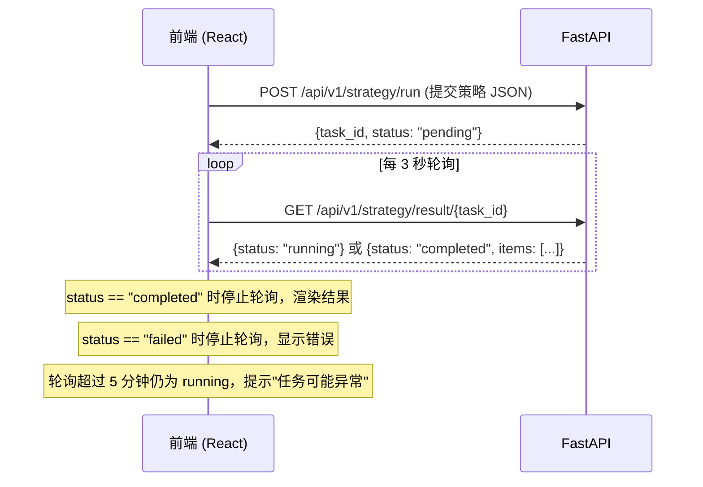
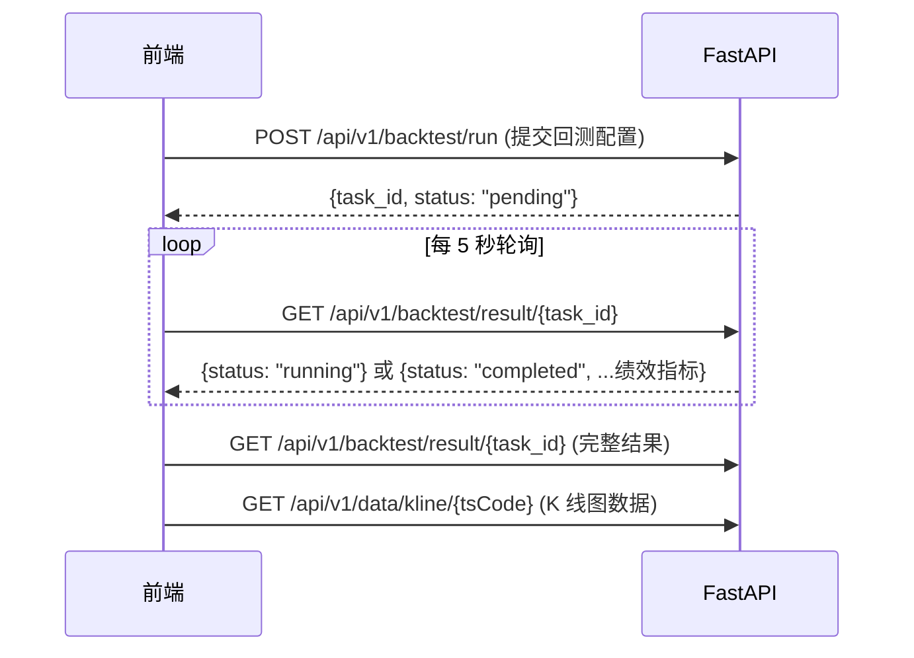

# 详细设计 - 模块 4：前端交互与 API 契约

> **版本：** v2.0
> **日期：** 2026-02-07
> **关联任务：** Task B4
> **状态：** Final
> **前置依赖：** 00-概要设计-v2, 02-详细设计-策略引擎, 03-详细设计-AI与回测
>
> **V1 实施范围：** 见 `99-实施范围-V1与V2划分.md` §五。V1 只做选股工作台 + 回测结果页，去掉 WebSocket 推送（改轮询），去掉实时监控和新闻仪表盘。

---

## 1. 核心页面交互设计

### 1.1 智能选股工作台 (Strategy Workbench)

这是系统的核心界面，采用 **"左配置 - 右结果"** 的布局。

#### 1.1.1 布局原型
```
+---------------------------------------------------------------+
| Header: 导航栏 (工作台 | 回测中心 | 监控看板 | 帮助)          |
+----------------------+----------------------------------------+
| [左侧栏：策略配置]   | [右侧栏：筛选结果]                     |
|                      |                                        |
| 1. 基础池            |  ToolBar: [运行筛选] [保存策略] [导出] |
|  [x] 剔除ST          |                                        |
|  [x] 剔除停牌        |  +--------+--------+-------+-------+   |
|                      |  | 代码   | 名称   | 现价  | 评分  |   |
| 2. 策略积木 (拖拽)   |  +--------+--------+-------+-------+   |
|  +----------------+  |  | 600519 | 茅台   | 1700  |  95   |   |
|  | MA金叉 [⚙️]    |  |  | 000001 | 平安   | 10.5  |  88   |   |
|  +----------------+  |  +--------+--------+-------+-------+   |
|  | 低PE (<30) [⚙️] |  |                                        |
|  +----------------+  |  [分页组件]                            |
|  | ➕ 添加策略...  |  |                                        |
|                      |  +----------------------------------+  |
| 3. AI 增强           |  | [底部面板] 选中股票详情          |  |
|  [ ] 开启AI初筛      |  | K线图 preview | AI 分析摘要      |  |
|  (消耗Token)         |  +----------------------------------+  |
+----------------------+----------------------------------------+
```

#### 1.1.2 策略积木交互逻辑
- **添加策略：** 点击"添加"按钮，弹出策略库（79种分类菜单），选择后加入左侧列表。
- **参数配置：** 点击积木上的 `[⚙️]` 图标，弹出参数配置气泡。
    - *示例：* MA金叉 -> 配置 `fast=5, slow=10`。
- **逻辑组合：** 默认是 `AND` 关系。支持创建 `策略组` 来实现 `OR` 关系（如：满足"双底" OR 满足"突破年线"）。
- **实时性：** 每次修改参数，前端不自动重跑（太慢），需手动点击 [运行筛选]。

---

### 1.2 回测配置中心 (Backtest Lab)

#### 1.2.1 配置向导 (Wizard)
1.  **选择策略：** 引用在工作台保存的策略组合。
2.  **设置区间：** `开始日期` - `结束日期`。
3.  **资金设置：** 初始资金 `100,000`，佣金 `0.00025`。
4.  **运行回测：** 点击运行 -> 进入"执行中"状态（显示进度条）。

#### 1.2.2 结果报告页
- **概览卡片：** 年化收益率 (红色/绿色高亮)、最大回撤、夏普比率。
- **收益曲线图：** 策略净值 vs 沪深300指数 (ECharts 折线图)。
- **交易明细表：** 每一笔买卖的时间、价格、收益。
- **潜在风险：** AI 生成的回测总结报告 ("该策略在震荡市表现不佳...")。

---

### 1.3 每日选股结果页面

> **V1 已实施** — 2026-02-28，路由 `/daily-picks`

- **日期范围选择器：** 支持查看最近 N 天（默认 30 天）
- **日期汇总表格：** 按日聚合展示选股数、策略数、1 日均收益、5 日命中率
- **展开行明细：** 点击某日展开该日全部选股记录（代码、名称、策略、买入价、1d/3d/5d/10d/20d 收益、最大涨幅、最大回撤）
- **数据来源：** `strategy_picks` 表，API 端点 `GET /api/v1/strategy/picks/daily-summary` 和 `GET /api/v1/strategy/picks/by-date`

### 1.4 盘后概览页面

> **V1 已实施** — 2026-02-28，路由 `/post-market`

- **统计卡片：** 今日选股数、5 日命中率、5 日均收益、交易计划数
- **Tab 1 — 任务执行日志：** 最近任务执行记录（类型、日期、状态、耗时）
- **Tab 2 — 命中率统计：** 各策略最新 5d 命中率和平均收益
- **Tab 3 — 最新交易计划：** 最新一日的交易计划列表
- **数据来源：** `task_execution_log`、`strategy_hit_stats`、`trade_plans` 表，API 端点 `GET /api/v1/strategy/post-market/overview`

---

## 2. 前后端交互模式

### 2.1 V1 交互模式：轮询

V1 不使用 WebSocket，所有异步任务通过**前端轮询**获取状态。



### 2.2 回测任务交互



---

## 3. API 接口契约 (Interface Contract)

### 3.1 运行选股策略
- **Endpoint:** `POST /api/v1/strategy/run`
- **Request Body:**
```json
{
  "base_filter": {
    "exclude_st": true,
    "exclude_halt": true
  },
  "strategies": [
    {
      "id": "tech_ma_cross",
      "params": {"fast": 5, "slow": 10},
      "enabled": true
    },
    {
      "id": "fund_low_pe",
      "params": {"threshold": 30},
      "enabled": true
    }
  ],
  "ai_filter": {
    "enabled": true,
    "min_score": 80
  }
}
```
- **Response:** `{"task_id": "uuid-1234", "status": "pending"}`

### 3.2 获取选股结果
- **Endpoint:** `GET /api/v1/strategy/result/{task_id}`
- **Response:**
```json
{
  "status": "completed",
  "total_count": 5,
  "execution_time_ms": 1500,
  "items": [
    {
      "ts_code": "600519.SH",
      "name": "贵州茅台",
      "price": 1700.00,
      "match_details": {
        "tech_ma_cross": true,
        "fund_low_pe": true
      },
      "ai_analysis": {
        "score": 95,
        "summary": "业绩稳健，外资持续流入..."
      }
    }
  ]
}
```

### 3.3 K 线数据查询
- **Endpoint:** `GET /api/v1/data/kline/{tsCode}`
- **Query Params:** `start_date`, `end_date`, `adj` (qfq/bfq/none, 默认 qfq)
- **Response:**
```json
{
  "ts_code": "600519.SH",
  "name": "贵州茅台",
  "adj": "qfq",
  "total": 487,
  "bars": [
    {
      "date": "2024-01-02",
      "open": 1680.00,
      "high": 1705.50,
      "low": 1675.00,
      "close": 1700.00,
      "volume": 25000,
      "turnover_rate": 0.32
    }
  ]
}
```

### 3.4 策略列表
- **Endpoint:** `GET /api/v1/strategy/list`
- **Response:**
```json
{
  "items": [
    {
      "id": 1,
      "name": "均线金叉 + 低估值",
      "category": "composite",
      "strategies": [
        {"id": "tech_ma_cross", "params": {"fast": 5, "slow": 10}},
        {"id": "fund_low_pe", "params": {"threshold": 30}}
      ],
      "created_at": "2026-02-07T10:00:00"
    }
  ]
}
```

### 3.5 保存策略
- **Endpoint:** `POST /api/v1/strategy/save`
- **Request Body:**
```json
{
  "name": "我的策略组合",
  "base_filter": {"exclude_st": true, "exclude_halt": true},
  "strategies": [
    {"id": "tech_ma_cross", "params": {"fast": 5, "slow": 10}},
    {"id": "fund_low_pe", "params": {"threshold": 30}}
  ],
  "ai_filter": {"enabled": false}
}
```
- **Response:** `{"id": 1, "message": "保存成功"}`

### 3.6 删除策略
- **Endpoint:** `DELETE /api/v1/strategy/{id}`
- **Response:** `{"message": "删除成功"}`

### 3.7 提交回测
- **Endpoint:** `POST /api/v1/backtest/run`
- **Request Body:**
```json
{
  "strategy_id": 1,
  "start_date": "2024-01-01",
  "end_date": "2025-12-31",
  "initial_capital": 100000,
  "rebalance_freq": "weekly",
  "allocation_method": "equal",
  "max_positions": 10,
  "benchmark": "000300.SH"
}
```
- **Response:** `{"task_id": "a1b2c3d4-...", "status": "pending"}`

### 3.8 回测结果
- **Endpoint:** `GET /api/v1/backtest/result/{taskId}`
- **Response:**
```json
{
  "task_id": "a1b2c3d4-...",
  "status": "completed",
  "total_return": 0.2531,
  "annual_return": 0.1342,
  "benchmark_return": 0.0856,
  "max_drawdown": 0.1523,
  "sharpe_ratio": 1.23,
  "total_trades": 86,
  "win_rate": 0.6047,
  "profit_loss_ratio": 1.85,
  "initial_capital": 100000,
  "final_capital": 125310,
  "equity_curve": [
    {"date": "2024-01-02", "equity": 1.0, "benchmark": 1.0, "drawdown": 0.0},
    {"date": "2025-12-31", "equity": 1.2531, "benchmark": 1.0856, "drawdown": 0.021}
  ],
  "trades": [
    {
      "ts_code": "600519.SH", "direction": "BUY",
      "trade_date": "2024-03-15", "price": 1680.50,
      "quantity": 100, "profit_rate": null
    },
    {
      "ts_code": "600519.SH", "direction": "SELL",
      "trade_date": "2024-04-02", "price": 1752.30,
      "quantity": 100, "profit_rate": 0.0416
    }
  ]
}
```

### 3.9 回测任务列表
- **Endpoint:** `GET /api/v1/backtest/list`
- **Query Params:** `page` (默认 1), `page_size` (默认 20)
- **Response:**
```json
{
  "total": 5,
  "items": [
    {
      "task_id": "a1b2c3d4-...",
      "strategy_name": "均线金叉 + 低估值",
      "start_date": "2024-01-01",
      "end_date": "2025-12-31",
      "status": "completed",
      "annual_return": 0.1342,
      "max_drawdown": 0.1523,
      "created_at": "2026-02-07T10:30:00"
    }
  ]
}
```

---

## 4. 路由设计

### 4.1 V1 路由表

| 路径 | 页面 | 说明 |
|:---|:---|:---|
| `/` | — | 重定向到 `/workbench` |
| `/workbench` | 智能选股工作台 | 策略配置 + 筛选结果 |
| `/backtest` | 回测任务列表 | 历史回测记录 |
| `/backtest/new` | 新建回测任务 | 配置向导 |
| `/backtest/:taskId` | 回测结果详情 | 绩效指标 + 收益曲线 + 交易明细 |

### 4.2 V2 预留路由

| 路径 | 页面 | 推迟原因 |
|:---|:---|:---|
| `/monitor` | 实时监控看板 | V1 不做盘中监控 |
| `/monitor/alerts` | 告警历史 | V1 不做实时告警 |
| `/news` | 新闻舆情仪表盘 | V1 不做新闻模块 |
| `/settings` | 用户设置 | V1 无用户系统 |
| `/login` | 登录页 | V1 无用户系统 |

### 4.3 React Router 配置

```tsx
import { createBrowserRouter } from "react-router-dom";
import { AppLayout } from "@/layouts/AppLayout";
import { Workbench } from "@/pages/Workbench";
import { BacktestList } from "@/pages/BacktestList";
import { BacktestNew } from "@/pages/BacktestNew";
import { BacktestDetail } from "@/pages/BacktestDetail";

export const router = createBrowserRouter([
  {
    path: "/",
    element: <AppLayout />,
    children: [
      { index: true, element: <Navigate to="/workbench" replace /> },
      { path: "workbench", element: <Workbench /> },
      { path: "backtest", element: <BacktestList /> },
      { path: "backtest/new", element: <BacktestNew /> },
      { path: "backtest/:taskId", element: <BacktestDetail /> },
    ],
  },
]);
```

---

## 5. 状态管理设计

### 5.1 Zustand Store 结构

```tsx
// ---- useStrategyStore ----
interface StrategyState {
  // 当前策略配置
  baseFilter: { excludeSt: boolean; excludeHalt: boolean };
  strategies: Array<{ id: string; params: Record<string, any>; enabled: boolean }>;
  aiFilter: { enabled: boolean; minScore: number };

  // 运行状态
  taskId: string | null;
  status: "idle" | "pending" | "running" | "completed" | "failed";
  results: StockItem[];
  error: string | null;

  // Actions
  addStrategy: (id: string, params: Record<string, any>) => void;
  removeStrategy: (id: string) => void;
  updateParams: (id: string, params: Record<string, any>) => void;
  runSelection: () => Promise<void>;
  pollResult: () => Promise<void>;
  reset: () => void;
}

// ---- useBacktestStore ----
interface BacktestState {
  // 任务列表
  tasks: BacktestTaskItem[];
  totalTasks: number;

  // 当前查看的结果
  currentResult: BacktestResult | null;
  currentTaskId: string | null;

  // Actions
  fetchTasks: (page: number) => Promise<void>;
  submitBacktest: (config: BacktestConfig) => Promise<string>;
  fetchResult: (taskId: string) => Promise<void>;
  pollStatus: (taskId: string) => Promise<void>;
}
```

### 5.2 React Query 配置

```tsx
import { QueryClient } from "@tanstack/react-query";

export const queryClient = new QueryClient({
  defaultOptions: {
    queries: {
      staleTime: 5 * 60 * 1000,    // 5 分钟内不重新请求
      gcTime: 30 * 60 * 1000,      // 缓存保留 30 分钟
      retry: 2,                     // 失败重试 2 次
      refetchOnWindowFocus: false,  // 切换窗口不自动刷新
    },
  },
});

// 各查询的 staleTime 覆盖
export const QUERY_CONFIG = {
  strategyList: { staleTime: 10 * 60 * 1000 },   // 策略列表 10 分钟
  backtestList: { staleTime: 30 * 1000 },         // 回测列表 30 秒（可能有新任务）
  backtestResult: { staleTime: Infinity },         // 回测结果不变，永久缓存
  klineData: { staleTime: 60 * 60 * 1000 },       // K 线数据 1 小时
};
```

### 5.3 轮询 Hook

```tsx
import { useEffect, useRef } from "react";

/**
 * 通用轮询 Hook。
 *
 * 在 status 为 "pending" 或 "running" 时，每隔 interval 毫秒调用 pollFn。
 * status 变为终态（completed/failed）或超过 maxDuration 时自动停止。
 */
export function usePolling(
  pollFn: () => Promise<void>,
  status: string,
  options: {
    interval?: number;       // 轮询间隔，默认 3000ms
    maxDuration?: number;    // 最大轮询时长，默认 300000ms (5 分钟)
    onTimeout?: () => void;  // 超时回调
  } = {}
) {
  const { interval = 3000, maxDuration = 300000, onTimeout } = options;
  const startTime = useRef(Date.now());

  useEffect(() => {
    if (status !== "pending" && status !== "running") return;

    startTime.current = Date.now();
    const timer = setInterval(async () => {
      const elapsed = Date.now() - startTime.current;
      if (elapsed > maxDuration) {
        clearInterval(timer);
        onTimeout?.();
        return;
      }
      await pollFn();
    }, interval);

    return () => clearInterval(timer);
  }, [status, interval, maxDuration]);
}
```

---

## 6. 错误处理 UI 设计

### 6.1 统一错误码

| 错误码 | HTTP 状态 | 含义 | 前端处理 |
|:---|:---|:---|:---|
| `STRATEGY_NOT_FOUND` | 404 | 策略不存在 | Toast 提示 |
| `BACKTEST_FAILED` | 200 | 回测执行失败（status=failed） | 显示 error_message |
| `BACKTEST_TIMEOUT` | 200 | 回测超时（轮询超 5 分钟） | 提示"任务可能异常，请稍后查看" |
| `INVALID_PARAMS` | 422 | 参数校验失败 | 表单字段标红 + 错误提示 |
| `DATA_NOT_AVAILABLE` | 404 | 请求的数据不存在 | Toast 提示 |
| `SERVER_ERROR` | 500 | 服务端内部错误 | Toast "服务异常，请稍后重试" |

### 6.2 错误处理组件

```tsx
import { message } from "antd";

/**
 * 统一 API 错误处理。
 * 在 axios 拦截器中调用。
 */
export function handleApiError(error: any): void {
  const status = error?.response?.status;
  const data = error?.response?.data;

  if (status === 422) {
    // 参数校验错误，由表单组件自行处理
    return;
  }

  if (status === 404) {
    message.warning(data?.detail || "请求的资源不存在");
    return;
  }

  if (status >= 500) {
    message.error("服务异常，请稍后重试");
    return;
  }

  // 网络错误
  if (!error.response) {
    message.error("网络连接失败，请检查网络");
    return;
  }

  message.error(data?.detail || "操作失败");
}
```

### 6.3 任务超时提示

```tsx
import { Alert } from "antd";

/**
 * 回测/选股任务超时提示组件。
 * 当轮询超过 5 分钟仍为 running 时显示。
 */
export function TaskTimeoutAlert({ taskId }: { taskId: string }) {
  return (
    <Alert
      type="warning"
      showIcon
      message="任务执行时间较长"
      description={`任务 ${taskId} 已运行超过 5 分钟，可能遇到异常。您可以稍后在回测列表中查看结果。`}
      closable
    />
  );
}
```

---

## 7. UI 组件库选型

| 用途 | 组件 | 说明 |
|:---|:---|:---|
| 整体 UI 框架 | Ant Design 5 | 表格、表单、布局、通知 |
| 高级表格 | Ant Design ProTable | 自带筛选、排序、分页 |
| 高级表单 | ProForm | 策略参数配置 |
| K 线图 | ECharts for React | Candlestick + 均线叠加 + 买卖点标记 |
| 收益曲线 | ECharts for React | 折线图（策略 vs 基准） |
| 状态管理 | Zustand | 轻量，替代 Redux |
| 数据请求 | React Query (TanStack Query) | 缓存 + 自动重试 + 轮询 |
| HTTP 客户端 | Axios | 拦截器统一错误处理 |
| 路由 | React Router v6 | 嵌套路由 |

---

## 8. 项目目录结构

```
src/
├── api/                    # API 请求函数
│   ├── strategy.ts         # 策略相关 API
│   ├── backtest.ts         # 回测相关 API
│   └── data.ts             # 数据查询 API
├── components/             # 通用组件
│   ├── KlineChart.tsx      # K 线图组件
│   ├── EquityCurve.tsx     # 收益曲线组件
│   ├── StrategyBlock.tsx   # 策略积木组件
│   └── TaskTimeoutAlert.tsx
├── hooks/                  # 自定义 Hooks
│   ├── usePolling.ts       # 轮询 Hook
│   └── useStrategyRun.ts   # 选股运行 Hook
├── layouts/
│   └── AppLayout.tsx       # 全局布局（Header + Content）
├── pages/
│   ├── Workbench.tsx       # 选股工作台
│   ├── BacktestList.tsx    # 回测列表
│   ├── BacktestNew.tsx     # 新建回测
│   └── BacktestDetail.tsx  # 回测详情
├── stores/
│   ├── strategyStore.ts    # 策略状态
│   └── backtestStore.ts    # 回测状态
├── router.tsx              # 路由配置
├── queryClient.ts          # React Query 配置
└── App.tsx
```

---

## 9. 边界条件与异常处理

| 场景 | 处理方式 |
|:---|:---|
| 策略列表为空 | 显示空状态引导："点击添加策略开始选股" |
| 选股结果为 0 | 提示"当前策略组合未筛选出股票，请调整参数" |
| 回测区间无交易日 | 表单校验拦截，提示"请选择包含交易日的区间" |
| 回测结果 total_trades=0 | 显示结果但提示"策略在该区间内未产生交易信号" |
| K 线数据加载失败 | 图表区域显示"数据加载失败" + 重试按钮 |
| 轮询超时（>5 分钟） | 停止轮询，显示 TaskTimeoutAlert |
| 网络断开 | Axios 拦截器捕获，Toast "网络连接失败" |
| 后端 500 错误 | Toast "服务异常，请稍后重试" |

---

## 10. 与其他模块的接口契约

### 10.1 依赖的后端 API

| API | 来源模块 | 用途 |
|:---|:---|:---|
| `POST /api/v1/strategy/run` | 策略引擎 | 提交选股任务 |
| `GET /api/v1/strategy/result/{taskId}` | 策略引擎 | 获取选股结果（含轮询） |
| `GET /api/v1/strategy/list` | 策略引擎 | 策略列表 |
| `POST /api/v1/strategy/save` | 策略引擎 | 保存策略 |
| `DELETE /api/v1/strategy/{id}` | 策略引擎 | 删除策略 |
| `POST /api/v1/backtest/run` | 回测引擎 | 提交回测 |
| `GET /api/v1/backtest/result/{taskId}` | 回测引擎 | 回测结果（含轮询） |
| `GET /api/v1/backtest/list` | 回测引擎 | 回测列表 |
| `GET /api/v1/data/kline/{tsCode}` | 数据采集 | K 线数据 |

### 10.2 V2 预留 API（V1 不对接）

| API | 用途 | 推迟原因 |
|:---|:---|:---|
| `GET /api/v1/data/realtime/{tsCode}` | 实时行情 | V1 不做盘中监控 |
| `GET /api/v1/watchlist` | 自选股 | V1 不做自选股功能 |
| `GET /api/v1/ai/health` | AI 健康状态 | V1 不做 AI 监控面板 |

---

## 11. 配置项清单

| 配置项 | 类型 | 默认值 | 说明 |
|:---|:---|:---|:---|
| `VITE_API_BASE_URL` | string | `http://localhost:8000` | 后端 API 地址 |
| `VITE_POLL_INTERVAL_MS` | number | 3000 | 选股任务轮询间隔 |
| `VITE_BACKTEST_POLL_INTERVAL_MS` | number | 5000 | 回测任务轮询间隔 |
| `VITE_POLL_MAX_DURATION_MS` | number | 300000 | 轮询最大时长（5 分钟） |
