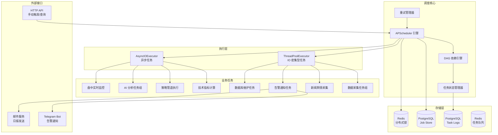
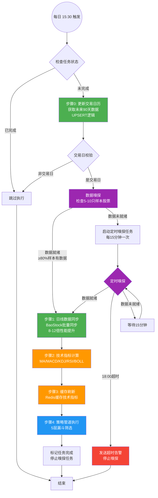
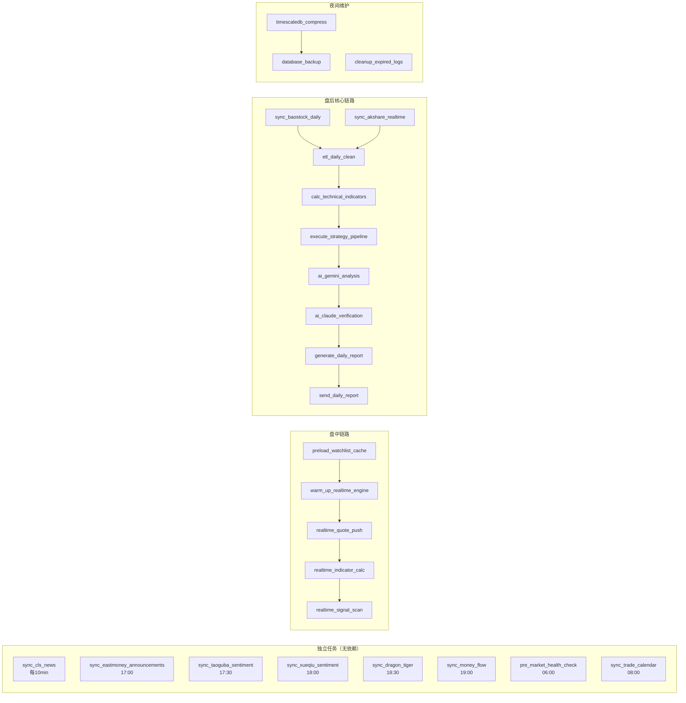
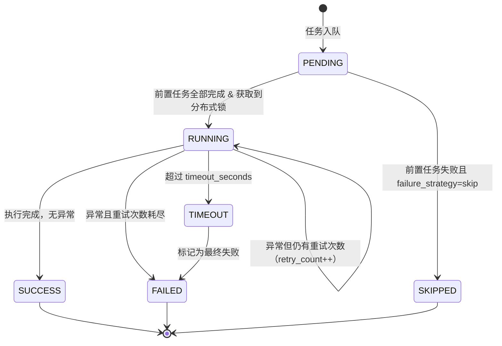
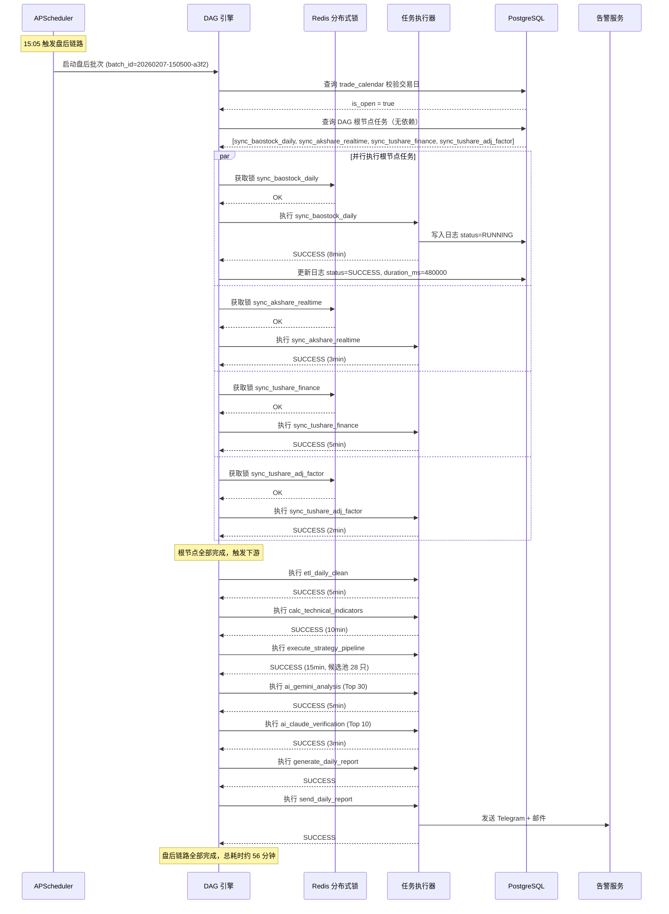

# 系统设计 - 定时任务调度

> **版本：** v1.0
> **日期：** 2026-02-07
> **关联任务：** Task C1
> **状态：** Draft
> **前置依赖：** 00-概要设计-v2.md, 01-详细设计-数据采集.md, 02-详细设计-策略引擎.md, 03-详细设计-AI与回测.md
>
> **V1 实施范围：** 见 `99-实施范围-V1与V2划分.md` §六。V1 去掉分布式锁和执行日志表，APScheduler 用 SQLite Job Store，失败只写日志，手动触发用命令行脚本。

---

## 1. 模块概述

### 1.1 职责

定时任务调度模块是整个 A 股智能选股系统的"中枢神经"，负责协调所有异步、周期性、依赖性任务的执行。其核心职责包括：

- **任务编排：** 管理从数据采集到 AI 分析再到报告生成的完整盘后链路，确保任务按 DAG 依赖顺序执行。
- **生命周期管理：** 对每个任务实例进行状态跟踪（PENDING / RUNNING / SUCCESS / FAILED / SKIPPED / TIMEOUT），记录完整执行日志。
- **失败恢复：** 提供指数退避重试、下游任务降级（使用昨日数据）、失败告警通知等容错机制。
- **手动干预：** 支持通过 HTTP API 手动触发任务、补数据重跑、取消正在执行的任务。
- **分布式安全：** 通过 Redis 分布式锁防止同一任务在多实例环境下重复执行。

### 1.2 核心挑战

| 挑战 | 说明 | 应对策略 |
| :--- | :--- | :--- |
| 任务依赖链路长 | 盘后核心链路包含 6 个串行环节，任一环节失败将阻塞下游 | DAG 依赖引擎 + 降级策略 |
| 交易日历感知 | 非交易日（周末、节假日）不应执行盘后数据任务 | 集成 `trade_calendar` 表，任务执行前校验 |
| 时间窗口紧张 | 盘后 15:00-22:00 需完成全部数据处理和 AI 分析 | 并行化 + 预计算 + 超时控制 |
| 幂等性要求 | 任务重跑不应产生重复数据 | UPSERT 语义 + 幂等装饰器 |
| 外部 API 不稳定 | BaoStock / AKShare / AI API 可能超时或限流 | 指数退避重试 + 数据源故障切换 |

### 1.3 与其他模块的关系

```
┌─────────────────────────────────────────────────────────────┐
│                    定时任务调度模块 (Scheduler)                │
│  ┌──────────┐  ┌──────────┐  ┌──────────┐  ┌──────────┐   │
│  │ 任务注册  │  │ DAG 引擎 │  │ 状态管理  │  │ 告警通知  │   │
│  └────┬─────┘  └────┬─────┘  └────┬─────┘  └────┬─────┘   │
└───────┼─────────────┼─────────────┼─────────────┼──────────┘
        │             │             │             │
   ┌────▼────┐   ┌────▼────┐  ┌────▼────┐  ┌────▼────┐
   │数据采集  │   │策略引擎  │  │AI 分析  │  │监控告警  │
   │模块      │   │模块      │  │模块     │  │模块      │
   └─────────┘   └─────────┘  └─────────┘  └─────────┘
```

- **数据采集模块：** 调度器触发 BaoStock 日线同步、AKShare 实时行情、Tushare 财务数据、ETL 清洗等任务。
- **策略引擎模块：** 调度器在技术指标预计算完成后触发 5 层漏斗筛选管道。
- **AI 分析模块：** 调度器在策略管道输出候选池后触发 Gemini / Claude 分析。
- **监控告警模块：** 调度器触发盘后日报生成与发送；任务失败时通过告警模块发送通知。
- **数据库维护：** 调度器在夜间触发 TimescaleDB 压缩、备份等运维任务。

---

## 2. 架构图

### 2.1 调度模块整体架构



---

## 3. 每日任务调度总表

### 3.1 交易日历校验

所有与行情数据相关的任务在执行前必须校验当日是否为交易日：

```python
async def is_trading_day(target_date: date | None = None) -> bool:
    """检查指定日期是否为 A 股交易日"""
    check_date = target_date or date.today()
    result = await db.fetch_one(
        "SELECT is_open FROM trade_calendar "
        "WHERE cal_date = :d AND exchange = 'SSE'",
        {"d": check_date}
    )
    return result["is_open"] if result else False
```

### 3.2 盘前任务（06:00 - 09:30）

| 时间 | 任务名 | 所属模块 | 依赖前置任务 | 预计耗时 | 失败处理策略 |
| :--- | :--- | :--- | :--- | :--- | :--- |
| 06:00 | `pre_market_health_check` | 系统运维 | 无 | 30s | 重试 3 次，失败发 Telegram 告警 |
| 08:00 | `sync_stock_list` | 数据采集 | 无 | 10min | 重试 3 次，失败告警 |
| 08:30 | `sync_news_morning` | 新闻舆情 | 无 | 2min | 重试 2 次，失败跳过 |
| 09:00 | `preload_watchlist_cache` | 实时监控 | 无 | 1min | 重试 2 次，使用昨日缓存 |
| 09:15 | `warm_up_realtime_engine` | 实时监控 | `preload_watchlist_cache` | 30s | 重试 3 次，失败告警 |

**注：** V1 实施中，交易日历更新已移至盘后链路第一步（15:30 自动执行），每次更新获取未来 90 天数据。周末任务（`sync_stock_list`）也会更新交易日历作为兜底机制。

**`pre_market_health_check` 详情：**
- 检查 PostgreSQL 连接可用性
- 检查 Redis 连接可用性
- 检查 BaoStock / AKShare / Tushare API 可达性
- 检查磁盘空间是否充足（阈值：剩余 < 10GB 告警）

### 3.3 盘中任务（09:30 - 15:00）

| 时间 | 任务名 | 所属模块 | 依赖前置任务 | 预计耗时 | 失败处理策略 |
| :--- | :--- | :--- | :--- | :--- | :--- |
| 09:30-15:00 每 3s | `realtime_quote_push` | 实时监控 | `warm_up_realtime_engine` | 持续运行 | 自动重连，断线超 30s 告警 |
| 09:30-15:00 每 1min | `realtime_indicator_calc` | 技术指标 | `realtime_quote_push` | <1s/次 | 跳过本次，下次重算 |
| 09:30-15:00 每 5min | `realtime_signal_scan` | 策略引擎 | `realtime_indicator_calc` | 5s | 跳过本次 |
| 每 10min | `sync_cls_news` | 新闻舆情 | 无 | 30s | 重试 2 次，失败跳过 |
| 11:30 | `morning_session_summary` | 告警通知 | 无 | 10s | 重试 1 次 |

### 3.4 盘后任务（15:00 - 22:00）-- 核心链路

**V1 实施状态：** 已升级为智能数据自动更新系统（`auto_update_job`），包含数据嗅探、智能重试、超时告警等机制。

| 时间 | 任务名 | 所属模块 | 依赖前置任务 | 预计耗时 | 失败处理策略 |
| :--- | :--- | :--- | :--- | :--- | :--- |
| 15:30 | `auto_update_job` | 数据采集 | 无 | 变动 | 智能嗅探重试，18:00 超时告警 |
| 17:00 | `sync_eastmoney_announcements` | 新闻舆情 | 无 | 5min | 重试 2 次 |
| 17:30 | `sync_taoguba_sentiment` | 新闻舆情 | 无 | 3min | 重试 2 次，失败跳过 |
| 18:00 | `sync_xueqiu_sentiment` | 新闻舆情 | 无 | 3min | 重试 2 次，失败跳过 |
| 18:30 | `sync_dragon_tiger` | 数据采集 | 无 | 2min | 重试 2 次 |
| 19:00 | `sync_money_flow` | 数据采集 | 无 | 3min | 重试 2 次 |

#### 3.4.1 智能数据自动更新系统（V1 已实施）

**设计目标：** 解决 BaoStock 数据源在 15:30 时可能尚未更新当日数据的问题，实现智能嗅探和自动重试。

**核心机制：**

1. **每日自动触发**（15:30）
   - 不管是否交易日，每天都尝试获取最新数据
   - 首先更新交易日历（获取未来 90 天数据）
   - 查询 `trade_calendar` 表判断是否交易日
   - 非交易日直接退出

2. **数据嗅探机制**
   - 检查 5-10 只流动性好的大盘股（如茅台、平安银行等）
   - 查询这些样本股票在目标日期是否有数据
   - 如果 ≥80% 的样本股有数据，则认为"数据已就绪"
   - 单次嗅探耗时 < 100ms

3. **智能重试机制**
   - 如数据就绪 → 立即执行完整盘后链路
   - 如数据未就绪 → 启动定时嗅探任务（`probe_and_sync_job`）
   - 嗅探任务每 15 分钟触发一次
   - 嗅探到数据后立即执行盘后链路并停止嗅探任务
   - 18:00 仍无数据则超时告警并停止嗅探

4. **状态管理**
   - 使用 Redis 存储任务状态（避免重复执行）
   - Redis Key 设计：
     - `sync_status:{date}` - 任务状态（pending/probing/syncing/completed/failed）
     - `probe_count:{date}` - 嗅探次数计数
     - `probe_job_id:{date}` - 嗅探任务 ID（用于停止任务）
   - TTL 设置为 7 天，自动清理过期数据

5. **完整盘后链路步骤**
   - 步骤 0：交易日历更新（获取未来 90 天，UPSERT 逻辑）
   - 步骤 1：交易日校验
   - 步骤 2：日线数据同步
   - 步骤 3：技术指标计算
   - 步骤 4：缓存刷新
   - 步骤 5：策略管道执行

**配置项：**

| 配置项 | 默认值 | 说明 |
|:---|:---|:---|
| `AUTO_UPDATE_ENABLED` | `true` | 是否启用自动数据更新 |
| `AUTO_UPDATE_PROBE_INTERVAL` | `15` | 嗅探间隔（分钟） |
| `AUTO_UPDATE_PROBE_TIMEOUT` | `18:00` | 嗅探超时时间 |
| `AUTO_UPDATE_PROBE_STOCKS` | `["600519.SH", ...]` | 嗅探样本股票列表 |
| `AUTO_UPDATE_PROBE_THRESHOLD` | `0.8` | 嗅探成功阈值（80%样本有数据） |

**实现文件：**
- `app/scheduler/auto_update.py` - 自动更新任务
- `app/data/probe.py` - 数据嗅探模块
- `app/scheduler/state.py` - 任务状态管理
- `app/notification/__init__.py` - 通知报警模块

**优势：**
- 无需手动干预，系统自动处理数据延迟问题
- 嗅探开销小（只查 5-10 只股票）
- 准确性高（大盘股数据更新最快）
- 超时自动告警，及时发现数据源问题

### 3.5 夜间 / 周末任务

| 时间 | 任务名 | 所属模块 | 依赖前置任务 | 预计耗时 | 失败处理策略 |
| :--- | :--- | :--- | :--- | :--- | :--- |
| 每日 02:00 | `timescaledb_compress` | 数据库维护 | 无 | 10min | 重试 1 次，失败告警 |
| 每日 03:00 | `database_backup` | 数据库维护 | `timescaledb_compress` | 20min | 重试 1 次，失败告警（P0） |
| 每日 04:00 | `cleanup_expired_logs` | 数据库维护 | 无 | 5min | 重试 1 次 |
| 每周六 08:00 | `sync_stock_list` | 数据采集 | 无 | 10min | 重试 3 次，包含交易日历更新 |
| 每周六 09:00 | `weekly_data_integrity_check` | 数据采集 | `sync_stock_list` | 30min | 失败告警，生成缺失报告 |
| 每周六 10:00 | `backfill_missing_data` | 数据采集 | `weekly_data_integrity_check` | 60min | 重试 2 次 |
| 每月 1 日 05:00 | `timescaledb_retention_policy` | 数据库维护 | 无 | 15min | 重试 1 次，失败告警 |

**注：** V1 实施中，周末任务 `sync_stock_list` 会首先更新交易日历（获取未来 90 天数据），然后执行股票列表同步。这作为交易日历更新的兜底机制，与每日盘后链路的交易日历更新互补。

---

## 4. 任务依赖链路图（DAG）

### 4.1 盘后核心链路 DAG（V1 已实施）

**注：** V1 实施中，盘后核心链路已升级为智能自动更新系统，包含数据嗅探和智能重试机制。



**V1 简化说明：**
- 移除了 AI 分析层（Gemini/Claude）
- 移除了日报生成和发送
- 移除了财务数据同步（Tushare）
- 移除了复权因子同步
- 保留核心数据采集、技术指标计算、策略管道执行
- 新增智能数据嗅探和自动重试机制

### 4.2 全量任务依赖关系图



---

## 5. 数据库表设计

### 5.1 任务定义表 `scheduler_tasks`

```sql
CREATE TABLE scheduler_tasks (
    -- 主键：任务唯一标识符，如 'sync_baostock_daily'
    task_name VARCHAR(100) PRIMARY KEY,

    -- 任务显示名称
    display_name VARCHAR(200) NOT NULL,

    -- 所属模块：data_collect / technical / strategy / ai / news / monitor / alert / maintenance
    module VARCHAR(50) NOT NULL,

    -- 任务描述
    description TEXT,

    -- Cron 表达式，如 '5 15 * * 1-5' 表示工作日 15:05
    cron_expression VARCHAR(100) NOT NULL,

    -- 是否需要交易日校验：true 表示仅在交易日执行
    require_trading_day BOOLEAN NOT NULL DEFAULT TRUE,

    -- 前置依赖任务列表（JSON 数组），如 '["sync_baostock_daily", "sync_akshare_realtime"]'
    dependencies JSONB NOT NULL DEFAULT '[]'::jsonb,

    -- 最大执行时长（秒），超时将被强制终止
    timeout_seconds INTEGER NOT NULL DEFAULT 600,

    -- 最大重试次数
    max_retries INTEGER NOT NULL DEFAULT 3,

    -- 重试基础间隔（秒），实际间隔 = base_retry_interval * 2^(retry_count-1)
    base_retry_interval INTEGER NOT NULL DEFAULT 10,

    -- 失败后下游任务处理策略：block(阻塞) / skip(跳过) / fallback(使用昨日数据)
    failure_strategy VARCHAR(20) NOT NULL DEFAULT 'block',

    -- 任务优先级：1(最高) - 10(最低)
    priority INTEGER NOT NULL DEFAULT 5,

    -- 是否启用
    is_enabled BOOLEAN NOT NULL DEFAULT TRUE,

    -- 任务执行函数的完整路径，如 'app.tasks.data_collect.sync_baostock_daily'
    func_path VARCHAR(300) NOT NULL,

    -- 任务参数模板（JSON），手动触发时可覆盖
    default_params JSONB NOT NULL DEFAULT '{}'::jsonb,

    -- 元数据
    created_at TIMESTAMP WITH TIME ZONE NOT NULL DEFAULT NOW(),
    updated_at TIMESTAMP WITH TIME ZONE NOT NULL DEFAULT NOW()
);

-- 索引：按模块查询
CREATE INDEX idx_scheduler_tasks_module ON scheduler_tasks (module);

-- 索引：按启用状态查询
CREATE INDEX idx_scheduler_tasks_enabled ON scheduler_tasks (is_enabled) WHERE is_enabled = TRUE;

COMMENT ON TABLE scheduler_tasks IS '定时任务定义表，存储所有可调度任务的元信息';
COMMENT ON COLUMN scheduler_tasks.task_name IS '任务唯一标识符，作为 APScheduler job_id';
COMMENT ON COLUMN scheduler_tasks.cron_expression IS 'Cron 表达式，格式：分 时 日 月 周';
COMMENT ON COLUMN scheduler_tasks.failure_strategy IS 'block=阻塞下游 skip=跳过下游 fallback=下游使用昨日数据';
```

### 5.2 任务执行日志表 `scheduler_task_logs`

```sql
CREATE TABLE scheduler_task_logs (
    -- 主键：自增 ID
    id BIGSERIAL PRIMARY KEY,

    -- 关联任务名
    task_name VARCHAR(100) NOT NULL,

    -- 执行批次号，同一天同一链路的任务共享一个 batch_id，格式：YYYYMMDD-HHmmss-随机4位
    batch_id VARCHAR(30) NOT NULL,

    -- 目标执行日期（业务日期，非物理执行时间），如补数据场景可能是历史日期
    target_date DATE NOT NULL,

    -- 任务状态枚举
    status VARCHAR(20) NOT NULL DEFAULT 'PENDING',

    -- 物理开始时间
    started_at TIMESTAMP WITH TIME ZONE,

    -- 物理结束时间
    finished_at TIMESTAMP WITH TIME ZONE,

    -- 执行耗时（毫秒）
    duration_ms INTEGER,

    -- 当前重试次数
    retry_count INTEGER NOT NULL DEFAULT 0,

    -- 触发方式：scheduled(定时) / manual(手动) / retry(重试) / dependency(依赖触发)
    trigger_type VARCHAR(20) NOT NULL DEFAULT 'scheduled',

    -- 触发者（手动触发时记录用户信息）
    triggered_by VARCHAR(100),

    -- 执行结果摘要（JSON），如处理了多少条数据、生成了多少条记录
    result_summary JSONB,

    -- 错误信息（失败时记录完整堆栈）
    error_message TEXT,

    -- 错误堆栈
    error_traceback TEXT,

    -- 创建时间
    created_at TIMESTAMP WITH TIME ZONE NOT NULL DEFAULT NOW()
);

-- 索引：按任务名 + 目标日期查询（最常用）
CREATE INDEX idx_task_logs_name_date ON scheduler_task_logs (task_name, target_date);

-- 索引：按批次号查询（查看同一批次所有任务）
CREATE INDEX idx_task_logs_batch ON scheduler_task_logs (batch_id);

-- 索引：按状态查询（查找失败任务）
CREATE INDEX idx_task_logs_status ON scheduler_task_logs (status) WHERE status IN ('FAILED', 'TIMEOUT', 'RUNNING');

-- 索引：按时间范围查询
CREATE INDEX idx_task_logs_created ON scheduler_task_logs (created_at DESC);

-- 约束：状态枚举
ALTER TABLE scheduler_task_logs ADD CONSTRAINT chk_task_log_status
    CHECK (status IN ('PENDING', 'RUNNING', 'SUCCESS', 'FAILED', 'SKIPPED', 'TIMEOUT'));

-- 约束：触发方式枚举
ALTER TABLE scheduler_task_logs ADD CONSTRAINT chk_task_log_trigger
    CHECK (trigger_type IN ('scheduled', 'manual', 'retry', 'dependency'));

COMMENT ON TABLE scheduler_task_logs IS '任务执行日志表，记录每次任务执行的完整生命周期';
COMMENT ON COLUMN scheduler_task_logs.batch_id IS '执行批次号，同一天盘后链路共享批次';
COMMENT ON COLUMN scheduler_task_logs.target_date IS '业务目标日期，补数据时可能是历史日期';
COMMENT ON COLUMN scheduler_task_logs.duration_ms IS '执行耗时（毫秒），用于性能监控';
```

### 5.3 任务状态枚举与状态机

```python
from enum import Enum

class TaskStatus(str, Enum):
    """任务状态枚举"""
    PENDING = "PENDING"      # 等待执行（已入队，等待前置任务完成）
    RUNNING = "RUNNING"      # 正在执行
    SUCCESS = "SUCCESS"      # 执行成功
    FAILED = "FAILED"        # 执行失败（已耗尽重试次数）
    SKIPPED = "SKIPPED"      # 被跳过（前置任务失败且策略为 skip）
    TIMEOUT = "TIMEOUT"      # 执行超时（超过 timeout_seconds）
```

**状态流转图：**



---

## 6. APScheduler 配置方案

### 6.1 完整配置代码

```python
import logging
from datetime import datetime, date
from typing import Any

from apscheduler.schedulers.asyncio import AsyncIOScheduler
from apscheduler.jobstores.sqlalchemy import SQLAlchemyJobStore
from apscheduler.executors.pool import ThreadPoolExecutor
from apscheduler.executors.asyncio import AsyncIOExecutor
from apscheduler.events import (
    EVENT_JOB_EXECUTED,
    EVENT_JOB_ERROR,
    EVENT_JOB_MISSED,
)

from app.core.config import settings

logger = logging.getLogger("scheduler")


def create_scheduler() -> AsyncIOScheduler:
    """
    创建并配置 APScheduler 实例。
    - Job Store 使用 PostgreSQL 持久化，防止服务重启丢失任务。
    - IO 密集型任务使用 ThreadPoolExecutor（数据采集、文件操作）。
    - CPU/异步任务使用 AsyncIOExecutor（指标计算、策略执行）。
    """

    # -- Job Store 配置 --
    # 使用 PostgreSQL 持久化任务定义，服务重启后自动恢复
    jobstores = {
        "default": SQLAlchemyJobStore(
            url=settings.DATABASE_URL,          # postgresql+asyncpg://...
            tablename="apscheduler_jobs",       # APScheduler 内部表
            engine_options={
                "pool_size": 5,
                "max_overflow": 10,
                "pool_pre_ping": True,          # 连接健康检查
            },
        ),
    }

    # -- Executor 配置 --
    executors = {
        # IO 密集型：数据采集（网络请求）、文件读写、邮件发送
        "default": ThreadPoolExecutor(max_workers=10),
        # 异步任务：技术指标计算、策略管道、AI 调用
        "async": AsyncIOExecutor(),
    }

    # -- 全局任务默认配置 --
    job_defaults = {
        "coalesce": True,           # 如果任务积压，合并为一次执行（防止重复）
        "max_instances": 1,         # 同一任务最多同时运行 1 个实例
        "misfire_grace_time": 300,  # 错过触发时间后 5 分钟内仍可执行
    }

    scheduler = AsyncIOScheduler(
        jobstores=jobstores,
        executors=executors,
        job_defaults=job_defaults,
        timezone="Asia/Shanghai",   # A 股时区
    )

    # -- 注册事件监听器 --
    scheduler.add_listener(_on_job_executed, EVENT_JOB_EXECUTED)
    scheduler.add_listener(_on_job_error, EVENT_JOB_ERROR)
    scheduler.add_listener(_on_job_missed, EVENT_JOB_MISSED)

    return scheduler


def _on_job_executed(event: Any) -> None:
    """任务执行成功回调"""
    logger.info(f"任务执行成功: job_id={event.job_id}, "
                f"scheduled_run_time={event.scheduled_run_time}")


def _on_job_error(event: Any) -> None:
    """任务执行失败回调"""
    logger.error(f"任务执行失败: job_id={event.job_id}, "
                 f"exception={event.exception}",
                 exc_info=event.traceback)


def _on_job_missed(event: Any) -> None:
    """任务错过执行时间回调"""
    logger.warning(f"任务错过执行: job_id={event.job_id}, "
                   f"scheduled_run_time={event.scheduled_run_time}")
```

### 6.2 任务注册代码

```python
from apscheduler.triggers.cron import CronTrigger

from app.scheduler.core import create_scheduler
from app.tasks import (
    data_collect,
    technical,
    strategy,
    ai_analysis,
    news,
    monitor,
    alert,
    maintenance,
)


async def register_all_tasks(scheduler: AsyncIOScheduler) -> None:
    """
    从 scheduler_tasks 表读取任务定义，动态注册到 APScheduler。
    支持热更新：修改数据库后调用此函数即可生效。
    """
    tasks = await db.fetch_all(
        "SELECT * FROM scheduler_tasks WHERE is_enabled = TRUE"
    )

    for task in tasks:
        # 解析 cron 表达式（格式：分 时 日 月 周）
        cron_parts = task["cron_expression"].split()
        trigger = CronTrigger(
            minute=cron_parts[0],
            hour=cron_parts[1],
            day=cron_parts[2],
            month=cron_parts[3],
            day_of_week=cron_parts[4],
            timezone="Asia/Shanghai",
        )

        # 动态导入任务函数
        func = _import_func(task["func_path"])

        scheduler.add_job(
            func=func,
            trigger=trigger,
            id=task["task_name"],           # 使用 task_name 作为 job_id
            name=task["display_name"],
            replace_existing=True,          # 重复注册时覆盖
            executor="async" if "calc" in task["task_name"]
                              or "pipeline" in task["task_name"]
                              or "ai_" in task["task_name"]
                     else "default",
        )
        logger.info(f"注册任务: {task['task_name']} -> {task['cron_expression']}")


def _import_func(func_path: str):
    """动态导入函数，如 'app.tasks.data_collect.sync_baostock_daily'"""
    module_path, func_name = func_path.rsplit(".", 1)
    import importlib
    module = importlib.import_module(module_path)
    return getattr(module, func_name)
```

### 6.3 Redis 分布式锁

```python
import redis.asyncio as redis
import uuid
import functools
from typing import Callable, Any

# Redis 连接池（全局单例）
redis_pool = redis.ConnectionPool.from_url(
    "redis://localhost:6379/1",
    max_connections=20,
    decode_responses=True,
)


class DistributedLock:
    """
    基于 Redis 的分布式锁，防止同一任务在多实例环境下重复执行。
    使用 SET NX EX 原子操作实现，支持自动续期。
    """

    def __init__(
        self,
        lock_name: str,
        expire_seconds: int = 600,  # 锁过期时间，需大于任务最大执行时长
    ):
        self.redis = redis.Redis(connection_pool=redis_pool)
        self.lock_name = f"scheduler:lock:{lock_name}"
        self.expire_seconds = expire_seconds
        self.lock_value = str(uuid.uuid4())  # 唯一标识，防止误删他人的锁

    async def acquire(self) -> bool:
        """尝试获取锁，成功返回 True"""
        result = await self.redis.set(
            self.lock_name,
            self.lock_value,
            nx=True,                    # 仅当 key 不存在时设置
            ex=self.expire_seconds,     # 设置过期时间，防止死锁
        )
        return result is not None

    async def release(self) -> None:
        """释放锁（仅释放自己持有的锁）"""
        # Lua 脚本保证原子性：先检查值是否匹配，再删除
        lua_script = """
        if redis.call("get", KEYS[1]) == ARGV[1] then
            return redis.call("del", KEYS[1])
        else
            return 0
        end
        """
        await self.redis.eval(lua_script, 1, self.lock_name, self.lock_value)

    async def __aenter__(self):
        acquired = await self.acquire()
        if not acquired:
            raise RuntimeError(f"无法获取分布式锁: {self.lock_name}")
        return self

    async def __aexit__(self, exc_type, exc_val, exc_tb):
        await self.release()


def with_distributed_lock(lock_name: str | None = None, expire: int = 600):
    """
    分布式锁装饰器。
    用法：
        @with_distributed_lock("sync_baostock_daily", expire=900)
        async def sync_baostock_daily():
            ...
    """
    def decorator(func: Callable) -> Callable:
        @functools.wraps(func)
        async def wrapper(*args: Any, **kwargs: Any) -> Any:
            name = lock_name or func.__name__
            lock = DistributedLock(name, expire_seconds=expire)
            acquired = await lock.acquire()
            if not acquired:
                logger.warning(f"任务 {name} 已在其他实例运行，跳过本次执行")
                return None
            try:
                return await func(*args, **kwargs)
            finally:
                await lock.release()
        return wrapper
    return decorator
```

---

## 7. 核心流程

### 7.1 盘后任务链执行流程



### 7.2 DAG 依赖引擎实现

```python
import asyncio
from datetime import date, datetime
from typing import Dict, List, Set

from app.models.scheduler import TaskStatus
from app.scheduler.lock import with_distributed_lock
from app.scheduler.retry import retry_with_backoff


class DAGEngine:
    """
    DAG 任务依赖引擎。
    负责按拓扑顺序执行任务链，支持并行执行无依赖关系的任务。
    """

    def __init__(self, batch_id: str, target_date: date):
        self.batch_id = batch_id
        self.target_date = target_date
        # 任务状态缓存：{task_name: TaskStatus}
        self.task_status: Dict[str, TaskStatus] = {}

    async def execute_chain(self, root_tasks: List[str]) -> None:
        """
        从根节点开始，按 DAG 拓扑顺序执行整条链路。
        无依赖关系的任务将并行执行。
        """
        # 加载所有任务定义
        all_tasks = await self._load_task_definitions()

        # 构建邻接表（task_name -> 下游任务列表）
        downstream: Dict[str, List[str]] = {}
        # 构建入度表（task_name -> 未完成的前置任务数）
        in_degree: Dict[str, int] = {}

        for task in all_tasks:
            name = task["task_name"]
            deps = task["dependencies"]  # JSON 数组
            in_degree[name] = len(deps)
            for dep in deps:
                downstream.setdefault(dep, []).append(name)

        # 初始化就绪队列（入度为 0 的任务）
        ready_queue: Set[str] = {
            name for name, deg in in_degree.items() if deg == 0
        }

        # BFS 拓扑排序执行
        while ready_queue:
            # 并行执行所有就绪任务
            tasks_to_run = list(ready_queue)
            ready_queue.clear()

            results = await asyncio.gather(
                *[self._execute_single_task(name, all_tasks) for name in tasks_to_run],
                return_exceptions=True,
            )

            # 处理执行结果，更新下游入度
            for task_name, result in zip(tasks_to_run, results):
                if isinstance(result, Exception):
                    self.task_status[task_name] = TaskStatus.FAILED
                    await self._handle_failure(task_name, result, all_tasks, downstream)
                else:
                    self.task_status[task_name] = TaskStatus.SUCCESS

                # 更新下游任务入度
                for child in downstream.get(task_name, []):
                    in_degree[child] -= 1
                    if in_degree[child] == 0:
                        # 检查所有前置任务是否都成功
                        child_deps = next(
                            t["dependencies"] for t in all_tasks
                            if t["task_name"] == child
                        )
                        if all(
                            self.task_status.get(d) == TaskStatus.SUCCESS
                            for d in child_deps
                        ):
                            ready_queue.add(child)
                        else:
                            # 前置任务有失败的，根据策略决定是否跳过
                            await self._handle_dependency_failure(
                                child, all_tasks
                            )

    async def _execute_single_task(
        self, task_name: str, all_tasks: List[dict]
    ) -> None:
        """执行单个任务，包含日志记录、超时控制、重试逻辑"""
        task_def = next(t for t in all_tasks if t["task_name"] == task_name)

        # 写入 PENDING 日志
        log_id = await self._create_log(task_name, TaskStatus.PENDING)

        # 更新为 RUNNING
        started_at = datetime.now()
        await self._update_log(log_id, TaskStatus.RUNNING, started_at=started_at)

        try:
            # 动态导入并执行任务函数
            func = _import_func(task_def["func_path"])

            # 带超时控制执行
            await asyncio.wait_for(
                func(target_date=self.target_date),
                timeout=task_def["timeout_seconds"],
            )

            # 成功
            finished_at = datetime.now()
            duration_ms = int((finished_at - started_at).total_seconds() * 1000)
            await self._update_log(
                log_id, TaskStatus.SUCCESS,
                finished_at=finished_at,
                duration_ms=duration_ms,
            )

        except asyncio.TimeoutError:
            # 超时处理
            await self._update_log(
                log_id, TaskStatus.TIMEOUT,
                error_message=f"任务超时: 超过 {task_def['timeout_seconds']}s",
            )
            raise

        except Exception as e:
            # 异常处理
            import traceback
            await self._update_log(
                log_id, TaskStatus.FAILED,
                error_message=str(e),
                error_traceback=traceback.format_exc(),
            )
            raise

    async def _handle_failure(
        self,
        task_name: str,
        error: Exception,
        all_tasks: List[dict],
        downstream: Dict[str, List[str]],
    ) -> None:
        """处理任务失败：发送告警，根据策略处理下游任务"""
        task_def = next(t for t in all_tasks if t["task_name"] == task_name)

        # 发送失败告警
        await send_task_failure_alert(
            task_name=task_name,
            batch_id=self.batch_id,
            error=str(error),
        )

        # 根据 failure_strategy 处理下游
        strategy = task_def["failure_strategy"]
        for child in downstream.get(task_name, []):
            if strategy == "skip":
                self.task_status[child] = TaskStatus.SKIPPED
                logger.warning(f"任务 {child} 因前置 {task_name} 失败被跳过")
            elif strategy == "fallback":
                logger.warning(f"任务 {child} 将使用昨日数据执行（降级模式）")
                # 降级模式下仍然执行，但传入 fallback=True 参数
            # strategy == "block" 时，下游任务不会被加入就绪队列

    async def _handle_dependency_failure(
        self, task_name: str, all_tasks: List[dict]
    ) -> None:
        """处理因前置任务失败导致的下游任务跳过"""
        self.task_status[task_name] = TaskStatus.SKIPPED
        log_id = await self._create_log(task_name, TaskStatus.SKIPPED)
        logger.warning(f"任务 {task_name} 因前置依赖未满足被跳过")

    async def _load_task_definitions(self) -> List[dict]:
        """从数据库加载所有启用的任务定义"""
        return await db.fetch_all(
            "SELECT * FROM scheduler_tasks WHERE is_enabled = TRUE"
        )

    async def _create_log(self, task_name: str, status: TaskStatus) -> int:
        """创建任务执行日志，返回 log_id"""
        result = await db.fetch_one(
            "INSERT INTO scheduler_task_logs "
            "(task_name, batch_id, target_date, status, trigger_type) "
            "VALUES (:name, :batch, :date, :status, 'scheduled') "
            "RETURNING id",
            {
                "name": task_name,
                "batch": self.batch_id,
                "date": self.target_date,
                "status": status.value,
            },
        )
        return result["id"]

    async def _update_log(self, log_id: int, status: TaskStatus, **kwargs) -> None:
        """更新任务执行日志"""
        set_clauses = ["status = :status"]
        params: dict = {"status": status.value, "id": log_id}
        for key, value in kwargs.items():
            set_clauses.append(f"{key} = :{key}")
            params[key] = value
        await db.execute(
            f"UPDATE scheduler_task_logs SET {', '.join(set_clauses)} WHERE id = :id",
            params,
        )
```

---

## 8. 失败处理与告警

### 8.1 重试装饰器（指数退避）

```python
import asyncio
import functools
import logging
from typing import Any, Callable, TypeVar

logger = logging.getLogger(__name__)

T = TypeVar("T")


def retry_with_backoff(
    max_retries: int = 3,
    base_delay: float = 5.0,
    max_delay: float = 120.0,
    exceptions: tuple = (Exception,),
):
    """
    指数退避重试装饰器。

    Args:
        max_retries: 最大重试次数
        base_delay: 初始延迟秒数
        max_delay: 最大延迟秒数
        exceptions: 需要重试的异常类型元组

    用法:
        @retry_with_backoff(max_retries=3, base_delay=5.0)
        async def sync_baostock_daily(target_date: date):
            ...
    """
    def decorator(func: Callable) -> Callable:
        @functools.wraps(func)
        async def wrapper(*args: Any, **kwargs: Any) -> Any:
            last_exception = None
            for attempt in range(max_retries + 1):
                try:
                    return await func(*args, **kwargs)
                except exceptions as e:
                    last_exception = e
                    if attempt < max_retries:
                        delay = min(base_delay * (2 ** attempt), max_delay)
                        logger.warning(
                            f"任务 {func.__name__} 第 {attempt + 1} 次失败: {e}，"
                            f"{delay}s 后重试"
                        )
                        await asyncio.sleep(delay)
                    else:
                        logger.error(
                            f"任务 {func.__name__} 重试 {max_retries} 次后仍失败: {e}"
                        )
            raise last_exception  # type: ignore
        return wrapper
    return decorator
```

### 8.2 任务链失败策略矩阵

每个任务在 `scheduler_tasks` 表中通过 `failure_strategy` 字段定义失败后的处理方式：

| 策略值 | 含义 | 下游任务行为 | 适用场景 |
|:---|:---|:---|:---|
| `retry_then_block` | 重试 N 次，仍失败则阻塞下游 | 下游任务标记为 SKIPPED | 核心数据任务（ETL、技术指标） |
| `retry_then_skip` | 重试 N 次，仍失败则跳过，下游继续 | 下游任务正常执行 | 非关键任务（舆情采集） |
| `retry_then_fallback` | 重试 N 次，仍失败则下游使用昨日数据 | 下游任务以降级模式执行 | 数据源同步任务 |
| `alert_only` | 不重试，仅发送告警 | 下游任务正常执行 | 独立任务（备份、清理） |

**盘后核心链路各任务的失败策略：**

| 任务名 | 失败策略 | 最大重试 | 重试间隔 | 说明 |
|:---|:---|:---|:---|:---|
| `sync_baostock_daily` | `retry_then_fallback` | 3 | 5s/10s/20s | 失败后切换 AKShare |
| `sync_akshare_realtime` | `retry_then_skip` | 3 | 5s/10s/20s | 非必须，可跳过 |
| `sync_tushare_finance` | `retry_then_fallback` | 3 | 10s/20s/40s | 失败后使用昨日财务数据 |
| `etl_daily_clean` | `retry_then_block` | 2 | 10s/20s | 失败则阻塞下游全部 |
| `calc_technical_indicators` | `retry_then_block` | 2 | 10s/20s | 失败则阻塞策略管道 |
| `execute_strategy_pipeline` | `retry_then_fallback` | 1 | 30s | 失败后使用昨日候选池 |
| `ai_gemini_analysis` | `retry_then_skip` | 2 | 10s/20s | 失败后跳过 AI 层 |
| `ai_claude_verification` | `retry_then_skip` | 2 | 10s/20s | 失败后跳过 AI 层 |
| `generate_daily_report` | `retry_then_block` | 2 | 5s/10s | 失败则不发送报告 |
| `send_daily_report` | `retry_then_skip` | 3 | 5s/10s/20s | 发送失败仅告警 |

### 8.3 失败告警通知

```python
async def send_task_failure_alert(
    task_name: str,
    batch_id: str,
    error: str,
    retry_count: int = 0,
    max_retries: int = 0,
) -> None:
    """
    发送任务失败告警到 Telegram 和邮件。

    Args:
        task_name: 失败的任务名
        batch_id: 批次 ID
        error: 错误信息
        retry_count: 当前重试次数
        max_retries: 最大重试次数
    """
    from datetime import datetime

    is_final_failure = retry_count >= max_retries
    severity = "严重" if is_final_failure else "警告"

    message = (
        f"[{severity}] 任务执行失败\n"
        f"任务: {task_name}\n"
        f"批次: {batch_id}\n"
        f"重试: {retry_count}/{max_retries}\n"
        f"错误: {error[:200]}\n"
        f"时间: {datetime.now().strftime('%Y-%m-%d %H:%M:%S')}"
    )

    # Telegram 即时告警
    await send_telegram_alert(message)

    # 最终失败时额外发送邮件
    if is_final_failure:
        await send_email_alert(
            subject=f"[选股系统] 任务 {task_name} 最终失败",
            body=message,
        )
```

---

## 9. 手动触发机制

### 9.1 API 接口定义

```python
from fastapi import APIRouter, Query, HTTPException
from datetime import date
from typing import Optional

router = APIRouter(prefix="/api/v1/admin/task", tags=["任务管理"])


@router.post("/trigger/{task_name}")
async def trigger_task(
    task_name: str,
    target_date: Optional[date] = Query(
        default=None, description="目标日期，默认为今天"
    ),
) -> dict:
    """
    手动触发指定任务。

    - **task_name**: 任务名称（如 sync_baostock_daily）
    - **target_date**: 目标日期，用于补数据场景
    """
    task_def = await db.fetch_one(
        "SELECT * FROM scheduler_tasks WHERE task_name = :name",
        {"name": task_name},
    )
    if not task_def:
        raise HTTPException(status_code=404, detail=f"任务 {task_name} 不存在")

    actual_date = target_date or date.today()

    # 异步执行，立即返回 task_id
    import uuid
    batch_id = f"manual-{uuid.uuid4().hex[:8]}"
    asyncio.create_task(
        execute_task_with_logging(task_name, batch_id, actual_date, trigger_type="manual")
    )

    return {
        "status": "accepted",
        "batch_id": batch_id,
        "task_name": task_name,
        "target_date": actual_date.isoformat(),
    }


@router.get("/status/{batch_id}")
async def get_task_status(batch_id: str) -> dict:
    """查询某次任务执行的状态。"""
    logs = await db.fetch_all(
        "SELECT task_name, status, started_at, finished_at, duration_ms, error_message "
        "FROM scheduler_task_logs WHERE batch_id = :bid ORDER BY started_at",
        {"bid": batch_id},
    )
    return {"batch_id": batch_id, "tasks": [dict(row) for row in logs]}


@router.get("/history")
async def get_task_history(
    task_name: Optional[str] = Query(default=None),
    limit: int = Query(default=20, le=100),
) -> dict:
    """查询任务执行历史。"""
    sql = "SELECT * FROM scheduler_task_logs"
    params: dict = {"limit": limit}
    if task_name:
        sql += " WHERE task_name = :name"
        params["name"] = task_name
    sql += " ORDER BY started_at DESC LIMIT :limit"
    logs = await db.fetch_all(sql, params)
    return {"tasks": [dict(row) for row in logs]}
```

---

## 10. 配置项清单

| 配置项 | 类型 | 默认值 | 取值范围 | 说明 |
|:---|:---|:---|:---|:---|
| `scheduler.job_store_url` | str | `postgresql+asyncpg://...` | 有效 DB URL | APScheduler Job Store 连接 |
| `scheduler.thread_pool_size` | int | 10 | 1-50 | ThreadPoolExecutor 线程数 |
| `scheduler.async_pool_size` | int | 20 | 1-100 | AsyncIOExecutor 并发数 |
| `scheduler.misfire_grace_time` | int | 300 | 60-3600 | 任务错过触发时间的容忍秒数 |
| `scheduler.coalesce` | bool | true | true/false | 错过多次触发时是否合并为一次 |
| `lock.redis_url` | str | `redis://localhost:6379/1` | 有效 Redis URL | 分布式锁 Redis 连接 |
| `lock.default_expire` | int | 600 | 60-3600 | 默认锁过期时间（秒） |
| `retry.default_max_retries` | int | 3 | 0-10 | 默认最大重试次数 |
| `retry.default_base_delay` | float | 5.0 | 1.0-60.0 | 默认重试初始延迟（秒） |
| `retry.default_max_delay` | float | 120.0 | 10.0-600.0 | 默认重试最大延迟（秒） |
| `dag.task_timeout_default` | int | 600 | 60-3600 | 默认任务超时时间（秒） |
| `dag.max_parallel_tasks` | int | 5 | 1-20 | DAG 引擎最大并行任务数 |
| `alert.telegram_bot_token` | str | - | - | Telegram Bot Token（环境变量） |
| `alert.telegram_chat_id` | str | - | - | Telegram 告警群组 ID |
| `alert.email_smtp_host` | str | - | - | 邮件 SMTP 服务器 |
| `alert.email_from` | str | - | - | 发件人地址 |
| `alert.email_to` | str | - | - | 收件人地址（逗号分隔多个） |
| **`auto_update.enabled`** | **bool** | **true** | **true/false** | **V1 已实施：是否启用自动数据更新** |
| **`auto_update.probe_interval`** | **int** | **15** | **5-60** | **V1 已实施：嗅探间隔（分钟）** |
| **`auto_update.probe_timeout`** | **str** | **"18:00"** | **HH:MM** | **V1 已实施：嗅探超时时间** |
| **`auto_update.probe_stocks`** | **list[str]** | **["600519.SH", ...]** | **股票代码列表** | **V1 已实施：嗅探样本股票** |
| **`auto_update.probe_threshold`** | **float** | **0.8** | **0.0-1.0** | **V1 已实施：嗅探成功阈值（80%样本有数据）** |

---

## 11. 与其他模块的接口契约

### 11.1 本模块对外暴露

| 接口 | 调用方 | 说明 |
|:---|:---|:---|
| `POST /api/v1/admin/task/trigger/{name}` | 前端/管理员 | 手动触发任务 |
| `GET /api/v1/admin/task/status/{batch_id}` | 前端 | 查询任务执行状态 |
| `GET /api/v1/admin/task/history` | 前端 | 查询任务执行历史 |
| `register_task(name, func, cron, ...)` | 各业务模块 | 注册定时任务（启动时调用） |

### 11.2 本模块依赖

| 依赖模块 | 接口 | 说明 |
|:---|:---|:---|
| 数据采集模块 | `sync_baostock_daily()` 等 | 被调度器触发执行 |
| 策略引擎模块 | `execute_strategy_pipeline()` | 被调度器触发执行 |
| AI 分析模块 | `ai_gemini_analysis()` 等 | 被调度器触发执行 |
| 监控告警模块 | `send_telegram_alert()` | 任务失败时发送告警 |
| Redis | 分布式锁 | 防止任务重复执行 |
| PostgreSQL | `trade_calendar` 表 | 交易日校验 |
| PostgreSQL | `scheduler_tasks` / `scheduler_task_logs` 表 | 任务定义和日志存储 |
