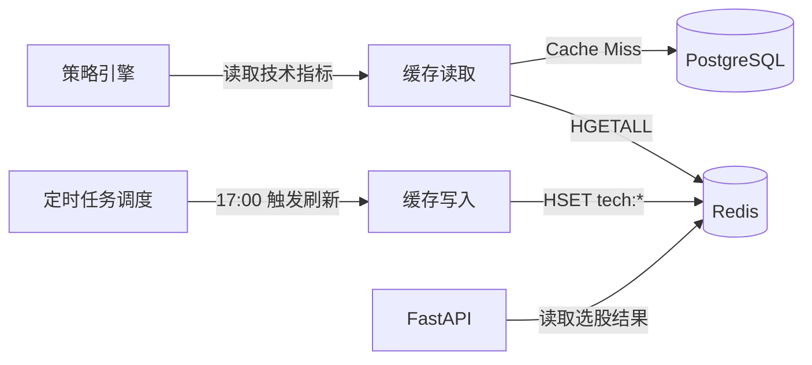

# 系统设计 - 缓存策略

> **版本：** v1.0
> **日期：** 2026-02-07
> **关联任务：** Task C2
> **状态：** Final
> **前置依赖：** 00-概要设计-v2, 01-详细设计-数据采集, 02-详细设计-策略引擎
>
> **V1 实施范围：** V1 只缓存技术指标和选股结果，去掉分布式锁、JWT 黑名单、WebSocket 订阅者、告警冷却等 V2 场景。

---

## 1. 模块概述

### 1.1 职责

Redis 在本系统中承担**读加速层**的角色，缓存高频读取但低频变更的数据，减少 PostgreSQL 查询压力。

### 1.2 核心挑战

| 挑战 | 说明 | 应对方案 |
|:---|:---|:---|
| 缓存一致性 | 技术指标每日更新，缓存必须及时刷新 | 定时全量刷新（每日 17:00） |
| 内存有限 | 单机 Redis 内存不宜过大 | 只缓存最新一天的指标，历史数据走 DB |
| 冷启动 | Redis 重启后缓存为空 | 启动时预热脚本 |

### 1.3 与其他模块的关系



---

## 2. Redis 数据结构设计

### 2.1 V1 Key 清单

| Key 模式 | 数据结构 | 内容 | TTL | 写入时机 | 读取方 |
|:---|:---|:---|:---|:---|:---|
| `tech:{ts_code}:latest` | Hash | 最新技术指标（ma5/ma10/rsi/macd 等） | 25h | 技术指标预计算完成后 | 策略引擎 Pipeline 第二层 |
| `pipeline:result:{date}` | String(JSON) | 当日选股结果列表 | 48h | 策略管道执行完成后 | 前端 API |
| `backtest:status:{task_id}` | String(JSON) | 回测任务状态 | 24h | 回测开始/完成时 | 前端轮询 |

### 2.2 V2 预留 Key（V1 不实现）

| Key 模式 | 用途 | 推迟原因 |
|:---|:---|:---|
| `market:realtime:{ts_code}` | 实时行情快照 | V1 不做盘中实时监控 |
| `alert:cooldown:{code}:{type}` | 告警冷却标记 | V1 不做实时告警 |
| `task:lock:{task_name}` | 分布式锁 | 单机无需分布式锁 |
| `session:{user_id}` | JWT 黑名单 | V1 无用户系统 |
| `ws:subscribers:{channel}` | WebSocket 订阅者 | V1 不做 WebSocket |

### 2.3 技术指标 Hash 结构

```
Key: tech:600519.SH:latest
Type: Hash

Fields:
  trade_date  -> "2026-02-07"
  ma5         -> "1705.20"
  ma10        -> "1698.50"
  ma20        -> "1680.30"
  ma60        -> "1650.00"
  ma120       -> "1620.00"
  ma250       -> "1580.00"
  dif         -> "12.35"
  dea         -> "10.20"
  macd        -> "4.30"
  k           -> "72.50"
  d           -> "65.30"
  j           -> "86.90"
  rsi_6       -> "62.50"
  rsi_12      -> "58.30"
  rsi_24      -> "55.10"
  boll_upper  -> "1750.00"
  boll_mid    -> "1700.00"
  boll_lower  -> "1650.00"
  cci         -> "85.20"
  wr_10       -> "-25.30"
  atr         -> "28.50"
```

**内存估算：**
- 单只股票 Hash：约 22 个字段 × 20 字节 ≈ 440 字节
- 5000 只股票：5000 × 440 ≈ **2.2 MB**
- 加上 Redis 内部开销：约 **5-10 MB**
- 结论：内存占用极小，无需担心

---

## 3. 缓存读写策略

### 3.1 读取策略：Cache-Aside

```python
import json
from typing import Optional

import redis.asyncio as aioredis
from sqlalchemy import text
from sqlalchemy.ext.asyncio import AsyncSession

from app.logger import logger


class TechIndicatorCache:
    """
    技术指标缓存层。

    读取策略：先查 Redis，Miss 则查 DB 并回填缓存。
    写入策略：定时任务全量刷新，不做逐条写入。
    """

    def __init__(
        self,
        redis_client: aioredis.Redis,
        db_session: AsyncSession,
    ) -> None:
        self._redis = redis_client
        self._db = db_session

    async def get_latest(self, ts_code: str) -> Optional[dict[str, str]]:
        """
        获取单只股票的最新技术指标。

        Args:
            ts_code: 股票代码，如 "600519.SH"

        Returns:
            指标字典，如 {"ma5": "1705.20", "rsi_6": "62.50", ...}
            None 表示无数据
        """
        cache_key = f"tech:{ts_code}:latest"

        # 1. 先查 Redis
        data = await self._redis.hgetall(cache_key)
        if data:
            # Redis 返回 bytes，转为 str
            return {k.decode(): v.decode() for k, v in data.items()}

        # 2. Cache Miss → 查 DB
        logger.debug(f"Cache miss: {cache_key}")
        row = await self._db.execute(
            text("""
                SELECT ma5, ma10, ma20, ma60, ma120, ma250,
                       dif, dea, macd, k, d, j,
                       rsi_6, rsi_12, rsi_24,
                       boll_upper, boll_mid, boll_lower,
                       cci, wr_10, atr, trade_date
                FROM technical_daily
                WHERE ts_code = :code
                ORDER BY trade_date DESC
                LIMIT 1
            """),
            {"code": ts_code},
        )
        result = row.fetchone()
        if result is None:
            return None

        # 3. 回填 Redis
        columns = [
            "ma5", "ma10", "ma20", "ma60", "ma120", "ma250",
            "dif", "dea", "macd", "k", "d", "j",
            "rsi_6", "rsi_12", "rsi_24",
            "boll_upper", "boll_mid", "boll_lower",
            "cci", "wr_10", "atr", "trade_date",
        ]
        indicator = {}
        for i, col in enumerate(columns):
            val = result[i]
            if val is not None:
                indicator[col] = str(val)

        if indicator:
            await self._redis.hset(cache_key, mapping=indicator)
            await self._redis.expire(cache_key, 90000)  # 25 小时

        return indicator

    async def get_batch(
        self, ts_codes: list[str]
    ) -> dict[str, dict[str, str]]:
        """
        批量获取多只股票的技术指标（Pipeline 优化）。

        Args:
            ts_codes: 股票代码列表

        Returns:
            {ts_code: {指标字典}} 映射
        """
        result: dict[str, dict[str, str]] = {}
        miss_codes: list[str] = []

        # 1. Pipeline 批量查 Redis
        pipe = self._redis.pipeline()
        for code in ts_codes:
            pipe.hgetall(f"tech:{code}:latest")
        responses = await pipe.execute()

        for code, data in zip(ts_codes, responses):
            if data:
                result[code] = {
                    k.decode(): v.decode() for k, v in data.items()
                }
            else:
                miss_codes.append(code)

        # 2. 批量回填 Miss 的
        if miss_codes:
            logger.debug(f"Cache batch miss: {len(miss_codes)} codes")
            for code in miss_codes:
                indicator = await self.get_latest(code)
                if indicator:
                    result[code] = indicator

        return result
```

### 3.2 写入策略：定时全量刷新

```python
async def refresh_all_tech_cache(
    redis_client: aioredis.Redis,
    db_session: AsyncSession,
) -> int:
    """
    全量刷新技术指标缓存（由定时任务在 17:00 调用）。

    流程：
    1. 从 technical_daily 表查询所有股票的最新指标
    2. 用 Redis Pipeline 批量写入
    3. 设置 25 小时 TTL（覆盖到次日刷新）

    Returns:
        刷新的股票数量
    """
    # 查询所有股票最新指标
    result = await db_session.execute(
        text("""
            SELECT DISTINCT ON (ts_code)
                ts_code, ma5, ma10, ma20, ma60, ma120, ma250,
                dif, dea, macd, k, d, j,
                rsi_6, rsi_12, rsi_24,
                boll_upper, boll_mid, boll_lower,
                cci, wr_10, atr, trade_date
            FROM technical_daily
            ORDER BY ts_code, trade_date DESC
        """)
    )
    rows = result.fetchall()

    columns = [
        "ts_code", "ma5", "ma10", "ma20", "ma60", "ma120", "ma250",
        "dif", "dea", "macd", "k", "d", "j",
        "rsi_6", "rsi_12", "rsi_24",
        "boll_upper", "boll_mid", "boll_lower",
        "cci", "wr_10", "atr", "trade_date",
    ]

    # Pipeline 批量写入
    pipe = redis_client.pipeline()
    count = 0
    for row in rows:
        ts_code = row[0]
        cache_key = f"tech:{ts_code}:latest"
        mapping = {}
        for i, col in enumerate(columns[1:], start=1):
            if row[i] is not None:
                mapping[col] = str(row[i])
        if mapping:
            pipe.hset(cache_key, mapping=mapping)
            pipe.expire(cache_key, 90000)  # 25 小时
            count += 1

        # 每 500 条执行一次，避免 Pipeline 过大
        if count % 500 == 0:
            await pipe.execute()
            pipe = redis_client.pipeline()

    # 执行剩余
    await pipe.execute()
    logger.info(f"技术指标缓存刷新完成: {count} 只股票")
    return count
```

### 3.3 选股结果缓存

```python
async def cache_pipeline_result(
    redis_client: aioredis.Redis,
    trade_date: str,
    result: list[dict],
) -> None:
    """
    缓存当日选股结果。

    Args:
        trade_date: 交易日期 "2026-02-07"
        result: 选股结果列表
    """
    cache_key = f"pipeline:result:{trade_date}"
    await redis_client.set(
        cache_key,
        json.dumps(result, ensure_ascii=False),
        ex=172800,  # 48 小时
    )


async def get_pipeline_result(
    redis_client: aioredis.Redis,
    trade_date: str,
) -> Optional[list[dict]]:
    """获取缓存的选股结果"""
    cache_key = f"pipeline:result:{trade_date}"
    data = await redis_client.get(cache_key)
    if data:
        return json.loads(data)
    return None
```

---

## 4. 缓存预热

### 4.1 应用启动时预热

```python
async def warmup_cache(
    redis_client: aioredis.Redis,
    db_session: AsyncSession,
) -> None:
    """
    应用启动时预热缓存。

    在 FastAPI lifespan 中调用，确保首次请求不会全部 Cache Miss。
    """
    logger.info("开始预热缓存...")

    # 1. 检查 Redis 中是否已有数据
    sample_key = await redis_client.randomkey()
    if sample_key:
        # 统计已有 tech:* 的数量
        count = 0
        async for key in redis_client.scan_iter(match="tech:*:latest"):
            count += 1
            if count >= 100:
                break
        if count >= 100:
            logger.info(f"Redis 已有缓存数据（>= {count} 条），跳过预热")
            return

    # 2. 全量刷新
    refreshed = await refresh_all_tech_cache(redis_client, db_session)
    logger.info(f"缓存预热完成: {refreshed} 只股票")
```

### 4.2 FastAPI Lifespan 集成

```python
from contextlib import asynccontextmanager

import redis.asyncio as aioredis
from fastapi import FastAPI

from app.cache import warmup_cache
from app.config import settings


@asynccontextmanager
async def lifespan(app: FastAPI):
    # 启动时
    app.state.redis = aioredis.from_url(
        settings.redis_url, decode_responses=False
    )
    await warmup_cache(app.state.redis, db_session)
    yield
    # 关闭时
    await app.state.redis.close()


app = FastAPI(lifespan=lifespan)
```

---

## 5. 缓存失效与一致性

### 5.1 失效策略

| 场景 | 失效方式 | 说明 |
|:---|:---|:---|
| 每日收盘后指标更新 | 定时全量刷新（17:00） | 覆盖写入，无需先删除 |
| 除权除息日 | 同上，全量刷新自动覆盖 | 前复权价格变化，指标全部重算 |
| 手动补数据 | 调用 `refresh_all_tech_cache()` | 管理命令触发 |
| Redis 重启 | 应用启动时自动预热 | lifespan 中调用 |

### 5.2 不需要复杂一致性的原因

- 技术指标是**每日收盘后批量计算**的，不存在实时写入冲突
- 缓存数据只在**次日开盘前**被策略引擎读取，17:00 刷新后到次日 9:30 有充足的时间窗口
- 最坏情况（缓存未刷新）：策略引擎 Cache Miss → 回源 DB，功能不受影响，只是慢一点

---

## 6. Redis 部署配置

### 6.1 V1 配置（单机）

```ini
# redis.conf（关键配置项）

# 内存限制 256MB（V1 实际使用 < 50MB）
maxmemory 256mb

# 淘汰策略：优先淘汰设置了 TTL 且即将过期的 Key
maxmemory-policy volatile-ttl

# 持久化：RDB 快照（每 5 分钟且至少 100 个 Key 变更时）
save 300 100

# 不启用 AOF（缓存数据可重建，无需强持久化）
appendonly no

# 绑定本地（单机部署，不对外暴露）
bind 127.0.0.1

# 关闭保护模式（本地访问）
protected-mode no
```

### 6.2 连接配置

```python
# app/config.py 中的 Redis 配置
class RedisSettings:
    url: str = "redis://127.0.0.1:6379/0"
    max_connections: int = 10
    socket_timeout: float = 5.0
    socket_connect_timeout: float = 2.0
    retry_on_timeout: bool = True
```

---

## 7. 配置项清单

| 配置项 | 类型 | 默认值 | 取值范围 | 说明 |
|:---|:---|:---|:---|:---|
| `redis.url` | str | `redis://127.0.0.1:6379/0` | — | Redis 连接地址 |
| `redis.max_connections` | int | 10 | 5-50 | 连接池大小 |
| `cache.tech_ttl_seconds` | int | 90000 | 3600-172800 | 技术指标 TTL（默认 25h） |
| `cache.pipeline_result_ttl` | int | 172800 | 3600-604800 | 选股结果 TTL（默认 48h） |
| `cache.backtest_status_ttl` | int | 86400 | 3600-172800 | 回测状态 TTL（默认 24h） |
| `cache.warmup_on_startup` | bool | true | — | 启动时是否预热 |
| `cache.refresh_batch_size` | int | 500 | 100-2000 | 全量刷新时 Pipeline 批次大小 |

---

## 8. 与其他模块的接口契约

### 8.1 对外暴露

| 接口 | 调用方 | 说明 |
|:---|:---|:---|
| `TechIndicatorCache.get_latest(ts_code)` | 策略引擎 | 获取单只股票最新指标 |
| `TechIndicatorCache.get_batch(ts_codes)` | 策略引擎 | 批量获取（Pipeline 优化） |
| `get_pipeline_result(date)` | 前端 API | 获取缓存的选股结果 |
| `refresh_all_tech_cache()` | 定时任务 | 全量刷新技术指标缓存 |
| `warmup_cache()` | FastAPI lifespan | 启动预热 |

### 8.2 依赖

| 依赖模块 | 接口 | 说明 |
|:---|:---|:---|
| 数据采集 | `technical_daily` 表 | 技术指标数据源 |
| 定时任务 | 17:00 触发 `refresh_all_tech_cache` | 每日刷新 |
| FastAPI | lifespan 事件 | 启动预热 |
